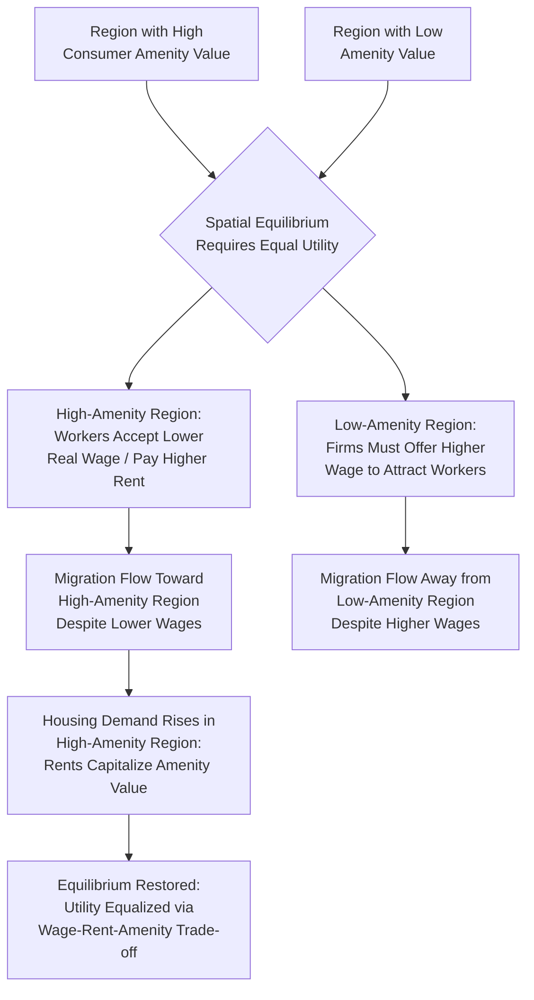

## Amenity-Driven Migration

### Definition and Conceptual Foundation

Amenity-driven migration refers to relocation decisions motivated primarily by a region's non-pecuniary quality-of-life attributes — climate, natural environment, cultural offerings, safety, recreational opportunities, and social atmosphere — rather than by wage or employment differentials alone. It represents a significant extension of the standard human capital investment model of migration (Sjaastad framework), which in its basic form emphasizes income maximization, toward a **utility-maximization** framework in which non-wage location attributes enter the migration decision on equal analytical footing with pecuniary considerations.

This topic has grown substantially in importance in migration and urban/regional economics as researchers observed migration patterns — particularly retirement migration, "Sun Belt" flows, and post-pandemic remote-work relocation — that standard wage-differential models could not fully explain, since many migrants moved *toward* regions with lower nominal wages or even lower overall economic dynamism, provided quality-of-life attributes were sufficiently attractive.

### Theoretical Foundation: The Rosen-Roback Compensating Differentials Model

The dominant theoretical framework, developed by Sherwin Rosen (1979) and further formalized by Jennifer Roback (1982), models regional amenities as generating **compensating wage and rent differentials** in a spatial equilibrium where utility is equalized across regions for a mobile population.

In the Rosen-Roback framework, a worker's indirect utility in region $r$ depends on the wage $W_r$, cost of housing $R_r$, and the local amenity level $A_r$:

$$V_r = V(W_r, R_r, A_r)$$

In spatial equilibrium (with freely mobile, homogeneous workers), utility must be equalized across all regions:

$$V(W_r, R_r, A_r) = \bar{V} \quad \text{for all } r$$

This equilibrium condition implies that regions with **higher amenity values** must offer **lower wages and/or higher housing costs** to keep total utility equalized — workers are willing to "pay" for desirable amenities through accepting lower real income. Conversely, regions with **lower (disamenity) values** must offer **higher wages and/or lower housing costs** to compensate workers for the lower quality of life, in order to retain population.

This generates the model's central testable implication: **observed cross-regional wage and rent differentials, after controlling for productivity and cost-of-living factors, can be used to implicitly estimate the monetary value residents place on local amenities** — a widely used technique for valuing non-market goods such as clean air, favorable climate, or low crime rates.

$$\frac{\partial R_r}{\partial A_r} > 0, \quad \frac{\partial W_r}{\partial A_r} < 0 \quad \text{(in a full amenity-only equilibrium)}$$

[Inference: the precise sign and magnitude of the wage relationship depends on whether the amenity also affects firm productivity (a "firm amenity" that raises both wages and rents) versus a pure "consumer amenity" affecting only household utility (which the basic prediction above describes); the Rosen-Roback framework itself formally distinguishes these two cases, and empirical results differ accordingly.]

### Categories of Regional Amenities

- **Natural/climate amenities**: temperature, sunshine, precipitation, coastal proximity, topography (mountains, scenic value) — the most extensively studied category, given relatively objective and time-invariant measurability.
- **Built environment amenities**: quality of local architecture, urban design, walkability, and public infrastructure.
- **Cultural and recreational amenities**: presence of restaurants, arts institutions, entertainment options, professional sports, outdoor recreation access.
- **Social and civic amenities**: crime rates and safety, school quality, local governance quality, social capital and community cohesion.
- **Agglomeration-linked amenities**: variety of consumption goods and services associated with larger, denser urban areas (a channel connecting amenity theory to New Economic Geography's "love of variety" mechanisms).
- **Disamenities**: the negative counterpart — pollution, congestion, high crime, extreme climate, natural disaster risk — which theoretically require *compensating* higher wages or lower rents to retain population.

### Diagram: Rosen-Roback Compensating Differential Logic

### Empirical Measurement Approaches

- **Hedonic wage and rent regressions**: the standard empirical technique, regressing observed regional wages (controlling for worker characteristics and industry) and housing rents/prices (controlling for structure characteristics) on measured amenity variables, using the Rosen-Roback framework's implied coefficients to back out implicit amenity valuations.

$$\ln W_r = \beta_0 + \beta_1 A_r + \mathbf{X}_r'\gamma + \epsilon_r$$

$$\ln R_r = \alpha_0 + \alpha_1 A_r + \mathbf{Z}_r'\delta + \eta_r$$

where a full amenity valuation combines both the wage coefficient $\beta_1$ (expected negative for a pure consumer amenity) and the rent coefficient $\alpha_1$ (expected positive) into a money-metric quality-of-life index.

- **Quality-of-life index construction**: several published indices (e.g., historical work in the tradition of Blomquist, Berger, and Hoehn, 1988) rank U.S. metropolitan areas by aggregating amenity-driven wage/rent differentials into a single comparative quality-of-life score.
- **Migration flow gravity-model amenity augmentation**: incorporating amenity variables directly as covariates in gravity-model migration regressions (alongside wage/employment differentials and distance), estimating the relative weight households place on amenities versus pecuniary factors in observed migration decisions.
- **Revealed-preference discrete choice models**: estimating random utility models of destination choice where amenity attributes enter the indirect utility function alongside wages and housing costs, allowing for heterogeneous amenity valuation across different demographic or income groups.

### Heterogeneity in Amenity Valuation

A substantial body of research finds that amenity valuation is not uniform across the population, with significant implications for regional sorting patterns:

- **Income and amenity valuation**: higher-income and higher-skilled households are generally found to place greater absolute monetary value on amenities (a form of amenity being a normal or luxury good in consumption), contributing to income-based geographic sorting where affluent populations concentrate in high-amenity locations, potentially raising housing costs there beyond the reach of lower-income households — a dynamic increasingly discussed in the "geography of inequality" and gentrification literatures. [Inference: while the general pattern of amenity valuation rising with income is well-supported empirically, the specific magnitude and its interaction with housing supply constraints varies by study and location.]
- **Life-cycle variation**: amenity preferences shift systematically over the life cycle — for example, retirees are disproportionately represented in climate- and recreation-driven migration (retirement migration to warm-climate/coastal regions), since they no longer weigh local labor-market wage prospects in their location decision, isolating the pure amenity-consumption motive.
- **Remote-work-enabled amenity migration**: the substantial expansion of remote and hybrid work arrangements has been widely discussed as loosening the traditional wage-amenity trade-off for a subset of workers, since remote workers can potentially retain a high-wage job's income while relocating to a high-amenity, lower-cost-of-living region — a pattern extensively documented and discussed following the COVID-19 pandemic period. [Unverified: the long-run persistence and full magnitude of this remote-work-driven amenity migration shift, and whether it represents a permanent structural change to the Rosen-Roback equilibrium logic or a temporary adjustment, remains an active empirical question subject to ongoing research as work-arrangement patterns continue to evolve.]

### Amenity Migration and Regional Economic Effects

- **Housing market capitalization**: sustained amenity-driven in-migration raises local housing demand, which — particularly where housing supply is constrained by geography or regulation — capitalizes into higher home prices and rents, a self-limiting mechanism that eventually reduces the region's *net* attractiveness once housing costs fully offset the amenity premium.
- **Local service-sector employment growth**: population inflows driven by amenity motives (rather than by local labor demand growth) can nonetheless stimulate local employment growth indirectly, via increased demand for local services, retail, construction, and hospitality — sometimes termed "consumption-driven" as opposed to "production-driven" regional growth.
- **Interaction with the export base**: amenity-migration-driven regions can develop a distinct growth model relative to traditional economic base theory, where population and associated local-serving employment growth is driven by amenity consumption demand (effectively, the region "exports" its climate/amenities to in-migrants who bring outside income, functioning somewhat like an amenity-based "export" even without conventional traded-goods production) — an idea sometimes discussed under the "amenity-led growth" or "consumption city" framework in urban economics.
- **Potential displacement effects**: amenity-driven in-migration by higher-income newcomers can raise local cost of living to a degree that displaces lower-income long-term residents, a distributional concern central to contemporary debates over housing affordability and gentrification in amenity-attractive regions.

### Policy Considerations

- **Housing supply policy interaction**: because sustained amenity-driven migration pressure on constrained housing supply can erode housing affordability for existing residents, land-use and zoning policy in high-amenity regions has direct implications for how amenity migration translates into housing-cost versus population-growth outcomes.
- **Amenity investment as regional development strategy**: some regional development policy explicitly targets amenity enhancement (parks, cultural institutions, downtown revitalization, environmental quality improvements) as a strategy to attract population and, indirectly, associated local-serving economic activity — distinct from traditional industrial-recruitment-based regional development strategy.
- **Equity and displacement mitigation**: policies such as inclusionary zoning, rent stabilization, or targeted affordable-housing investment are sometimes proposed to manage the distributional consequences of amenity-driven in-migration on existing lower-income residents, an area of active and often contested local policy debate. [Inference: the effectiveness and appropriate design of such mitigation policies is a matter of ongoing empirical and normative debate in urban and housing economics, not a settled consensus.]

**Related Topics**

- Rosen-Roback compensating differentials model
- Hedonic wage and rent regression methodology
- Determinants of internal migration
- Quality-of-life indices and regional rankings
- Remote work and post-pandemic migration patterns
- Housing supply constraints and regional affordability
- Gentrification and residential displacement economics
- Retirement migration patterns