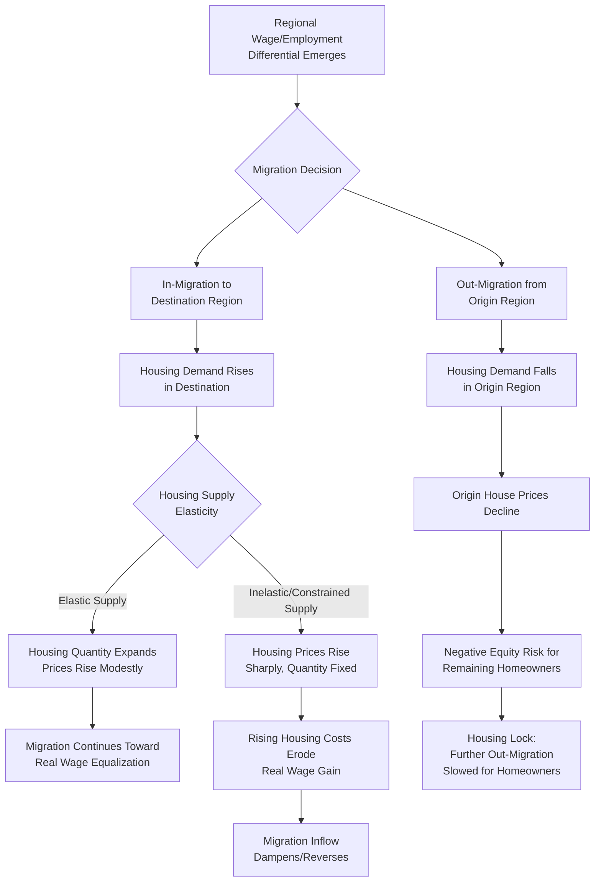

## Migration and Housing Market Interactions

### Definition and Conceptual Foundation

Migration and housing market interactions refer to the bidirectional relationship between interregional migration flows and local housing markets: migration inflows and outflows shift local housing demand, which affects house prices and rents, while housing market conditions — supply constraints, price levels, and ownership status — in turn shape the volume, direction, and composition of migration flows. This bidirectionality means housing markets are not a passive backdrop to migration but an active determinant and consequence of it, with significant implications for regional economic adjustment, affordability, and spatial equilibrium.

This topic connects several previously covered frameworks: the Rosen-Roback compensating differentials model (where housing rents capitalize amenity value), the Blanchard-Katz regional labor market adjustment literature (where housing frictions slow migration-based adjustment), and standard urban economics housing-supply models, applied specifically to the migration context.

### Housing as a Determinant of Migration: The Demand Side

**Cost-of-Living Adjusted Migration Incentives**

Nominal wage differentials across regions can substantially overstate the *real* incentive to migrate once regional housing-cost differences are accounted for. A worker comparing a nominal wage gain from migrating must weigh it against the higher cost of housing typically found in higher-wage, higher-productivity regions:

$$\text{Real Wage Gain} = \frac{W_B}{P_B} - \frac{W_A}{P_A}$$

where $P_r$ is a regional cost-of-living index heavily weighted by housing costs (since housing typically constitutes the largest share of variation in regional cost-of-living indices). In many empirical contexts, particularly for lower- and middle-income workers, housing-cost differentials are large enough to substantially erode or even reverse the *nominal* wage advantage of migrating to high-productivity metropolitan regions — a mechanism increasingly emphasized in the literature on spatial misallocation of labor. [Inference: the magnitude of this housing-cost erosion effect and its role in explaining aggregate migration patterns is an active area of ongoing research with estimates varying by country, time period, and income group studied.]

**Housing Availability as a Binding Constraint**

Even where a favorable real wage gap exists, migration into a destination region can be constrained by the physical or regulatory availability of housing. In supply-constrained metropolitan areas (due to geographic limits, restrictive zoning, or lengthy permitting processes), a demand shock from in-migration is absorbed disproportionately through **rising prices** rather than through **increased housing quantity**, which can choke off further in-migration before wage/employment differentials are fully arbitraged away.

### Housing as a Barrier to Migration: The Supply/Ownership Side

**Housing Lock (Negative Equity Effect)**

"Housing lock" refers to the reduced mobility of homeowners whose home value has fallen below their outstanding mortgage balance (negative equity), preventing them from selling without incurring a loss that must be covered out of pocket or through a lender-negotiated short sale. This friction is particularly salient in the context of regional labor market adjustment: a region experiencing a negative economic shock often simultaneously experiences falling local house prices (as declining local income/employment prospects are capitalized into housing values), which can trap the very homeowners who would most benefit from migrating toward better opportunities elsewhere — a mechanism that slows the migration-based regional adjustment process discussed in the Blanchard-Katz framework. [Inference: while housing lock's directional effect on reducing mobility is well-documented in the literature, the magnitude of its drag on aggregate interregional migration rates varies across studies and estimation approaches.]

**Transaction Cost Effects of Homeownership Generally**

Independent of negative equity, homeownership imposes higher fixed transaction costs on relocation than renting (real estate agent commissions, closing costs, time-on-market risk, moving costs for a household with more accumulated possessions), which is a primary reason renters exhibit systematically higher migration rates than homeowners across virtually all empirical studies of residential and interregional mobility.

**Mortgage Interest Rate Lock-In**

A related, more recently emphasized mechanism: when a homeowner holds a mortgage at a historically low fixed interest rate, moving to a new home financed at a higher prevailing rate imposes an implicit cost (higher monthly payments for equivalent housing value), which can suppress mobility even absent negative equity — a phenomenon that received substantial attention during periods of rapidly rising mortgage rates. [Unverified: the magnitude of this specific "rate lock-in" effect on interregional (as opposed to purely local) migration is a more recent and less thoroughly established area of the literature compared to the classic negative-equity housing-lock finding, and estimates should be treated as provisional pending further research.]

### Diagram: Bidirectional Migration-Housing Feedback Loop

### Spatial Equilibrium Framework: Housing as the Adjusting Variable

Building on the Rosen-Roback framework, a broader spatial equilibrium view treats housing rents/prices as the primary market-clearing variable that absorbs migration-driven demand shifts when wages are relatively rigid or slow to adjust across regions (consistent with the Blanchard-Katz finding that wages adjust more slowly than quantities in U.S. regional labor markets):

$$V(W_r, R_r, A_r) = \bar{V} \quad \Rightarrow \quad R_r \text{ adjusts to restore equilibrium as } L_r \text{ (population) changes}$$

In this view, migration inflows raise $R_r$ (housing costs) directly, which reduces the *net* utility gain from migrating to region $r$, providing a self-correcting mechanism: absent labor-supply constraints, migration continues until the rising cost of housing in the destination fully offsets the wage or amenity advantage that initially attracted migrants, restoring spatial equilibrium purely through the housing-cost channel.

### Empirical Measurement Approaches

- **House price and migration flow VAR/panel models**: estimating dynamic relationships between regional house price changes and subsequent net migration flows, and vice versa, using panel vector autoregression or instrumental variable approaches to address the clear simultaneity/reverse-causality concern (migration affects prices; prices affect migration).
- **Housing supply elasticity estimation (Saiz-style measures)**: constructing metropolitan-area-specific housing supply elasticity measures (based on geographic land constraints and regulatory stringency, following methodologies such as Albert Saiz's widely used geographic elasticity index) and testing how migration responds differently to demand shocks across high- versus low-elasticity regions.
- **Negative equity and mobility microdata studies**: using household-level panel data (often linked mortgage and migration records) to estimate the causal effect of negative home equity on the probability of interregional relocation, controlling for other migration determinants.
- **Spatial equilibrium wage-rent-amenity decomposition**: applying the Rosen-Roback hedonic framework specifically to migration-driven demand shifts, decomposing observed house-price changes in fast-growing regions into components attributable to amenity capitalization versus pure population-pressure/supply-constraint effects.

### Regional and Macroeconomic Implications

- **Spatial misallocation of labor**: several influential studies argue that housing supply constraints in the most productive U.S. metropolitan regions have significantly suppressed migration toward those regions relative to what would occur under more elastic housing supply, resulting in a meaningful aggregate productivity loss from workers being spatially "stuck" in lower-productivity regions rather than able to relocate to higher-productivity ones. [Inference: while this general finding is prominent and influential in the urban/regional economics literature, the precise magnitude of the aggregate productivity cost attributed to housing constraints varies across studies depending on model specification and time period, and should be treated as an estimated range rather than a single precise figure.]
- **Housing market amplification of regional cycles**: because housing responds to and reinforces migration flows, regions experiencing rapid in-migration can see amplified housing-price booms (and regions experiencing out-migration can see amplified housing-price busts), potentially overshooting the level implied by underlying economic fundamentals alone — a dynamic relevant to understanding boom-bust regional housing cycles.
- **Interaction with the "housing lock" adjustment friction**: the combination of constrained housing supply in growing regions (limiting inflows) and negative-equity-driven housing lock in declining regions (limiting outflows) can jointly slow the overall pace of migration-based interregional labor market adjustment relative to a frictionless benchmark, a synthesis connecting this topic directly back to the regional labor market adjustment literature.

### Policy Considerations

- **Housing supply reform as a labor-mobility policy**: given the spatial-misallocation findings above, land-use and zoning reform to increase housing supply elasticity in high-productivity regions has been increasingly proposed and discussed as an indirect but potentially significant labor-market and regional-convergence policy tool, distinct from traditional labor-market policy instruments.
- **Mortgage portability and housing-lock mitigation**: policy proposals aimed at reducing housing-lock frictions (e.g., facilitating easier short sales, mortgage assistance programs during regional downturns, or portable mortgage products) are sometimes discussed as complementary tools to support migration-based regional adjustment.
- **Balancing housing affordability and growth**: policies that successfully attract migration to a region (economic development success) can simultaneously create housing affordability pressures for existing residents if not paired with housing supply expansion — a recurring tension in fast-growing metropolitan regions requiring coordinated housing and economic development policy design. [Inference: the appropriate balance and specific policy mix is context-dependent and a matter of ongoing local policy debate rather than a single universally applicable formula.]

**Related Topics**

- Rosen-Roback compensating differentials model
- Migration and regional labor market adjustment
- Determinants of internal migration
- Housing supply elasticity (Saiz methodology)
- Spatial misallocation of labor and aggregate productivity
- Amenity-driven migration
- Regional housing boom-bust cycles
- Zoning reform and land-use policy