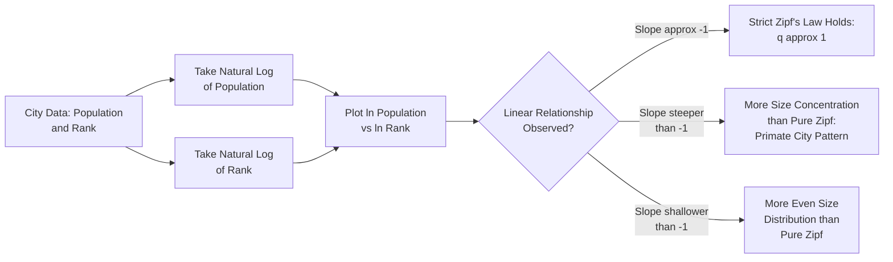

## Zipf's Law and the Rank-Size Rule

### Definition and Conceptual Foundation

Zipf's Law, as applied to urban systems, describes a remarkably regular empirical pattern in the size distribution of cities within a country or region: when cities are ranked from largest to smallest, the population of the city ranked $r$ is approximately inversely proportional to its rank. Equivalently, the second-largest city tends to be about half the size of the largest, the third-largest about one-third the size of the largest, and so on. This regularity is also referred to as the **rank-size rule**, and it is one of the most robust and widely replicated empirical regularities in urban and regional economics — observed across a striking range of countries, historical periods, and levels of economic development.

The pattern is named after linguist George Kingsley Zipf, who originally documented the same inverse rank-frequency relationship in word usage frequency, and later applied the identical mathematical structure to city size distributions (1949). It has since become a canonical topic in urban systems theory precisely because a simple, near-universal statistical regularity emerging from a highly decentralized, historically contingent process (city growth) invites deep theoretical explanation.

### The Formal Rank-Size Relationship

The rank-size rule is expressed as:

$$P_r = \frac{P_1}{r^{q}}$$

where:

- $P_r$ = population of the city ranked $r$ (by size, with $r=1$ being the largest city)
- $P_1$ = population of the largest city
- $q$ = the Zipf exponent (or Pareto exponent), a parameter typically found empirically close to 1

When $q = 1$ exactly, this is referred to as "pure" or "strict" Zipf's Law, implying:

$$P_r = \frac{P_1}{r}$$

Taking natural logarithms of both sides yields a linear relationship that is the standard basis for empirical estimation:

$$\ln P_r = \ln P_1 - q \ln r$$

This log-linear form implies that plotting $\ln(\text{rank})$ against $\ln(\text{population})$ for a country's cities should produce an approximately straight line with slope $-q$. Empirical estimates of $q$ across many countries and time periods commonly fall close to 1, though deviations both above and below 1 are frequently documented, and are themselves the subject of substantial theoretical and empirical interest. [Inference: while $q \approx 1$ is a widely replicated finding across a substantial number of country studies, the precise estimate varies by country, time period, choice of city definition (metropolitan area versus municipal boundary), and the sample of cities included (e.g., whether only the largest cities or the full city-size distribution is used), so no single universal value should be assumed to hold exactly for any specific untested case.]

### Relationship to the Pareto Distribution

Zipf's Law for city sizes is mathematically equivalent to stating that city sizes follow a **Pareto distribution** (a power-law distribution) in the upper tail. If city sizes $P$ are Pareto-distributed with shape parameter $\alpha$, the rank-size relationship's exponent $q$ corresponds to $1/\alpha$; strict Zipf's Law ($q=1$) corresponds to a Pareto shape parameter $\alpha = 1$. This connects urban size-distribution analysis to the broader statistical literature on power-law distributions found across many natural and social phenomena (earthquake magnitudes, income distributions, firm sizes), an important disciplinary link explored extensively in subsequent research (e.g., Gabaix, 1999).

### Diagram: Rank-Size Distribution (Log-Log Relationship)

### Theoretical Explanations for Zipf's Law

**Gibrat's Law and Random Growth Processes**

The most widely accepted theoretical explanation, formalized rigorously by Xavier Gabaix (1999), derives Zipf's Law as an emergent statistical property of **Gibrat's Law of Proportionate Effect**: if each city's growth rate is a random variable independent of its current size (i.e., a city's percentage growth rate does not systematically depend on whether it is currently large or small), and this process continues over a sufficiently long time period, the resulting cross-sectional size distribution of cities converges asymptotically to a Zipf distribution ($q=1$), regardless of the specific underlying economic mechanisms driving individual city growth.

$$\frac{dP_i}{P_i} = \mu \, dt + \sigma \, dW_i \quad \text{(independent of } P_i\text{)}$$

This is a striking and somewhat counterintuitive theoretical result: it implies that Zipf's Law does not require any specific economic theory of *why* cities grow (agglomeration economies, transportation cost minimization, government policy) — it only requires that growth rates be size-independent and subject to random idiosyncratic shocks, a much weaker and more general condition. [Inference: Gabaix's random-growth derivation is widely regarded as an elegant and influential formal result, but it explains the *statistical regularity itself* rather than pinning down the specific economic mechanisms that make Gibrat's Law approximately hold for real cities — the deeper economic "why" of size-independent growth rates remains a separate and ongoing area of investigation.]

**Central Place Theory Connections**

Walter Christaller's central place theory, which explains the hierarchical spatial organization of settlements based on the range and threshold of different goods and services, offers a complementary (though not fully unified) theoretical lens: settlements providing higher-order goods and services (requiring larger population thresholds to be viable) are necessarily fewer in number and larger in size, naturally generating a hierarchical, skewed city-size distribution broadly consistent with the qualitative rank-size pattern, even though central place theory's specific predicted size ratios do not derive the precise Zipf exponent in the way the random-growth model does.

**Urban Systems and Economies of Scale/Agglomeration Trade-offs**

Some theoretical models explain the rank-size distribution as an equilibrium outcome balancing agglomeration economies (which favor concentration into fewer, larger cities to capture scale benefits) against congestion costs and diseconomies of scale (which favor dispersion into more, smaller cities), with the specific city-size distribution reflecting the underlying parameters of this trade-off across different industries and their spatial requirements. [Inference: this class of models can generate rank-size-like distributions under certain parameterizations, but there is not a single universally agreed micro-founded model in this tradition that uniquely pins down the empirically observed $q \approx 1$ result without additional assumptions.]

### Deviations from Pure Zipf's Law: The Primate City Pattern

A well-documented empirical deviation occurs when a country's largest city is disproportionately larger than the rank-size rule would predict relative to the rest of the urban hierarchy — termed **urban primacy** or a **primate city distribution** (a concept originally introduced by Mark Jefferson, 1939, predating but conceptually related to the Zipf framework). In rank-size terms, primacy corresponds to a steeper-than-Zipf slope for the top-ranked cities (the largest city is far bigger than $P_1$ predicted by extrapolating from lower-ranked cities' pattern).

Primacy is commonly associated with:

- **Highly centralized political and economic systems**: capital cities that concentrate national government, finance, and administrative functions (common in many developing countries and in countries with a strong colonial-era administrative-capital legacy).
- **Smaller or less economically diversified countries**: economies too small to support multiple large, differentiated urban centers may naturally concentrate activity in a single dominant city.
- **Historical and geographic factors**: a single dominant port or historically privileged location can lock in outsized primacy through path-dependent agglomeration, similar to the mechanisms discussed under regional specialization.

Examples commonly cited in the urban economics literature include Bangkok relative to other Thai cities, and Paris relative to other French cities, both frequently noted as exhibiting significant primacy in various empirical studies, though the degree of primacy for any specific country should be verified against current data rather than assumed fixed, since urban systems evolve over time. [Unverified: specific primacy rankings and their current magnitude for any named country should be checked against up-to-date data, as relative city sizes shift over time with economic and demographic change.]

### Empirical Measurement and Testing Approaches

- **OLS regression on log-rank, log-size**: the standard and simplest estimation approach, regressing $\ln(\text{rank})$ on $\ln(\text{population})$ (or vice versa) across a country's cities and testing whether the estimated slope coefficient is statistically indistinguishable from $-1$ (or $1$, depending on specification direction).
- **Sample sensitivity considerations**: a well-documented econometric concern in this literature is that OLS slope estimates for Zipf's Law are sensitive to the specific sample of cities included (e.g., whether very small settlements are included, what population threshold defines a "city," and whether metropolitan-area or municipal-boundary definitions are used), and to whether rank is measured from the actual rank ($r$) or "rank minus one-half" (a small-sample correction proposed by Gabaix and Ibragimov, 2011, to reduce finite-sample bias in the estimated exponent).
- **Maximum likelihood estimation of the Pareto tail**: an alternative, often statistically preferred, approach to OLS log-rank regression, directly estimating the Pareto shape parameter from the underlying size distribution using maximum likelihood methods (following general power-law estimation methodology, e.g., Clauset, Shalizi, and Newman, 2009), which better addresses some of the statistical biases associated with simple log-log OLS regression on power-law data.
- **Testing across countries and time**: cross-country comparative studies test whether the Zipf exponent varies systematically with country characteristics (political centralization, economic development level, land area, federal versus unitary governance structure), and time-series studies test whether a given country's exponent has remained stable or shifted over decades of urbanization.

### Applications and Broader Significance

- **Urban policy diagnostic tool**: deviations from the rank-size rule (particularly strong primacy) are sometimes used as a diagnostic indicator of excessive spatial concentration of economic activity, potentially informing debates about decentralization policy, secondary-city development strategy, or capital-relocation proposals.
- **Testing ground for urban growth theory**: because Zipf's Law is such a robust, widely replicated empirical pattern, it serves as an important benchmark that any comprehensive theory of urban growth and city formation should be able to replicate or explain, making it a frequently cited touchstone in the broader urban systems and economic geography theoretical literature.
- **Cross-disciplinary connections**: the mathematical structure connects urban economics to the broader study of power-law and scaling phenomena across disciplines (physics, complexity science, network science), and city-size Zipf's Law is frequently cited alongside analogous power laws in firm-size distributions, income distributions, and other economic phenomena as an example of universal scaling behavior emerging from decentralized stochastic processes.

### Policy Considerations

- **Decentralization debates**: countries exhibiting strong urban primacy sometimes consider policies to promote secondary-city growth (infrastructure investment outside the primate city, relocation of government functions, targeted regional development incentives) to reduce over-concentration risk (congestion, disaster vulnerability, regional inequality) — though the economic desirability of intervening in what may be an efficient agglomeration-driven equilibrium, rather than a market failure, is a genuinely contested policy question. [Inference: whether observed primacy reflects an efficient equilibrium outcome of agglomeration economics versus a distortion from political centralization or historical accident is not resolved by the rank-size pattern alone, and requires additional context-specific analysis for any given country.]
- **Capital city relocation as an extreme policy tool**: some countries have pursued capital relocation partly motivated by a desire to reduce primacy and promote more balanced regional development (a strategy with a mixed and debated empirical track record regarding its actual effect on the broader urban size distribution). [Unverified: the effectiveness of capital relocation as a tool for reducing urban primacy varies by case and is a matter of ongoing empirical assessment rather than an established general result.]

**Related Topics**

- Gabaix's random growth model and Gibrat's Law
- Central place theory (Christaller)
- Urban primacy and primate city distributions
- Power-law and Pareto distribution estimation methods
- Agglomeration economies and urban scale economies
- Regional specialization patterns
- Secondary-city development and decentralization policy
- Urban hierarchy and central place systems