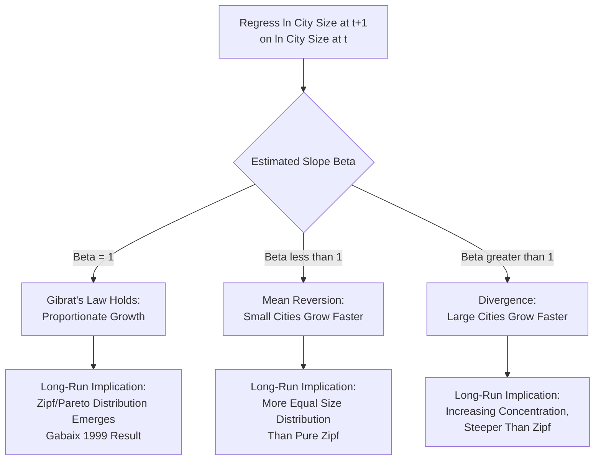

## Gibrat's Law of Proportionate Growth

### Definition and Conceptual Foundation

Gibrat's Law of Proportionate Effect, formulated by French economist Robert Gibrat (1931), states that the growth rate of an entity — originally applied to firm sizes, and subsequently extended to city populations — is statistically independent of its initial size. In the urban systems context, this means a small city and a large city are equally likely, in expectation, to experience any given *percentage* growth rate over a given period; large cities do not systematically grow faster (or slower) in percentage terms than small cities.

This is a deceptively simple statistical proposition with substantial theoretical importance: as covered under Zipf's Law and the rank-size rule, Gibrat's Law is the key micro-level growth assumption from which Xavier Gabaix (1999) formally derived the emergence of the Zipf/Pareto city-size distribution as a long-run statistical equilibrium, without requiring any specific structural economic theory of *why* cities grow. Understanding Gibrat's Law in its own right — its precise formal statement, empirical testing methodology, and known limitations — is thus foundational to understanding the broader urban size-distribution literature.

### Formal Statement

Gibrat's Law states that if $P_i(t)$ is the population of city $i$ at time $t$, the growth rate over a period is:

$$g_i = \frac{P_i(t+1) - P_i(t)}{P_i(t)} = \epsilon_i$$

where $\epsilon_i$ is drawn from a probability distribution that is **independent of** $P_i(t)$ — the city's size at the start of the period. Equivalently, in log form (commonly used for empirical testing, and consistent with modeling growth as a multiplicative/proportionate rather than additive process):

$$\ln P_i(t+1) - \ln P_i(t) = \mu + \sigma \epsilon_i, \quad \epsilon_i \sim \text{i.i.d.}, \quad \text{Cov}(\epsilon_i, P_i(t)) = 0$$

This describes a **random walk in log population** (also called geometric Brownian motion in continuous time), where each city's size evolves multiplicatively via a sequence of independent, size-uncorrelated proportional shocks. Over many periods, this stochastic process produces a cross-sectional distribution of city sizes that becomes increasingly right-skewed (log-normal in the short-to-medium run, converging toward Pareto/Zipf in the long run under certain boundary conditions, per Gabaix's formal derivation).

### The Standard Empirical Test

The canonical test of Gibrat's Law regresses a city's subsequent growth rate (or log-size at $t+1$) on its initial log-size at $t$:

$$\ln P_i(t+1) = \alpha + \beta \ln P_i(t) + \epsilon_i$$

Gibrat's Law implies the null hypothesis:

$$H_0: \beta = 1$$

If $\beta = 1$, this confirms that a city's percentage growth rate is uncorrelated with its initial size (proportionate growth). Deviations from $\beta = 1$ indicate systematic size-dependent growth patterns:

- **$\beta < 1$**: implies **mean reversion** — smaller cities grow faster (in percentage terms) than larger cities, a pattern sometimes called "regression toward the mean" in city-size dynamics, and would imply a *more equal* long-run size distribution than pure Zipf's Law predicts (a shallower rank-size slope).
- **$\beta > 1$**: implies **divergence** — larger cities grow faster than smaller cities in percentage terms, which would imply increasing size concentration over time and a *more unequal* long-run distribution than pure Zipf predicts.

An alternative, closely related test regresses the growth rate itself (rather than the subsequent-period log-size) directly on initial log-size:

$$g_i = a + b \ln P_i(t) + \epsilon_i, \quad H_0: b = 0$$

which is mathematically equivalent to the $\beta=1$ test above (since $b = \beta - 1$), but is often presented this way in applied studies since it directly tests whether growth rate correlates with size.

### Diagram: Gibrat's Law Testing Logic and Implications for the Size Distribution

### Theoretical Link to Zipf's Law (Gabaix's Formal Result)

Gabaix (1999) provided the key formal bridge between the micro-level growth process (Gibrat's Law) and the macro-level cross-sectional size distribution (Zipf's Law): if city growth rates satisfy Gibrat's Law with growth-rate variance approximately independent of city size, and the process has run for a sufficiently long time (technically, the model requires attention to conditions preventing the distribution from either collapsing or exploding, often incorporating a lower-bound reflecting barrier or entry/exit dynamics for small settlements), the resulting steady-state cross-sectional distribution of city sizes converges asymptotically to a **Zipf distribution** with exponent exactly equal to 1, essentially independent of the specific parameters of the underlying growth-shock distribution (a "robust" or "universal" result in the technical sense that many different underlying stochastic growth processes, provided they satisfy Gibrat's Law, converge to the same limiting size distribution). [Inference: this convergence-to-Zipf result depends on specific technical conditions in Gabaix's formal model (such as the behavior of small cities and time-invariance of the growth-shock distribution across the size distribution), which are simplifying modeling assumptions rather than empirically verified facts about every real urban system — the theoretical elegance of the result should be distinguished from the separate empirical question of whether real-world city growth actually satisfies Gibrat's Law precisely.]

### Empirical Evidence: Mixed Support for Gibrat's Law

The empirical literature testing Gibrat's Law for city populations has produced genuinely mixed findings across different countries, time periods, and city-size samples:

- **Broad support in many studies**: numerous country-level studies (particularly for well-established, mature urban systems in developed economies over multi-decade periods) find estimated $\beta$ coefficients close to, and often not statistically distinguishable from, 1, providing empirical support for approximate proportionate growth.
- **Deviations for small cities**: a recurring finding across several studies is that Gibrat's Law tends to hold more closely for *larger* cities but shows evidence of mean reversion (smaller cities growing faster, $\beta < 1$) among *smaller* settlements — sometimes attributed to smaller places benefiting more from basic infrastructure development, catch-up urbanization effects, or measurement/definitional issues affecting very small population units disproportionately.
- **Deviations during rapid urbanization or transition periods**: some studies of rapidly urbanizing developing economies, or countries undergoing significant structural economic transition, find more pronounced departures from strict proportionate growth, plausibly reflecting non-stationary growth dynamics linked to broader economic transformation processes.
- **Sensitivity to time period and city definition**: as with Zipf's Law testing more broadly, findings are sensitive to the choice of metropolitan-area versus municipal-boundary city definitions, the specific historical period examined, and the country's stage of urban system maturity. [Unverified: because of this substantial documented heterogeneity across studies, no single "Gibrat's Law holds" or "Gibrat's Law fails" conclusion should be treated as universally applicable without examining the specific country, period, and city-size sample in question.]

### Known Limitations and Critiques

- **The "law" describes a statistical regularity, not a structural economic mechanism**: Gibrat's Law, even where empirically supported, is a description of the *statistical properties* of the growth process (size-independence of growth rates) rather than an economic explanation of *why* cities grow — it is compatible with many different underlying economic stories (agglomeration economies exactly offsetting congestion costs at each size level, or genuinely idiosyncratic, unpredictable shocks dominating systematic size-related factors).
- **Amenity, infrastructure, and policy shocks violate pure randomness assumptions**: real city growth reflects identifiable causal factors (new infrastructure investment, policy changes, discovery of natural resources, changes in industrial location, amenity shifts) that are not literally "random" in the sense the formal model requires, even if their *net effect* across many cities and time periods statistically resembles a size-independent random shock process in the aggregate.
- **Reflecting versus absorbing barriers at the low end of the size distribution**: very small settlements can disappear entirely (be absorbed into larger conurbations, or effectively cease to exist as distinct urban units) or emerge as genuinely new settlements, which introduces boundary-condition complications for a stochastic growth model that Gabaix's formal analysis addresses through specific technical assumptions about behavior at the lower tail. [Inference: how these boundary-condition assumptions are specified can affect the precise theoretical predictions, and different modeling choices at this boundary are an area of ongoing technical refinement in the formal urban-growth-process literature.]

### Applications and Broader Significance

- **Foundational input to urban size-distribution theory**: Gibrat's Law serves as the essential micro-foundation connecting individual city growth dynamics to the aggregate Zipf/rank-size regularity, making it a required conceptual building block for understanding why urban size distributions take the specific mathematical form they do.
- **Firm-size distribution parallel**: the identical logic (originally developed by Gibrat for firm growth, later applied to cities) is used to explain the similarly skewed, power-law-like distribution of firm sizes within an economy, illustrating a broader cross-disciplinary pattern of proportionate-growth stochastic processes generating power-law distributions across different economic units of analysis (firms, cities, and, in some literature, personal income and wealth).
- **Forecasting and urban planning implications**: if Gibrat's Law holds reasonably well for a given urban system, it implies that simple extrapolative population forecasting methods (which do not need to model complex, size-dependent structural growth drivers) may perform reasonably well for aggregate city population projections, though this does not eliminate the substantial idiosyncratic uncertainty inherent in the random-shock component for any *individual* city's specific growth trajectory.

### Policy Considerations

- **Caution against assuming systematic size-based growth patterns**: to the extent Gibrat's Law holds, it implies that policies presuming large cities will automatically continue growing disproportionately faster (or that small cities are structurally destined to stagnate) may not be well-supported by the underlying statistical growth process, since idiosyncratic, city-specific shocks (not systematic size effects) may be the dominant determinant of any individual city's future growth trajectory.
- **Value of the model as a diagnostic benchmark**: testing whether a specific country's urban system currently satisfies or violates Gibrat's Law (and identifying which size ranges show deviations) can help regional and urban policymakers distinguish "normal" idiosyncratic city-growth variation from potentially policy-relevant systematic patterns (e.g., persistent small-city decline that would show up as $\beta < 1$, warranting investigation into underlying causes such as selective out-migration or lagging infrastructure investment). [Inference: this diagnostic use of Gibrat's Law testing is a reasonable methodological application suggested by the literature, but any specific policy conclusion drawn from such a test would require additional context-specific analysis beyond the statistical test result alone.]

**Related Topics**

- Zipf's Law and the rank-size rule
- Gabaix's random growth derivation of Pareto city-size distributions
- Power-law and log-normal distribution estimation
- Firm-size distribution and industrial organization parallels
- Urban primacy and deviations from proportionate growth
- Regional specialization patterns
- Central place theory (Christaller)
- Urban population forecasting methodology