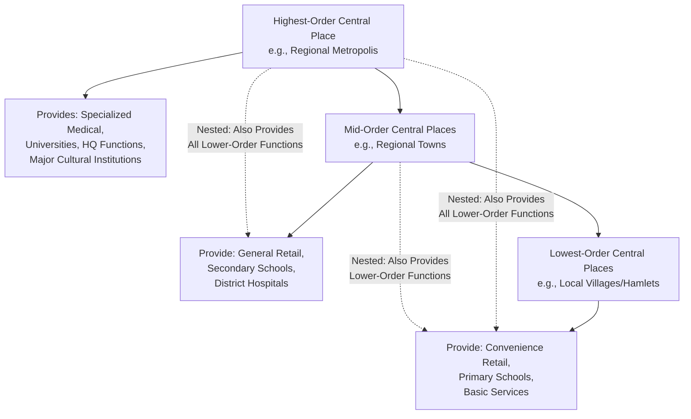

## Urban Hierarchy and Systems of Cities

### Definition and Conceptual Foundation

A system of cities refers to the interdependent network of urban centers within a country or region, analyzed not as isolated units but as functionally interconnected nodes linked by flows of goods, people, capital, and information. Urban hierarchy describes the structured ordering of cities within this system according to their size, the range and complexity of functions (goods and services) they provide, and their position in networks of economic and administrative control. Together, these concepts form a framework for understanding *why* cities of different sizes coexist, *what functional role* each size class plays, and *how* the overall spatial urban structure of a country evolves.

This topic synthesizes and extends several previously covered frameworks — Zipf's Law and the rank-size rule (the statistical size regularity), Gibrat's Law (the growth process underlying that regularity), and agglomeration/regional specialization concepts — into a more structural, functionally oriented theory of *why* cities of specific sizes exist and what distinguishes their economic roles.

### Christaller's Central Place Theory: The Foundational Hierarchical Model

Walter Christaller's Central Place Theory (1933) remains the foundational theoretical framework for understanding urban hierarchy. It explains the emergence of a nested, hierarchical system of settlements based on two key concepts:

- **Range of a good**: the maximum distance consumers are willing to travel to purchase a good or service, beyond which they will seek a closer alternative provider.
- **Threshold of a good**: the minimum population (market size) required to make provision of that good or service economically viable for a firm/provider.

Goods and services are classified as **lower-order** (low threshold and range — e.g., convenience retail, primary schools, routine banking) versus **higher-order** (high threshold and range — e.g., specialized medical care, universities, corporate headquarters, major cultural institutions). Because higher-order goods require a larger population base to be viable, they are provided only in a smaller number of larger "central places," while lower-order goods are provided ubiquitously across many smaller settlements.

This generates a **nested hierarchy**: each higher-order central place provides not only its own higher-order specialized functions but also all the lower-order functions available in smaller places within its market area, creating a hierarchical, layered spatial structure. Christaller formalized this geometrically using hexagonal market areas (chosen because hexagons tile a plane without gaps or overlaps, more efficiently than circles, while still approximating the circular market areas implied by the "range" concept), producing a theoretically elegant, symmetric spatial lattice of settlements at different hierarchical levels — the **K-value systems** (K=3, K=4, K=7), each representing different assumptions about whether the hierarchy is optimized for market efficiency (K=3), transportation efficiency (K=4), or administrative efficiency (K=7).

### Diagram: Christaller's Nested Central Place Hierarchy

### Losch's Refinement: Economic Landscape Theory

August Lösch (1940) extended and refined Christaller's model by relaxing some of its more rigid assumptions, developing a more general **economic landscape** framework in which multiple overlapping hexagonal networks (for different goods with different thresholds and ranges) are superimposed and rotated relative to one another to minimize aggregate transport costs across the entire system, rather than assuming a single, rigid nested hierarchy applies uniformly to all goods. Lösch's model allows for a richer variety of settlement sizes and functional specializations than Christaller's stricter nested hierarchy, and is often regarded as a more general (though also more mathematically complex) framework within the same central-place theoretical tradition. [Inference: while Lösch's framework is widely credited as a meaningful theoretical refinement, empirical testing of the full Löschian landscape structure is considerably more demanding than testing simpler Christallerian hierarchy predictions, and direct empirical validation of the complete Löschian lattice structure is less common in the applied literature than tests of simpler rank-size or central-place hierarchy predictions.]

### Functional Classification of Cities Within a System

Beyond pure population-size hierarchy, urban systems research also classifies cities by their **functional role**, recognizing that cities of similar size can perform quite different economic functions within the national or regional system:

- **Global/world cities**: cities occupying command-and-control positions in the global economy (international finance, corporate headquarters, advanced producer services), a concept developed extensively in the "world city" and "global city" literature (associated with researchers such as John Friedmann and Saskia Sassen), which emphasizes functional position in global economic networks rather than population size alone as the key organizing criterion.
- **Regional/national administrative and service centers**: cities providing higher-order government, healthcare, education, and financial services to a defined regional hinterland, corresponding closely to Christaller's higher-order central places.
- **Specialized production/industrial cities**: cities whose economic base is dominated by a narrow set of specialized export industries (per economic base theory and regional specialization concepts covered previously), which may not occupy a correspondingly high position in the *central-place service hierarchy* despite substantial population or output — illustrating that population-size hierarchy and functional-service hierarchy do not always perfectly align.
- **Satellite/commuter cities and suburbs**: smaller settlements functionally integrated into a larger metropolitan labor market (via commuting linkages) rather than functioning as independent central places with their own distinct hinterland, a category of increasing importance in modern metropolitan-area-based (rather than purely municipal-boundary-based) urban systems analysis.

### The Urban System as a Network: Beyond Simple Hierarchy

Contemporary urban systems research increasingly emphasizes that modern urban systems are not purely hierarchical (a simple nested pyramid) but exhibit substantial **network** characteristics — direct horizontal linkages between cities of similar size or even between smaller cities that bypass the strict hierarchical "pass-through-the-next-level-up" structure implied by classical central place theory. This shift reflects:

- **Corporate network linkages**: multinational corporate headquarters-branch relationships connect cities directly across the hierarchy in complex patterns not reducible to simple nested spatial nesting, studied extensively via the "world city network" methodology (e.g., work by Peter Taylor and the Globalization and World Cities, GaWC, research network), which measures inter-city connectivity based on advanced producer service firm office networks rather than simple population-based hierarchy.
- **Transportation and infrastructure network effects**: air travel networks, high-speed rail, and digital infrastructure connectivity create direct linkages between distant cities of any size, weakening the strict "nearest central place of appropriate order" assumption embedded in classical central place theory.
- **Specialization-driven direct linkages**: per interregional input-output linkage concepts, cities specializing in complementary stages of a supply chain may develop strong direct bilateral economic linkages regardless of their relative position in a population-size hierarchy.

### Empirical Testing and Measurement Approaches

- **Rank-size and Zipf's Law testing**: as covered previously, testing whether a country's city-size distribution conforms to the statistical rank-size regularity, providing an aggregate-level empirical signature consistent with (though not uniquely proving) an underlying hierarchical central-place structure.
- **Central place function inventories**: empirical studies sometimes directly catalog the presence/absence of specific higher-order functions (hospital specialties, university programs, headquarters presence, specialized retail) across a country's cities to test whether the presence of higher-order functions is indeed nested within cities also possessing lower-order functions, as Christallerian theory predicts.
- **Network connectivity analysis (GaWC-style methodology)**: constructing inter-city connectivity matrices based on corporate office location and linkage data (rather than population size) to empirically map the "world city network" or national urban network structure, and comparing this network-based hierarchy to simple population-based rankings.
- **Commuting-zone and functional urban area delineation**: statistical methods (used by national statistical agencies) to define metropolitan/functional urban areas based on commuting flow thresholds, recognizing that administrative municipal boundaries often poorly reflect the actual functional urban system structure relevant to hierarchy and network analysis.

### Applications and Broader Significance

- **Infrastructure and service planning**: central place theory's threshold/range logic provides a foundational rationale for spatial planning of public services (hospital networks, school district sizing, retail location planning), since it formalizes the trade-off between service accessibility (favoring dispersion) and economies of scale in service provision (favoring concentration in fewer, larger centers).
- **Regional development strategy**: understanding a country's urban hierarchy structure informs "growth pole" and secondary-city development strategies, since policies aiming to develop underserved regions may focus on strengthening mid-tier central places to provide higher-order services to underserved rural hinterlands, rather than attempting uniform dispersion or exclusively reinforcing the primate city.
- **Understanding global economic integration's spatial imprint**: the world city network literature provides an empirical lens for understanding how globalization has reshaped urban hierarchies, often strengthening the position of a relatively small number of highly connected "global cities" regardless of their national ranking by population alone.

### Policy Considerations

- **Balancing hierarchy-based service provision efficiency against equity/access concerns**: central-place-theory-informed public service planning (e.g., closing small rural hospitals to concentrate specialized care in larger regional centers) achieves efficiency and quality gains from scale but raises legitimate access and equity concerns for populations in smaller settlements, a recurring policy tension in rural health and education service planning. [Inference: the appropriate balance between service-provision efficiency and geographic access equity is a normative and context-specific policy question rather than one resolved purely by central place theory's efficiency logic.]
- **Secondary-city and mid-tier urban development policy**: strengthening the functional capacity of mid-order central places (adding higher-order functions such as universities, specialized hospitals, or regional administrative functions) is a commonly proposed strategy for reducing excessive dependence on a single primate city and building a more balanced, resilient national urban system — connecting directly to the urban primacy policy discussion covered under Zipf's Law.
- **Adapting planning frameworks to network-era urban systems**: as urban systems increasingly exhibit non-hierarchical network linkages (direct city-to-city corporate, logistics, and digital connectivity bypassing strict spatial hierarchy), regional planning frameworks originally designed around classical central place hierarchy logic may require updating to account for these more complex, network-based interdependencies. [Inference: this is an area of ongoing methodological development in applied urban and regional planning practice rather than a fully settled analytical framework.]

**Related Topics**

- Christaller's central place theory (K=3, K=4, K=7 systems)
- Lösch's economic landscape theory
- Zipf's Law and the rank-size rule
- Gibrat's Law of proportionate growth
- World city network and global city theory (Sassen, Friedmann, GaWC)
- Growth pole theory and secondary-city development
- Functional urban area and commuting-zone delineation methodology
- Regional specialization patterns