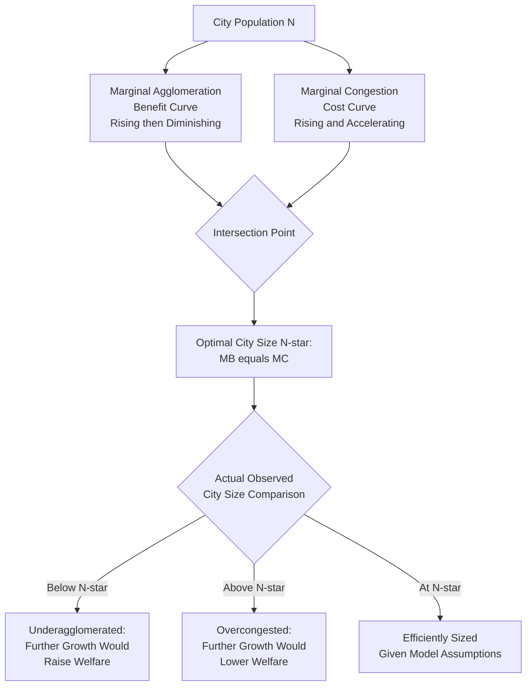

## Optimal City Size

### Definition and Conceptual Foundation

Optimal city size refers to the population (or economic activity) level at which a city's net social benefit — the marginal benefit of additional agglomeration (scale economies, productivity gains, variety of goods and services) minus the marginal cost of additional congestion (higher land prices, commuting time, pollution, infrastructure strain) — is maximized. It is a foundational normative concept in urban economics, distinct from the positive/descriptive analysis of city-size distributions covered under Zipf's Law and urban hierarchy, because it asks not merely how cities *are* distributed but how large a city *should* be from a welfare-maximization standpoint, and whether observed city sizes in the real world correspond to this welfare-maximizing benchmark.

The concept synthesizes agglomeration economics (the benefits of urban scale) with urban diseconomies of scale (the costs of urban scale) into a single analytical framework, typically formalized as a U-shaped or inverted-U-shaped relationship between city size and some measure of per-capita welfare, productivity, or utility.

### The Core Trade-off: Agglomeration Benefits versus Congestion Costs

**Agglomeration Benefits (Rising with City Size)**

As covered in agglomeration economics literature, larger cities generate positive externalities through several channels (often summarized under the "Marshallian trinity" plus Jacobs-style diversity externalities):

- **Labor market pooling**: larger, thicker labor markets improve worker-firm matching quality and provide insurance against firm-specific and worker-specific shocks.
- **Input sharing**: larger cities support a greater variety and specialization of intermediate input suppliers, reducing costs and improving quality for downstream firms.
- **Knowledge spillovers**: denser concentrations of workers and firms facilitate faster and richer transmission of tacit knowledge, innovation, and productivity-enhancing ideas.
- **Consumer variety/urbanization economies**: larger cities support a greater range of consumption goods, services, and cultural amenities, directly raising resident utility independent of production-side effects.

**Congestion Costs (Rising with City Size)**

Offsetting these benefits, larger cities also generate rising costs as population and density increase:

- **Land and housing price escalation**: fixed land supply combined with rising demand from a larger population drives up land rents and housing costs, a cost that scales with city size (formalized in the monocentric city model's rent-gradient framework).
- **Commuting costs and time**: larger cities generally require longer average commutes (in time and/or distance) to access the same range of opportunities, representing a real resource and utility cost that rises with urban spatial extent and, often, with population.
- **Congestion externalities**: traffic congestion, crowding in public infrastructure and services (transit systems, utilities, public spaces), and increased infrastructure strain generally worsen with population size, particularly where infrastructure investment does not keep pace with population growth.
- **Pollution and environmental costs**: air and noise pollution, and other environmental quality degradation, are frequently found to worsen with city size and density, imposing health and quality-of-life costs on residents.
- **Increased cost of public service provision at scale**: beyond a certain point, some public services may face rising per-capita provision costs due to the complexity of coordinating service delivery across a larger, more complex urban system (though this is more contested than the land-price and congestion channels, since many public services also exhibit their own scale economies).

### Formal Framework

A standard, simplified formalization treats per-capita welfare (or utility, or productivity) $U$ as a function of city population $N$:

$$U(N) = B(N) - C(N)$$

where $B(N)$ represents aggregate agglomeration benefits (often modeled as increasing and concave in $N$, reflecting diminishing marginal agglomeration benefits) and $C(N)$ represents aggregate congestion costs (often modeled as increasing and convex in $N$, reflecting accelerating marginal congestion costs at higher densities). The **optimal city size** $N^*$ is the population level that maximizes $U(N)$, satisfying the first-order condition:

$$\frac{dB}{dN}\bigg|_{N^*} = \frac{dC}{dN}\bigg|_{N^*}$$

i.e., the marginal agglomeration benefit of one additional resident exactly equals the marginal congestion cost imposed by that resident, at the welfare-maximizing city size.

### Diagram: Optimal City Size — Marginal Benefit and Cost Curves

### The Divergence Between Private and Social Optimum

A central and policy-relevant insight in this literature is that individual migration decisions (private optimization) do not automatically produce the socially optimal city size, because migrants base their location decisions on the **private** marginal benefit and cost they personally experience, not the **marginal social** benefit and cost their arrival imposes on *existing* residents:

- **Under-agglomeration risk**: if agglomeration benefits are substantially externalized (a new resident's presence raises others' productivity via knowledge spillovers, but the migrant does not capture the full value of this externality in their own private wage), cities may end up *smaller* than socially optimal, since the private return to migrating understates the true social benefit of the migration.
- **Over-congestion risk**: if congestion costs are substantially externalized (a new resident's commute adds to others' traffic congestion, and their housing demand raises rents for existing residents, but the migrant does not fully internalize these costs imposed on others), cities may end up *larger* than socially optimal, since the private return to migrating overstates the true social benefit net of the costs imposed on incumbents.

Which of these two externality-driven distortions dominates in practice — leading to systematically undersized or oversized cities relative to the social optimum — is a genuinely important and empirically contested question in the literature, and the answer plausibly varies by city, country, and specific margin of city size being considered (e.g., very large "megacities" may be more prone to over-congestion distortions, while smaller cities in a given country's urban system might be prone to under-agglomeration if strong external economies are not internalized locally). [Unverified: there is no single settled consensus in the literature on which distortion generally dominates across the full range of city sizes and contexts; this remains an active area of theoretical and empirical research.]

### The Henry George Theorem: Land Rent as a Measure of Optimal City Size

A notable and influential theoretical result connecting urban economics to optimal city size analysis is the **Henry George Theorem** (formalized by economists including Joseph Stiglitz and others in the 1970s), which shows that, under specific idealized conditions (including constant returns to scale in production with agglomeration externalities, and a city sized to maximize aggregate output net of costs), the **aggregate land rent** collected in the city exactly equals the optimal level of expenditure on local public goods that generated the agglomeration benefits in the first place. This provides a theoretical (though highly stylized) benchmark linking observed land rents to city-size and public-investment optimality, and has been influential in public finance discussions of land-value taxation as a mechanism for funding local public goods. [Inference: the Henry George Theorem's precise conditions are quite restrictive (constant returns, specific competitive market assumptions), so while theoretically elegant and influential, its direct empirical applicability to real, imperfectly competitive urban economies with heterogeneous land uses requires caution and is generally treated in the literature as a stylized benchmark result rather than a directly testable prediction for any specific city.]

### Empirical Measurement Approaches

- **City-size productivity/wage regressions**: estimating the relationship between city population (or density) and worker productivity or wages (controlling for worker composition and industry mix), commonly finding a positive but concave (diminishing-returns) relationship — the empirical counterpart to the $B(N)$ benefit function, widely documented in the urban agglomeration-elasticity literature.
- **Housing cost and commuting cost gradients**: using housing price/rent data and commuting survey data to estimate the empirical congestion-cost function $C(N)$ as a function of city size, often via hedonic and monocentric-city-model-based estimation approaches.
- **Optimal city size structural estimation**: some studies attempt to directly estimate the full $B(N) - C(N)$ welfare function using structural spatial equilibrium models (combining the Rosen-Roback framework's wage-rent-amenity equilibrium logic with agglomeration and congestion cost components) to derive an implied welfare-maximizing city size and compare it to observed sizes.
- **Comparing city-size distribution to a counterfactual optimal distribution**: a distinct strand of research (e.g., work examining spatial misallocation) compares the actual observed distribution of economic activity across cities to a counterfactual "optimal" allocation implied by a general equilibrium model, testing whether observed city sizes (particularly of the largest, most productive cities) are too small relative to the efficient benchmark, often attributing under-sizing to housing supply constraints (connecting this topic directly to the "migration and housing market interactions" and spatial misallocation literature covered previously). [Inference: specific quantitative estimates of the gap between observed and optimal city size from this literature vary considerably by study, model specification, and time period, and should be treated as illustrative estimates rather than precise, universally agreed figures.]

### Complications and Critiques of the Single Optimal-Size Concept

- **Heterogeneous optimal size by function/industry**: because different industries and economic functions have different agglomeration-benefit and congestion-cost profiles (a global finance hub versus a light-manufacturing center face very different optimal scale trade-offs), a single "optimal city size" concept applicable uniformly across all cities in a national urban system is a significant simplification — the *system of cities* concept (multiple cities specializing at different, individually appropriate scales) is, in an important sense, a more complete framework than any single optimal-size number. [Inference: this heterogeneity point is a widely acknowledged qualification in the literature to the simple single-optimal-size framework, motivating the broader urban-hierarchy and systems-of-cities perspective covered previously as a complementary lens.]
- **Dynamic versus static optimality**: the optimal-size framework as typically formalized is a static, point-in-time concept, but real cities evolve dynamically (per Gibrat's Law and city growth process discussions), and a city's optimal size may itself shift over time with technological change, changing industry composition, and infrastructure investment, meaning a "one-time" optimal size calculation can quickly become outdated.
- **Difficulty separating correlation from causation in productivity-density relationships**: the empirically observed positive relationship between city size/density and productivity/wages is subject to a well-known identification challenge — more productive workers and firms may *select into* larger cities (sorting), rather than city size *causing* higher productivity, a concern the literature addresses through various instrumental-variable and historical-density-based identification strategies, though the degree to which pure agglomeration causation versus selection sorting explains the observed pattern remains an active empirical debate. [Unverified: the precise decomposition between causal agglomeration effects and selection/sorting effects in explaining the city-size productivity relationship varies across studies and identification strategies, and is not a single settled empirical magnitude.]

### Policy Considerations

- **Infrastructure investment as a tool to shift optimal size upward**: because congestion costs are partly a function of infrastructure capacity (transit systems, utility networks) rather than an immutable technological constraint, infrastructure investment can raise a city's *effective* optimal size by reducing the marginal congestion cost of additional population at any given size — connecting land-use and transportation planning directly to the optimal-city-size framework.
- **Growth management versus growth promotion debates**: cities perceived as approaching or exceeding their optimal size (severe congestion, unaffordable housing) sometimes consider growth-management policies (urban growth boundaries, development restrictions), while cities perceived as below optimal size (underutilized infrastructure, insufficient agglomeration benefits) may pursue growth-promotion strategies (business attraction, housing supply expansion) — both informed, at least conceptually, by the marginal-benefit-versus-marginal-cost logic of the optimal-size framework. [Inference: translating the theoretical optimal-size framework into specific, actionable local growth-management policy requires substantial additional empirical work specific to each city, and is not a mechanical application of the abstract model.]
- **Land value capture and public finance implications**: the Henry George Theorem's connection between land rent and optimal public-goods investment has informed policy discussions around land-value taxation as a potentially efficient mechanism for funding urban infrastructure that supports agglomeration benefits, though practical implementation of land-value tax systems involves considerations beyond the stylized theoretical model.

**Related Topics**

- Agglomeration economies (Marshallian and Jacobs externalities)
- Monocentric city model and urban rent gradients
- Henry George Theorem and land value taxation
- Urban hierarchy and systems of cities
- Zipf's Law and Gibrat's Law
- Spatial misallocation of labor and productivity
- Migration and housing market interactions
- Urban growth boundaries and growth management policy