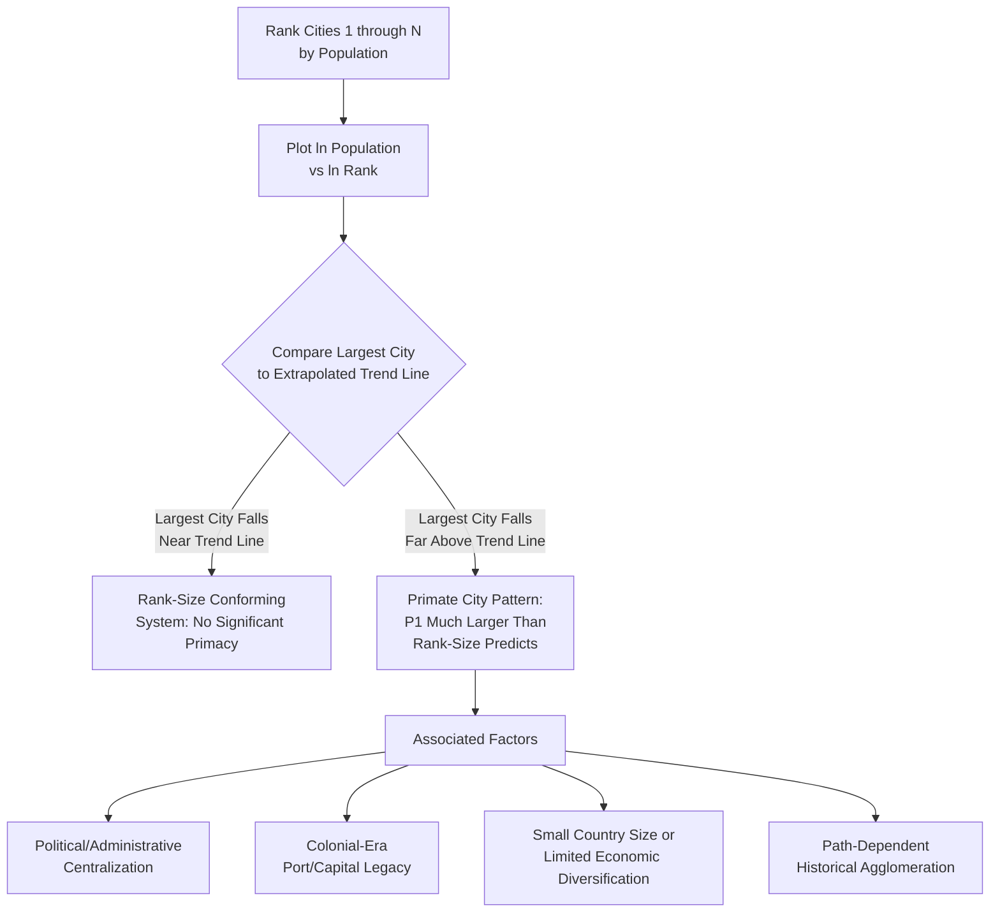

## Primate Cities and Urban Concentration

### Definition and Conceptual Foundation

A primate city is a city that is disproportionately larger than the second-largest city in its national urban system — substantially exceeding what the rank-size rule (Zipf's Law) would predict by extrapolating the size relationship observed among lower-ranked cities. Urban concentration, more broadly, refers to the degree to which a country's economic activity, population, and urban functions are spatially concentrated in one or a small number of dominant metropolitan centers rather than being distributed across a more balanced hierarchy of cities. Primacy is the most extreme and most studied form of urban concentration, representing a specific empirical deviation from the general rank-size regularity covered previously.

The concept was introduced by geographer Mark Jefferson (1939), who observed that many countries exhibit a single city so dominant in population, economic activity, and national life that it functions as the country's "primate city" — a term drawn from the biological metaphor of the largest, most dominant member of a group.

### Formal Measurement: The Primacy Index

While primacy can be identified qualitatively, several formal indices are used to quantify the degree of urban primacy:

**The Simple Primacy Ratio**

The most basic measure compares the population of the largest city to the second-largest:

$$\text{Primacy Index} = \frac{P_1}{P_2}$$

Under strict Zipf's Law ($q=1$), this ratio should be approximately 2 (since $P_2 = P_1/2$). Values substantially greater than 2 indicate primacy; values close to or below 2 suggest a size distribution closer to the rank-size norm.

**The Four-City Index (Mehta's Index)**

A more robust measure that reduces sensitivity to idiosyncrasies of any single second-ranked city, comparing the largest city to the sum of the next three:

$$\text{Four-City Index} = \frac{P_1}{P_2 + P_3 + P_4}$$

Under strict Zipf's Law, this index has an implied benchmark value; deviations above the rank-size-implied benchmark again indicate primacy.

**The Eleven-City Index**

An extension using a larger set of cities for greater robustness in countries with substantial urban systems:

$$\text{Eleven-City Index} = \frac{P_1}{\sum_{r=2}^{11} P_r}$$

**Deviation from the Rank-Size Regression**

As covered under Zipf's Law testing, a more statistically grounded approach examines whether the largest city (or the top few cities) lies substantially above the extrapolated rank-size regression line fitted to the rest of the country's cities, providing a formal test for primacy as a statistical outlier relative to the broader rank-size pattern rather than relying on a simple ratio benchmark.

### Diagram: Primate City Pattern versus Rank-Size Norm

### Theoretical Explanations for Primacy

**Political and Administrative Centralization**

Countries with highly centralized political systems — where the national capital concentrates government administration, national media, major corporate headquarters (often co-locating near government to facilitate regulatory and policy access), and national cultural institutions — tend to exhibit stronger primacy than countries with more federally decentralized political and administrative structures. This is one of the most robustly cited explanations across the comparative primacy literature.

**Colonial and Historical Legacy**

Many countries with pronounced primacy, particularly former colonies, exhibit a primate city that originated as a colonial-era administrative capital or key port city, deliberately developed by colonial authorities to concentrate administrative control and export-oriented trade infrastructure. This colonial-origin urban structure has, in numerous cases, persisted and often intensified after independence, since substantial fixed infrastructure investment, administrative path dependence, and continued economic agglomeration around the historically privileged location reinforce the initial concentration — an application of the path-dependence and cumulative-causation logic discussed under regional specialization and cumulative causation. [Inference: while colonial legacy is a widely cited contributing factor in the comparative development and urban economics literature explaining primacy patterns in many post-colonial countries, the relative weight of colonial history versus other contemporaneous factors (economic structure, political system, geography) varies by specific country case and is not uniformly the dominant explanation in every instance.]

**Country Size and Economic Diversification**

Smaller countries, and countries with less economically diversified national economies, are more likely to exhibit primacy, plausibly because a smaller total economic base cannot support multiple large, functionally differentiated urban centers, naturally concentrating higher-order economic and administrative functions into a single dominant city — connecting to the central place theory logic that higher-order functions require larger population thresholds to be viable, which in a small national economy may only be reachable by a single city.

**Import-Substitution and Urban-Biased Development Strategies**

Some development economics literature has linked primacy, particularly in mid-20th-century developing economies, to import-substitution industrialization strategies and broader "urban bias" in national development policy (a concept associated with economist Michael Lipton) — where national industrial and infrastructure investment was disproportionately directed toward the capital/primate city, reinforcing its dominance relative to secondary cities and rural regions, and connecting this topic to the Harris-Todaro migration literature's concern about urban-biased policy inducing excessive rural-urban migration into an already-dominant primate city.

### Empirical Patterns and Cross-Country Variation

- **Primacy is more common, on average, in smaller and lower-income countries**, though with substantial exceptions and heterogeneity, and the relationship is not a strict deterministic rule — some larger and higher-income countries also exhibit notable primacy, while some smaller countries exhibit relatively balanced urban systems, reflecting the multi-causal nature of the phenomenon (political structure, colonial history, geography, and economic structure all contribute jointly). [Unverified: any specific claim about the relative primacy ranking of named countries should be verified against current data, since urban systems evolve over time and this response does not include real-time verified country-specific figures.]
- **Federal versus unitary governance systems**: countries with federal governance structures, which tend to distribute administrative and political functions across multiple regional capitals, are frequently observed to exhibit less pronounced primacy than comparable unitary states with a single, centralized seat of government — consistent with the political-centralization explanation above.
- **Trends over time**: some countries have experienced declining primacy over recent decades as secondary cities have grown faster than the primate city (sometimes linked to deliberate decentralization policy, infrastructure investment in secondary regions, or natural agglomeration diseconomies eventually slowing the primate city's relative growth rate per the optimal-city-size congestion-cost logic), while others have experienced persistent or increasing primacy. [Unverified: because urban primacy trends are country-specific and evolve over time, any claim about a particular country's primacy trajectory should be checked against current, dated empirical data rather than treated as a fixed, permanent characteristic.]

### Consequences of Urban Concentration

**Potential Costs**

- **Congestion and diseconomies of scale**: per the optimal-city-size framework, a primate city that has grown well beyond its efficient scale may impose substantial congestion costs (traffic, housing unaffordability, pollution, infrastructure strain) on its residents and the national economy.
- **Regional inequality**: excessive concentration of economic opportunity, higher education, and public investment in the primate city can exacerbate income and opportunity disparities between the primate city and the rest of the country, a pattern frequently discussed in regional inequality and "left-behind places" policy literature.
- **Vulnerability and resilience concerns**: heavy national economic dependence on a single dominant city creates systemic vulnerability to localized shocks (natural disasters, infrastructure failures, public health crises) that would have more limited national impact in a more spatially diversified urban system.
- **Rural-urban and brain-drain amplification**: a highly dominant primate city can draw disproportionate in-migration (including selective, skilled out-migration from secondary cities and rural areas, per the brain drain discussion), potentially weakening the economic vitality and human capital base of the rest of the country.

**Potential Benefits (A More Balanced View)**

- **Genuine agglomeration efficiency**: to the extent primacy reflects a legitimate agglomeration-driven equilibrium (the primate city genuinely offers superior productivity, innovation, and matching efficiency that smaller cities cannot replicate, given fixed national economic scale), concentration may represent an efficient national outcome rather than a policy-relevant distortion — connecting to the broader theoretical uncertainty, discussed under optimal city size, about whether large cities are typically under- or over-sized relative to the social optimum.
- **National competitiveness in global city networks**: a strong, highly connected primate city can serve as the nation's key node of integration into global economic networks (per the world-city-network literature), potentially generating national benefits (foreign investment attraction, international trade facilitation) that a more dispersed urban system might not achieve as effectively. [Inference: whether the national benefits of a highly globally-connected primate city outweigh the domestic regional-inequality and resilience costs of concentration is a genuinely debated policy question without a universal answer, and depends on country-specific circumstances.]

### Empirical Measurement Approaches

- **Primacy index calculation and cross-country comparison**: applying the formal indices above (two-city, four-city, or eleven-city primacy ratios) using national urban population data, and comparing across countries or over time within a single country.
- **Rank-size regression residual analysis**: formally testing whether the largest city's population is a statistical outlier relative to the extrapolated rank-size trend fitted to the remainder of the country's urban system, providing a more rigorous test than simple ratio-based primacy indices.
- **Panel studies of primacy determinants**: cross-country panel regressions relating primacy indices to explanatory variables such as governance structure (federal versus unitary), colonial history, country land area and population, and measures of economic development, to statistically test the relative importance of the theoretical explanations discussed above.

### Policy Considerations

- **Decentralization and secondary-city development policy**: as discussed under urban hierarchy, policies to strengthen secondary and mid-tier cities (infrastructure investment, relocation of selected government functions, targeted higher-education and specialized-service investment) are commonly proposed responses to excessive primacy, aiming to build a more balanced national urban hierarchy and reduce over-concentration risks.
- **Capital relocation as a policy tool**: some countries have pursued relocating the national capital (fully or partially) away from the existing primate city, partly motivated by a desire to reduce primacy and stimulate development in a new region — a strategy with a genuinely mixed empirical track record regarding its effectiveness in meaningfully altering the broader national urban concentration pattern, since administrative relocation alone does not necessarily redirect the underlying economic and population agglomeration forces that sustained the original primate city's dominance. [Unverified: the effectiveness of capital relocation specifically as a primacy-reduction tool varies substantially by case and is a matter of ongoing empirical and policy assessment rather than an established general result.]
- **Infrastructure investment balance**: national infrastructure investment planning (transportation, digital connectivity, higher education, healthcare) that explicitly considers geographic balance across the urban hierarchy, rather than defaulting to primate-city-centered investment, is frequently recommended in the urban and regional development policy literature as a tool for managing excessive concentration over the long run. [Inference: the specific design and effectiveness of such balanced-investment strategies is highly context-dependent and a matter of ongoing policy debate rather than a settled, universally applicable prescription.]

**Related Topics**

- Zipf's Law and the rank-size rule
- Urban hierarchy and systems of cities
- Optimal city size and congestion costs
- Harris-Todaro model and urban-biased migration
- Brain drain and regional human capital concentration
- Regional inequality and place-based policy
- World city network and global city theory
- Colonial urban legacy and post-colonial development economics