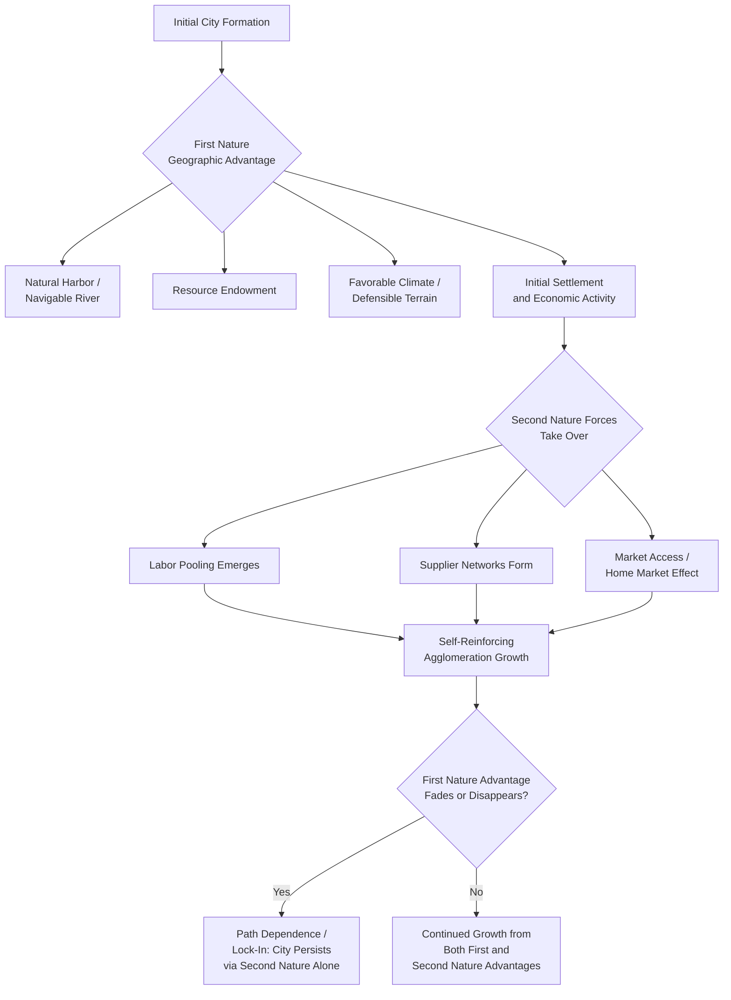

## Determinants of City Formation and Growth

### Definition and Conceptual Foundation

Determinants of city formation and growth encompass the full set of geographic, economic, historical, and institutional factors that explain why cities emerge at particular locations, why some cities grow substantially while others stagnate or decline, and what underlying mechanisms drive the dynamic process of urban emergence and expansion over time. This topic serves as an integrative capstone within the urban systems chapter, drawing together and synthesizing concepts previously covered — agglomeration economies, Gibrat's Law growth dynamics, central place theory, and optimal city size trade-offs — into a comprehensive account of the full life cycle of urban places, from initial formation through sustained growth, and in some cases eventual decline.

### First Nature versus Second Nature Geography

A foundational conceptual distinction in this literature, developed extensively in the work of Paul Krugman and other New Economic Geography scholars, separates the determinants of city location into two categories:

**First Nature Geography**

Refers to fixed, exogenous physical geographic characteristics that make a location inherently advantageous for settlement and economic activity, independent of any economic decisions made by other agents:

- **Natural transportation advantages**: navigable rivers, natural harbors, confluence points of trade routes, and locations along historically important overland trade corridors.
- **Resource endowments**: proximity to valuable natural resources (minerals, fertile agricultural land, fisheries, energy resources) that provide an initial economic rationale for settlement and specialization.
- **Climate and topography**: favorable climate for agriculture or human habitation, defensible terrain (historically significant for city-founding in many world regions), and access to fresh water.

**Second Nature Geography**

Refers to advantages that emerge from the *spatial pattern of economic activity itself* — i.e., a location's attractiveness for a new firm or resident depends on where other firms and residents have already chosen to locate, generating self-reinforcing agglomeration dynamics essentially independent of the site's original first-nature characteristics:

- **Market access and demand externalities**: firms benefit from locating near a large existing concentration of consumers and other firms (the "home market effect" from New Economic Geography), even absent any special natural-geographic advantage of that location.
- **Labor pooling and supplier networks**: once a critical mass of firms and workers has settled in a location, the resulting thick labor market and specialized supplier base becomes a self-reinforcing locational advantage independent of the site's original natural endowments.
- **Path dependence and lock-in**: cities can persist and continue growing at locations whose original first-nature advantage (a resource that has since been depleted, a transportation mode that has since become obsolete) no longer provides meaningful ongoing justification, because the sunk infrastructure investment and accumulated second-nature agglomeration advantages sustain the city's ongoing viability regardless of the fading first-nature rationale.

[Inference: while the first-nature/second-nature distinction is a well-established and influential conceptual framework in the economic geography literature, empirically disentangling the precise relative contribution of each category to any specific city's historical formation and growth trajectory typically requires detailed historical case analysis, and general quantitative decompositions across large samples of cities remain a genuinely challenging and actively researched empirical question.]

### Diagram: First Nature and Second Nature Determinants of City Formation and Growth

### Economic Theories of City Formation

**Trade and Market-Access-Based Formation**

Classical location theory (building on von Thünen's agricultural land-use model and Christaller's central place theory, both covered in related topics) explains city formation as arising from the economic necessity of concentrated points for exchange, processing, and distribution of goods within a spatial economy — cities form where transportation costs are minimized for aggregating and redistributing agricultural or resource-based production to broader markets.

**Increasing Returns and New Economic Geography Formation Models**

Krugman's core-periphery model (part of the New Economic Geography tradition) formalizes city (or "core region") formation as an emergent equilibrium outcome of the interaction between increasing returns to scale in manufacturing, transportation costs, and the migration of mobile factors (particularly labor and capital) toward locations offering larger markets — generating self-reinforcing agglomeration that need not originate from any decisive first-nature advantage, consistent with the second-nature geography concept above.

**Firm Formation and Entrepreneurial Ecosystem Theories**

More recent urban economics literature, particularly work associated with Edward Glaeser and colleagues, emphasizes the role of local entrepreneurial ecosystems, small-firm density, and industry competitive structure in explaining differential city growth: cities characterized by a greater number of small, competing firms (rather than a few large, dominant firms) in their initial industrial base have frequently been found to exhibit faster subsequent employment growth, attributed to greater innovation pressure, entrepreneurial spillovers, and the diversity-driven "Jacobs externality" mechanism (named for urbanist Jane Jacobs, who emphasized the innovation-generating benefits of industrial diversity and small-scale urban interaction, in contrast to the specialization-driven "Marshallian" externality emphasis). [Inference: while this general finding linking initial small-firm density and competitive market structure to subsequent urban growth is documented across several influential empirical studies, the precise magnitude and universality of this relationship across different countries, industries, and time periods should be treated as an area of continuing empirical refinement rather than a fixed, universally confirmed parameter.]

### Human Capital as a Determinant of City Growth

A substantial and influential body of urban economics research (extensively associated with Edward Glaeser's work) identifies the initial **human capital level** of a city's population — commonly measured by the share of residents with tertiary education — as one of the single strongest predictors of subsequent city growth across a wide range of countries and historical periods. Proposed mechanisms include:

- **Direct productivity effects**: more educated workforces are directly more productive, supporting higher wages that attract further in-migration.
- **Enhanced innovation and entrepreneurship capacity**: higher local human capital stocks are associated with greater rates of local innovation, patenting activity, and new business formation.
- **Adaptive capacity to economic shocks**: cities with higher initial human capital appear better able to adapt to structural economic changes (industry decline, technological shifts) by transitioning workers and firms into new, growing sectors, rather than experiencing prolonged decline — a mechanism directly relevant to explaining differential regional resilience to shocks such as deindustrialization. [Inference: while the general finding that human capital predicts urban resilience and growth is well-replicated across numerous studies, the specific causal mechanisms through which this operates, and their relative importance, remain an area of ongoing empirical investigation.]

### Institutional and Policy Determinants

- **Property rights and institutional quality**: reliable property rights, contract enforcement, and stable local governance are widely regarded as necessary preconditions for sustained private investment and urban economic growth, connecting urban growth determinants to the broader institutional economics literature on the foundations of economic development.
- **Local government fiscal capacity and public goods provision**: cities that can effectively provide infrastructure, education, and public safety are generally better positioned to attract and retain both firms and skilled residents, connecting to the amenity-driven migration and quality-of-life literature covered previously.
- **National and regional transportation infrastructure investment**: the construction of major transportation infrastructure (railroads, highways, ports, airports) has historically been a powerful determinant of which locations experience city formation or accelerated growth, and continues to shape contemporary urban growth patterns through infrastructure-driven changes in market access and second-nature agglomeration potential.
- **Zoning, land-use, and housing supply regulation**: as discussed under migration and housing market interactions, local regulatory environments governing housing and commercial development supply substantially shape a city's capacity to accommodate population and economic growth, with more restrictive regulatory environments constraining growth even where underlying economic demand for locating in the city is strong.

### The Dynamic Growth Process: Integrating Stochastic and Structural Determinants

Reconciling the structural, economically grounded determinants discussed above with the stochastic, size-independent growth process described by Gibrat's Law (covered previously) is an important synthesis point: contemporary urban growth theory generally views observed city growth as the *net outcome* of:

1. **Structural, systematic factors** (human capital, institutional quality, geography, industrial composition) that create persistent, identifiable differences in *expected* growth rates across cities, and
2. **Idiosyncratic, largely unpredictable shocks** (individual firm decisions, natural disasters, unexpected industry shifts, path-dependent historical accidents) that are approximately random and size-independent, consistent with the Gibrat's Law finding that a large share of observed city growth variation is not systematically explained by initial city characteristics alone.

This reconciliation implies that while economists can identify meaningful, statistically significant structural determinants of *average* or *expected* city growth rates across large samples, substantial idiosyncratic variation around these structural predictions remains for any *individual* city's specific growth trajectory — a nuanced middle ground between purely deterministic structural theories of urban growth and the purely stochastic Gibrat's Law framework taken in isolation. [Inference: this synthesis view represents a reasonable and widely held position bridging the structural and stochastic urban growth literatures, but the precise relative explanatory weight of structural versus idiosyncratic factors in accounting for observed cross-city growth variance differs across specific empirical studies and is not reducible to a single universal ratio.]

### Empirical Measurement Approaches

- **Cross-sectional and panel growth regressions**: regressing city employment or population growth rates over a defined period on lagged (initial-period) explanatory variables — human capital share, industrial diversity indices, initial firm-size structure, geographic characteristics — to identify statistically significant structural determinants of growth, generally controlling for the baseline Gibrat's-Law-consistent finding that initial city size itself should not systematically predict growth rate.
- **Natural experiment and historical event-study approaches**: using historically exogenous events (unexpected infrastructure placement decisions, natural disasters, resource discoveries, historically arbitrary administrative boundary decisions) as identification strategies to more credibly estimate the causal effect of specific determinants on subsequent city growth, addressing the substantial endogeneity concerns present in simple cross-sectional growth regressions (e.g., cities may have already been growing for unobserved reasons that also happen to correlate with the explanatory variable of interest).
- **Firm and industry composition analysis**: examining how the initial industrial structure (specialization versus diversification, competitive market structure versus concentrated dominant-firm structure) of a city's economic base correlates with subsequent growth, connecting to both the economic-base/regional-specialization literature and the Jacobs-versus-Marshallian-externality debate.

### Applications and Broader Significance

- **Regional development and economic development policy design**: understanding the empirically validated determinants of city growth (human capital investment, institutional quality, transportation infrastructure, competitive/diverse industrial structure) directly informs the design of regional and local economic development strategies aimed at stimulating growth in lagging cities or regions.
- **Understanding urban decline as the flip side of growth determinants**: the same framework used to explain growth can be applied, often with the relevant factors' signs reversed, to understand urban decline (deindustrialization, population loss, "shrinking cities" phenomena) — connecting this topic to broader discussions of regional economic resilience and adjustment covered under migration and regional labor market adjustment.
- **Forecasting and urban planning applications**: identifying robust structural determinants of city growth supports more informed long-term urban and regional infrastructure planning, population forecasting, and housing-supply policy design, though the substantial idiosyncratic/stochastic component identified in the Gibrat's Law literature implies meaningful, irreducible uncertainty must be acknowledged in any such forecasting exercise.

### Policy Considerations

- **Human capital investment as a growth strategy**: given the strong empirical association between initial human capital levels and subsequent city growth, investment in local education systems and efforts to attract and retain skilled workers are frequently emphasized as central pillars of local and regional economic development strategy. [Inference: while well-supported by the empirical association literature, translating this correlation into a guaranteed causal policy lever for any specific city requires attention to the broader institutional and economic context, since human capital investment alone does not mechanically guarantee growth absent complementary factors.]
- **Balancing industrial diversification and specialization strategies**: the tension between the benefits of industrial specialization (per regional specialization and comparative advantage logic) and the benefits of industrial diversity (per the Jacobs-externality growth literature) represents an important and unresolved strategic consideration for local economic development policy, without a single universally applicable prescription for the "right" degree of specialization versus diversification for any given city. [Inference: this trade-off is a genuinely debated question in applied regional economic development practice, and the appropriate balance is highly context-dependent.]
- **Infrastructure investment sequencing and path-dependence awareness**: because second-nature agglomeration effects can lock in growth patterns well beyond the useful life of the original first-nature or infrastructure-driven rationale for a city's location, policymakers should be aware that major infrastructure investment decisions can have very long-lasting, path-dependent effects on urban growth patterns that are difficult to reverse once established.

**Related Topics**

- First nature and second nature geography (Krugman)
- New Economic Geography and core-periphery models
- Gibrat's Law of proportionate growth
- Human capital and urban growth (Glaeser)
- Jacobs externalities versus Marshallian externalities
- Regional specialization patterns
- Migration and housing market interactions
- Urban decline and shrinking cities phenomena