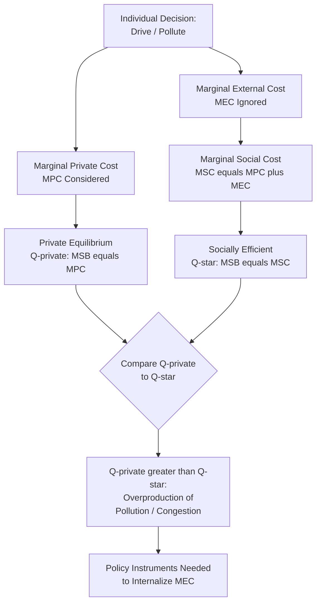

## Urban Externalities: Pollution and Congestion

### Definition and Conceptual Foundation

Urban externalities refer to costs (negative externalities) or benefits (positive externalities) generated by economic activity or consumption decisions in cities that are borne by third parties not directly involved in the originating transaction, and are not reflected in market prices. Pollution and congestion are the two most extensively studied negative urban externalities in urban environmental economics, both arising directly from the spatial concentration of people, vehicles, and economic activity that defines cities, and both representing central examples of market failure requiring analysis distinct from the market-based agglomeration benefits discussed in earlier urban systems topics.

These externalities constitute the primary economic rationale for the "congestion cost" side of the optimal-city-size trade-off covered previously, and understanding their precise economic structure — why markets fail to price them correctly, and what policy instruments can correct this — is foundational to urban environmental and sustainability economics.

### Theoretical Foundation: Negative Externalities and Market Failure

Both pollution and congestion share the fundamental economic structure of a **negative production or consumption externality**: an individual's private cost of an activity (driving a car, operating a polluting facility) is lower than the true **social cost**, because the individual does not bear the full cost imposed on others (fellow commuters, nearby residents breathing polluted air). This divergence between private and social cost leads to **overproduction** of the externality-generating activity relative to the socially efficient level.

Formally, if $MPC$ is marginal private cost and $MEC$ is marginal external cost, marginal social cost is:

$$MSC = MPC + MEC$$

The socially efficient quantity of the activity, $Q^*$, occurs where marginal social benefit ($MSB$, typically equal to price/demand in a competitive market) equals marginal social cost:

$$MSB(Q^*) = MSC(Q^*) = MPC(Q^*) + MEC(Q^*)$$

Absent any correction, private market actors instead equate $MSB$ to $MPC$ alone, producing a private equilibrium quantity $Q_{private} > Q^*$ — i.e., an inefficiently high level of the polluting or congestion-generating activity, since individual decision-makers ignore the external costs imposed on others.

### Diagram: Externality Wedge Between Private and Social Cost

### Traffic Congestion: Economic Structure and Analysis

**The Nature of Congestion as an Externality**

Traffic congestion arises because road capacity is a shared, largely non-excludable (absent tolling) resource: each additional driver entering a congested roadway slows travel for all other drivers already on that road, imposing a time cost on everyone else that the marginal driver does not personally bear (beyond their own experienced delay). This is a classic **congestible public good** or common-pool resource problem, distinct in structure from pure pollution externalities, though both share the private-cost-versus-social-cost divergence described above.

**The Standard Congestion Cost Model**

The foundational economic model of congestion (developed by economists including William Vickrey and further formalized in subsequent transportation economics literature) distinguishes:

- **Average cost of travel (private cost)**: the travel time (converted to a monetary cost via the value of travel time) experienced by an individual driver, which rises with traffic volume due to congestion.
- **Marginal social cost of travel**: the average cost *plus* the additional delay that one more driver imposes on all other drivers already using the road.

$$MSC = AC + Q \cdot \frac{dAC}{dQ}$$

where $AC(Q)$ is the average cost function (rising with traffic volume $Q$) and the second term captures the externality — the marginal driver's contribution to slowing down every other driver, multiplied by the number of other drivers affected. Because $\frac{dAC}{dQ} > 0$ in a congested regime, $MSC > AC$, confirming that individual drivers systematically underweight the true social cost of their trip, leading to excessive traffic volume relative to the efficient level.

**The Vickrey Congestion Pricing Solution**

The theoretically efficient correction is a **congestion toll (Pigouvian tax)** set equal to the external marginal cost at the efficient traffic volume:

$$\tau^* = MSC(Q^*) - AC(Q^*) = Q^* \cdot \frac{dAC}{dQ}\bigg|_{Q^*}$$

This toll internalizes the externality by making each driver's private cost (now including the toll) equal to the true marginal social cost, inducing drivers to reduce trip-making, shift travel times, switch to alternative modes, or reroute until traffic volume falls to the efficient level $Q^*$. William Vickrey's pioneering theoretical work (extending into time-varying, dynamic congestion pricing models accounting for peak versus off-peak travel) is widely credited as foundational to the transportation economics congestion-pricing literature.

### Pollution: Economic Structure and Analysis

**Types of Urban Pollution Externalities**

- **Air pollution**: emissions from vehicles, industrial facilities, and energy generation, imposing health costs (respiratory and cardiovascular disease, reduced life expectancy) on nearby and, for some pollutants, more distant populations.
- **Noise pollution**: traffic, industrial, and construction noise imposing quality-of-life and, in some studies, documented health costs on nearby residents.
- **Water pollution**: urban runoff, industrial discharge, and inadequate wastewater treatment affecting local water bodies and downstream users.
- **Localized versus regional/global pollutants**: some urban pollutants (local particulate matter, noise) impose costs primarily on nearby residents, while others (certain air pollutants, and especially greenhouse gas emissions) impose costs at a much broader regional or global scale, complicating the appropriate jurisdictional level for policy intervention — a point of connection to broader environmental economics and climate policy discussions beyond the purely urban scale.

**The Pigouvian Tax Solution for Pollution**

Analogous to congestion pricing, the standard efficient correction for a pollution externality is a **Pigouvian tax** set equal to the marginal external damage at the efficient pollution level:

$$t^* = MEC(Q^*)$$

where $Q^*$ is the pollution-generating activity level that equates marginal social benefit to marginal social cost. In practice, given substantial uncertainty in precisely estimating $MEC$, policy often instead relies on quantity-based instruments (emissions caps, cap-and-trade systems) which can achieve a similar economic efficiency outcome to a correctly calibrated tax under the Coase-theorem-adjacent equivalence results between price and quantity instruments, though the two approaches differ in their relative performance under conditions of uncertainty about costs versus benefits (a distinction formalized in the Weitzman "prices versus quantities" framework). [Inference: whether a price instrument (tax) or quantity instrument (cap-and-trade) is preferable in a specific urban pollution context depends on the relative steepness of marginal benefit and cost curves and the degree of uncertainty involved, a case-specific determination rather than a universal rule favoring one instrument type.]

### Spatial Dimensions Specific to Urban Externalities

- **Density and externality intensity**: because urban externalities (both pollution and congestion) generally intensify with population and activity density, the optimal-city-size trade-off (covered previously) is directly shaped by how effectively a given city manages these externalities — cities that successfully internalize congestion and pollution costs through effective policy can sustain a larger efficient population size than cities that fail to address these externalities, since well-managed externalities reduce the marginal congestion-cost curve's steepness in the optimal-size framework.
- **Spatial distribution of externality costs and environmental justice**: pollution and, to a lesser extent, congestion-related externalities (e.g., proximity to major arterial roads) frequently impose disproportionate costs on lower-income and minority neighborhoods, a pattern extensively documented in the environmental justice literature, connecting urban environmental economics directly to broader questions of spatial equity within cities. [Inference: the specific magnitude and drivers of this disproportionate exposure pattern vary across cities and countries, and the underlying causal mechanisms (historical zoning and infrastructure siting decisions, housing market sorting by income, or a combination) are actively studied and debated in the literature.]
- **Interaction between pollution and congestion**: vehicle-generated air pollution is directly linked to congestion levels, since idling and stop-and-go traffic conditions typically increase per-mile emissions relative to free-flow traffic conditions, meaning congestion-reduction policies (such as congestion pricing) often generate a complementary co-benefit of reduced local air pollution, an important consideration in comprehensive urban environmental policy design.

### Empirical Measurement Approaches

- **Hedonic pricing studies**: estimating the implicit cost of pollution or noise exposure by examining how these disamenities are capitalized into (i.e., reduce) local property values, controlling for other housing and neighborhood characteristics — directly connecting to the Rosen-Roback compensating differentials framework covered under amenity-driven migration, with pollution/noise treated as a negative amenity.
- **Health cost and epidemiological damage-function studies**: estimating the marginal external cost of air pollution by combining epidemiological dose-response relationships (linking pollution concentration to health outcomes) with economic valuation of health impacts (value of statistical life, healthcare cost estimates), providing empirical inputs for calibrating Pigouvian tax rates or evaluating cap-and-trade program benefits.
- **Traffic speed-flow-density relationship estimation**: transportation engineering and economics studies estimate the empirical relationship between traffic volume and average travel speed/time (the foundational input to the Vickrey congestion cost model) for specific road segments or metropolitan networks, used to calibrate optimal congestion toll levels.
- **Natural experiment evaluation of implemented policies**: evaluating real-world congestion pricing schemes (e.g., London's Congestion Charge, Singapore's Electronic Road Pricing, Stockholm's congestion tax) and pollution regulations through before-after and difference-in-differences empirical designs to estimate actual observed effects on traffic volume, travel times, emissions, and economic activity. [Unverified: specific quantitative outcomes of any named real-world congestion pricing or pollution policy program should be verified against current, dated evaluation studies rather than assumed from general theoretical predictions alone, since actual program effects depend on local implementation details and have been documented to vary across cities.]

### Policy Instruments

- **Congestion pricing**: direct tolling of congested roadways or zones (cordon-based, distance-based, or dynamic/variable pricing), the theoretically most efficient direct correction for the congestion externality per the Vickrey framework.
- **Fuel taxes and vehicle registration fees**: less precisely targeted than direct congestion pricing (since they do not vary with actual congestion levels or location/time of travel) but administratively simpler instruments that partially internalize both congestion and pollution externalities associated with vehicle use.
- **Emissions standards and technology mandates**: regulatory requirements on vehicle or facility emissions rates, a quantity/technology-based approach to pollution control that does not require precise monetary valuation of external damages, though it may be less cost-effective than a well-calibrated price instrument in achieving a given pollution-reduction target.
- **Cap-and-trade systems**: quantity-based market mechanisms setting an aggregate pollution cap and allowing trading of emissions allowances among regulated entities, used for some urban and regional air pollutants and, more prominently, for greenhouse gas emissions at broader jurisdictional scales.
- **Public transit investment and mode-shift incentives**: investment in public transit, cycling infrastructure, and pedestrian infrastructure as complementary, non-pricing policy tools that reduce both congestion and pollution externalities by providing viable lower-externality alternatives to private vehicle travel.
- **Land-use and zoning policy**: policies promoting mixed-use, transit-oriented development can reduce trip lengths and vehicle dependence, indirectly mitigating both congestion and pollution externalities through altered urban spatial structure rather than direct pricing or regulation of the externality-generating activity itself.

### Policy Considerations

- **Political economy challenges of congestion pricing implementation**: despite strong theoretical efficiency support, congestion pricing schemes frequently face significant public and political opposition, often related to equity concerns (regressive impact on lower-income drivers without ready access to alternatives), and successful implementation typically requires careful attention to revenue use (e.g., dedicating toll revenue to transit improvements or equity-focused rebates) and public communication. [Inference: the specific political economy dynamics and success factors for congestion pricing implementation vary substantially by city and political context, and no single implementation formula guarantees public acceptance.]
- **Balancing efficiency and equity in pollution policy design**: because pollution externality costs are frequently borne disproportionately by lower-income and minority populations, pollution policy design increasingly incorporates explicit environmental justice considerations alongside pure economic efficiency criteria, an area of active policy development and debate regarding how best to integrate distributional concerns into Pigouvian-tax-style efficiency frameworks. [Inference: the appropriate method for integrating equity considerations into efficiency-based pollution policy design remains a genuinely contested area in both academic and applied policy literature.]
- **Coordination across jurisdictional boundaries**: because urban externalities, particularly pollution, frequently cross municipal or even regional boundaries (upwind/downwind effects, regional airsheds, metropolitan-area-wide traffic networks), effective policy often requires coordination across multiple local governments or a higher (state/provincial or national) level of policy authority, connecting this topic to broader questions of fiscal federalism and multi-jurisdictional environmental governance.

**Related Topics**

- Pigouvian taxation and Coase theorem
- Vickrey congestion pricing theory
- Optimal city size and congestion cost trade-offs
- Hedonic pricing and Rosen-Roback compensating differentials
- Environmental justice and spatial equity
- Cap-and-trade systems and emissions trading
- Transit-oriented development and land-use policy
- Fiscal federalism and multi-jurisdictional environmental governance