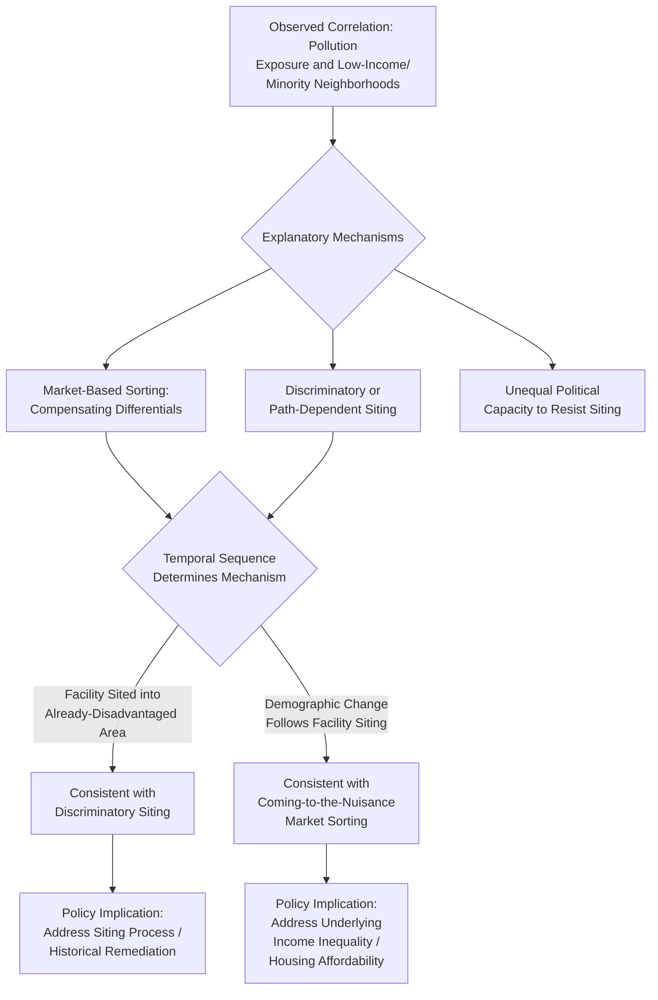

## Environmental Justice in Cities

### Definition and Conceptual Foundation

Environmental justice in cities refers to the study of how environmental burdens (pollution exposure, hazardous facility proximity, climate vulnerability) and environmental benefits (green space access, clean air, resilient infrastructure) are distributed across different socioeconomic, racial, and demographic groups within an urban area, and the economic and policy analysis of the causes and consequences of any observed disparities. The field examines whether environmental costs and benefits are distributed in a manner correlated with income, race, or other social characteristics, and whether such patterns constitute a form of market failure, historical injustice, or both, requiring distinct policy attention beyond conventional pollution-control economics.

This topic builds directly on the urban externalities framework covered previously (pollution and congestion as negative externalities with a divergence between private and social cost) but shifts the analytical focus from aggregate efficiency (how much pollution should exist) to distributional questions (who bears the burden of the pollution that does exist), integrating urban environmental economics with the broader economics of discrimination, spatial sorting, and housing markets.

### Historical Origins and Conceptual Development

The environmental justice framework emerged initially from community activism and empirical documentation, notably a series of landmark studies and events in the United States beginning in the early 1980s (including protests over a hazardous waste landfill sited in a predominantly Black community in Warren County, North Carolina, and a subsequent 1987 study by the United Church of Christ's Commission for Racial Justice documenting the disproportionate siting of hazardous waste facilities in minority communities), which brought sustained academic, policy, and legal attention to the intersection of environmental policy and civil rights. The concept has since been extended internationally and applied to a broadening range of environmental concerns beyond hazardous waste siting, including air quality, urban heat exposure, green space access, and climate change vulnerability.

### Theoretical Mechanisms Explaining Disparate Environmental Exposure

Economists and social scientists have proposed several, not mutually exclusive, theoretical mechanisms to explain observed correlations between environmental burden and socioeconomic/racial characteristics:

**Market-Based Residential Sorting (Compensating Differentials)**

Drawing on the Rosen-Roback compensating differentials framework covered under amenity-driven migration, this mechanism proposes that polluted or environmentally degraded areas command lower housing prices/rents (since pollution is a disamenity that residents must be compensated for via lower housing costs to remain willing to live there), and that lower-income households, facing tighter budget constraints, are disproportionately drawn to these lower-cost, lower-amenity locations as a rational economic response to relative price differences — an outcome of ordinary market sorting rather than necessarily reflecting discriminatory siting decisions per se.

**Discriminatory or Path-Dependent Facility Siting**

An alternative (though not mutually exclusive) mechanism emphasizes that hazardous facilities and infrastructure have historically been *deliberately or systematically sited* in or near minority and low-income communities — whether due to lower political resistance capacity in these communities, explicit historical discrimination (including the legacy of exclusionary zoning and redlining practices), or the path-dependent effect of earlier discriminatory siting decisions influencing subsequent facility location patterns in the same areas.

**"Coming to the Nuisance" versus "Move-In" Dynamics**

A key empirical and methodological question in disentangling the above two mechanisms is the sequencing of causation: did the hazardous facility get sited in an area that was *already* predominantly low-income/minority (consistent with either market sorting or discriminatory siting into existing vulnerable communities), or did the facility's presence *cause* subsequent demographic change (lower-income and minority households moving in *after* facility siting, drawn by resulting lower housing costs — the "coming to the nuisance" pattern)? Distinguishing these two temporal sequences requires panel or historical data tracking both facility siting dates and neighborhood demographic composition over time, and has been the subject of a substantial and still-evolving empirical literature. [Unverified: the relative empirical support for "was-already-disadvantaged" versus "coming-to-the-nuisance" explanations varies across specific studies, facility types, and locations studied, and the literature has not converged on a single universal finding applicable to all contexts — this remains a genuinely active area of empirical research.]

**Political Economy and Unequal Political Capacity**

A further proposed mechanism emphasizes that lower-income and minority communities may have historically possessed less effective political capacity (organizational resources, access to legal representation, political representation) to resist the siting of locally undesirable land uses ("LULUs" — locally unwanted land uses) in their neighborhoods, compared to more affluent or politically connected communities, a mechanism connecting environmental justice analysis to the broader public choice and political economy literature on the siting of disamenity-generating infrastructure.

### Diagram: Competing and Complementary Explanatory Mechanisms

### Categories of Environmental Justice Concerns in Urban Contexts

**Air Quality and Industrial/Traffic Pollution Exposure**

Extensive empirical documentation across many countries shows that proximity to major highways, industrial facilities, ports, and other significant pollution sources correlates with lower income and, in many studies, specific racial/ethnic composition of nearby residents, translating into disparate exposure to particulate matter, nitrogen oxides, and other air pollutants with documented adverse respiratory and cardiovascular health effects.

**Urban Heat Islands and Green Space Access**

A growing body of research documents that lower-income and minority urban neighborhoods frequently have less tree canopy cover, less park and green space access, and correspondingly higher local temperatures during heat events (the urban heat island effect being amplified in areas with more paved surface and less vegetation), imposing disproportionate heat-related health risks — a pattern in some studies traced historically to discriminatory mid-20th-century housing and zoning practices that shaped long-lasting differences in neighborhood green infrastructure investment. [Inference: while this general pattern linking historical housing policy to contemporary green space and heat disparities has been documented in several influential studies, the specific magnitude and universality of this historical linkage across all cities and countries is an area of ongoing empirical research rather than a uniformly established finding for every urban context.]

**Water Infrastructure and Quality**

Disparities in water infrastructure investment, maintenance, and resulting water quality (including well-documented cases of lead contamination linked to aging infrastructure) have been identified as a significant environmental justice concern in some urban contexts, connecting to broader questions of municipal fiscal capacity and historical infrastructure investment patterns across different neighborhoods within a city.

**Climate Change Vulnerability and Resilience Infrastructure**

As climate change increases the frequency and severity of extreme weather events (flooding, heat waves, storms), environmental justice analysis increasingly examines whether resilience and adaptation infrastructure investment (flood barriers, cooling centers, emergency response capacity) is distributed equitably across a city's neighborhoods, given that lower-income residents often have fewer private resources (air conditioning, ability to evacuate, insurance coverage) to independently mitigate climate risk exposure.

### Empirical Measurement Approaches

- **Spatial correlation and regression analysis**: the foundational empirical method, using Geographic Information System (GIS) tools to overlay pollution monitoring data, facility location data, and demographic/socioeconomic census data, then statistically testing for significant correlations between environmental burden measures and demographic characteristics, controlling for other relevant factors (land value, industrial zoning history, transportation infrastructure).
- **Panel/longitudinal siting studies**: as discussed above, using historical facility siting date data combined with demographic data at multiple points in time to empirically distinguish "was-already-disadvantaged" from "coming-to-the-nuisance" explanatory patterns.
- **Hedonic price disparity studies**: examining whether the compensating differential for a given level of pollution/disamenity exposure (the housing price discount associated with proximity to a pollution source) is consistent across different neighborhoods, or whether there is evidence that minority or low-income neighborhoods receive a *smaller* compensating discount than would be predicted by a purely market-based sorting model — a finding, where documented, that would be more consistent with a discrimination-based rather than pure market-sorting explanation. [Inference: findings regarding differential compensating discounts across neighborhood demographic composition vary across specific empirical studies and geographic contexts, and should not be treated as a single universal finding.]
- **Health outcome linkage studies**: connecting environmental exposure data to health outcome data (asthma rates, cardiovascular disease incidence, mortality) disaggregated by neighborhood demographic composition, to quantify the ultimate health and economic welfare consequences of documented exposure disparities.

### Policy Instruments and Approaches

- **Environmental justice screening tools and cumulative impact assessment**: government agencies in several jurisdictions have developed formal screening tools that combine multiple pollution and demographic indicators into composite indices used to identify and prioritize environmental justice communities for targeted policy attention, regulatory scrutiny of new facility permits, or additional public investment.
- **Facility siting reform**: policy reforms requiring more rigorous community engagement, environmental impact assessment, and cumulative impact consideration (accounting for existing pollution burden rather than evaluating each new facility in isolation) before permitting new potentially hazardous facilities, aimed at preventing further concentration of environmental burden in already-affected communities.
- **Targeted remediation and infrastructure investment**: directing public infrastructure investment (green space development, water infrastructure upgrades, tree planting programs) specifically toward historically underserved neighborhoods identified through environmental justice screening analysis.
- **Integrating equity into Pigouvian and market-based instrument design**: as noted under urban externalities more broadly, congestion pricing, cap-and-trade, and other market-based environmental policy instruments are increasingly designed with explicit attention to potential regressive distributional effects, sometimes incorporating revenue recycling mechanisms (rebates, targeted local investment) specifically aimed at offsetting disproportionate burden on lower-income or historically affected communities.

### Applications and Broader Significance

- **Integrating equity into cost-benefit analysis**: environmental justice research has motivated methodological developments in public economics regarding how to formally incorporate distributional weighting into standard efficiency-focused cost-benefit analysis of environmental regulations, moving beyond a purely aggregate net-benefit calculation to also assess who bears costs and who receives benefits.
- **Connecting to broader urban economic inequality research**: environmental justice concerns are increasingly integrated into broader urban economics research on neighborhood effects, residential segregation, and spatial mismatch between residential location and economic opportunity, recognizing that environmental burden is one dimension among several interconnected forms of spatial inequality within cities.
- **International and comparative applications**: while much of the foundational empirical literature originated in the U.S. context, environmental justice analysis has been extended to urban contexts globally, examining analogous patterns of environmental burden distribution by income, ethnicity, caste, or other locally relevant social stratification categories, with country-specific historical and institutional contexts shaping the particular mechanisms and patterns observed. [Unverified: the specific patterns, magnitudes, and dominant causal mechanisms of environmental justice disparities vary substantially across countries and should be assessed based on locally relevant, dated empirical research rather than assumed to directly replicate patterns documented in any single country's literature.]

### Policy Considerations

- **Balancing efficiency and equity objectives in environmental policy design**: environmental justice analysis raises the broader normative and policy design question of how to weigh aggregate efficiency (minimizing total pollution costs) against distributional equity (ensuring no community bears a disproportionate burden), a tension without a single objectively "correct" resolution, requiring explicit normative and political judgment alongside economic analysis. [Inference: this remains a genuinely contested area of policy and welfare-economics debate, since standard efficiency criteria alone do not resolve distributional questions.]
- **Addressing root causes versus symptom mitigation**: policy debates in this area often distinguish between addressing the *underlying* economic and historical drivers of environmental justice disparities (income inequality, historical discriminatory housing policy, residential segregation) versus more narrowly targeted *symptom-focused* interventions (remediation of specific pollution sources, targeted infrastructure investment) — with many analysts arguing that durable progress requires attention to both levels, though the appropriate policy mix and sequencing remains actively debated. [Inference: the relative priority and effectiveness of root-cause versus symptom-focused interventions is a matter of ongoing policy and academic debate without a single settled consensus.]
- **Data and monitoring infrastructure needs**: effective environmental justice policy requires adequate environmental monitoring infrastructure (air quality sensors, health outcome data systems) at sufficiently fine geographic resolution to detect and act on within-city disparities, an area where data availability and quality vary substantially across cities and countries and represent an ongoing implementation challenge for evidence-based environmental justice policy.

**Related Topics**

- Urban externalities: pollution and congestion
- Rosen-Roback compensating differentials model
- Residential segregation and neighborhood effects
- Redlining and historical discriminatory housing policy
- Cost-benefit analysis and distributional weighting
- Climate change adaptation and urban resilience
- Fiscal federalism and municipal infrastructure investment
- Amenity-driven migration and quality-of-life disparities