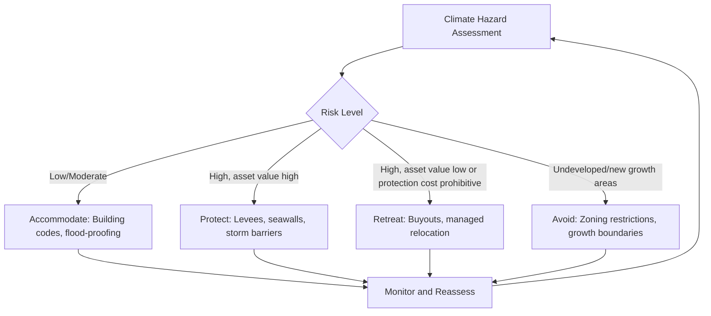

## Climate Change Adaptation and Urban Areas

### Definition and Scope

Climate change adaptation refers to adjustments in ecological, social, or economic systems in response to actual or expected climatic stimuli and their effects or impacts, undertaken to moderate harm or exploit beneficial opportunities. In the urban context, adaptation encompasses the planning, infrastructure, institutional, and behavioral changes cities undertake to reduce vulnerability to climate hazards such as sea-level rise, extreme heat, flooding, drought, and storm intensification.

Urban areas are disproportionately significant in the adaptation discourse for three structural reasons: (1) they concentrate population and capital in spatially fixed, high-value infrastructure that is costly to relocate; (2) they generate localized climate feedbacks, notably the urban heat island (UHI) effect, that compound background climate change; and (3) they are frequently sited in exposed locations (coastlines, river deltas, floodplains) due to historical trade and resource-access advantages.

### Distinguishing Adaptation from Mitigation

| Dimension | Mitigation | Adaptation |
| --- | --- | --- |
| Objective | Reduce greenhouse gas (GHG) emissions | Reduce vulnerability/exposure to climate impacts |
| Spatial scale of benefit | Global (public good) | Local/regional (often local public or private good) |
| Free-rider problem | Severe (classic global commons problem) | Less severe (benefits are localized) |
| Time horizon | Long-term, diffuse benefits | Often near-term, localized benefits |
| Economic framing | Externality correction (Pigouvian) | Risk management, insurance, defensive investment |

This distinction matters economically because mitigation suffers from a global collective action problem (a city's individual mitigation effort has negligible effect on that city's own climate outcomes), whereas adaptation benefits accrue substantially to the investing jurisdiction, giving local governments stronger incentives to act unilaterally on adaptation than on mitigation.

### The Urban Heat Island as an Adaptation-Relevant Externality

The UHI effect arises because urban surfaces (asphalt, concrete, dark roofing) have lower albedo and higher heat capacity than vegetated or natural land cover, and because reduced evapotranspiration and waste heat from energy use, transport, and air conditioning add to ambient heat. This is a classic negative externality: each individual paving or building decision imposes a marginal thermal cost on neighbors that is not reflected in private decision-making.

$$T_{urban} - T_{rural} = f(\text{density}, \text{albedo}, \text{vegetation cover}, \text{anthropogenic heat flux})$$

Because UHI intensity scales with built density, it interacts directly with urban economic theory: the same agglomeration forces that generate productivity benefits (density, proximity) also generate thermal externalities that raise adaptation costs, implying a tradeoff urban planners must price into land-use regulation.

### Climate Hazards Relevant to Urban Areas

**Key Points**

- **Coastal/riverine flooding**: driven by sea-level rise, storm surge, and increased precipitation intensity; disproportionately affects port cities and floodplain settlements.
- **Extreme heat**: amplified by UHI; increases mortality, reduces labor productivity, and raises peak electricity demand.
- **Drought and water stress**: affects municipal water systems, particularly in cities dependent on single-source watersheds.
- **Extreme precipitation and stormwater overload**: exceeds the design capacity of legacy drainage infrastructure sized for historical rainfall distributions.
- **Compound and cascading hazards**: e.g., heat-driven demand for cooling coinciding with drought-constrained hydropower generation.

### Economic Framework: Adaptation as a Risk Management Investment

Urban adaptation investment can be modeled as an optimal risk-reduction problem. A city (or planner) chooses adaptation expenditure $A$ to minimize the sum of adaptation costs and expected residual damages:

$$\min_{A} \; C(A) + E[D(A, \theta)]$$

where $C(A)$ is the direct cost of adaptation measures, $E[D(A,\theta)]$ is expected climate damage as a function of adaptation level and the stochastic climate hazard state $\theta$, and $\partial D/\partial A < 0$ (more adaptation reduces expected damage) at a decreasing rate (diminishing marginal protection).

The optimal adaptation level $A^*$ satisfies the first-order condition:

$$\frac{\partial C}{\partial A} = -\frac{\partial E[D]}{\partial A}$$

i.e., marginal adaptation cost equals the marginal reduction in expected damage. This framework is directly analogous to the economics of self-protection versus self-insurance in insurance theory (Ehrlich and Becker, 1972): adaptation measures that reduce the probability of loss are "self-protection," while measures that reduce the size of loss conditional on occurrence (e.g., flood-resistant construction) are "self-insurance."

### Market Failures Motivating Public Intervention

**Key Points**

- **Externalities**: Individual building/paving decisions impose thermal and drainage costs on neighbors (as with UHI above); flood defenses built by one property owner can displace water onto neighboring parcels.
- **Public goods**: Large-scale infrastructure (seawalls, levees, urban drainage systems) is non-excludable and non-rival within the protected zone, leading to underprovision if left to private actors.
- **Information asymmetries and myopia**: Households and firms often underestimate low-probability, high-impact climate risks (present bias, availability heuristic), leading to underinvestment in private adaptation.
- **Moral hazard from subsidized insurance**: Government flood insurance programs (e.g., the U.S. National Flood Insurance Program) that price risk below actuarial cost encourage continued development in hazard-prone areas, a phenomenon sometimes termed the "coastal squeeze" or "levee effect."
- **Split incentives**: Renters and landlords face misaligned incentives for adaptation retrofits (landlords bear cost, tenants capture heat/flood-safety benefit), analogous to the energy-efficiency "principal-agent problem."

### Capitalization of Climate Risk into Land and Property Markets

A growing empirical literature examines whether climate risk is capitalized into real estate prices — a test of market efficiency in pricing future hazard exposure.

**Key Points**

- Hedonic pricing models regress property values on flood-zone designation, elevation, and sea-level-rise exposure, controlling for structural and locational amenities.
- Underpricing of risk is commonly found where flood insurance is subsidized or where disclosure requirements are weak, consistent with information asymmetry.
- Post-disaster price adjustments ("salience effects") show that home buyers frequently update risk perceptions sharply after a flood event, then this "risk premium" partially decays over time as memory fades — evidence of bounded rationality rather than fully rational forward-looking pricing.
- This capitalization dynamic matters for adaptation policy because it affects who bears transition costs: if risk is not priced in, current owners can sell to less-informed buyers ("hot potato" effect), diffusing losses inefficiently.

### Adaptation Strategy Typology

**Key Points**

- **Protect**: Engineering infrastructure to resist hazards (seawalls, levees, storm-surge barriers, elevated roadways).
- **Accommodate**: Modify structures and systems to function despite hazard exposure (flood-proofing, elevated construction, permeable pavement, green roofs).
- **Retreat (managed relocation)**: Withdraw from highest-risk areas, often via buyout programs, land-use downzoning, or transfer of development rights.
- **Avoid**: Prevent new development in hazard-prone areas through zoning, building codes, and growth boundaries.

### Managed Retreat: Economic Considerations

Managed retreat is politically and economically the most contentious adaptation strategy because it imposes concentrated, visible losses (property value destruction, community/social capital loss) in exchange for diffuse, uncertain future benefits (avoided future disaster costs).

Cost-benefit analysis of retreat versus protection typically compares:

$$NPV_{retreat} = -\text{(relocation + compensation costs)} + \sum_{t} \frac{\text{avoided future damages}_t}{(1+r)^t}$$

$$NPV_{protect} = -\sum_t \frac{\text{infrastructure capital + O\&M costs}_t}{(1+r)^t} + \sum_t \frac{\text{avoided damages}_t}{(1+r)^t}$$

Retreat tends to dominate protection economically when: (a) the protected asset value is low relative to defense cost, (b) the hazard probability/severity is projected to increase substantially over the infrastructure's design life, or (c) protection generates negative externalities elsewhere (e.g., a levee that increases flood risk downstream). [Inference: the precise crossover point is highly site-specific and sensitive to discount rate assumptions, so general claims about when retreat "dominates" should be treated as illustrative rather than a universal threshold.]

Buyout programs (e.g., FEMA's Hazard Mitigation Grant Program in the U.S.) illustrate practical retreat implementation but face well-documented frictions: voluntary participation leads to a "checkerboard" pattern of vacant and occupied lots that undermines neighborhood cohesion and infrastructure economics (fixed costs of remaining services spread over fewer users).

### Green and Blue Infrastructure as Adaptation Assets

**Key Points**

- **Green infrastructure**: Urban forests, green roofs, bioswales, and permeable surfaces reduce UHI intensity and stormwater runoff while providing co-benefits (amenity value, air quality, carbon sequestration).
- **Blue infrastructure**: Constructed wetlands, retention ponds, and daylighted urban streams manage flood peaks and provide recreational/ecological value.
- These are frequently termed "nature-based solutions" (NBS) and are economically attractive where co-benefits are large relative to grey infrastructure alternatives, though they typically have lower peak-capacity ceilings than engineered defenses, implying hybrid grey-green systems are often optimal.
- Valuation of green infrastructure typically requires non-market valuation techniques (hedonic pricing for amenity value, avoided-cost methods for stormwater capacity, contingent valuation for ecological services) since these benefits are not transacted in markets directly.

### Financing Urban Adaptation

**Key Points**

- **Municipal bonds** (including "climate resilience bonds" and "green bonds"): debt financing for infrastructure with long payback periods matched to bond maturities.
- **Special assessment districts**: geographically targeted property tax levies where beneficiaries of a specific adaptation investment (e.g., a local drainage upgrade) bear its cost, addressing free-rider concerns.
- **Public-private partnerships (PPPs)**: risk-sharing arrangements for large infrastructure (e.g., storm-surge barriers), though these require careful contract design to avoid shifting downside risk disproportionately to the public sector.
- **Resilience/catastrophe bonds and parametric insurance**: transfer tail risk to capital markets, paying out based on predefined trigger events (e.g., storm wind speed) rather than assessed damage, reducing claims-processing delay.
- **Intergovernmental transfers**: national or supranational funding (e.g., FEMA grants in the U.S., EU Cohesion Funds, World Bank climate resilience financing) address the fiscal capacity gap in lower-income municipalities, which are often most exposed and least able to self-finance adaptation.

### Distributional and Equity Dimensions

Adaptation investment is not distributionally neutral. Key equity concerns include:

- **Heat vulnerability**: Lower-income neighborhoods often have less tree canopy and more impervious surface (a legacy in the U.S. context linked to historical redlining), producing measurably higher local temperatures and heat-mortality risk — an empirically documented correlation between historical discriminatory lending maps and present-day UHI intensity.
- **Flood protection inequities**: Levee and seawall siting decisions historically prioritized commercial/high-value districts, leaving lower-income and minority neighborhoods more exposed.
- **Green gentrification**: Adaptation-linked amenity investments (parks, green infrastructure, waterfront restoration) can raise surrounding property values and rents, displacing the lower-income residents such investments were partly intended to protect — a documented tension in environmental justice literature termed "climate gentrification."
- **Retreat equity**: Buyout compensation based on pre-disaster market value can undercompensate residents in historically undervalued (e.g., previously redlined) neighborhoods, compounding prior inequities.

### Institutional and Governance Considerations

**Key Points**

- **Jurisdictional fragmentation**: Metropolitan areas often span multiple municipalities with independent land-use authority, creating coordination failures for basin-wide flood management or region-wide heat mitigation (a classic multi-jurisdictional externality problem).
- **Building codes and land-use regulation**: Updating codes to reflect forward-looking climate projections (rather than historical hazard data) is an information- and political-economy-intensive process, often lagging updated hazard maps.
- **Federal/national flood maps**: In the U.S., FEMA Flood Insurance Rate Maps (FIRMs) have historically underrepresented pluvial (rainfall-driven) and future climate-adjusted flood risk relative to purely fluvial/coastal mapping, a documented gap addressed by newer probabilistic modeling efforts (e.g., First Street Foundation's flood models).
- **Path dependency**: Sunk infrastructure investment (e.g., existing drainage networks sized for historical rainfall) creates lock-in that raises the cost of later adaptation, an application of general path-dependence theory in urban economics.

### Illustrative Diagram: Adaptation Decision Framework

### Illustrative Diagram: Urban Heat Island Cross-Section (svg_diagram)

<svg xmlns="http://www.w3.org/2000/svg" viewBox="0 0 700 320">
<rect x="0" y="0" width="700" height="320" fill="#ffffff" />
<text x="350" y="24" text-anchor="middle" font-size="16" font-weight="bold" fill="#1a1a1a">Urban Heat Island Temperature Profile (svg_diagram)</text>
<line x1="40" y1="260" x2="660" y2="260" stroke="#333" stroke-width="2" />
<path d="M40,230 Q120,225 180,150 Q260,90 350,80 Q440,90 520,150 Q580,225 660,230" stroke="#d1495b" stroke-width="3" fill="none" />
<rect x="20" y="260" width="120" height="30" fill="#8fbf8f" />
<text x="80" y="300" text-anchor="middle" font-size="11" fill="#333">Rural/Farmland</text>
<rect x="140" y="260" width="90" height="30" fill="#c9b48a" />
<text x="185" y="300" text-anchor="middle" font-size="11" fill="#333">Suburban</text>
<rect x="230" y="260" width="90" height="30" fill="#a8a8a8" />
<text x="275" y="300" text-anchor="middle" font-size="11" fill="#333">Residential</text>
<rect x="320" y="260" width="120" height="30" fill="#6e6e6e" />
<text x="380" y="300" text-anchor="middle" font-size="11" fill="#fff">Downtown/CBD</text>
<rect x="440" y="260" width="100" height="30" fill="#a8a8a8" />
<text x="490" y="300" text-anchor="middle" font-size="11" fill="#333">Residential</text>
<rect x="540" y="260" width="90" height="30" fill="#c9b48a" />
<text x="585" y="300" text-anchor="middle" font-size="11" fill="#333">Suburban</text>
<rect x="630" y="260" width="30" height="30" fill="#8fbf8f" />
<text x="30" y="85" font-size="11" fill="#333">Higher Temp</text>
<text x="30" y="245" font-size="11" fill="#333">Lower Temp</text>
<line x1="35" y1="70" x2="35" y2="255" stroke="#999" stroke-width="1" marker-end="url(#arrow)" />
</svg>

### Worked Example: Optimal Adaptation Under Rising Hazard Probability

Consider a coastal municipality evaluating a seawall costing $50 million with a 50-year design life, discount rate $r = 3\%$. Expected annual flood damage without the seawall is projected to rise linearly from $1 million/year today to $6 million/year by year 50 as sea levels rise. With the seawall, residual annual damage is capped at $0.5 million/year (assuming maintenance).

The present value of avoided damages is:

$$PV_{avoided} = \sum_{t=0}^{50} \frac{D_{no\_wall}(t) - D_{wall}(t)}{(1.03)^t}$$

where $D_{no\_wall}(t) = 1 + 0.1t$ (in $ millions) and $D_{wall}(t) = 0.5$.

[Inference: Using a simplified discretized approximation, this integral yields a present value of avoided damages substantially exceeding the $50 million capital cost under these assumptions, suggesting the seawall passes a benefit-cost test — but actual conclusions are highly sensitive to the discount rate, damage function specification, and assumed maintenance costs, and a full analysis would require explicit annual computation and sensitivity testing rather than the closed-form approximation shown here.]

This example illustrates the standard structure of urban adaptation cost-benefit analysis: rising hazard trajectories interact with discounting to determine whether upfront capital costs are justified by long-run avoided damages.

### Empirical Measurement Challenges

**Key Points**

- **Counterfactual damage estimation**: Measuring "damages avoided" requires modeling a counterfactual no-adaptation scenario, which is inherently uncertain and model-dependent.
- **Climate projection uncertainty**: Adaptation planning must incorporate a range of emissions scenarios (e.g., IPCC Shared Socioeconomic Pathways) rather than point estimates, since sea-level-rise and precipitation projections vary substantially across scenarios and models.
- **Discount rate sensitivity**: Because climate damages are long-horizon, adaptation cost-benefit conclusions are highly sensitive to the social discount rate chosen — a well-known point of contention in climate economics (cf. the Stern Review's low discount rate versus Nordhaus's higher rate assumptions in DICE-model analyses).
- **Attribution**: Isolating the marginal effect of a specific adaptation measure from confounding factors (other infrastructure changes, demographic shifts) complicates ex-post program evaluation.

### Conclusion

Urban climate adaptation sits at the intersection of environmental economics, public finance, and urban land-use theory. It requires reconciling place-based, capital-intensive infrastructure with an inherently uncertain and worsening hazard trajectory, under conditions of externalities, public-good underprovision, and significant distributional stakes. The dominant analytical tools — risk-based cost-benefit analysis, hedonic capitalization studies, and typologies of protect/accommodate/retreat/avoid — provide a structured framework, but practical implementation remains constrained by governance fragmentation, financing gaps, and the political economy of managed retreat.

**Related Topics**

- Sea-level rise and coastal property markets
- Urban heat island mitigation policy
- Flood insurance markets and moral hazard (NFIP case study)
- Green infrastructure valuation and non-market valuation methods
- Climate gentrification and environmental justice
- Municipal climate finance and resilience bonds
- Land-use zoning as a climate risk management tool
- Discounting and intergenerational equity in climate cost-benefit analysis
- Urban water scarcity and drought resilience planning
- Managed retreat case studies (e.g., U.S. buyout programs, Netherlands "Room for the River")