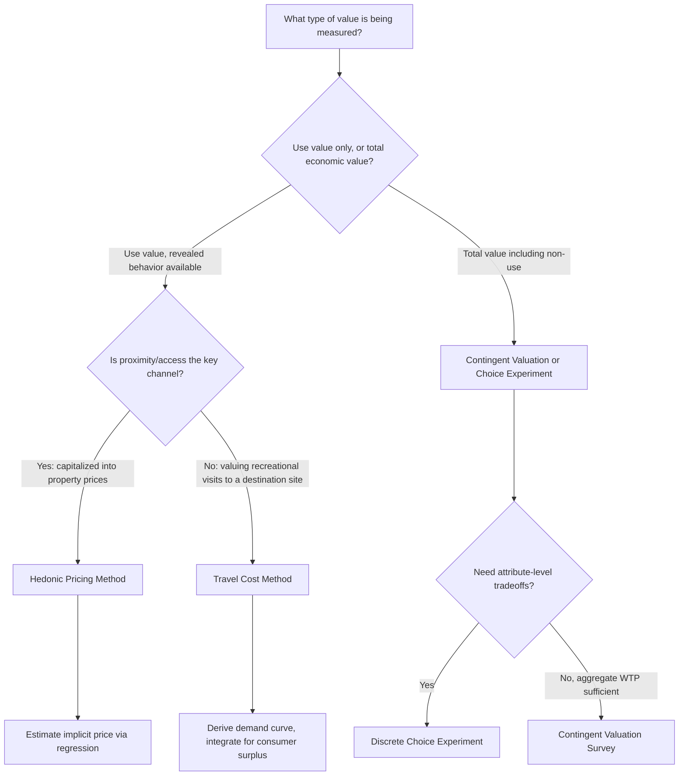

## Green Space and Urban Amenity Valuation

### Definition and Scope

Urban amenity valuation is the subfield of environmental and urban economics concerned with estimating the economic value of non-market goods that affect quality of life in cities — most centrally, green space (parks, urban forests, community gardens, greenways) but extending to related amenities such as air quality, viewsheds, and proximity to water bodies. Because green space is typically not bought and sold directly, its value must be inferred using non-market valuation techniques rather than observed transaction prices.

This topic sits within environmental economics' broader treatment of non-market valuation, applied specifically to the spatial and locational context of cities, where amenity value is capitalized into land and housing markets due to the fixed, immobile nature of urban land.

### Why Green Space Requires Non-Market Valuation

Green space generates value through multiple channels that are not directly priced:

**Key Points**

- **Use value**: Direct recreational benefits to visitors (walking, exercise, social gathering).
- **Non-use value**: Existence value (people value knowing a park exists even if they never visit) and bequest value (value from preserving it for future generations).
- **Ecosystem service value**: Air pollution removal, stormwater absorption, carbon sequestration, urban heat island mitigation.
- **Amenity/proximity value**: Capitalized into nearby property values, since living near a park is a positive locational attribute.
- **Public health value**: Documented associations between green space access and reduced stress, improved mental health, and increased physical activity.

Because most of these values lack direct market transactions, economists rely on revealed-preference and stated-preference methods to estimate willingness to pay (WTP).

### Core Valuation Methodologies

#### 1. Hedonic Pricing Method (HPM)

The hedonic method exploits the fact that housing is a bundled good: a home's price reflects not only structural characteristics but also locational attributes, including proximity to green space. The standard hedonic price function is:

$$P_i = \beta_0 + \beta_1 S_i + \beta_2 N_i + \beta_3 G_i + \varepsilon_i$$

where $P_i$ is the sale price of property $i$, $S_i$ is a vector of structural characteristics (square footage, bedrooms, age), $N_i$ is a vector of neighborhood characteristics (school quality, crime rate), and $G_i$ captures green space attributes (distance to nearest park, park size, tree canopy cover). The coefficient $\beta_3$ is interpreted as the implicit (marginal) price of green space proximity, and the marginal willingness to pay for a marginal change in $G$ is given by:

$$MWTP_G = \frac{\partial P}{\partial G} = \beta_3$$

**Key Points**

- Requires large transaction datasets with georeferenced property and park locations (typically from tax assessor or MLS records combined with GIS park boundary data).
- Common green space measures: Euclidean or network distance to nearest park, park acreage within a fixed radius (e.g., 500m, 1km), percentage tree canopy cover, view of green space from the property.
- Distance-decay functions are typically nonlinear: the marginal value of proximity diminishes with distance, often modeled with a semi-log or spline specification rather than assuming a linear relationship.
- Requires controlling for spatial autocorrelation (nearby homes have correlated unobserved characteristics), commonly addressed with spatial fixed effects, spatial lag models, or spatial error models.
- Endogeneity concern: park siting is not random — parks are often located based on land availability or planning decisions correlated with neighborhood characteristics, biasing naive OLS estimates. Researchers address this using instrumental variables, difference-in-differences around park openings, or repeat-sales designs.

#### 2. Travel Cost Method (TCM)

TCM estimates recreational use value by treating the time and money cost of traveling to a green space as an implicit "price," analogous to a demand curve derived from observed visitation patterns.

$$V_i = f(TC_i, X_i)$$

where $V_i$ is the number of visits by individual or zone $i$, $TC_i$ is the travel cost (transport cost plus opportunity cost of time), and $X_i$ is a vector of socioeconomic controls. Consumer surplus per visit is derived by integrating under the estimated demand curve.

**Key Points**

- Zonal TCM aggregates visitation rates by origin zone (e.g., zip code); individual TCM uses survey-based individual visitation data.
- The opportunity cost of travel time is typically valued at a fraction (often one-third to one-half) of the visitor's wage rate, a convention with ongoing debate in the literature. [Inference: the appropriate fraction varies by context and is not a fixed law of demand estimation — commonly cited ranges reflect empirical convention rather than universal consensus.]
- Best suited to valuing use value of a single large, destination-type green space (e.g., a major urban park or regional greenway) rather than small, ubiquitous neighborhood green space where travel cost variation is minimal.
- Limitation: does not capture non-use value (existence, bequest value) since it relies entirely on observed visitation behavior.

#### 3. Contingent Valuation Method (CVM)

CVM is a stated-preference technique that directly surveys individuals about their hypothetical willingness to pay for a green space improvement or willingness to accept compensation for its loss.

**Key Points**

- Typically implemented via dichotomous-choice ("would you pay $X?") or open-ended WTP questions, embedded in carefully designed surveys describing a specific, credible scenario.
- Capable of capturing total economic value, including non-use value, which revealed-preference methods (hedonic, TCM) cannot capture.
- Subject to well-documented biases: hypothetical bias (respondents overstate WTP in non-binding scenarios), strategic bias (free-riding or overstatement to influence provision), and starting-point bias in payment-card formats.
- The NOAA Blue Ribbon Panel (1993) established methodological guidelines for CVM validity following the Exxon Valdez oil spill litigation, including recommendations for referendum-format questions and conservative design to minimize upward bias.

#### 4. Choice Experiments (Discrete Choice / Conjoint Analysis)

An extension of stated-preference methods where respondents choose among hypothetical bundles of attributes (e.g., different park designs with varying tree cover, amenities, and cost), allowing estimation of implicit prices for individual attributes via random utility models:

$$U_{ij} = V(X_{ij}, \beta) + \varepsilon_{ij}$$

estimated typically via conditional or mixed logit, where the ratio of attribute coefficients to the cost coefficient yields marginal willingness to pay for each attribute.

#### 5. Benefit Transfer

Given the high cost of primary valuation studies, practitioners often apply benefit transfer — adapting WTP or value estimates from existing studies of comparable green spaces to a new policy site, adjusted for income and site-characteristic differences. This is a pragmatic but methodologically contested approach, since transfer error (the gap between transferred and "true" site-specific value) can be substantial. [Inference: transfer error magnitude is highly context-dependent and not reliably predictable ex ante, so benefit transfer results are generally treated as approximations for screening-level analysis rather than precise valuations.]

### The Green Space Capitalization Literature: Empirical Regularities

**Key Points**

- Proximity to parks is consistently associated with a positive price premium in most hedonic studies, though the magnitude varies widely (commonly cited ranges are on the order of a few percent of home value per unit of proximity, but effect sizes are highly sensitive to park type, size, quality, and city context, and should not be treated as a universal constant).
- Larger, higher-quality parks with more amenities (trails, water features, active recreation facilities) tend to command larger premiums than small, unmaintained green spaces.
- Effects can be non-monotonic: very close proximity (e.g., directly adjacent) sometimes shows reduced or even negative premiums due to nuisance factors (noise, traffic, perceived safety concerns at night), producing a "doughnut" pattern where value peaks at a short but non-zero distance.
- Urban tree canopy cover, studied separately from parks, is also frequently associated with positive housing price premiums, attributed to both aesthetic amenity and cooling/energy-saving benefits.

### Market Failure Rationale for Public Provision

Green space exhibits classic public-good and externality characteristics justifying public provision or regulation:

- **Non-excludability/non-rivalry**: Open, unfenced urban parks are largely non-excludable and (up to a congestion threshold) non-rival, leading to underprovision if left purely to private markets.
- **Positive externalities**: Ecosystem services (air filtration, stormwater absorption, cooling) benefit surrounding properties regardless of whether those property owners contributed to the park's provision or maintenance — a free-rider problem.
- **Option and existence value**: Values that a private developer has no mechanism to capture or monetize, leading to systematic underinvestment relative to the social optimum.

This motivates zoning tools such as mandatory park dedication requirements in new developments, park impact fees, and conservation easements, as well as direct public acquisition and maintenance of parkland.

### Green Gentrification: An Equity Complication

A well-documented tension in the green space valuation literature is "green gentrification" (also termed "environmental gentrification" or the "green space paradox"): investments that create or improve urban green space raise surrounding property values and rents (as predicted by hedonic capitalization theory), which can displace lower-income and long-term residents — the very populations that often had the least access to green amenities prior to the investment.

**Key Points**

- Documented in case studies of major urban greening projects (e.g., New York's High Line, Atlanta's BeltLine), where post-development price appreciation significantly exceeded citywide trends in immediately adjacent areas.
- Raises a policy tension between the economic goal of maximizing amenity value capitalization (which benefits existing property owners and city tax revenue) and the equity goal of maintaining affordability and access for existing residents.
- Policy responses include inclusionary zoning tied to green infrastructure projects, community land trusts, and rent stabilization measures targeted at areas undergoing green-space-driven appreciation.

### Distributional Analysis of Green Space Access

Beyond capitalization, a substantial literature documents unequal distribution of green space access across income and racial/ethnic lines within cities — an environmental justice concern distinct from (but related to) valuation.

**Key Points**

- Lower-income and minority neighborhoods frequently have less park acreage per capita, lower tree canopy cover, and greater distance to quality green space, in many U.S. cities correlating with historical redlining boundaries.
- This inequitable distribution compounds urban heat island exposure (see Climate Change Adaptation and Urban Areas) since tree canopy is a key UHI mitigant.
- Equity-weighted cost-benefit analysis has been proposed as a methodological response, applying differential weights to WTP estimates or health benefits accruing to historically underserved populations, though this remains methodologically and politically contested.

### Illustrative Diagram: Non-Market Valuation Method Selection

### Worked Example: Hedonic Estimation of Park Proximity Value

Suppose a hedonic regression on 10,000 home sales yields the following simplified specification (log-linear form):

$$\ln(P_i) = 11.2 + 0.004(\text{sqft}_i) - 0.015(\text{distance to park}_i, \text{in 100m units}) + \gamma X_i + \varepsilon_i$$

The coefficient on distance to park implies that each additional 100 meters of distance from the nearest park is associated with an approximate 1.5% reduction in home price, holding structural and other neighborhood characteristics constant. For a home priced at $400,000, this implies a marginal implicit value of approximately $6,000 per 100-meter reduction in distance — though [Inference: this dollar translation assumes the log-linear specification is correctly specified and that unobserved neighborhood quality is not correlated with park distance; if park siting is endogenous to unobserved neighborhood desirability, this estimate would be biased and should be interpreted as suggestive rather than causal without further identification strategy].

### Aggregation to City-Wide Value Estimates

Individual property-level implicit prices are commonly aggregated to estimate the total capitalized value of a city's green space system, calculated as:

$$V_{total} = \sum_{i=1}^{N} (\hat{P}_i - \hat{P}_i^{counterfactual})$$

where $\hat{P}_i^{counterfactual}$ is the predicted price of property $i$ absent nearby green space (holding all else constant). Such aggregate estimates are frequently used in municipal cost-benefit analyses to justify park acquisition budgets or green infrastructure bonds, though they require caution regarding extrapolation beyond the sample's observed range of distances and park sizes.

### Conclusion

Green space and urban amenity valuation applies the standard toolkit of environmental non-market valuation — hedonic pricing, travel cost, contingent valuation, and choice experiments — to the specific spatial economics of cities, where land is fixed and amenities are capitalized into highly localized property values. The empirical literature robustly finds positive capitalization of park proximity and tree canopy, but methodological challenges around endogenous park siting, non-linear distance effects, and stated-preference biases require careful econometric treatment. Increasingly, the field has expanded beyond pure valuation to grapple with the equity consequences of amenity investment, particularly green gentrification and unequal baseline access to green space across income and racial lines.

**Related Topics**

- Hedonic pricing models and spatial econometrics
- Green gentrification and environmental justice in urban planning
- Urban heat island mitigation and tree canopy policy
- Contingent valuation methodology and survey design (NOAA panel guidelines)
- Park impact fees and land dedication requirements in zoning
- Ecosystem services valuation frameworks
- Discrete choice experiments in environmental economics
- Equity-weighted cost-benefit analysis
- Urban forestry economics and canopy cover policy
- Public goods provision and municipal park financing