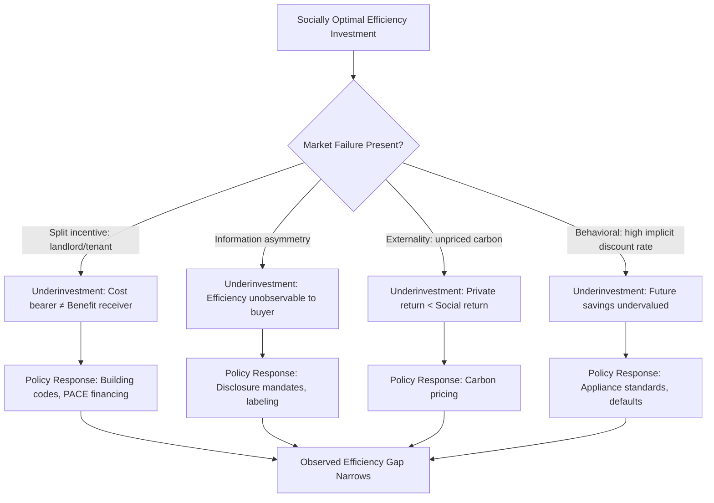

## Energy Use and the Built Environment

### Definition and Scope

The economics of energy use in the built environment examines how urban form, building characteristics, and infrastructure decisions determine energy consumption patterns, and how market failures, price signals, and regulatory instruments shape investment in energy efficiency. The built environment — encompassing residential, commercial, and industrial structures along with the transportation and urban form that connects them — accounts for a substantial share of total energy consumption and associated greenhouse gas emissions in most developed economies, making it a central focus of urban environmental economics.

This topic bridges several subfields: urban economics (density and land-use effects on energy demand), public economics (externalities and market failures in energy markets), and industrial organization (principal-agent problems in energy efficiency investment).

### Channels Linking Urban Form to Energy Consumption

**Key Points**

- **Density and transportation energy**: Lower-density, sprawling development increases per-capita vehicle miles traveled (VMT), raising transportation energy consumption; compact, mixed-use development reduces trip lengths and enables non-auto modes.
- **Building type and thermal efficiency**: Multifamily and attached housing units have lower per-unit heating/cooling energy demand due to shared walls (reduced surface-area-to-volume ratio) compared to detached single-family homes.
- **District-scale infrastructure**: Higher density enables cost-effective district heating/cooling systems and combined heat and power (CHP), which are typically uneconomical at low densities due to distribution network costs.
- **Building vintage and codes**: Older building stock, constructed under weaker or nonexistent energy codes, exhibits substantially higher energy intensity per square foot than recently constructed stock subject to modern codes.
- **Climate and building orientation**: Urban microclimate effects (see urban heat island) interact with building energy demand, increasing cooling-degree-day-driven electricity consumption in dense urban cores.

### The Building Energy Balance

Building energy consumption for heating and cooling can be conceptually decomposed via a simplified energy balance:

$$Q_{HVAC} = UA(T_{in} - T_{out}) + Q_{internal} + Q_{solar} - Q_{losses}$$

where $UA$ is the building's overall heat transfer coefficient (a function of insulation, window performance, and air leakage), $T_{in} - T_{out}$ is the indoor-outdoor temperature differential, $Q_{internal}$ is internal heat gains (occupants, appliances), and $Q_{solar}$ is solar heat gain. Energy efficiency investments (insulation, window upgrades, air sealing) reduce $UA$, directly lowering the heating/cooling load for a given climate and comfort target.

### Market Failures in Building Energy Efficiency

The persistent gap between the energy-efficiency investments that appear cost-effective on a lifecycle basis and those actually undertaken — commonly termed the "energy efficiency gap" — is attributed to several distinct market failures and behavioral factors.

#### 1. The Principal-Agent (Split-Incentive) Problem

**Key Points**

- **Landlord-tenant split**: In rental housing, landlords typically bear the capital cost of efficiency upgrades (insulation, efficient HVAC) while tenants who pay utility bills capture the energy savings, eliminating the landlord's incentive to invest.
- **Reverse split incentive**: Where landlords pay utility costs directly (common in some multifamily and commercial leases), tenants have no incentive to conserve energy since they do not bear the marginal cost of consumption.
- **Builder-buyer split**: Speculative developers may underinvest in efficiency features that are not easily observed or valued by buyers at time of purchase, especially where efficiency labeling or disclosure is weak.

This is a specific application of the general principal-agent framework in economics, where information asymmetry and misaligned incentives between the decision-maker (who bears the cost) and the beneficiary (who captures the value) lead to underinvestment relative to the social optimum.

#### 2. Information Asymmetries and Imperfect Information

- Energy performance is difficult for buyers/renters to observe or verify prior to purchase or lease, unlike easily observed attributes (square footage, number of bedrooms).
- Energy efficiency ratings and disclosure mandates (e.g., Energy Performance Certificates in the EU, ENERGY STAR labeling and benchmarking ordinances in the U.S.) are policy responses designed to reduce this asymmetry, analogous to Akerlof's "market for lemons" framework.

#### 3. Externalities

Energy consumption, particularly from fossil-fuel-generated electricity and direct fossil fuel combustion (natural gas heating), generates negative externalities through GHG emissions and local air pollution not reflected in the market price of energy — the standard Pigouvian externality rationale for carbon pricing and energy taxation.

#### 4. Behavioral and Bounded Rationality Factors

- **High implicit discount rates**: Empirical studies of household appliance and vehicle purchase decisions frequently find implicit discount rates for energy efficiency investments substantially higher than market interest rates, suggesting under-weighting of future energy savings relative to upfront cost — though [Inference: the degree to which this reflects true behavioral bias versus rational responses to liquidity constraints, risk, or heterogeneous private benefit estimates remains debated in the literature].
- **Salience and inattention**: Energy costs bundled into utility bills received monthly, after consumption, are less salient than upfront purchase price, potentially leading to under-weighting of operating costs relative to capital costs in purchase decisions.
- **Status quo bias and inertia**: Default options and switching costs (e.g., failure to switch electricity suppliers or upgrade equipment even when it is unambiguously cost-effective) are well documented in energy choice contexts.

### Policy Instruments Addressing Building Energy Use

**Key Points**

- **Building energy codes**: Mandatory minimum efficiency standards for new construction and major renovations (e.g., IECC in the U.S., Passivhaus standard in Europe), directly targeting the split-incentive problem by removing the choice margin at construction/renovation time.
- **Energy efficiency mandates and appliance standards**: Minimum efficiency standards for HVAC equipment, water heaters, and appliances, addressing information asymmetry and bounded rationality by removing inefficient options from the market entirely.
- **Building energy benchmarking and disclosure ordinances**: Municipal requirements (e.g., New York City's Local Law 84, San Francisco's Existing Building Energy Ordinance) mandating disclosure of energy performance, intended to activate market pricing of efficiency via increased buyer/renter information.
- **Utility demand-side management (DSM) programs**: Utility-administered rebate and financing programs for efficiency upgrades, often funded through a small surcharge on all ratepayers, justified on externality and market-failure grounds.
- **Carbon pricing (carbon tax or cap-and-trade)**: A Pigouvian correction internalizing the GHG externality directly into energy prices, theoretically the most economically efficient instrument since it lets the market determine the cost-minimizing mix of efficiency, fuel switching, and behavior change — though [Inference: political economy constraints have historically limited carbon price levels well below estimates of the social cost of carbon in most implemented systems, so realized emission reductions from carbon pricing alone have often been more modest than efficiency-only or standards-based policies].
- **On-bill financing and PACE (Property Assessed Clean Energy) programs**: Financing mechanisms that attach efficiency investment costs to the utility bill or property tax assessment rather than requiring upfront capital, directly addressing capital constraints and the split-incentive problem (since the assessment can transfer with the property).

### Cost-Effectiveness Analysis of Efficiency Investments

Efficiency investments are conventionally evaluated using standard capital budgeting techniques, most commonly the **Cost of Conserved Energy (CCE)**:

$$CCE = \frac{C \times CRF(r, n)}{\Delta E}$$

where $C$ is the incremental capital cost, $CRF(r,n)$ is the capital recovery factor at discount rate $r$ over lifetime $n$, and $\Delta E$ is the annual energy savings. An investment is cost-effective from society's perspective if $CCE$ is less than the marginal cost of supplying the conserved energy (i.e., the avoided cost of generation/supply).

$$CRF(r,n) = \frac{r(1+r)^n}{(1+r)^n - 1}$$

This framework underlies utility integrated resource planning and the concept of "negawatts" — treating conserved energy as a supply-side resource to be compared directly against generation alternatives on a cost basis.

### The "Rebound Effect"

A well-documented complication in efficiency policy is the rebound effect: efficiency improvements reduce the effective price of energy services (e.g., cheaper heating per degree of comfort), which induces increased consumption of that service, partially offsetting the anticipated energy savings.

$$\text{Rebound} = 1 - \frac{\Delta E_{actual}}{\Delta E_{engineering}}$$

**Key Points**

- **Direct rebound**: Increased consumption of the specific energy service made cheaper (e.g., raising thermostat setpoints after insulation upgrades).
- **Indirect rebound**: Redirected spending of the money saved toward other energy-consuming goods and services.
- **Economy-wide rebound**: Macroeconomic effects from efficiency-driven productivity gains that stimulate broader economic activity and energy use.
- Empirical estimates of direct rebound for residential heating/cooling are commonly found to be modest in magnitude in most studies, though estimates vary considerably by context, income level, and end use, and the size of indirect and economy-wide rebound remains more contested and harder to measure. [Inference: because rebound magnitude estimates vary substantially across studies and methodologies, specific numeric ranges should be treated as context-dependent rather than universal parameters.]

### Illustrative Diagram: Energy Efficiency Gap — Causal Structure

### Worked Example: Cost of Conserved Energy Calculation

A property owner considers upgrading building insulation at an incremental cost of $8,000, expected to reduce annual heating energy consumption by 4,000 kWh-equivalent per year over a 20-year measure life, with a discount rate of 5%.

$$CRF(0.05, 20) = \frac{0.05(1.05)^{20}}{(1.05)^{20} - 1} \approx 0.0802$$

$$CCE = \frac{8000 \times 0.0802}{4000} \approx \$0.16 \text{ per kWh}$$

If the local avoided cost of energy supply (retail electricity price or marginal generation cost) exceeds $0.16/kWh, the investment is cost-effective from a societal resource-cost perspective. [Inference: this simplified calculation excludes non-energy benefits (comfort, health, property value) and excludes the rebound effect; a complete analysis would incorporate both to avoid understating or overstating net social benefit respectively.]

### Distributional Considerations: Energy Burden and Equity

**Key Points**

- **Energy burden** (energy expenditure as a share of household income) is regressive by construction, since energy consumption for basic heating/cooling needs does not scale proportionally with income, meaning low-income households typically bear a disproportionately higher energy cost burden as a share of income.
- Low-income and renter households are disproportionately affected by the split-incentive problem, since they are more likely to occupy older, less efficient rental housing stock with limited ability to undertake capital improvements themselves.
- Carbon pricing, while economically efficient in aggregate, can be regressive absent revenue recycling mechanisms (e.g., per-capita dividends, targeted low-income rebates), since energy expenditure share of income tends to fall with income.
- Weatherization Assistance Programs and low-income efficiency subsidies are policy responses specifically designed to address the equity dimension of the efficiency gap, targeting households least able to self-finance upgrades.

### Building Energy Use and Urban Heat Island Interaction

Building energy demand interacts bidirectionally with the urban heat island effect (see Climate Change Adaptation and Urban Areas): UHI-elevated ambient temperatures increase cooling energy demand in warm seasons, while waste heat rejected from air conditioning systems and dense energy infrastructure itself contributes to elevated urban temperatures — a reinforcing feedback loop that has motivated integrated urban energy-climate planning approaches combining green infrastructure, cool roofing requirements, and efficiency standards.

### Conclusion

Energy use in the built environment sits at the intersection of urban form economics, environmental externality theory, and behavioral economics. The persistent "energy efficiency gap" is best understood not as a single market failure but as the layered result of split incentives, information asymmetries, unpriced externalities, and behavioral factors, each requiring a distinct policy instrument. Standard cost-effectiveness frameworks (cost of conserved energy) provide the analytical backbone for efficiency program evaluation, but must be interpreted alongside empirical complications such as the rebound effect and distributional equity concerns around energy burden.

**Related Topics**

- Energy efficiency gap and behavioral economics of energy choices
- Carbon pricing design: carbon tax versus cap-and-trade
- Building energy codes and benchmarking ordinances
- Urban heat island interaction with building cooling demand
- PACE financing and on-bill repayment mechanisms
- Energy burden, fuel poverty, and distributional equity
- District energy systems and combined heat and power economics
- Urban density, sprawl, and transportation energy consumption
- Utility integrated resource planning and demand-side management
- Rebound effect measurement and macroeconomic energy-efficiency interactions