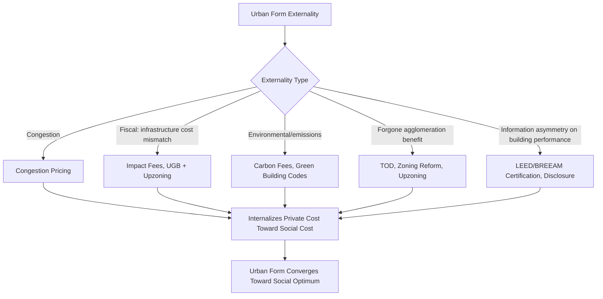

## Sustainable Urban Development Strategies

### Definition and Scope

Sustainable urban development strategies encompass the set of planning, regulatory, and market-based interventions aimed at reconciling urban growth with long-term environmental, social, and economic viability. The economic core of the topic is the recognition that urban growth patterns generate externalities — congestion, pollution, habitat loss, GHG emissions, and infrastructure cost escalation — that are not fully internalized by individual location and development decisions, creating a divergence between private and socially optimal urban form.

This topic synthesizes threads from several preceding areas (urban heat islands, green space valuation, energy use) into an integrated framework for evaluating and designing city-scale growth strategies, commonly organized around the "triple bottom line" of environmental, economic, and social sustainability, though the analytical treatment here emphasizes the economic mechanisms and tradeoffs.

### The Compact City vs. Sprawl Debate: Core Economic Tradeoffs

The central empirical and theoretical debate in sustainable urban development concerns the relative efficiency of compact, dense urban form versus dispersed, low-density (sprawling) development.

**Key Points**

- **Compact development advantages**: Lower per-capita infrastructure cost (shorter pipe/road networks per household), reduced VMT and transportation emissions, enables transit viability, preserves peripheral open space/agricultural land, supports agglomeration economies (see labor market pooling and knowledge spillovers).
- **Compact development costs**: Higher land/housing prices due to supply constraints, potential congestion and reduced green space per capita within the built area, higher exposure to urban heat island effects.
- **Sprawl advantages**: Lower land costs enable larger lot sizes and housing affordability (holding regulatory constraints constant), reduced density-related congestion and pollution concentration.
- **Sprawl costs**: Higher per-capita infrastructure provision costs (documented extensively in "cost of sprawl" studies), increased VMT and associated emissions, habitat fragmentation, and reduced viability of transit and non-auto mobility.

The economically efficient urban form is not simply "denser is always better" but depends on the relative magnitude of internalized versus externalized costs at different density levels — a point formalized in the monocentric city model tradition (Alonso-Muth-Mills), extended to incorporate environmental externalities.

### Externalities as the Central Market Failure in Urban Form

**Key Points**

- **Congestion externality**: Each additional vehicle trip imposes delay costs on other road users not reflected in the individual driver's private cost, a classic tragedy-of-the-commons problem in transportation economics.
- **Environmental/pollution externality**: Vehicle emissions, energy consumption, and impervious surface runoff generate costs borne by third parties (regional air quality, downstream water quality) rather than the developer or resident.
- **Fiscal externality**: New low-density development often does not generate sufficient property/impact tax revenue to cover its full marginal infrastructure servicing cost (roads, utilities, schools), effectively subsidized by existing taxpayers — a phenomenon documented extensively in municipal fiscal impact analysis.
- **Agglomeration externality (positive)**: Density-driven knowledge spillovers and labor market matching efficiency represent a positive externality that unregulated low-density development forgoes, an underappreciated counterpart to the negative externalities typically emphasized in sprawl critiques.

### Land-Use Regulatory Tools

#### 1. Urban Growth Boundaries (UGBs)

UGBs establish a fixed geographic limit beyond which urban development is restricted, intended to concentrate growth within existing service areas and preserve peripheral land.

**Key Points**

- Portland, Oregon's UGB is among the most frequently studied examples in the North American planning economics literature.
- Economic effect: constrains the supply of developable land, which — absent offsetting increases in permitted density inside the boundary — can increase land and housing prices, an outcome extensively debated in the housing affordability literature.
- Effectiveness depends critically on whether the boundary is paired with upzoning (increased density allowances) inside the boundary; a binding boundary without corresponding density increases primarily raises prices rather than achieving compact form.

#### 2. Zoning Reform and Upzoning

- **Inclusionary zoning**: Mandates or incentivizes affordable unit inclusion in new developments, often paired with density bonuses.
- **Form-based codes**: Regulate building form, scale, and street relationship rather than strict use segregation, facilitating mixed-use, walkable development patterns.
- **Elimination of single-family-only zoning**: A policy direction adopted in various jurisdictions (e.g., statewide reforms in California and Oregon) intended to increase "missing middle" housing supply (duplexes, triplexes, small multifamily) as a lower-cost path to increased density than large-scale redevelopment.

#### 3. Transit-Oriented Development (TOD)

Concentrating higher-density, mixed-use development around transit stations to maximize transit ridership potential and reduce automobile dependence.

**Key Points**

- Economic rationale rests on the interaction between density and transit viability: transit service requires a minimum ridership density to achieve operationally sustainable farebox recovery, while transit access itself capitalizes into higher land values near stations (an application of the same hedonic capitalization logic as green space valuation) — creating a potential value-capture financing mechanism.
- **Land value capture (LVC)** mechanisms — tax increment financing (TIF), special assessment districts, joint development agreements — allow transit agencies or municipalities to capture a portion of the land value uplift generated by transit investment to help finance that investment, addressing the free-rider problem where adjacent landowners benefit without contributing to infrastructure cost.

### Pricing-Based (Market) Instruments

**Key Points**

- **Congestion pricing**: Direct Pigouvian correction for the congestion externality, charging road users a price reflecting the marginal delay cost imposed on others (e.g., London's Congestion Charge, Singapore's Electronic Road Pricing, New York City's congestion pricing program). Economically preferred over quantity-based tools (e.g., driving restrictions) because it allows the market to allocate scarce road capacity to highest-value trips.
- **Impact fees**: One-time charges on new development intended to internalize the marginal infrastructure cost imposed by that development, addressing the fiscal externality described above.
- **Parking pricing and minimum parking requirement removal**: Minimum parking mandates function as an implicit subsidy to automobile use by bundling parking cost into all development regardless of actual demand; removing mandates and pricing parking directly is increasingly adopted as a low-cost sustainable development lever.
- **Development impact/carbon fees**: Fees calibrated to the estimated lifecycle GHG emissions of a development's location and form (accounting for VMT-inducing sprawl versus low-VMT infill), an emerging and less standardized instrument.

### Green Building Standards and Certification

**Key Points**

- **LEED (Leadership in Energy and Environmental Design)**, **BREEAM**, and similar certification systems provide third-party verification of building sustainability performance, addressing the information asymmetry problem discussed in building energy economics (buyers/tenants cannot easily verify a building's environmental performance without certification).
- Certification can generate a "green premium" in rental and sale prices, documented in commercial real estate studies, providing a market-based incentive for voluntary adoption beyond regulatory minimums.
- Mandatory green building codes (as opposed to voluntary certification) shift the same performance requirements from a market-signaling mechanism to a regulatory floor, appropriate where information asymmetry alone is judged insufficient to achieve socially optimal adoption rates.

### Integrating Infrastructure: Water, Waste, and Energy Systems

**Key Points**

- **Decentralized/distributed infrastructure**: Localized stormwater management (green infrastructure), on-site water reuse, and distributed energy generation (rooftop solar, microgrids) reduce dependence on large centralized systems and can lower total infrastructure capital cost in appropriate contexts, though they introduce coordination and standardization challenges.
- **Circular economy principles applied to urban material flows**: Construction and demolition waste diversion, industrial symbiosis (using one facility's waste stream as another's input), and urban mining of material stocks in aging infrastructure represent an extension of sustainability strategy from land-use form to material/resource flows.
- **Integrated resource planning**: Coordinating water, energy, and waste infrastructure planning at the municipal level to exploit synergies (e.g., wastewater treatment biogas capture for energy generation) rather than planning each system independently.

### Cost-Benefit Framework for Evaluating Development Strategies

A generalized framework for comparing alternative urban development patterns (e.g., a proposed infill development versus a greenfield/peripheral alternative) sums the net present value of all internalized and externalized costs and benefits:

$$NPV_{strategy} = \sum_{t=0}^{T} \frac{(B_{private,t} + B_{external,t}) - (C_{private,t} + C_{external,t})}{(1+r)^t}$$

where $B_{external}$ and $C_{external}$ capture the non-market benefits (agglomeration spillovers, ecosystem service preservation) and costs (congestion, emissions, infrastructure servicing cost) typically omitted from a purely private developer feasibility analysis. The gap between the privately optimal strategy (maximizing $B_{private} - C_{private}$ alone) and the socially optimal strategy (maximizing the full expression) is the theoretical justification for the full suite of regulatory and pricing instruments described above.

### Illustrative Diagram: Sustainable Development Policy Instrument Map

### Illustrative Diagram: Cost of Servicing by Development Density (svg_diagram)

<svg xmlns="http://www.w3.org/2000/svg" viewBox="0 0 700 340">
<rect x="0" y="0" width="700" height="340" fill="#ffffff" />
<text x="350" y="26" text-anchor="middle" font-size="16" font-weight="bold" fill="#1a1a1a">Per-Capita Infrastructure Cost vs. Density (svg_diagram)</text>
<line x1="70" y1="280" x2="650" y2="280" stroke="#333" stroke-width="2" />
<line x1="70" y1="280" x2="70" y2="50" stroke="#333" stroke-width="2" />
<text x="360" y="315" text-anchor="middle" font-size="12" fill="#333">Residential Density (units/acre)</text>
<text x="30" y="165" text-anchor="middle" font-size="12" fill="#333" transform="rotate(-90 30 165)">Per-Capita Infrastructure Cost</text>
<path d="M90,80 Q200,110 300,190 Q420,250 630,265" stroke="#2f6f4f" stroke-width="3" fill="none" />
<text x="120" y="70" font-size="11" fill="#2f6f4f">High cost: sparse networks</text>
<text x="480" y="255" font-size="11" fill="#2f6f4f">Lower cost: shared infrastructure</text>
<line x1="90" y1="280" x2="90" y2="285" stroke="#333" />
<text x="90" y="298" text-anchor="middle" font-size="10" fill="#333">Exurban</text>
<line x1="300" y1="280" x2="300" y2="285" stroke="#333" />
<text x="300" y="298" text-anchor="middle" font-size="10" fill="#333">Suburban</text>
<line x1="500" y1="280" x2="500" y2="285" stroke="#333" />
<text x="500" y="298" text-anchor="middle" font-size="10" fill="#333">Urban Infill</text>
</svg>

### Worked Example: Fiscal Impact Comparison of Development Patterns

A municipality compares two hypothetical 500-unit developments: Development A (greenfield, low-density, 2 units/acre, requiring 3 miles of new road and utility extension) versus Development B (infill, 25 units/acre, using existing road and utility capacity).

**Key Points**

- Development A's marginal infrastructure servicing cost (new road construction, extended water/sewer lines, extended emergency service response routes) is estimated using standard fiscal impact modeling to substantially exceed the property tax revenue increment generated by the development at typical local tax rates — a common finding in fiscal impact studies of low-density greenfield development.
- Development B's marginal servicing cost is comparatively minimal since existing infrastructure has spare capacity, meaning nearly the full tax revenue increment is a net fiscal gain to the municipality.
- [Inference: the precise fiscal gap between such scenarios is highly sensitive to local infrastructure capacity, tax rate structure, and development-specific assumptions, so this comparison illustrates the general mechanism rather than a generalizable numeric result.]

This type of fiscal impact analysis increasingly informs municipal decisions to prioritize infill development approval processes and impact fee schedules that reflect true marginal servicing cost differentials.

### Distributional and Equity Dimensions

**Key Points**

- Compact development and UGB policies, if not paired with affordability safeguards, can raise regional housing costs and displace lower-income households — a documented tension between environmental sustainability goals and housing affordability goals.
- TOD and transit investment can trigger the same "green gentrification" dynamic discussed in the green space valuation context: value capture near new transit stations can displace existing lower-income residents absent anti-displacement policy (inclusionary zoning, community land trusts, right-to-return policies).
- Congestion pricing, while economically efficient, is regressive in incidence absent revenue recycling toward transit improvements or low-income rebates, since it represents a larger share of income for lower-income drivers.
- These tensions have motivated increasing integration of "just sustainabilities" or equity-explicit frameworks into sustainable development planning, evaluating not only aggregate efficiency but also the distribution of costs and benefits across income and demographic groups.

### Conclusion

Sustainable urban development strategy is fundamentally an exercise in externality correction applied to urban form and infrastructure decisions: congestion, fiscal, and environmental externalities push actual development patterns away from the social optimum, while agglomeration externalities represent a forgone positive externality under excessively dispersed growth. The policy toolkit — growth boundaries, zoning reform, TOD, congestion pricing, impact fees, and green building standards — represents a spectrum from quantity-based regulation to price-based market correction, each with distinct efficiency properties and distributional consequences that must be jointly evaluated rather than treated as a purely technical optimization problem.

**Related Topics**

- Monocentric city model and the economics of urban spatial structure
- Congestion pricing design and revenue recycling
- Land value capture and transit-oriented development financing
- Fiscal impact analysis of residential development
- Housing affordability and land-use regulation
- Green building certification and the "green premium" in real estate
- Urban growth boundaries: Portland case study and comparative analysis
- Circular economy principles in urban infrastructure planning
- Equity-explicit ("just sustainabilities") planning frameworks
- Agglomeration economies and density-productivity relationships