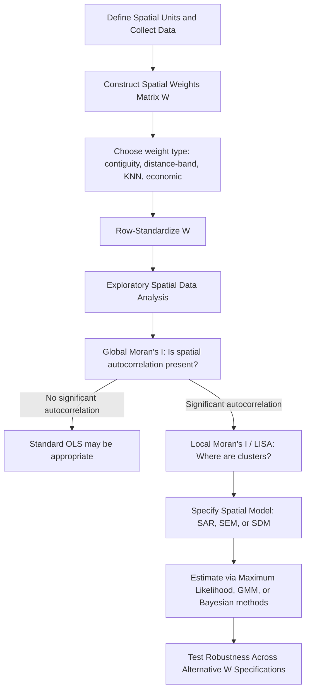

## Spatial Autocorrelation and Spatial Weights Matrices

### Definition and Scope

Spatial autocorrelation refers to the degree to which the value of a variable observed at one location is correlated with values of the same variable at nearby locations. Formally, it is a violation of the independence assumption underlying classical (non-spatial) statistical inference: observations are not independently distributed in space, but instead exhibit systematic patterns of similarity (positive spatial autocorrelation) or dissimilarity (negative spatial autocorrelation) as a function of geographic proximity. Tobler's First Law of Geography — "everything is related to everything else, but near things are more related than distant things" — is the informal statement of this phenomenon that motivates the entire field of spatial econometrics.

The spatial weights matrix ($W$) is the foundational tool used to formalize "nearness" mathematically, converting an inherently continuous and multidimensional concept of spatial relationship into a discrete matrix structure that can be incorporated into econometric models.

### Why Spatial Autocorrelation Matters for Urban and Regional Economics

**Key Points**

- Urban and regional economic data (housing prices, unemployment rates, tax rates, pollution levels) are almost universally spatially autocorrelated, since the economic and physical processes generating them (labor markets, housing markets, transportation networks, environmental externalities) operate across, not within, arbitrary jurisdictional or sampling units.
- If spatial autocorrelation is present in the regression error term and ignored, ordinary least squares (OLS) estimates remain unbiased but are inefficient, and standard errors are estimated incorrectly (typically understated), leading to spurious statistical significance and invalid hypothesis tests.
- If spatial autocorrelation arises from a substantively spatial process (e.g., one region's outcome directly depends on neighboring regions' outcomes, such as tax competition or agglomeration spillovers) and is embedded in the dependent variable itself, OLS estimates are both biased and inconsistent, not merely inefficient — a much more serious problem requiring explicit spatial model specification.

### Constructing the Spatial Weights Matrix

The spatial weights matrix $W$ is an $n \times n$ matrix where $n$ is the number of spatial units, and each element $w_{ij}$ represents the degree of spatial connectivity or proximity between unit $i$ and unit $j$. By convention, $w_{ii} = 0$ (a unit is not considered its own neighbor).

$$W = \begin{bmatrix} 0 & w_{12} & \cdots & w_{1n} \\ w_{21} & 0 & \cdots & w_{2n} \\ \vdots & \vdots & \ddots & \vdots \\ w_{n1} & w_{n2} & \cdots & 0 \end{bmatrix}$$

#### Common Weight Specifications

**Key Points**

- **Contiguity-based weights**:
  - *Rook contiguity*: $w_{ij} = 1$ if units $i$ and $j$ share a common border (edge), 0 otherwise.
  - *Queen contiguity*: $w_{ij} = 1$ if units $i$ and $j$ share a common border or vertex (corner), 0 otherwise — a less restrictive definition than rook contiguity, analogous to chess piece movement patterns from which the naming derives.
- **Distance-based weights**:
  - *Inverse distance*: $w_{ij} = 1/d_{ij}^{\alpha}$, where $d_{ij}$ is the distance between units $i$ and $j$ and $\alpha$ is a distance-decay parameter (commonly $\alpha = 1$ or $2$), giving all pairs some nonzero weight that declines with distance.
  - *Distance-band (cutoff)*: $w_{ij} = 1$ if $d_{ij} \leq D$ (some threshold distance), 0 otherwise — imposes a hard cutoff beyond which units are not considered neighbors.
- **K-nearest neighbors (KNN)**: $w_{ij} = 1$ if unit $j$ is among the $k$ nearest neighbors of unit $i$, 0 otherwise. Notably asymmetric in raw form ($j$ being among $i$'s nearest neighbors does not guarantee $i$ is among $j$'s), which some applications symmetrize.
- **Economic/social distance weights**: $w_{ij}$ based on non-geographic proximity measures such as trade flow volume, similarity in economic structure, or social network connections — appropriate when the theoretically relevant "neighbor" relationship is not purely physical distance (e.g., interstate tax competition may be better captured by economic similarity than geographic adjacency).
- **Block/hierarchical weights**: $w_{ij} = 1$ if units belong to the same higher-level administrative or functional grouping (e.g., same metropolitan statistical area), used when spillovers are hypothesized to operate within a bounded functional region rather than continuously with distance.

### Row-Standardization

In most applied spatial econometric work, the raw weights matrix is row-standardized so that each row sums to one:

$$w_{ij}^{std} = \frac{w_{ij}}{\sum_{j} w_{ij}}$$

**Key Points**

- Row-standardization allows the spatially lagged variable $Wy$ to be interpreted as a weighted average of neighboring values, facilitating interpretation of spatial lag coefficients as reflecting the average influence of neighbors rather than their raw sum.
- A consequence of row-standardization is that $W$ becomes asymmetric even if the underlying raw weights were symmetric (e.g., contiguity), since units with different numbers of neighbors receive different per-neighbor weights — this has technical implications for certain estimators and test statistics that assume symmetry, requiring care in model specification.
- Row-standardization also means the interpretation of $\rho$ (the spatial autoregressive coefficient) is scale-consistent regardless of the number of neighbors any given unit has.

### The Modifiable Areal Unit Problem (MAUP) and Weight Matrix Sensitivity

A critical methodological caveat is that empirical results in spatial econometrics are frequently sensitive to the choice of spatial weights specification — a manifestation of the broader Modifiable Areal Unit Problem (MAUP), where statistical results can change substantially depending on how continuous space is partitioned into discrete reporting units and how proximity between those units is defined.

**Key Points**

- There is no universally "correct" weights matrix; specification should be theoretically motivated by the economic mechanism generating the hypothesized spatial dependence (e.g., commuting-based labor market spillovers suggest travel-time-based weights rather than simple contiguity).
- Best practice in applied work typically involves testing robustness of key results across multiple plausible weight specifications (e.g., queen contiguity, distance-band, KNN) rather than relying on a single arbitrary choice.
- [Inference: while sensitivity testing across weight specifications is widely recommended practice, there is no formal consensus threshold for how much specification-sensitivity is considered acceptable before a result is deemed non-robust — this remains a matter of researcher judgment and disciplinary convention.]

### Measuring Global Spatial Autocorrelation: Moran's I

The most widely used global statistic for detecting the presence and strength of spatial autocorrelation across an entire study area is Moran's I:

$$I = \frac{n}{\sum_i \sum_j w_{ij}} \times \frac{\sum_i \sum_j w_{ij}(x_i - \bar{x})(x_j - \bar{x})}{\sum_i (x_i - \bar{x})^2}$$

where $n$ is the number of spatial units, $x_i$ is the observed value at location $i$, $\bar{x}$ is the sample mean, and $w_{ij}$ are the spatial weights.

**Key Points**

- $I$ ranges approximately from $-1$ to $+1$: values significantly greater than the expected value under spatial randomness ($E[I] = -1/(n-1)$, approximately zero for large $n$) indicate positive spatial autocorrelation (similar values cluster together); values significantly below indicate negative spatial autocorrelation (dissimilar values are adjacent, a checkerboard-like pattern).
- Statistical significance is typically assessed via a z-score test comparing the observed $I$ to its theoretical expectation and variance under the null hypothesis of spatial randomness, or via permutation-based (Monte Carlo) inference, which is often preferred in applied work since it does not rely on normality assumptions.
- Moran's I is a global statistic — it summarizes the overall degree of clustering across the entire study area but does not identify where specific clusters are located.

### Local Indicators of Spatial Association (LISA)

To identify the location of specific spatial clusters or outliers, Anselin's Local Indicators of Spatial Association (LISA) decompose the global Moran's I into location-specific contributions:

$$I_i = \frac{(x_i - \bar{x})}{\sum_i (x_i - \bar{x})^2 / n} \sum_j w_{ij}(x_j - \bar{x})$$

**Key Points**

- Each observation receives its own local Moran's I statistic, classified into four quadrant types: **High-High** (a high-value unit surrounded by high-value neighbors — a "hot spot"), **Low-Low** (a low-value unit surrounded by low-value neighbors — a "cold spot"), **High-Low** and **Low-High** (spatial outliers, where a unit's value diverges markedly from its neighbors).
- LISA cluster maps are a standard exploratory spatial data analysis (ESDA) tool in urban and regional economics for visually identifying, for example, spatial clusters of poverty, house price appreciation, or crime concentration prior to formal model specification.
- Multiple testing concerns arise since a LISA statistic is computed for every unit simultaneously; false discovery rate corrections or conservative significance thresholds are recommended in rigorous applications, though this is not universally implemented in applied practice.

### Spatial Weights Matrices in Model Specification

The spatial weights matrix underlies the three canonical spatial econometric model families:

**Key Points**

- **Spatial Lag Model (SAR)**: $y = \rho Wy + X\beta + \varepsilon$ — models direct spatial spillovers in the dependent variable itself (e.g., a jurisdiction's tax rate depends directly on neighboring jurisdictions' tax rates, as in tax competition models).
- **Spatial Error Model (SEM)**: $y = X\beta + u$, where $u = \lambda Wu + \varepsilon$ — models spatial autocorrelation in unobserved factors affecting the error term (e.g., unmeasured neighborhood quality correlated across nearby units), without implying a direct behavioral spillover mechanism.
- **Spatial Durbin Model (SDM)**: $y = \rho Wy + X\beta + WX\theta + \varepsilon$ — nests both the SAR and SEM as special cases and additionally allows neighboring units' explanatory variables (not just their outcome) to directly affect a given unit's outcome, providing the most general and often preferred starting specification in applied work following LeSage and Pace's methodological recommendations.

The distinct interpretation and estimation properties of these model families are typically covered as a dedicated companion topic (spatial regression models), with the weights matrix $W$ serving as the common structural input across all three.

### Illustrative Diagram: Contiguity Weight Definitions (svg_diagram)

<svg xmlns="http://www.w3.org/2000/svg" viewBox="0 0 700 260">
<rect x="0" y="0" width="700" height="260" fill="#ffffff" />
<text x="350" y="24" text-anchor="middle" font-size="16" font-weight="bold" fill="#1a1a1a">Rook vs. Queen Contiguity (svg_diagram)</text>
<text x="175" y="50" text-anchor="middle" font-size="13" font-weight="bold" fill="#333">Rook Contiguity</text>
<rect x="75" y="70" width="60" height="60" fill="#dfe7f5" stroke="#333" />
<rect x="135" y="70" width="60" height="60" fill="#dfe7f5" stroke="#333" />
<rect x="195" y="70" width="60" height="60" fill="#f7d9a0" stroke="#333" />
<rect x="75" y="130" width="60" height="60" fill="#dfe7f5" stroke="#333" />
<rect x="135" y="130" width="60" height="60" fill="#f2a65a" stroke="#333" />
<rect x="195" y="130" width="60" height="60" fill="#dfe7f5" stroke="#333" />
<rect x="75" y="190" width="60" height="60" fill="#dfe7f5" stroke="#333" />
<rect x="135" y="190" width="60" height="60" fill="#dfe7f5" stroke="#333" />
<rect x="195" y="190" width="60" height="60" fill="#f7d9a0" stroke="#333" />
<text x="165" y="165" text-anchor="middle" font-size="10" fill="#333">shared edge = neighbor</text>
<text x="525" y="50" text-anchor="middle" font-size="13" font-weight="bold" fill="#333">Queen Contiguity</text>
<rect x="425" y="70" width="60" height="60" fill="#f7d9a0" stroke="#333" />
<rect x="485" y="70" width="60" height="60" fill="#f7d9a0" stroke="#333" />
<rect x="545" y="70" width="60" height="60" fill="#f7d9a0" stroke="#333" />
<rect x="425" y="130" width="60" height="60" fill="#f7d9a0" stroke="#333" />
<rect x="485" y="130" width="60" height="60" fill="#f2a65a" stroke="#333" />
<rect x="545" y="130" width="60" height="60" fill="#f7d9a0" stroke="#333" />
<rect x="425" y="190" width="60" height="60" fill="#f7d9a0" stroke="#333" />
<rect x="485" y="190" width="60" height="60" fill="#f7d9a0" stroke="#333" />
<rect x="545" y="190" width="60" height="60" fill="#f7d9a0" stroke="#333" />
<text x="515" y="165" text-anchor="middle" font-size="10" fill="#333">edge or corner = neighbor</text>
</svg>

### Illustrative Diagram: Spatial Econometric Workflow

### Worked Example: Computing Moran's I

Consider four adjacent regions arranged in a 2x2 grid with median household income values (in $1,000s): Region A = 60, Region B = 65, Region C = 40, Region D = 45, where A-B are adjacent (share an edge), C-D are adjacent, and A-C and B-D are adjacent (a simple rook contiguity structure), while A-D and B-C are not contiguous (diagonal).

The row-standardized weights matrix assigns each region weight 0.5 to each of its two rook-contiguous neighbors. The regional mean is $\bar{x} = 52.5$. Regions A and B (both above the mean) are adjacent to each other, and regions C and D (both below the mean) are adjacent to each other — a pattern consistent with positive spatial autocorrelation. [Inference: with only four observations, any Moran's I calculation would have essentially no statistical power to reject the null hypothesis of spatial randomness regardless of the point estimate's sign or magnitude; this example is illustrative of the mechanics only and does not constitute a valid inferential test, which in practice requires a substantially larger number of spatial units.]

### Practical Software Implementation Notes

**Key Points**

- Standard tools for constructing spatial weights matrices and computing Moran's I / LISA statistics include the `spdep` and `sf` packages in R, the `PySAL` (Python Spatial Analysis Library, specifically its `libpysal` and `esda` modules) in Python, and GeoDa (a dedicated, free-standing spatial analysis software widely used in regional science pedagogy, developed by Luc Anselin's research group).
- Common workflow: import a shapefile or GeoJSON of spatial units, construct $W$ using a specified contiguity or distance rule, row-standardize, then compute Moran's I and LISA statistics before proceeding to spatial regression model estimation.
- [Unverified: specific current function names, default parameter behaviors, and version-specific syntax in these packages should be checked against current package documentation, as these libraries are under active development and interfaces can change across versions.]

### Conclusion

Spatial autocorrelation and the spatial weights matrix constitute the essential foundation of spatial econometrics: before any spatial regression model can be meaningfully specified, the researcher must first establish whether spatial dependence is present (via Moran's I and LISA) and must make a theoretically defensible choice about how "spatial proximity" is structurally represented (via the weights matrix). Because results can be sensitive to weights matrix specification — a manifestation of the broader Modifiable Areal Unit Problem — rigorous applied work treats the weights matrix not as a mechanical input but as a substantive modeling choice requiring theoretical justification and robustness testing.

**Related Topics**

- Spatial regression models: SAR, SEM, and Spatial Durbin Model estimation and interpretation
- Modifiable Areal Unit Problem (MAUP) in regional economic analysis
- Exploratory spatial data analysis (ESDA) and cluster mapping
- Geographically weighted regression (GWR) and spatial non-stationarity
- Spatial panel data models
- Tax competition and strategic interaction models using spatial weights
- Hedonic price models with spatial dependence corrections
- Software implementation: PySAL, spdep, and GeoDa workflows
- Spatial spillovers in regional growth and convergence models
- Network-based versus geographic-distance-based spatial weights