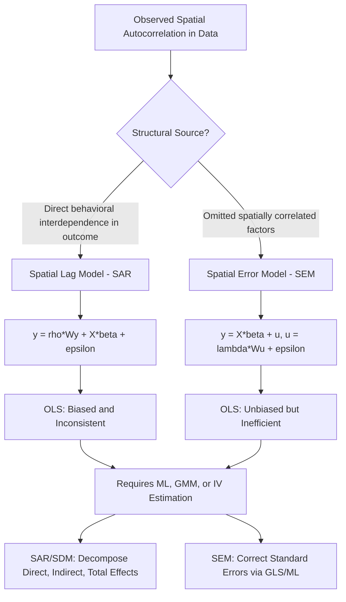

## Spatial Lag and Spatial Error Models

### Definition and Scope

Spatial lag and spatial error models are the two foundational econometric specifications used to correct for spatial dependence identified via tools such as Moran's I and the spatial weights matrix (see Spatial Autocorrelation and Spatial Weights Matrices). They represent structurally distinct hypotheses about *where* spatial dependence enters the data-generating process: the spatial lag model (SAR) posits dependence in the outcome variable itself (a substantive spillover mechanism), while the spatial error model (SEM) posits dependence in unobserved disturbances (a nuisance correlation arising from omitted spatially correlated factors). Distinguishing between them is not a matter of statistical convenience — the two models imply fundamentally different economic interpretations and different consequences for policy simulation.

### The Spatial Lag Model (SAR)

The spatial autoregressive (spatial lag) model specifies that the dependent variable at location $i$ depends directly on a weighted average of the dependent variable at neighboring locations:

$$y = \rho Wy + X\beta + \varepsilon, \quad \varepsilon \sim N(0, \sigma^2 I)$$

where $y$ is the $n \times 1$ vector of the dependent variable, $W$ is the row-standardized spatial weights matrix, $\rho$ is the spatial autoregressive coefficient, $X$ is the matrix of explanatory variables, and $\beta$ is the corresponding parameter vector.

**Key Points**

- **Economic interpretation**: The SAR specification is appropriate when theory suggests a genuine behavioral or mechanical spillover in the outcome — e.g., a municipality's property tax rate is influenced by neighboring municipalities' tax rates (fiscal/tax competition), or a region's housing price growth is influenced by neighboring regions' housing price growth (contagion in expectations or arbitrage-driven price convergence).
- **Simultaneity problem**: Because $y$ appears on both sides of the equation (through $Wy$), $y_i$ and $y_j$ are jointly and simultaneously determined for contiguous units, meaning OLS estimation of the SAR model produces biased and inconsistent estimates — this is structurally analogous to the simultaneity bias problem in traditional simultaneous equations models.
- **Reduced form**: Solving for $y$ explicitly:

$$y = (I - \rho W)^{-1}X\beta + (I - \rho W)^{-1}\varepsilon$$

This reduced form reveals that a shock to $X$ at any single location propagates through the entire system via the spatial multiplier $(I - \rho W)^{-1}$, affecting outcomes at all other locations, not just the location where the shock originated — a defining substantive feature of the spatial lag specification with direct implications for policy simulation (see "Spillover Effects Decomposition" below).

### The Spatial Error Model (SEM)

The spatial error model specifies that the *disturbance* term, rather than the dependent variable itself, exhibits spatial autocorrelation:

$$y = X\beta + u, \quad u = \lambda Wu + \varepsilon, \quad \varepsilon \sim N(0, \sigma^2 I)$$

where $\lambda$ is the spatial autoregressive coefficient on the error term.

**Key Points**

- **Economic interpretation**: The SEM specification is appropriate when spatial autocorrelation is believed to arise from omitted variables that are themselves spatially correlated (e.g., unmeasured neighborhood quality, unobserved local amenities, or measurement error correlated across nearby administrative units) rather than from any direct behavioral interaction between units' outcomes.
- **Consequence for OLS**: Unlike the SAR case, OLS estimates of $\beta$ in the presence of a spatial error process remain unbiased and consistent (since $X$ is not correlated with $u$ by assumption), but they are inefficient, and the standard OLS variance-covariance matrix is misspecified, leading to incorrect standard errors and invalid inference — a less severe but still consequential problem than the SAR bias case.
- **Reduced form of the error process**:

$$u = (I - \lambda W)^{-1}\varepsilon$$

implying that the variance-covariance matrix of $u$ is $\sigma^2(I - \lambda W)^{-1}(I - \lambda W')^{-1}$, a non-spherical structure that generalized least squares (GLS) or maximum likelihood estimation must explicitly account for.

### The Spatial Durbin Model (SDM) as a Generalization

The Spatial Durbin Model nests both SAR and SEM as restricted special cases and is increasingly recommended as a preferred general starting specification in applied work (following the methodological guidance of LeSage and Pace):

$$y = \rho Wy + X\beta + WX\theta + \varepsilon$$

**Key Points**

- Including $WX\theta$ (spatially lagged explanatory variables) allows neighboring units' *characteristics*, not just their outcomes, to directly affect a given unit's outcome — e.g., a region's employment growth may depend not only on neighboring regions' employment growth ($Wy$) but also directly on neighboring regions' infrastructure investment ($WX$).
- The SDM reduces to the SAR model under the restriction $\theta = 0$, and reduces to a model observationally equivalent to certain SEM specifications under the "common factor" restriction $\theta = -\rho\beta$, which can be formally tested via a likelihood ratio test — providing a principled, testable basis for model selection rather than relying solely on ad hoc pre-testing.

### Model Selection: LM Tests and the Anselin-Florax-Rey Decision Rule

Because SAR and SEM imply different structural interpretations, choosing between them (or determining that neither is needed) requires formal specification testing rather than arbitrary selection. The standard approach uses Lagrange Multiplier (LM) tests developed primarily by Anselin and colleagues.

**Key Points**

- **LM-lag test**: Tests the null hypothesis $\rho = 0$ in the SAR model, i.e., tests for the presence of a spatially lagged dependent variable.
- **LM-error test**: Tests the null hypothesis $\lambda = 0$ in the SEM model, i.e., tests for spatial autocorrelation in the error term.
- **Robust LM-lag and Robust LM-error tests**: Because the simple LM-lag and LM-error tests can each have power against the *other* form of misspecification (i.e., LM-lag can reject even when the true process is SEM, and vice versa), robust variants were developed that maintain power against their own alternative while controlling for the possible presence of the other form of dependence.
- **Decision rule (Anselin-Florax-Rey)**: If both simple LM tests are significant, compare the robust versions: whichever robust test remains significant indicates the more likely correct specification. If only one simple LM test is significant, that specification is generally preferred. If neither is significant, standard non-spatial OLS may be adequate. [Inference: this decision rule is a widely taught heuristic rather than a definitive proof of correct specification — modern applied practice increasingly favors starting from the more general Spatial Durbin Model and testing down via nested restrictions, precisely because the LM-test approach can be sensitive to the specific weights matrix chosen and does not fully resolve ambiguity between competing spatial processes.]

### Estimation Methods

**Key Points**

- **Maximum Likelihood (ML)**: The standard estimation approach for both SAR and SEM, since the simultaneity in SAR and the non-spherical error structure in SEM both violate the assumptions required for consistent OLS or straightforward GLS estimation. ML estimation requires numerical evaluation of the Jacobian determinant $|I - \rho W|$, which for large $n$ is computationally handled via sparse matrix techniques and eigenvalue-based simplifications (following Ord's approach).
- **Generalized Method of Moments (GMM)**: An alternative to ML, particularly attractive for large datasets where ML's Jacobian computation becomes burdensome, and for SEM specifications following the Kelejian-Prucha GMM estimator, which does not require distributional (normality) assumptions on the error term.
- **Instrumental Variables (IV/2SLS)**: For the SAR model, spatially lagged explanatory variables ($WX$, $W^2X$, etc.) can serve as instruments for the endogenous spatial lag term $Wy$, providing a computationally simpler (though potentially less efficient) alternative to full ML estimation.
- **Bayesian estimation via MCMC**: Increasingly used, particularly for spatial panel extensions and models incorporating spatial heterogeneity, since it naturally handles the complex posterior distributions arising from spatial dependence structures.

### Spillover Effects Decomposition: Direct, Indirect, and Total Effects

A critical and frequently misunderstood aspect of spatial lag models (SAR and SDM) is that the raw coefficient $\beta$ **cannot** be interpreted as the marginal effect of $X$ on $y$ in the standard OLS sense, because the spatial multiplier $(I - \rho W)^{-1}$ causes a change in $X$ at any location to propagate to *all* other locations through the system.

**Key Points**

- **Direct effect**: The average impact of a change in $X_i$ on $y_i$ itself, which — because of feedback loops through the network (a change in $X_i$ affects $y_j$, which via $Wy$ feeds back to affect $y_i$) — is generally not equal to the raw coefficient $\beta$ in models with $Wy$ or $WX$ terms.
- **Indirect effect (spillover effect)**: The average impact of a change in $X_i$ on $y_j$ for all $j \neq i$ — this is the formal quantification of the "spillover" that motivated the spatial specification in the first place.
- **Total effect**: The sum of direct and indirect effects, representing the full system-wide impact of a unit change in $X$ at a given location.
- These effects are computed from the reduced-form matrix $(I - \rho W)^{-1}(I\beta + W\theta)$ (for the general SDM case), typically summarized as scalar averages (average direct effect, average total effect) following LeSage and Pace's simulation-based decomposition approach, since the full $n \times n$ effect matrix is unwieldy to report directly.
- Failure to compute and report these decomposed effects — i.e., reporting only the raw $\hat\beta$ coefficient as if it were a standard marginal effect — is a well-documented and consequential error in applied spatial econometrics, since it can substantially misstate the true magnitude (and in some cases even the sign) of a variable's total economic impact.

### Illustrative Diagram: SAR vs. SEM Structural Comparison

### Worked Example: Interpreting Spillovers in a Regional Growth Model

Suppose a researcher estimates a spatial lag model of county-level employment growth as a function of local infrastructure investment:

$$y = 0.35 Wy + 0.20 X + \varepsilon$$

where $y$ is employment growth and $X$ is infrastructure investment (both standardized). A naive interpretation would treat $0.20$ as "the effect of a one-unit increase in infrastructure investment on employment growth." This is incorrect: because $\rho = 0.35$, the spatial multiplier $(I - 0.35W)^{-1}$ amplifies this effect through the network. [Inference: the exact numerical decomposition into direct and indirect effects requires the full weights matrix and cannot be computed from the scalar coefficients alone via a simple formula; however, the qualitative implication is well-established — the total effect of infrastructure investment (summing direct and indirect/spillover components) will exceed the raw coefficient of 0.20 whenever $\rho > 0$, since positive spatial dependence in the outcome mechanically amplifies any exogenous shock through repeated rounds of neighbor feedback.] This has direct policy relevance: an infrastructure investment program justified using only the raw coefficient would understate its true regional benefit by ignoring spillovers to neighboring counties.

### Spatial Panel Extensions

**Key Points**

- Both SAR and SEM specifications extend naturally to panel data settings (repeated observations across time for the same spatial units), incorporating spatial dependence alongside standard panel considerations (fixed effects, time effects, serial correlation).
- **Spatial panel fixed effects models** must address the incidental parameters problem alongside spatial dependence, complicating estimation relative to the cross-sectional case.
- **Dynamic spatial panel models** incorporate both a temporal lag ($y_{t-1}$) and a spatial lag ($Wy_t$) simultaneously, allowing separate identification of "space-time diffusion" processes from pure spatial contemporaneous dependence — relevant, for example, in modeling how a regional recession propagates both over time and across space to neighboring regions.

### Practical Software Implementation Notes

**Key Points**

- Standard implementations include the `spatialreg` package in R (which succeeded and absorbed the modeling functionality formerly in `spdep`), the `spreg` module within `PySAL` in Python, and Stata's `spregress`/`spivregress` commands (available in Stata 15 and later).
- Effects decomposition (direct/indirect/total) is typically available as a dedicated post-estimation function in these packages (e.g., `impacts()` in R's `spatialreg`) rather than requiring manual matrix computation by the researcher.
- [Unverified: exact function names, syntax, and default settings should be checked against current package documentation given ongoing package development and potential deprecations/renamings across versions.]

### Conclusion

The spatial lag and spatial error models represent two structurally distinct answers to the question of *why* spatial autocorrelation appears in urban and regional economic data — genuine behavioral spillover (SAR) versus nuisance correlation in omitted factors (SEM) — with materially different consequences for both estimation (bias versus inefficiency) and interpretation (spillover effects decomposition versus corrected inference on otherwise standard coefficients). The Spatial Durbin Model's role as a general nesting specification, combined with formal LM-based or nested-restriction testing, provides the standard applied framework for navigating this choice, while the direct/indirect/total effects decomposition is essential for correctly interpreting and reporting results from any model containing a spatially lagged dependent variable.

**Related Topics**

- Spatial weights matrix construction and Moran's I (foundational prerequisite)
- Spatial Durbin Model nested hypothesis testing and common factor restrictions
- Direct, indirect, and total effects decomposition (LeSage-Pace methodology)
- Spatial panel data models and dynamic space-time diffusion
- Kelejian-Prucha GMM estimation for spatial models
- Geographically weighted regression as an alternative to global spatial models
- Tax competition and strategic interaction empirical applications
- Spatial econometric software: spatialreg, PySAL, GeoDa, Stata spregress
- Endogeneity and instrumental variables in spatial regression
- Housing price spillovers and regional business cycle synchronization