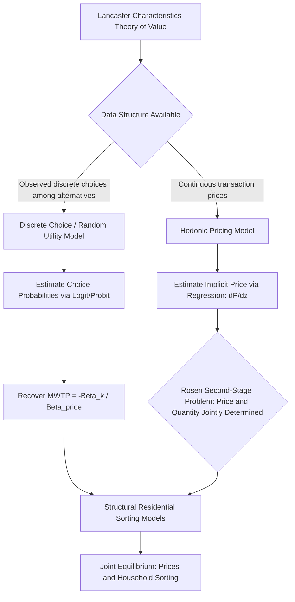

## Hedonic Pricing and Discrete Choice Models

### Definition and Scope

Hedonic pricing and discrete choice models constitute the two dominant empirical frameworks used in urban and regional economics to recover the implicit values households and firms place on non-market attributes of differentiated goods — most prominently housing and location. Both frameworks derive from the same underlying theoretical foundation (Lancaster's characteristics theory of value and Rosen's hedonic equilibrium theory) but diverge methodologically: hedonic models exploit continuous price variation in observed transactions, while discrete choice models exploit observed choices among discrete alternatives to recover the same underlying preference parameters via random utility maximization.

### Theoretical Foundations: Lancaster and Rosen

**Key Points**

- **Lancaster's characteristics approach** (1966) reconceptualizes consumer demand theory: utility is not derived directly from goods themselves, but from the bundle of characteristics those goods embody. A house is not valued as an undifferentiated unit but as a bundle of square footage, bedrooms, school quality, and locational attributes.
- **Rosen's hedonic equilibrium model** (1974) formalizes how a market-clearing hedonic price function emerges from the interaction of heterogeneous buyers (with differing marginal willingness to pay for characteristics) and heterogeneous sellers/producers (with differing marginal costs of supplying characteristics). The equilibrium hedonic price function $P(z)$, where $z$ is a vector of characteristics, is an envelope of the tangencies between buyers' bid functions and sellers' offer functions.
- A key theoretical implication (Rosen's "second stage") is that estimating the hedonic price function's partial derivatives (implicit prices) is only the *first stage* of full preference recovery; identifying the full underlying marginal willingness-to-pay function (how MWTP varies across the population) requires a more demanding second-stage estimation that has proven empirically difficult due to well-documented identification problems (Bartik 1987; Epple 1987) — specifically, that the marginal price and the quantity of the characteristic chosen are jointly, simultaneously determined by the same underlying market equilibrium, creating an endogeneity problem for second-stage demand estimation.

### Hedonic Pricing Model: Specification

The hedonic price function is typically estimated as:

$$P_i = f(S_i, N_i, L_i) + \varepsilon_i$$

where $P_i$ is the transaction price of property $i$, $S_i$ is structural characteristics, $N_i$ is neighborhood characteristics, and $L_i$ is locational characteristics (which may include spatial coordinates or distance measures relevant to the specific research question).

**Key Points**

- **Functional form selection**: Linear, semi-log ($\ln P = f(\cdot)$), and log-log specifications are all common; the semi-log form is frequently favored because it directly yields percentage-change interpretations of coefficients and tends to fit skewed housing price distributions better than a linear specification, though functional form should ideally be tested (e.g., via Box-Cox transformation tests) rather than assumed.
- **The implicit (hedonic) price** of characteristic $z_k$ is given by the partial derivative $\partial P/\partial z_k$, interpreted as the marginal willingness to pay for a marginal increase in that characteristic, holding all other characteristics constant.
- **Omitted variable bias**: A pervasive concern in hedonic housing studies is that unobserved neighborhood quality (e.g., unmeasured aesthetic appeal, social capital, perceived safety) is likely correlated with the characteristic of interest (e.g., proximity to green space, environmental quality), biasing OLS estimates of the implicit price. This motivates the same identification strategies discussed in prior hedonic applications: repeat-sales designs, boundary discontinuity designs, difference-in-differences around policy/amenity changes, and spatial fixed effects.
- **Spatial dependence**: Housing hedonic residuals are frequently spatially autocorrelated (see Spatial Autocorrelation and Spatial Weights Matrices), motivating spatial lag or spatial error specifications (see Spatial Lag and Spatial Error Models) as a standard robustness extension to the baseline hedonic regression.

### Applications of Hedonic Pricing in Urban Economics

**Key Points**

- **Environmental amenity/disamenity valuation**: Air quality, noise (e.g., airport or highway proximity), proximity to hazardous waste sites, and water quality — each valued via their capitalization into property prices (methodologically identical to the green space valuation application covered previously).
- **School quality valuation**: Exploiting attendance boundary discontinuities (comparing near-identical homes on either side of a school district boundary) to isolate the capitalized value of school quality net of other neighborhood characteristics — a widely used quasi-experimental hedonic design (Black, 1999).
- **Transportation access valuation**: Value of proximity to transit stations, highway access, and walkability indices.
- **Climate risk capitalization**: As discussed in the climate adaptation context, hedonic models are used to test whether flood zone designation, sea-level-rise exposure, and wildfire risk are priced into property values.
- **Compensating wage differentials**: The hedonic framework extends beyond housing to labor markets, where wage differences across jobs and locations are used to infer the implicit value of job risk (value of a statistical life) or locational (dis)amenities — Rosen's original theoretical framework was developed jointly for both housing and labor market applications.

### Random Utility Theory and Discrete Choice Foundations

Discrete choice models formalize location or product choice as the outcome of utility-maximizing behavior over a finite set of discrete alternatives, following McFadden's random utility maximization (RUM) framework (for which McFadden received the 2000 Nobel Memorial Prize in Economic Sciences).

The utility that individual $n$ derives from alternative $j$ is decomposed into an observable (deterministic) component and an unobservable random component:

$$U_{nj} = V(X_{nj}, \beta) + \varepsilon_{nj}$$

where $X_{nj}$ is a vector of observed attributes of alternative $j$ (and/or individual $n$), $\beta$ is the parameter vector to be estimated, and $\varepsilon_{nj}$ is an idiosyncratic random utility component representing unobserved heterogeneity. Individual $n$ is assumed to choose the alternative yielding the highest utility: $j^* = \arg\max_j U_{nj}$.

### Multinomial and Conditional Logit Models

Assuming $\varepsilon_{nj}$ follows an i.i.d. Type I Extreme Value (Gumbel) distribution yields the multinomial/conditional logit model, with the closed-form choice probability:

$$P(j) = \frac{\exp(V_{nj})}{\sum_{k=1}^{J} \exp(V_{nk})}$$

**Key Points**

- **Multinomial logit (MNL)**: Explanatory variables vary across individuals (not across alternatives), commonly used when choice depends on individual characteristics interacted with alternative-specific constants.
- **Conditional logit**: Explanatory variables vary across alternatives (e.g., each neighborhood's price, school quality, commute time), the more common specification in residential/location choice applications, since the whole point is typically to estimate how alternative-specific attributes drive choice.
- **Independence of Irrelevant Alternatives (IIA)**: A defining and restrictive property of the logit model — the ratio of choice probabilities between any two alternatives is independent of the attributes or even the existence of any third alternative. This is often empirically implausible in location choice contexts (e.g., two similar suburban neighborhoods should be closer substitutes for each other than either is to an urban downtown neighborhood, violating IIA's implicit assumption of equal cross-substitution patterns) — famously illustrated by McFadden's "red bus/blue bus" problem.
- Willingness-to-pay for a given attribute is recovered as the ratio of that attribute's coefficient to the (negative of the) price/cost coefficient: $MWTP_k = -\beta_k/\beta_{price}$, directly analogous to the marginal rate of substitution in consumer theory.

### Addressing IIA: Nested Logit and Mixed Logit

**Key Points**

- **Nested logit**: Groups similar alternatives into "nests" (e.g., all suburban neighborhoods in one nest, urban neighborhoods in another), allowing correlation in unobserved utility components within a nest while retaining the logit-derived closed-form structure between nests — directly relaxing the IIA assumption for alternatives sharing an unobserved similarity dimension.
- **Mixed (random-parameters) logit**: Allows the coefficient vector $\beta$ to vary randomly across individuals according to a specified distribution (e.g., normal, log-normal), capturing unobserved preference heterogeneity across the population and relaxing IIA at the individual level, though estimation requires simulation-based maximum likelihood since the choice probability no longer has a closed form.
- **Multinomial probit**: An alternative to logit-family models that assumes multivariate normal (rather than extreme-value) error distributions, allowing arbitrary correlation patterns across alternatives without the IIA restriction, at the cost of requiring numerical simulation (since the multivariate normal CDF lacks a closed form) — computationally more demanding than logit-family alternatives but theoretically more flexible.

### Discrete Choice Applications in Urban and Regional Economics

**Key Points**

- **Residential sorting models**: Households choose among discrete neighborhood/jurisdiction alternatives based on housing price, local public goods (school quality, crime, environmental quality), and commute distance — the discrete-choice analog to and extension of the Tiebout sorting hypothesis, allowing estimation of household-level demand for local public goods and neighborhood amenities.
- **Firm location choice models**: Firms choose among discrete candidate sites/regions based on labor costs, tax rates, agglomeration externalities, and infrastructure access — used extensively in regional economics to estimate the elasticity of firm location to tax incentives and local business conditions.
- **Mode choice models in transportation economics**: Commuters choose among discrete transportation modes (auto, transit, walk, bike) based on travel time, cost, and comfort attributes — one of the original and most extensively developed applications of the conditional logit framework (McFadden's foundational San Francisco BART mode-choice study).
- **Land-use/parcel development choice models**: Developers choose discrete land-use conversions (e.g., which parcel to develop, and to what use) based on expected returns, used in urban simulation models (e.g., UrbanSim) to project land-use change.

### Connecting Hedonic and Discrete Choice Frameworks: Sorting Models

A significant strand of modern urban economics integrates both frameworks into structural residential sorting equilibrium models (following Bayer, Ferreira, and McMillan, and related work), which jointly model discrete neighborhood choice (via random utility/discrete choice) and the market-clearing hedonic price function that emerges from the aggregation of those discrete choices across heterogeneous households.

**Key Points**

- These models address a key limitation of pure hedonic analysis (the Rosen second-stage identification problem noted above) by using discrete choice's explicit micro-foundation of heterogeneous household preferences to recover full preference distributions, rather than relying solely on hedonic price gradients.
- This integration allows counterfactual policy simulation — e.g., predicting how a new transit line or environmental cleanup would change both equilibrium housing prices *and* the resulting spatial sorting of household types across neighborhoods — a capability neither framework alone fully provides.
- Estimation is computationally demanding, typically requiring the model to solve for a new hedonic price equilibrium at each iteration of the parameter search (since prices depend on aggregate choice patterns, which depend on prices), and is a specialized topic within structural urban/regional economics.

### Illustrative Diagram: Hedonic vs. Discrete Choice Framework Comparison

### Worked Example: WTP Recovery from a Conditional Logit Neighborhood Choice Model

A researcher estimates a conditional logit model of household neighborhood choice with the utility specification:

$$V_{nj} = -0.08(\text{Price}_j) + 0.45(\text{SchoolRating}_j) + 0.30(\text{ParkAcres}_j) - 0.12(\text{CommuteMinutes}_j)$$

where price is measured in $1,000s. The implied marginal willingness to pay for a one-point increase in school rating is:

$$MWTP_{school} = \frac{0.45}{0.08} = 5.625 \text{ (in \$1,000s)} = \$5{,}625$$

Similarly, the marginal willingness to pay for one additional acre of nearby park space is $0.30/0.08 = 3.75$, or $3,750. [Inference: these WTP estimates are only valid under the logit model's IIA assumption and the assumption that the price coefficient is correctly identified as reflecting a genuine budget-constraint tradeoff rather than being confounded with unobserved neighborhood quality correlated with price — a standard caveat requiring the same identification scrutiny (instrumental variables for price, or structural sorting-model corrections) applied in the hedonic pricing context.]

### Practical Software Implementation Notes

**Key Points**

- Hedonic models are typically estimated using standard regression tools (`lm`/`felm`/`fixest` in R, `statsmodels`/`linearmodels` in Python, or `reghdfe` in Stata for high-dimensional fixed effects), combined with spatial packages noted in the prior spatial econometrics topics when spatial correction is needed.
- Discrete choice models are commonly estimated using `mlogit` in R, `mlogit`/`biogeme`/`pylogit` in Python (with Biogeme being particularly well-suited to complex mixed logit and advanced discrete choice specifications used in transportation and marketing research), and Stata's `clogit`/`asclogit`/`mixlogit` commands.
- [Unverified: specific package capabilities, current maintenance status, and syntax details should be verified against current documentation, as several of these packages (particularly in the R and Python discrete-choice ecosystem) have seen substantial development activity and occasional deprecation/succession over time.]

### Conclusion

Hedonic pricing and discrete choice models represent complementary empirical strategies rooted in the same characteristics-based theory of value, distinguished primarily by the type of variation they exploit — continuous price variation across observed transactions versus discrete choice variation across observed alternatives. Both face well-documented identification challenges (the hedonic second-stage problem and the discrete-choice IIA restriction, respectively), which the modern literature increasingly addresses through more flexible specifications (nested/mixed logit) and, at the frontier, through structural residential sorting models that integrate both frameworks into a single internally consistent equilibrium system capable of supporting genuine counterfactual policy analysis.

**Related Topics**

- Rosen's hedonic equilibrium theory and the second-stage identification problem
- Residential sorting models and the Tiebout hypothesis
- Random utility maximization and McFadden's contributions to discrete choice theory
- Nested logit, mixed logit, and multinomial probit estimation
- Boundary discontinuity and repeat-sales identification strategies in hedonic analysis
- Compensating wage differentials and the value of a statistical life
- Mode choice models in urban transportation economics
- Structural estimation methods in urban and regional economics
- Willingness-to-pay recovery and welfare analysis in discrete choice frameworks
- UrbanSim and land-use/parcel-level discrete choice simulation models