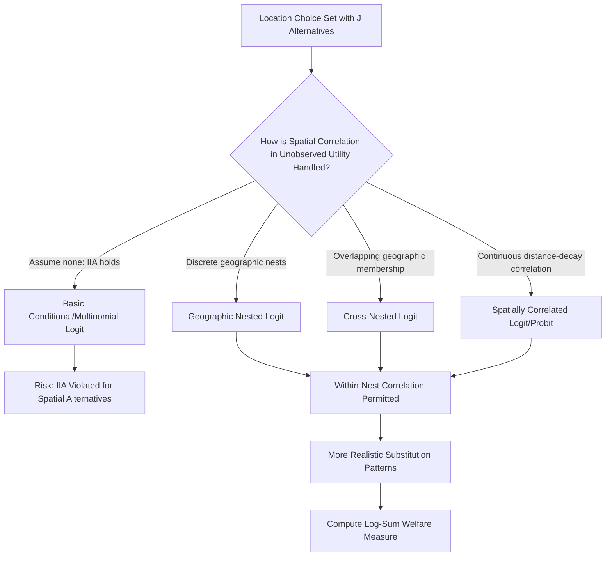

## Random Utility Models of Location Choice

### Definition and Scope

Random utility models (RUM) of location choice apply McFadden's random utility maximization framework specifically to the problem of where economic agents — households, firms, or migrants — choose to locate among a discrete set of spatial alternatives. While the general random utility and discrete choice apparatus was introduced in the preceding topic (Hedonic Pricing and Discrete Choice Models), this topic focuses specifically on the structural features unique to *location* choice problems: the treatment of spatial alternatives as a choice set, the role of distance and spatial correlation among alternatives, and the specific model families (particularly the nested logit and its spatial variants) developed to address the distinctive econometric challenges that arise when the choice set itself has an inherent geographic structure.

### Why Location Choice Requires Special Treatment Within the RUM Framework

**Key Points**

- **Large and structured choice sets**: Location choice problems (e.g., choosing among hundreds of census tracts, or thousands of parcels) involve far larger choice sets than typical discrete choice applications (e.g., choosing among 3-4 transportation modes), raising both computational and specification challenges.
- **Spatial correlation in unobserved utility**: Nearby locations are likely to share unobserved characteristics (unmeasured neighborhood quality, local amenities correlated across space) — meaning the independence of the error terms $\varepsilon_{nj}$ across alternatives $j$, an assumption underlying the basic multinomial/conditional logit model, is particularly likely to be violated for genuinely spatial choice sets, more so than for canonical non-spatial applications like brand choice.
- **Endogenous choice set definition**: Unlike a fixed and clearly bounded choice set (e.g., three specific insurance plans), the relevant location choice set (which neighborhoods, jurisdictions, or parcels are genuinely being considered) is often itself ambiguous and must be defined by the researcher, introducing an additional specification decision absent in most other discrete choice applications.
- **Distance/accessibility as a structural attribute**: Distance from a reference point (workplace, prior residence, family) is both a key explanatory variable and a variable whose functional form (linear, log, spline, distance-decay) requires careful specification, since it typically exhibits diminishing marginal disutility rather than constant marginal cost.

### The Basic Location Choice Random Utility Specification

For individual (household) $n$ choosing among location alternatives $j = 1, ..., J$:

$$U_{nj} = V(P_j, A_j, D_{nj}, Z_n) + \varepsilon_{nj}$$

where $P_j$ is the price (housing cost) at location $j$, $A_j$ is a vector of location-specific amenities (school quality, crime, environmental quality, green space — connecting directly to prior amenity valuation topics), $D_{nj}$ is the distance or commute cost from location $j$ relevant to individual $n$'s specific circumstances (e.g., distance to $n$'s workplace), and $Z_n$ is individual/household characteristics that may interact with location attributes (e.g., households with children may weight school quality more heavily).

### Addressing Spatial Correlation: Nested and Spatially-Structured Logit Models

Because the IIA property of the basic conditional logit model is particularly implausible for genuinely spatial choice sets, location choice modeling has developed several specific extensions:

**Key Points**

- **Geographic nested logit**: Nests are defined by spatial groupings (e.g., all neighborhoods within the same city nested together, all cities within the same region nested together), allowing correlated unobserved utility within a geographic nest while retaining tractable closed-form probabilities between nests — directly operationalizing the intuition that two neighborhoods in the same city are closer substitutes for each other than either is to a neighborhood in a different metropolitan area entirely.
- **Cross-nested logit (CNL)**: Allows an alternative to belong to multiple overlapping nests simultaneously (e.g., a border neighborhood might belong partially to two adjacent school district nests), providing additional flexibility for genuinely overlapping spatial correlation structures that a strict single-nest hierarchy cannot capture.
- **Spatially correlated logit / spatial probit variants**: Directly parameterize the correlation in $\varepsilon_{nj}$ across alternatives as a declining function of the geographic distance between alternatives $j$ and $k$ (analogous in spirit to the spatial weights matrix concept from spatial econometrics), rather than relying on a discrete nest structure — a more continuous and arguably more natural representation of spatial correlation, at the cost of typically requiring simulation-based estimation since the resulting choice probabilities generally lack closed form.
- **Distance-based sampling of alternatives**: For very large choice sets (e.g., all parcels in a metropolitan area), McFadden's result that consistent estimates can be obtained using a randomly sampled subset of the full choice set (plus the chosen alternative) is commonly invoked to make estimation computationally tractable, since evaluating the full choice probability denominator over thousands of alternatives at each iteration is often infeasible.

### Household Residential Location Choice Models

**Key Points**

- The dominant application area: households choose a residential location (typically a discrete geographic unit such as a census tract, zip code, or municipality) to maximize utility over housing cost, commute cost, and local public goods/amenities.
- These models operationalize (and provide the micro-econometric foundation for) the Tiebout sorting hypothesis, allowing estimation of household-level heterogeneity in willingness to pay for local public goods (school quality, crime rates, tax rates) — heterogeneity that a single aggregate hedonic price gradient cannot recover on its own (the Rosen second-stage problem discussed in the prior topic).
- **Bayer, Ferreira, and McMillan (2007)** is a widely cited example integrating a discrete-choice residential sorting model to estimate household willingness to pay for school quality and neighborhood racial composition, explicitly correcting for the endogeneity of neighborhood sociodemographic composition (since observed sorting patterns are themselves partly a consequence of the preferences being estimated — a subtle reflexivity/endogeneity problem specific to models where a location's "amenity" includes the characteristics of who else lives there).
- **Endogenous neighborhood composition** is a recurring identification challenge: if an amenity of interest is itself partly determined by who chooses to live there (e.g., neighborhood racial or income composition, or aggregate school quality that depends on the peer group of students who enroll), naive estimation risks conflating causal amenity value with a spurious sorting-driven correlation, requiring instrumental variables or structural equilibrium correction.

### Firm Location Choice Models

**Key Points**

- Firms choose among discrete candidate regions/sites to establish or expand operations, with utility (profit) typically specified as a function of labor costs, tax rates and incentives, agglomeration externalities (proximity to similar firms or suppliers), transportation infrastructure, and land costs.
- A substantial applied literature uses conditional logit or nested logit specifications of this form to estimate the elasticity of firm location decisions to state and local tax incentives, informing the long-standing regional economics debate over the cost-effectiveness of place-based economic development subsidies.
- Agglomeration variables (e.g., employment density in the firm's own industry within candidate locations) are frequently found to be a statistically and economically significant driver of location choice in this literature, providing microeconometric support for agglomeration theory predictions at the level of individual firm decisions rather than only aggregate regional correlations.

### Migration Models as Location Choice

**Key Points**

- Interregional and international migration decisions can be modeled within the same RUM framework, with origin-specific "stayer" utility compared against the utility of each destination alternative, incorporating moving costs, distance, and destination labor market/amenity conditions.
- The gravity model of migration (migration flows declining with distance and increasing with origin/destination population) can be derived as a reduced-form implication of an underlying random utility location choice model with a specific (typically logit-consistent) distance-decay specification, providing a micro-founded justification for the empirically long-standing but historically ad hoc gravity model tradition in regional science.

### Welfare Analysis: The Log-Sum (Inclusive Value) Formula

A key analytical advantage of the logit-family RUM framework for location choice is the availability of a closed-form expected maximum utility (consumer surplus) measure, known as the log-sum or inclusive value:

$$E[\max_j U_{nj}] = \frac{1}{\alpha}\ln\left(\sum_{j=1}^{J} \exp(\alpha V_{nj})\right) + C$$

where $\alpha$ is the scale parameter of the logit model (often normalized to 1) and $C$ is an arbitrary constant (Euler's constant term) that cancels out in welfare *comparisons* between scenarios.

**Key Points**

- This log-sum formula allows researchers to compute the expected welfare change to a representative household from a policy that alters location attributes (e.g., an environmental cleanup improving amenities at several locations, or a new transit line reducing commute costs) by comparing the log-sum before and after the policy change, converted to monetary terms by dividing by the marginal utility of income (typically the price/cost coefficient).
- This welfare measure correctly accounts for the fact that households can *re-sort* in response to a policy change (some households may switch which location they choose as the location's relative attractiveness changes), a behavioral margin that a fixed-location hedonic-only welfare calculation would miss entirely — a key methodological advantage of the discrete-choice/RUM approach for location-based policy welfare analysis.

### Illustrative Diagram: Structuring Spatial Correlation in Location Choice Models

### Worked Example: Nested Logit Location Choice Structure

Consider a household choosing among six neighborhoods, grouped into two nests: "Urban Core" (neighborhoods 1, 2, 3) and "Suburban" (neighborhoods 4, 5, 6). The nested logit choice probability for neighborhood $j$ within nest $k$ is:

$$P(j|k) = \frac{\exp(V_j/\lambda_k)}{\sum_{m \in k} \exp(V_m/\lambda_k)}, \quad P(k) = \frac{\exp(\lambda_k I_k)}{\sum_{l} \exp(\lambda_l I_l)}$$

where $I_k = \ln\left(\sum_{m \in k}\exp(V_m/\lambda_k)\right)$ is the inclusive value of nest $k$, and $\lambda_k \in (0,1]$ is the nest dissimilarity parameter measuring the degree of correlation among alternatives within nest $k$ ($\lambda_k = 1$ collapses to the standard logit with no within-nest correlation; lower values indicate higher within-nest correlation). [Inference: whether the estimated $\lambda_k$ is significantly different from 1 provides a direct statistical test of whether the nesting structure — and by implication, the assumption of spatial correlation within the "Urban Core" versus "Suburban" grouping — is empirically supported by the data, though the specific nest structure chosen (which neighborhoods belong to which nest) remains a researcher specification choice that is not itself directly tested by this parameter and should ideally be motivated by institutional or geographic knowledge of genuine substitutability patterns.]

### Practical Software Implementation Notes

**Key Points**

- Estimation tools mirror those noted in the prior discrete choice topic: `mlogit` in R (supports nested logit specifications), `pylogit` and `Biogeme` in Python (Biogeme is particularly well suited to complex nested and cross-nested specifications common in advanced location/transportation choice research), and Stata's `nlogit`/`nlogitgen`/`nlogittree` command suite.
- Large-scale applied location choice models (e.g., statewide or metropolitan-scale residential or firm location models used in integrated land-use/transportation planning) are frequently implemented within dedicated urban simulation platforms such as UrbanSim, which embeds discrete choice location models as one component of a broader simulation system.
- [Unverified: specific current syntax, default estimator settings, and platform capabilities should be checked against current documentation given the pace of development in this software ecosystem.]

### Conclusion

Random utility models of location choice extend the general discrete choice/RUM apparatus to address the distinctive challenges of spatial choice sets: large alternative sets, spatially correlated unobserved utility, and the specific welfare-analytic need to account for household re-sorting in response to policy-induced changes in location attributes. The progression from basic conditional logit through geographic nested logit to spatially correlated probit-type models reflects an ongoing effort to relax the empirically implausible IIA assumption specifically for genuinely spatial alternatives, while the log-sum welfare formula provides a theoretically grounded and increasingly standard tool for location-based policy evaluation that properly accounts for behavioral resorting responses.

**Related Topics**

- Hedonic pricing and discrete choice models (foundational RUM theory)
- Tiebout sorting hypothesis and residential sorting equilibrium models
- Nested logit, cross-nested logit, and spatial probit estimation
- Agglomeration economies and firm location choice empirics
- Gravity models of migration and their RUM micro-foundations
- Log-sum welfare analysis and policy evaluation under household resorting
- Place-based economic development incentives and firm location elasticities
- UrbanSim and integrated land-use/transportation simulation platforms
- Endogenous neighborhood composition and peer-effect identification
- Spatial weights matrices and correlation structures (cross-reference to spatial econometrics foundations)