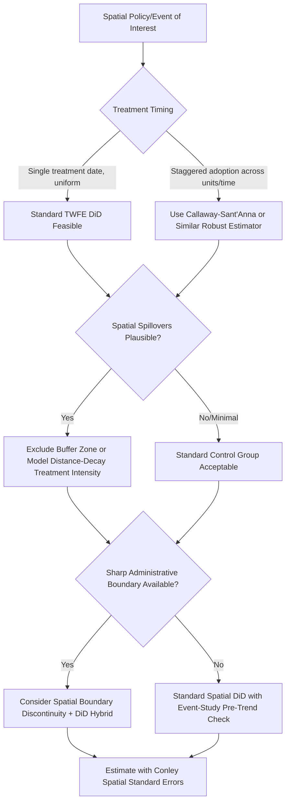

## Difference-in-Differences in Spatial Settings

### Definition and Scope

Difference-in-differences (DiD) in spatial settings applies the canonical DiD identification strategy — comparing outcome changes over time between a treated group and a control group to net out confounding time trends — to research designs where treatment is defined or assigned geographically. This is among the most widely used empirical strategies in urban and regional economics, since many policy interventions of interest (transit line openings, zoning reforms, enterprise zones, natural disasters, environmental cleanups) are inherently spatial in their treatment assignment, but spatial application introduces identification and inference complications distinct from the canonical non-spatial DiD setting.

### The Canonical DiD Framework Applied Spatially

The standard two-way fixed effects (TWFE) DiD specification in a spatial context is typically written as:

$$Y_{it} = \alpha_i + \gamma_t + \beta(\text{Treat}_i \times \text{Post}_t) + X_{it}'\delta + \varepsilon_{it}$$

where $Y_{it}$ is the outcome for spatial unit $i$ (parcel, tract, neighborhood, municipality) at time $t$, $\alpha_i$ is a unit fixed effect absorbing time-invariant spatial heterogeneity, $\gamma_t$ is a time fixed effect absorbing common shocks affecting all units, and $\beta$ is the coefficient of interest capturing the treatment effect on treated units after the policy/event occurs.

**Key Points**

- **Parallel trends assumption**: The core identifying assumption — that treated and control spatial units would have followed parallel outcome trajectories absent treatment — is the same as in non-spatial DiD, but is often harder to defend credibly in spatial applications because treatment location is frequently *not* randomly assigned but chosen precisely because of pre-existing or anticipated differential trends (e.g., a transit line is built where ridership demand is already growing; an enterprise zone is designated where economic decline is already occurring).
- **Spatial unit fixed effects** absorb permanent locational characteristics (soil quality, historical land use, fixed geographic amenities), addressing time-invariant confounding but not confounding trends.

### Distinctive Identification Challenges in Spatial DiD

#### 1. Spatial Spillovers Violate the Stable Unit Treatment Value Assumption (SUTVA)

**Key Points**

- Standard DiD requires SUTVA: the outcome of a control unit must be unaffected by the treatment status of other units. In spatial settings, this is frequently violated by construction — if a transit line, environmental cleanup, or economic development program affects nearby "control" locations through spillovers (commuting, migration, capital flows, or direct physical proximity effects), the control group is contaminated.
- This contamination typically causes DiD to **understate** the true treatment effect, since the "control" group's outcomes are themselves partially affected by treatment (a diluted counterfactual), though the direction of bias depends on whether spillovers are positive (upward-biasing the diluted control comparison and thus increasing understatement) or negative (partially offsetting).
- Standard mitigation strategies include: (a) excluding a buffer zone of near-treatment units from the control group entirely, (b) explicitly modeling a distance-decay treatment intensity gradient rather than a binary treated/control indicator, and (c) using more distant "donut" control groups specifically selected to be far enough from treated units to plausibly avoid spillover contamination.

#### 2. Endogenous Treatment Location (Selection on Anticipated Trends)

**Key Points**

- Policy or infrastructure siting decisions are rarely spatially random; they are frequently placed in locations selected precisely because of observed or anticipated economic conditions (declining areas selected for revitalization programs; growing areas selected for transit investment to accommodate anticipated demand) — a violation of the parallel trends assumption that is not addressed merely by including unit and time fixed effects.
- **Event study / dynamic DiD specifications**, which estimate treatment effects separately for each period relative to treatment timing (rather than a single pooled post-treatment coefficient), are the standard diagnostic tool for assessing this concern: significant "pre-trends" (differential trends between treated and control units *before* treatment occurs) are direct evidence against the parallel trends assumption and against a clean causal interpretation of the DiD estimate.
- Where anticipated future treatment plausibly affects behavior even before implementation (e.g., anticipation of a future transit line affecting current property investment decisions), the conventional "clean pre-period" assumption is itself violated, requiring careful definition of the true "pre-treatment" window.

#### 3. Boundary Discontinuity Designs as a Spatial DiD Refinement

**Key Points**

- A widely used refinement combines DiD with a spatial regression discontinuity logic: comparing outcomes just inside versus just outside a treatment boundary (e.g., an enterprise zone boundary, a school attendance zone boundary, a state or municipal border) before and after treatment, restricting the sample to a narrow geographic band around the boundary.
- This design assumes that units on either side of an arbitrary administrative boundary are otherwise similar in unobserved characteristics and trends (since the boundary itself, rather than economic fundamentals, determines treatment assignment) — a more defensible identification assumption than comparing broadly dispersed treated and control regions, since it holds unobserved spatial confounders approximately fixed by geographic proximity.
- Common applications include enterprise zone effectiveness studies, minimum wage border-county comparisons (canonical though not exclusively urban), and school district boundary hedonic/DiD hybrid designs.

#### 4. The Modern TWFE Critique and Its Spatial Relevance

**Key Points**

- A substantial recent econometric literature (Goodman-Bacon 2021; Callaway and Sant'Anna 2021; de Chaisemartin and D'Haultfœuille 2020, among others) has shown that standard TWFE DiD estimators can be severely biased in settings with staggered treatment timing and heterogeneous treatment effects across units or over time — a finding with direct relevance to spatial applications, since many spatial treatments (transit line phase-in, staggered zoning reform adoption across municipalities, sequential disaster/policy rollout) are inherently staggered rather than adopted simultaneously.
- The core problem identified in this literature is that standard TWFE estimates are a weighted average of all possible pairwise DiD comparisons, including problematic comparisons of *already-treated* units against *later-treated* units used as if they were "clean" controls — comparisons that can receive negative weights and, under treatment effect heterogeneity, can bias the aggregate estimate in surprising ways (including opposite-sign bias in some documented cases).
- **Modern estimators** designed to address this — Callaway-Sant'Anna's group-time average treatment effects, the Sun-Abraham interaction-weighted estimator, and de Chaisemartin-D'Haultfœuille's estimator — are increasingly considered best practice for any staggered-adoption spatial DiD design, and applied spatial economics papers using staggered treatment timing are now generally expected to report results from at least one of these robust estimators alongside (or instead of) standard TWFE.

### Spatial Statistical Inference: Clustering Standard Errors

Beyond identification, spatial DiD applications require careful treatment of statistical inference, since outcomes for nearby spatial units are likely to be correlated (spatial autocorrelation in the error term, as discussed extensively in prior spatial econometrics topics) even after controlling for the treatment and fixed effects.

**Key Points**

- **Standard clustering** (e.g., clustering standard errors at the county or state level) is the most common practical solution, appropriate when spatial correlation is believed to operate primarily *within* the chosen cluster rather than across cluster boundaries.
- **Conley (1999) spatial standard errors**: A more explicitly spatial alternative that allows for correlation between any two observations as a continuous, distance-decaying function (analogous in spirit to the spatial weights matrix concept), rather than assuming a hard cluster boundary — appropriate when the researcher believes spatial correlation does not respect administrative cluster boundaries cleanly.
- Choice between standard clustering and Conley-type spatial standard errors should be motivated by the underlying economic mechanism generating the spatial correlation (does correlation plausibly stop at a jurisdictional line, e.g., due to jurisdiction-specific policy shocks, or does it decay continuously with physical distance, e.g., due to labor market or housing market integration that crosses jurisdictional boundaries).

### Illustrative Diagram: Spatial DiD Design Decision Tree

### Worked Example: Transit Line Opening and Housing Prices

A researcher studies the effect of a new light rail line opening on nearby housing prices, comparing tracts within 0.5 miles of a new station ("treated") to tracts 2-3 miles away ("control"), before and after the line's opening.

**Key Points**

- **Spillover concern**: Tracts at 1-1.5 miles might experience partial price effects (e.g., from park-and-ride commuters or induced retail development), making them poor "pure control" candidates if included; the researcher would typically either exclude this intermediate band entirely (a "donut" design) or explicitly model price effects as a continuous function of distance to station rather than a sharp binary treated/control split.
- **Endogenous siting concern**: If the transit line's route was chosen partly because certain corridors were already experiencing faster growth (a highly plausible scenario for transit planning, which often follows anticipated or existing demand corridors), a naive pre/post comparison risks attributing pre-existing growth trends to the transit line itself; an event-study specification plotting coefficient estimates for several years before and after opening is the standard diagnostic to check whether treated tracts were already diverging from control tracts prior to the announcement or opening date.
- **Anticipation effects**: If the transit line's route was publicly announced well before physical opening, property markets may capitalize expected future access benefits immediately upon announcement rather than waiting for actual service commencement, meaning the conventionally defined "pre-period" (before physical opening) may not be a clean counterfactual — a common and well-documented issue in transit infrastructure DiD studies that typically requires defining the "pre-period" relative to the announcement date rather than the opening date, or explicitly testing for anticipation effects in the event-study design.
- [Inference: the specific magnitude and timing of any anticipation effect is highly context-dependent (varying with how far in advance a project is announced, how credible the announcement is perceived to be, and local market conditions), so general claims about anticipation effect size should be treated as illustrative of a methodological concern rather than as a fixed empirical parameter.]

### Event Study Specification for Pre-Trend Diagnostics

The standard event-study extension of the DiD framework, used to visually and statistically assess parallel pre-trends, replaces the single post-treatment indicator with a full set of period-specific treatment interactions:

$$Y_{it} = \alpha_i + \gamma_t + \sum_{k \neq -1} \beta_k (\text{Treat}_i \times \mathbb{1}[t = t_0 + k]) + X_{it}'\delta + \varepsilon_{it}$$

where $k$ indexes time relative to the treatment event (with $k=0$ typically the treatment period), and the period immediately before treatment ($k=-1$) is conventionally omitted as the reference category. Coefficients $\beta_k$ for $k < 0$ that are statistically indistinguishable from zero support the parallel trends assumption; significant pre-period coefficients indicate a violation requiring further investigation or a different identification strategy.

### Practical Software Implementation Notes

**Key Points**

- Standard TWFE DiD and event-study specifications are commonly implemented using `fixest` in R (with the `feols` function's interaction and event-study syntax) or `reghdfe`/`eventstudyinteract` in Stata.
- The modern robust staggered-adoption estimators are implemented in dedicated packages: `did` (Callaway-Sant'Anna) in R, `csdid` in Stata, `did2s` and `fixest`'s `sunab()` function for the Sun-Abraham estimator.
- Conley spatial standard errors are implemented via the `conleySE` command family in Stata and corresponding functions in R (e.g., within the `sandwich` ecosystem or dedicated Conley SE packages).
- [Unverified: specific package names, current maintenance status, and exact syntax should be verified against current documentation given active and ongoing development in this rapidly evolving subfield of applied econometrics.]

### Conclusion

Difference-in-differences in spatial settings inherits the core logic of the canonical DiD design but requires substantial additional care on three fronts largely specific to (or especially acute in) spatial applications: spatial spillovers that contaminate control groups and violate SUTVA, endogenous and often anticipated treatment siting that threatens the parallel trends assumption, and spatially correlated errors that require explicit inferential correction (clustering or Conley standard errors) beyond standard heteroskedasticity-robust variance estimation. The recent staggered-adoption TWFE critique adds a further layer of methodological rigor now expected in applied spatial DiD work, particularly given how commonly spatial policy rollouts occur on a staggered rather than simultaneous timeline.

**Related Topics**

- Staggered adoption DiD estimators: Callaway-Sant'Anna, Sun-Abraham, de Chaisemartin-D'Haultfœuille
- Spatial regression discontinuity and boundary discontinuity designs
- Conley (1999) spatial standard errors and spatial clustering
- Event study design and pre-trend diagnostic testing
- Transit infrastructure investment and property value capitalization (cross-reference to hedonic pricing)
- Enterprise zones and place-based policy evaluation
- SUTVA violations and spillover-robust causal inference designs
- Synthetic control methods as an alternative to DiD in spatial policy evaluation
- Anticipation effects and event-timing definition in infrastructure studies
- Spatial autocorrelation and weights matrices (foundational cross-reference)