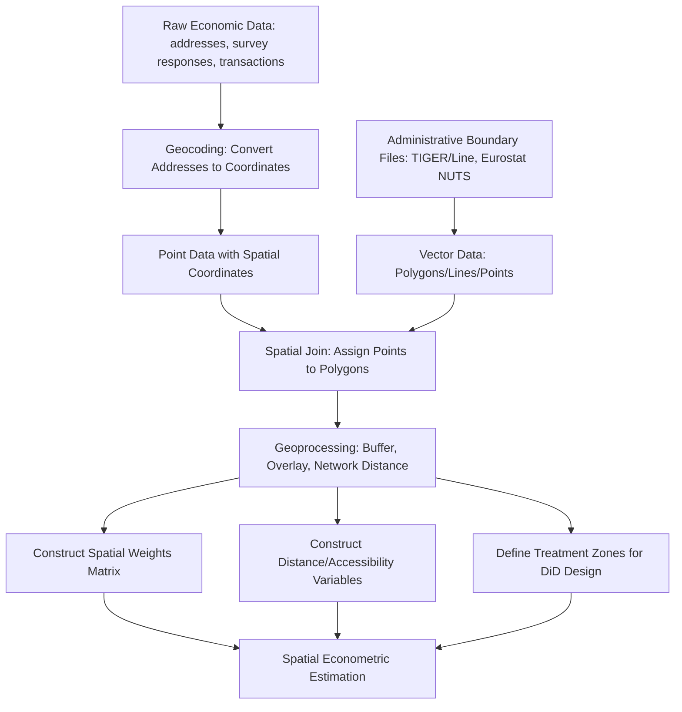

## Geographic Information Systems in Economic Analysis

### Definition and Scope

Geographic Information Systems (GIS) comprise the software, data structures, and analytical methods used to capture, store, manipulate, analyze, and visualize spatially referenced data. In economic analysis, GIS serves primarily as the data infrastructure and preprocessing layer that makes possible nearly all of the spatial econometric methods covered in preceding topics — constructing spatial weights matrices, measuring distance and accessibility, defining treatment zones for spatial DiD designs, and merging disparate datasets on a common geographic reference frame. This topic addresses GIS not as a standalone analytical method but as the essential data engineering and geoprocessing foundation underlying applied spatial economic research.

### Core GIS Data Structures

**Key Points**

- **Vector data**: Represents discrete geographic features as points (e.g., firm locations, transit stops), lines (e.g., roads, rivers), or polygons (e.g., census tracts, zoning districts, parcels), each associated with an attribute table of non-spatial data. Vector data is the dominant format for the administrative and socioeconomic boundary data used in most urban/regional economic applications (census geographies, municipal boundaries, parcel boundaries).
- **Raster data**: Represents continuous spatial phenomena as a grid of cells, each holding a value (e.g., satellite-derived land surface temperature for urban heat island studies, nighttime lights data as a proxy for economic activity, land cover classification, digital elevation models). Raster data is common in environmental and remote-sensing-derived economic applications.
- **Coordinate reference systems (CRS) and projections**: Because the Earth is a curved surface, any flat-map representation requires a projection that introduces some form of distortion (area, distance, shape, or direction); economic analysis requiring accurate area or distance calculations (e.g., computing parcel acreage, or distance-based spatial weights) must use an appropriately chosen projected CRS (e.g., a state plane or UTM zone system) rather than an unprojected geographic coordinate system (e.g., raw latitude/longitude in WGS84), since distance and area calculations performed directly on unprojected coordinates can be substantially distorted, particularly at larger geographic extents or higher latitudes.

### Common Vector File Formats and Data Sources

**Key Points**

- **Shapefile (.shp)**: The long-standing legacy industry-standard vector format (developed by Esri), still widely distributed by government statistical agencies despite technical limitations (a shapefile is actually a bundle of multiple files — .shp, .shx, .dbf, .prj — that must be kept together, and it has field name length and attribute table limitations).
- **GeoJSON**: A modern, human-readable, single-file vector format based on the JSON standard, increasingly preferred for web-based mapping and lightweight data interchange due to its simplicity and native compatibility with JavaScript-based web mapping libraries.
- **GeoPackage (.gpkg)**: A modern, SQLite-based single-file container format supporting multiple layers and larger datasets more efficiently than shapefiles, increasingly recommended as a shapefile replacement in updated data distribution standards.
- **Common administrative geography sources**: In the U.S. context, the Census Bureau's TIGER/Line shapefiles provide the standard boundary files for census geographies (blocks, block groups, tracts, counties, metropolitan statistical areas); international equivalents include Eurostat's NUTS boundary files for the EU and various national statistical agency GIS portals elsewhere.

### Geoprocessing Operations Relevant to Economic Analysis

**Key Points**

- **Spatial join**: Merging attribute data from one layer to another based on spatial relationship (e.g., assigning each firm point to the census tract polygon it falls within) rather than a common ID field — the essential operation for combining point-level economic data (business locations, crime incidents, transactions) with polygon-level administrative or demographic data.
- **Buffer analysis**: Creating a zone of a specified distance around a point, line, or polygon feature (e.g., a 0.5-mile buffer around transit stations) — directly operationalizes the "treated zone" definitions used in hedonic proximity studies and spatial DiD designs discussed in prior topics.
- **Overlay analysis** (intersection, union, clip): Combining two or more spatial layers based on their geometric overlap (e.g., intersecting flood zone polygons with parcel boundaries to identify which properties fall within a flood hazard zone, directly relevant to the climate risk capitalization studies discussed earlier).
- **Distance and network analysis**: Computing Euclidean (straight-line) distance is computationally simple but often a poor proxy for actual travel experience; **network distance/travel time analysis** (routing along an actual street or transit network) provides a more economically meaningful accessibility measure, particularly important for commute-cost variables in residential/firm location choice models and for defining realistic market areas in retail/service location analysis.
- **Areal interpolation / spatial aggregation**: Reallocating data reported at one set of geographic boundaries (e.g., zip codes) to a different, non-matching set of boundaries (e.g., census tracts) — a common and methodologically nontrivial problem when combining datasets reported at incompatible geographic units, typically handled via area-weighted interpolation (assuming uniform density within source units) or more sophisticated dasymetric methods that use ancillary data (e.g., land use) to improve the allocation.

### Geocoding: Converting Addresses to Spatial Coordinates

**Key Points**

- Geocoding is the process of converting a textual address or place description into geographic coordinates (latitude/longitude), an essential preprocessing step for economic datasets originally recorded as street addresses (business registries, property transaction records, survey respondent addresses) that need to be integrated into a GIS-based spatial analysis.
- Geocoding accuracy varies (exact address match, street-segment interpolation match, zip-code centroid match), and **positional accuracy directly affects the validity of downstream distance-based or spatial-join-based economic analysis** — imprecise geocoding (e.g., defaulting to zip-code centroids for unmatched addresses) can introduce substantial measurement error into distance-based explanatory variables, particularly problematic for studies measuring fine-grained proximity effects (e.g., valuing proximity to a specific amenity within a few hundred meters).
- Commonly used geocoding services/tools include the U.S. Census Bureau's free Geocoding API, commercial services (Google Maps Geocoding API, Esri's geocoding services), and open-source alternatives (Nominatim, built on OpenStreetMap data).

### GIS as Infrastructure for Spatial Econometric Methods

This topic connects directly to the preceding spatial econometrics sequence, since virtually every method discussed in this chapter depends on GIS-based data preparation:

**Key Points**

- **Spatial weights matrix construction** (see Spatial Autocorrelation and Spatial Weights Matrices) requires GIS operations to determine polygon contiguity (shared borders/vertices) or to compute pairwise distances between spatial units — typically performed using dedicated spatial analysis libraries rather than manual geometric calculation.
- **Hedonic and discrete choice location models** require GIS-derived distance and accessibility variables (distance to amenities, disamenities, transit, employment centers) as core explanatory variables.
- **Spatial DiD treatment zone definition** (buffer zones around treatment locations, boundary discontinuity band definitions) is fundamentally a GIS buffer/overlay operation.
- **Remote sensing-derived economic indicators**: An increasingly important frontier application uses satellite imagery-derived measures — nighttime lights intensity as a proxy for local economic activity/GDP (particularly valuable in developing-country contexts with limited traditional economic data), land surface temperature for urban heat island analysis, and vegetation indices (NDVI) for green space and agricultural productivity studies — all fundamentally raster GIS data requiring specialized processing pipelines.

### GIS Software and Programming Ecosystem

**Key Points**

- **Desktop GIS software**: Esri's ArcGIS Pro (the dominant commercial platform, particularly in government and planning agency contexts) and QGIS (a mature, actively developed open-source alternative with broad functional parity for most economic analysis use cases) are the two dominant desktop platforms.
- **Programmatic/scripted GIS in R**: The `sf` (simple features) package has become the modern standard for vector data handling in R, largely superseding the older `sp` package; `terra` (successor to the older `raster` package) handles raster data; `tmap` and `ggplot2` (with `geom_sf`) are common for static cartographic output.
- **Programmatic/scripted GIS in Python**: `geopandas` (built on `pandas`, `shapely`, and `fiona`/`pyogrio`) is the standard vector data library; `rasterio` and `rioxarray` handle raster data; `folium` and `contextily` support interactive and static web-style mapping respectively.
- **PostGIS**: A spatial extension to the PostgreSQL database, enabling spatial queries and joins to be performed directly within a relational database — appropriate for large-scale applied economic research infrastructure requiring efficient storage and querying of large spatial datasets beyond what fits comfortably in memory.
- The shift from desktop point-and-click GIS toward scripted, reproducible geoprocessing workflows (in R or Python) has been a significant methodological trend in applied economics, driven by the discipline's broader emphasis on reproducibility and the need to integrate spatial data preparation seamlessly with econometric estimation code. [Unverified: the relative current popularity and specific version capabilities of these tools should be checked against current documentation and community usage given the pace of ongoing development in this ecosystem.]

### Illustrative Diagram: GIS Data Preparation Workflow for Spatial Economic Analysis

### Worked Example: Constructing an Accessibility Variable via Network Analysis

A researcher studying the effect of grocery store access ("food deserts") on neighborhood economic outcomes needs to construct a travel-time-based accessibility measure for each census tract centroid.

**Key Points**

- **Step 1**: Geocode all grocery store addresses within the study region to point coordinates.
- **Step 2**: Obtain a street network dataset (e.g., from OpenStreetMap via the `osmnx` Python package, which retrieves and processes routable street network graphs) for the study area.
- **Step 3**: Compute network-based travel time (not straight-line distance) from each census tract's population-weighted centroid to the nearest grocery store, using a routing algorithm (e.g., Dijkstra's shortest-path algorithm implemented in `networkx` or dedicated routing engines like OSRM).
- **Step 4**: This network-based accessibility measure is then merged (via a standard table join on tract ID, not a spatial join, since both datasets now share a common tract identifier) into the tract-level economic dataset for use as an explanatory variable in subsequent regression analysis.
- [Inference: network-based travel time is generally considered a more economically meaningful accessibility measure than straight-line (Euclidean) distance for most retail/service accessibility applications, since actual travel is constrained by the street network and can differ substantially from straight-line distance depending on network configuration (e.g., water bodies, highways without pedestrian crossings, cul-de-sac street patterns) — though the magnitude of this discrepancy is context-specific to the particular street network topology of the study area and should not be assumed to be uniformly large or small across settings.]

### Common Pitfalls in Applied GIS-Based Economic Analysis

**Key Points**

- **CRS mismatches**: Combining spatial layers with different or undefined coordinate reference systems without reprojecting to a common CRS first produces silently incorrect spatial joins and distance calculations — one of the most common practical errors in applied GIS workflows.
- **Modifiable Areal Unit Problem (MAUP)**: As discussed in the spatial weights matrix topic, results can be sensitive to the choice of geographic aggregation unit (tract versus block group versus zip code), a concern that originates in GIS data structure choices and propagates directly into subsequent econometric results.
- **Ecological fallacy**: Inferring individual-level relationships from aggregated (polygon-level) GIS data risks the ecological fallacy — a correlation observed at the tract or county level does not necessarily hold at the individual or household level, a distinct but related concern to MAUP that arises specifically from the aggregation inherent in polygon-based administrative geography.
- **Boundary/edge effects**: Analysis restricted to a specific administrative boundary (e.g., a single city or county) can produce edge artifacts for spatial weights or accessibility calculations near the boundary, since relevant neighboring units or amenities just across the boundary are excluded from the dataset entirely — a distinct concern from MAUP that instead arises from incomplete/truncated data extent rather than the chosen unit of aggregation itself.

### Conclusion

Geographic Information Systems function as the essential data infrastructure underlying the entire spatial econometrics toolkit covered in this chapter: constructing the spatial weights matrices used in spatial lag and error models, deriving the distance and accessibility variables central to hedonic and discrete choice location models, and defining the treatment zones and boundary discontinuities used in spatial difference-in-differences designs. While GIS is sometimes treated as a purely technical, "data preparation" concern separate from econometric methodology proper, the specific choices made at the GIS stage — coordinate reference system selection, geocoding accuracy, areal interpolation method, and network versus Euclidean distance measurement — have direct and often underappreciated consequences for the validity of downstream economic estimates, making GIS literacy a practical necessity rather than an optional technical add-on for applied spatial economic research.

**Related Topics**

- Spatial weights matrices and Moran's I (direct GIS-dependent prerequisite)
- Remote sensing and nighttime lights as economic activity proxies
- Network analysis and accessibility measurement in transportation economics
- Modifiable Areal Unit Problem and ecological fallacy in aggregated spatial data
- Geocoding accuracy and measurement error in location-based variables
- PostGIS and database infrastructure for large-scale spatial economic datasets
- Open-source GIS ecosystems: QGIS, geopandas, sf, and osmnx
- Areal interpolation and dasymetric mapping methods
- Spatial difference-in-differences treatment zone definition (cross-reference)
- Hedonic pricing distance and accessibility variable construction (cross-reference)