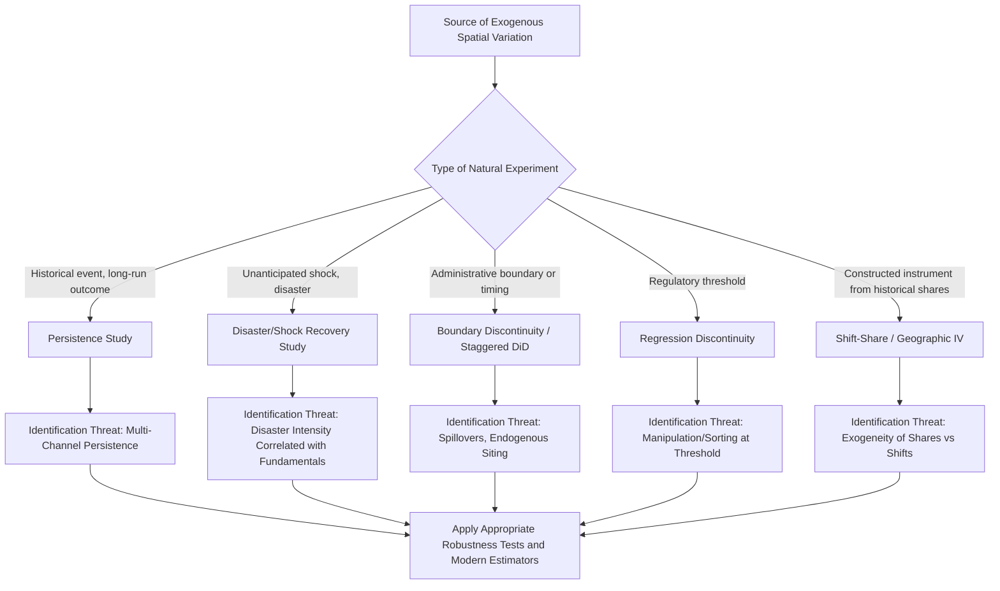

## Natural Experiments in Urban and Regional Economics

### Definition and Scope

A natural experiment is a research design that exploits an exogenous, as-if-random source of variation arising from real-world events, policies, or administrative rules — rather than from a researcher-designed randomized controlled trial — to identify causal effects. In urban and regional economics, natural experiments are particularly central to the empirical toolkit because randomized experimentation on entire cities, regions, or major infrastructure investments is rarely feasible, making the identification of credibly exogenous variation from historical accidents, policy discontinuities, and unanticipated shocks the primary avenue for causal inference at the spatial scale.

This topic serves as a capstone synthesis of the empirical methods sequence, since most natural experiment designs in urban/regional economics are implemented using the specific econometric tools already covered: difference-in-differences (spatial DiD), boundary discontinuities, instrumental variables, and event-study designs, each applied to a specific class of naturally occurring exogenous variation.

### Taxonomy of Natural Experiment Sources in Urban and Regional Economics

#### 1. Historical Accidents and Persistence Studies

**Key Points**

- Exploits arbitrary or historically contingent events whose long-run spatial consequences persist into the present, allowing researchers to isolate the causal effect of a historical shock net of the confounding that would arise if the same location's contemporary characteristics were used for identification.
- Classic examples include: the placement of historical transportation infrastructure (railroads, canals) often determined by 19th-century engineering constraints or political factors unrelated to contemporary economic potential, then used as an instrument for present-day infrastructure access; the long-run economic effects of historical events such as wartime bombing (used to study urban recovery and path dependence in city structure, since destruction patterns were driven by military targeting logic rather than by the economic characteristics researchers want to explain); and colonial-era administrative boundary or institutional placement decisions used to study long-run institutional persistence.
- The "persistence" literature broadly examines whether and how such historically determined spatial patterns persist over long time horizons, often decades or centuries after the original shock, providing evidence on the strength of path dependence in urban and regional economic geography.

#### 2. Natural Disasters and Unanticipated Shocks

**Key Points**

- Earthquakes, hurricanes, floods, and other disasters provide plausibly exogenous (with respect to pre-existing economic trends, though not necessarily with respect to pre-existing exposure/vulnerability) variation in destruction intensity across space, used to study urban resilience, reconstruction dynamics, and the persistence (or lack thereof) of shocks to city size and structure.
- A canonical empirical question in this literature is whether cities "bounce back" to their pre-disaster growth trajectory after a temporary shock (consistent with strong locational fundamentals or increasing-returns-driven path dependence) or experience permanent level or trend shifts — studies of Japanese and German post-WWII bombing recovery and the destruction/reconstruction patterns following major earthquakes are frequently cited examples in this literature.
- Identification concern: disaster *intensity* is sometimes correlated with underlying geographic/economic characteristics (e.g., coastal cities face both hurricane risk and trade-driven economic advantages), requiring careful attention to whether the specific source of cross-sectional variation in disaster exposure is genuinely orthogonal to the economic outcomes of interest, or whether it merely appears so at first glance.

#### 3. Policy and Administrative Discontinuities

**Key Points**

- **Jurisdictional/border discontinuities**: Arbitrary administrative boundaries (state lines, municipal boundaries, school district boundaries) that were drawn for historical or political reasons unrelated to contemporary economic conditions provide a natural regression-discontinuity-style comparison, as discussed in the spatial DiD topic's boundary discontinuity designs.
- **Policy rollout timing**: Staggered implementation of policies across jurisdictions (minimum wage changes, environmental regulations, zoning reforms) for administrative or political reasons unrelated to each jurisdiction's specific economic trajectory can provide natural experiment variation, though — as discussed in the spatial DiD topic — staggered timing requires careful application of modern heterogeneity-robust estimators rather than naive TWFE.
- **Redistricting and boundary redrawing**: Periodic redrawing of political or administrative boundaries (e.g., school district consolidations, municipal annexations) creates natural experiment variation in jurisdictional membership that can be exploited to study the causal effect of jurisdiction-specific policies or fiscal arrangements, holding location fixed.

#### 4. Regulatory and Legal Threshold Discontinuities

**Key Points**

- Many regulations impose discrete thresholds (population thresholds triggering different regulatory regimes, size thresholds for building code requirements, income thresholds for program eligibility) that create sharp discontinuities exploitable via regression discontinuity design (RDD) — a close conceptual relative of the spatial boundary discontinuity design, but based on a non-geographic (though sometimes population- or density-related) running variable.
- **Sharp RDD**: Treatment is a deterministic function of the running variable crossing a threshold (e.g., automatic eligibility for a program based on population count crossing a specific value).
- **Fuzzy RDD**: Crossing the threshold changes the *probability* of treatment rather than deterministically assigning it, requiring an instrumental-variables-style two-stage estimation approach analogous to standard IV.
- The validity of RDD rests on the assumption that units just above and just below the threshold are otherwise comparable (no manipulation or sorting around the threshold) — a testable assumption via density tests (e.g., the McCrary test) checking for suspicious bunching of the running variable near the cutoff, which would suggest strategic manipulation undermining the "as-if-random" local comparison.

#### 5. Instrumental Variables from Natural/Historical Sources

**Key Points**

- **Bartik/shift-share instruments**: Constructs an instrument for local labor demand shocks by interacting a region's initial industry composition (a pre-determined, historically fixed "share") with national-level industry growth rates (a "shift" common across all regions), under the identifying assumption that national industry trends are not driven by any single region's local conditions — extensively used in regional labor economics to study local labor demand shock effects on wages, migration, and housing prices, though this instrument's validity has come under increased econometric scrutiny in recent methodological literature regarding the precise exogeneity conditions required (particularly concerning whether the "shares" or the "shifts" bear the primary identifying burden).
- **Geographic/geological instruments**: Physical geographic features (soil type, ruggedness of terrain, wind patterns for pollution dispersion studies, geological formations affecting resource extraction) used as instruments for economic variables under the assumption that geography itself does not directly affect the outcome except through the specific channel of interest.
- **Historical population/settlement instruments**: Historical population levels or settlement patterns (e.g., population at a fixed historical date) used as instruments for contemporary city size or economic structure, under the assumption that very old historical conditions affect contemporary outcomes only through their persistent effect on the specific channel being studied, not through some other direct persistent pathway — an assumption that requires careful theoretical and historical justification given the "persistence" literature's own finding that historical conditions often have surprisingly long and multi-channeled reach.

### Threats to Validity Specific to Spatial Natural Experiments

**Key Points**

- **Spatial spillovers/SUTVA violations**: As discussed extensively in the spatial DiD topic, natural experiments involving spatially delineated treatment (a disaster zone, a policy boundary) face the same spillover contamination risk to "control" areas, requiring the same buffer-zone or distance-decay mitigation strategies.
- **General equilibrium effects**: A natural experiment that appears to isolate a local, partial-equilibrium effect may actually reflect a broader general equilibrium adjustment (e.g., a local labor demand shock may induce migration that redistributes the shock's effects across a wider region than the nominal "treated" area), complicating the interpretation of the estimated effect as a clean structural parameter versus a reduced-form equilibrium outcome that depends on the specific institutional context studied.
- **External validity/generalizability**: Because natural experiments by definition exploit a specific, often idiosyncratic historical event or policy discontinuity, a well-identified local causal effect may not generalize to different contexts, different treatment intensities, or different time periods — a standard but particularly salient concern in this literature given how often natural experiments rely on unique, non-repeatable historical circumstances.
- **Multiple/composite treatment concern**: Many natural events plausibly bundle several distinct causal channels simultaneously (e.g., a natural disaster affects capital stock, population, insurance markets, and government reconstruction spending all at once), making it difficult to attribute an estimated reduced-form effect to a single specific mechanism without additional design elements or theoretical structure.

### Illustrative Diagram: Natural Experiment Design Taxonomy

### Worked Example: Shift-Share Instrument Construction

A researcher wants to study the causal effect of local labor demand shocks on regional housing prices, but local labor demand is endogenous to local housing market conditions (reverse causality: booming housing markets attract labor-intensive construction employment). A Bartik/shift-share instrument is constructed as:

$$Z_r = \sum_{k} s_{rk,0} \times g_{k,-r}$$

where $s_{rk,0}$ is region $r$'s initial (pre-period, hence predetermined) employment share in industry $k$, and $g_{k,-r}$ is the national (or "leave-one-out," excluding region $r$ itself) growth rate of industry $k$ employment.

**Key Points**

- The identifying logic: a region that happened to have a high initial concentration in an industry that subsequently grew rapidly nationwide will experience a predicted labor demand increase for reasons plausibly unrelated to that specific region's own local housing market conditions at the time the industry shares were measured.
- [Inference: the credibility of this design rests critically on the initial industry shares being measured sufficiently far in the past that they cannot reflect anticipation of the subsequent shock, and on the national industry growth rates genuinely being driven by factors exogenous to any single region — assumptions that require case-specific justification rather than being generically guaranteed by the shift-share mathematical structure itself, a point emphasized in the recent methodological literature reassessing this widely used instrument class.]

### Practical Software and Data Considerations

**Key Points**

- Historical GIS data for persistence studies (historical maps, transportation network digitization, bombing/disaster intensity maps) often require substantial original data digitization and georeferencing work using the GIS tools and techniques discussed in the prior topic, frequently representing a significant share of the total research effort in this literature.
- RDD estimation is commonly implemented via the `rdrobust` package (available in both R and Stata), which provides standard bandwidth selection, bias-correction, and robust inference procedures following the methodological recommendations of Calonico, Cattaneo, and Titiunik.
- Shift-share instrument construction and associated robust inference (following recent methodological critiques) is implemented in packages such as `ssaggregate`/`shift_share` in Stata and corresponding R implementations.
- [Unverified: specific package names, current versions, and exact syntax should be verified against current documentation given ongoing methodological and software development in this active research area.]

### Conclusion

Natural experiments provide the primary avenue for credible causal inference in urban and regional economics precisely because the discipline's central objects of study — cities, regions, and large-scale infrastructure — cannot be randomly assigned by researchers. The taxonomy of natural experiment sources (historical persistence, disaster shocks, administrative discontinuities, regulatory thresholds, and constructed instruments) each map onto specific econometric implementations already covered in this chapter's methods sequence, while sharing common threats to validity — spillovers, general equilibrium contamination, and questions of external validity — that require careful, source-specific justification rather than mechanical application of a standard estimator. The recent methodological literature's increased scrutiny of long-standing tools (staggered DiD, shift-share instruments) reflects the field's ongoing effort to more rigorously interrogate the "as-if-random" assumption that gives natural experiments their causal credibility.

**Related Topics**

- Difference-in-differences in spatial settings (implementation toolkit cross-reference)
- Regression discontinuity design: sharp and fuzzy specifications, McCrary density test
- Shift-share (Bartik) instrument construction and recent identification critiques
- Persistence literature: historical determinants of contemporary spatial economic outcomes
- Natural disasters and urban resilience/recovery dynamics
- General equilibrium versus partial equilibrium interpretation of local shocks
- Geographic information systems in economic analysis (data infrastructure cross-reference)
- External validity and generalizability in applied microeconomics
- Historical transportation infrastructure and long-run regional development
- Randomized controlled trials versus natural experiments in economics methodology