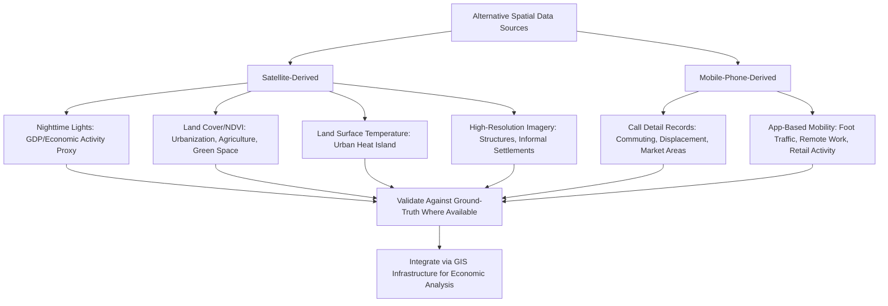

## Satellite and Mobile-Phone Data in Spatial Analysis

### Definition and Scope

Satellite and mobile-phone data represent two of the most significant "non-traditional" or "alternative" data sources that have transformed spatial empirical economics over the past two decades, providing high-frequency, high-resolution measurement of economic activity, human mobility, and physical infrastructure at spatial and temporal scales that traditional survey- and administrative-record-based data cannot match. This topic addresses both data sources as complementary innovations in the measurement infrastructure underlying the spatial econometric and natural experiment methods covered throughout this chapter, with particular relevance where traditional economic statistics are sparse, delayed, or entirely unavailable — most acutely in developing-country contexts, but increasingly also for high-frequency applications in developed economies.

### Satellite-Derived Economic Indicators

#### 1. Nighttime Lights (NTL) Data

**Key Points**

- Satellite-captured nighttime luminosity — most prominently from the U.S. Air Force Defense Meteorological Satellite Program (DMSP-OLS) historical series and its higher-resolution successor, the VIIRS (Visible Infrared Imaging Radiometer Suite) instrument aboard the Suomi NPP satellite — has become a widely used proxy for local economic activity, based on the empirical regularity that light emission intensity correlates with electricity consumption, urbanization, and economic output.
- **Primary applications**: (1) proxying GDP or economic growth in regions/countries with poor, delayed, or politically manipulated official statistics (a use case pioneered by Henderson, Storeygard, and Weil's influential work establishing the NTL-GDP correlation); (2) measuring sub-national economic activity at a spatial resolution far finer than most administrative GDP data, enabling city- or even neighborhood-level economic analysis; (3) providing a high-frequency (near-real-time in the VIIRS era) indicator usable for tracking economic shocks (e.g., conflict, disaster impact, or public health crisis effects on local economic activity) well before official statistics become available.
- **Known limitations**: NTL exhibits a well-documented "top-coding" or saturation problem in DMSP-OLS data, whereby very bright urban cores show little further increase in recorded brightness despite continued underlying economic growth (a sensor saturation issue substantially improved, though not entirely eliminated, in the higher dynamic range VIIRS sensor); NTL is a poor proxy for economic activity in sectors and contexts with limited electrification correlation (subsistence agriculture, informal economic activity with limited lighting); and cross-satellite/sensor comparability over time requires careful calibration given differences in sensor characteristics between DMSP-OLS and VIIRS eras.

#### 2. Land Cover, Land Use, and Vegetation Indices

**Key Points**

- Multispectral satellite imagery (e.g., from the Landsat program, operating continuously since 1972, and the EU's Sentinel-2 mission) enables classification of land cover and land use change over time, supporting studies of urban expansion/sprawl measurement, deforestation and agricultural land conversion, and informal settlement growth detection — often used as an independent, remotely sensed check on or substitute for administrative land-use records that may be outdated or unavailable in rapidly urbanizing contexts.
- **Normalized Difference Vegetation Index (NDVI)**, derived from the differential reflectance of vegetation in red and near-infrared spectral bands, is widely used both as a direct measure of urban green space/tree canopy (connecting to the green space valuation topic covered earlier) and, in agricultural economics contexts, as a proxy for crop yield and agricultural productivity.
- **Land surface temperature (LST)** derived from thermal infrared satellite bands (e.g., from the Landsat thermal sensors or MODIS) provides the primary remotely sensed measurement approach for urban heat island research, offering spatially continuous temperature mapping at a resolution generally unavailable from sparse ground-based weather station networks.

#### 3. High-Resolution Commercial Satellite Imagery

**Key Points**

- Very high-resolution commercial satellite imagery (sub-meter resolution, from providers such as Maxar/DigitalGlobe and Planet Labs) has enabled novel micro-level economic measurement applications: counting individual structures/rooftops for population and wealth estimation, detecting informal settlement boundaries and growth, measuring agricultural field boundaries and crop types at the individual-farm level, and tracking construction activity as a leading indicator of local economic investment.
- Machine learning (particularly convolutional neural network-based image classification) is increasingly integrated with high-resolution imagery to automate feature extraction (building footprints, road networks, land cover classification) at a scale infeasible for manual digitization, an active and rapidly evolving methodological frontier at the intersection of remote sensing, computer vision, and applied economics. [Unverified: specific current model architectures, accuracy benchmarks, and commercial data provider terms should be verified against current technical literature and provider documentation given the rapid pace of development in this area.]

### Mobile-Phone Data in Spatial Economic Analysis

#### 1. Call Detail Records (CDRs) and Mobility Patterns

**Key Points**

- Call Detail Records — metadata automatically logged by mobile network operators for billing purposes, recording the timestamp and cell tower location associated with each call or data session — provide a large-scale, passively collected source of human mobility data, typically accessed by researchers through data-sharing partnerships with mobile network operators (given that CDRs are proprietary and contain sensitive personal information, access is generally mediated through anonymization protocols, aggregation requirements, and institutional data-sharing agreements rather than being openly available).
- **Primary applications**: estimating commuting patterns and functional labor market boundaries at a much finer spatial and temporal resolution than traditional commuting surveys (e.g., the U.S. Census Longitudinal Employer-Household Dynamics origin-destination data) allow; measuring population displacement following disasters or conflict in near-real time; estimating informal economic activity and market catchment areas in contexts with limited traditional survey infrastructure; constructing high-frequency "mobility indices" used extensively during the COVID-19 pandemic to track social distancing compliance and its economic consequences.
- **Spatial resolution limitation**: CDR-derived location data is generally only as precise as the cell tower network's density — coarse in rural/low-tower-density areas and finer in dense urban areas — introducing a spatially heterogeneous measurement error that requires careful methodological treatment rather than being assumed uniform across a study area.

#### 2. Anonymized Mobility/Location Data from Smartphone Applications

**Key Points**

- A distinct and increasingly prominent data source consists of aggregated, anonymized location data derived from smartphone GPS and app-based location services (commercialized by firms such as SafeGraph, Placer.ai, and similar location-analytics providers, and made available in aggregated public-good form during the COVID-19 pandemic by Google's Community Mobility Reports and Meta's Data for Good initiative).
- **Primary economic applications**: measuring foot traffic to specific commercial establishments (used as a high-frequency proxy for local retail activity, particularly valuable during the COVID-19 pandemic for tracking real-time economic disruption well before official retail sales data became available); estimating residential-workplace commuting flows and remote work adoption patterns; constructing granular "market area" and trade-area analyses for retail location economics; and measuring the spatial extent and persistence of agglomeration-driven face-to-face interaction patterns.
- **Representativeness concerns**: This data reflects only the subpopulation using smartphones with location services enabled and the specific applications from which data is aggregated, raising nontrivial sample selection and representativeness concerns — particularly acute for studies of lower-income, elderly, or otherwise smartphone-access-limited populations, where mobility patterns captured by commercial location data may not generalize to the full population of interest. [Inference: the magnitude and direction of this representativeness bias is likely to vary substantially by context (country, region, demographic composition, and which specific commercial dataset/app ecosystem is used), so blanket assumptions about bias direction should be avoided without dataset-specific validation against ground-truth benchmarks where available.]

### Methodological Considerations Common to Both Data Types

**Key Points**

- **Validation against ground truth**: Both satellite-derived and mobile-phone-derived economic indicators are proxies, not direct measures of the underlying economic construct of interest (e.g., nighttime lights proxies GDP but is not GDP itself); rigorous applied work generally validates these proxies against available traditional data (survey-based GDP, census-based mobility data) in contexts where both exist, before extending the proxy's use to contexts where traditional data is unavailable — an essential step that is sometimes skipped or under-emphasized in applications motivated primarily by traditional data's absence.
- **Ethical and privacy considerations**: Both satellite imagery (particularly high-resolution commercial imagery capable of identifying individual structures or activities) and especially mobile-phone-derived mobility data raise significant privacy considerations, since even "anonymized" location data has been shown in the broader data-privacy literature to be potentially re-identifiable when combined with other datasets, motivating increasingly stringent aggregation, differential-privacy, and institutional review requirements for research access.
- **Temporal and spatial resolution tradeoffs**: Both data types generally offer a tradeoff between spatial/temporal resolution and either cost (high-resolution commercial satellite imagery) or access restrictions (individual-level CDR or mobile app data, generally available to researchers only in aggregated form), requiring researchers to select the appropriate resolution tier for their specific research question rather than defaulting to the highest available resolution regardless of cost or access constraints.
- **Integration with GIS infrastructure**: Both data sources are fundamentally processed and integrated into economic analysis using the same GIS data structures and geoprocessing operations discussed in the prior GIS topic (raster processing for satellite imagery, spatial joins for associating mobility data with administrative boundaries), reinforcing GIS's role as the common infrastructural layer across these alternative data sources.

### Illustrative Diagram: Alternative Spatial Data Sources and Applications

### Worked Example: Validating Nighttime Lights as a Local GDP Proxy

A researcher wants to use VIIRS nighttime lights data to estimate sub-national economic activity in a country where official GDP data is only available at the national level.

**Key Points**

- **Step 1**: Identify a benchmark dataset where both NTL data and an independent economic activity measure are available at a comparable sub-national spatial unit — commonly, a subset of regions with reliable regional accounts data, or household survey-based consumption/asset data aggregated to the same spatial unit.
- **Step 2**: Estimate the empirical relationship (often log-log, given the commonly documented non-linear/elasticity-form relationship between light intensity and economic output) between NTL and the benchmark economic measure within this validation subsample.
- **Step 3**: Apply the estimated relationship to extrapolate economic activity estimates to the full set of regions lacking direct economic data, while explicitly reporting the validation-sample fit statistics (e.g., R-squared, out-of-sample prediction error) so that downstream users of the extrapolated estimates can appropriately calibrate their confidence in the proxy-based figures.
- [Inference: because this approach fundamentally extrapolates a relationship estimated in a subsample to a different (out-of-sample) set of regions, the reliability of the extrapolation depends on the validation subsample being reasonably representative of the full target region set in terms of the underlying NTL-economic activity relationship — an assumption that is not automatically guaranteed and ideally should be assessed by researchers rather than presumed, particularly if the regions lacking traditional data differ systematically (e.g., in electrification rates, informal economic activity share, or urbanization level) from the regions used for validation.]

### Conclusion

Satellite and mobile-phone data represent complementary innovations in the spatial economic measurement toolkit, each offering high-resolution, high-frequency proxies for economic activity and human mobility that traditional survey and administrative data cannot match — particularly valuable in data-sparse developing-country contexts and for high-frequency shock-tracking applications. Both data types share a common set of methodological considerations: the necessity of validating proxy measures against available ground truth, careful attention to representativeness and selection biases (particularly acute for smartphone-derived mobility data), and significant privacy and ethical considerations governing data access and use. As with the GIS infrastructure discussed in the prior topic, both data sources function as inputs into, rather than replacements for, the broader spatial econometric and natural experiment methods covered throughout this chapter.

**Related Topics**

- Geographic information systems in economic analysis (processing infrastructure cross-reference)
- Nighttime lights and GDP measurement in data-sparse economies
- Urban heat island measurement via land surface temperature (cross-reference to environmental economics chapter)
- Machine learning and computer vision applications in remote sensing economics
- Privacy, re-identification risk, and ethical data governance in mobility research
- COVID-19 mobility data and real-time economic activity tracking
- Informal settlement detection and developing-world urbanization measurement
- Commuting zones and functional labor market boundary estimation
- Retail trade-area analysis using foot-traffic data
- Natural experiments in urban and regional economics (methodological application cross-reference)