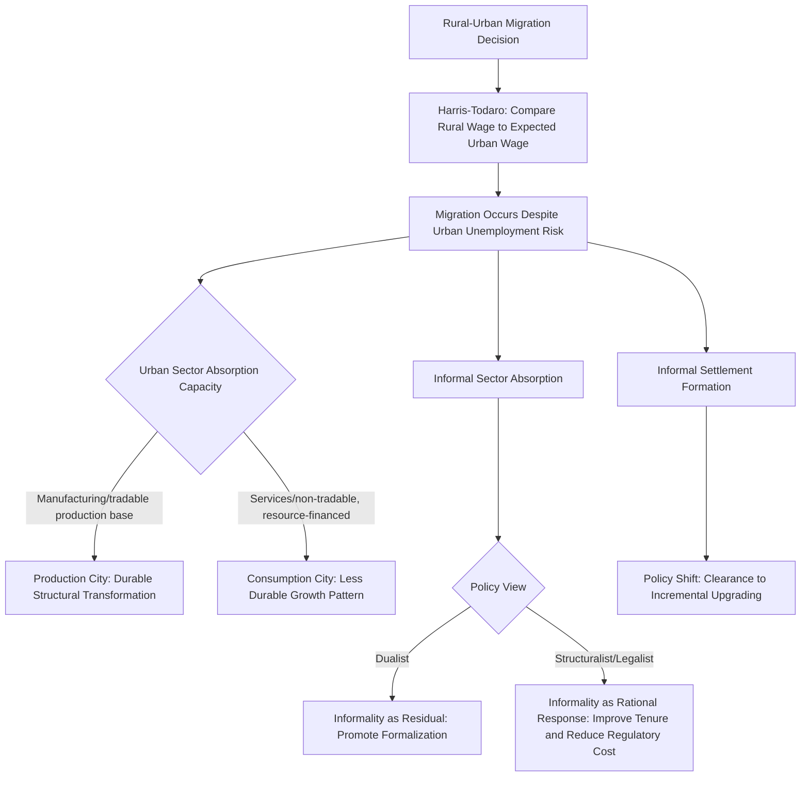

## Urbanization Patterns in Developing Countries

### Definition and Scope

Urbanization in developing countries refers to the process by which an increasing share of a country's population comes to live in urban areas, alongside the associated structural transformation of economic activity from agriculture toward industry and services. This topic examines how the pace, form, and economic character of urbanization in low- and middle-income countries has, in important respects, diverged from the historical urbanization experience of currently high-income countries — raising distinct theoretical and policy questions within urban and regional economics regarding the relationship between urbanization and economic development.

### Stylized Facts of Developing-Country Urbanization

**Key Points**

- **Rapid pace**: Many developing countries have urbanized at a substantially faster rate than the historical experience of currently developed countries during their own industrialization periods, compressing into decades a transition that took much longer historically in Western Europe and North America.
- **Urbanization without commensurate industrialization**: A widely discussed divergence from the classical structural transformation narrative (in which urbanization is driven by manufacturing-sector labor demand pulling workers from agriculture) is that urban population share has grown in many developing countries without a proportional rise in manufacturing employment share — a pattern sometimes termed "urbanization without industrialization," with services and informal sector activity absorbing a large share of urban population growth instead.
- **Large informal sector employment and housing**: A substantial share of urban economic activity in many developing-country cities occurs in the informal sector (unregistered firms, unlicensed street vending, informal transportation), and a substantial share of urban housing is informal or self-built, often lacking secure land tenure — a structural feature largely absent from the historical urbanization experience of currently developed economies at comparable income levels, and central to ongoing debates about the economic function and welfare implications of informality (discussed further below).
- **High primacy**: Many developing countries exhibit high urban primacy — a single dominant "primate city" (often the capital or largest commercial center) accounting for a disproportionate share of total urban population and economic activity relative to the rest of the urban hierarchy, in contrast to the more even city-size distributions (approximating Zipf's Law) more commonly observed in developed-country urban systems.

### Theoretical Frameworks for Urbanization and Development

#### 1. The Harris-Todaro Model of Rural-Urban Migration

The Harris-Todaro model provides a foundational framework explaining why rural-urban migration and urban population growth can persist even in the presence of substantial urban unemployment — a puzzle for simpler models assuming migration responds only to realized wage differentials.

$$E[W_u] = \pi \times W_u^{formal}$$

where migrants compare the *expected* urban wage — the formal-sector urban wage $W_u^{formal}$ multiplied by the probability $\pi$ of obtaining formal-sector employment — against the rural wage $W_r$, migrating whenever $E[W_u] > W_r$, even if $\pi$ is well below one and substantial urban unemployment (or underemployment in the informal sector while awaiting formal employment) coexists in equilibrium.

**Key Points**

- The model's key insight is that migration decisions are forward-looking and probabilistic rather than based on guaranteed employment, explaining the empirically observed coexistence of rural-urban migration flows alongside substantial urban unemployment or informal underemployment in many developing-country cities — a pattern that a naive wage-equalization migration model cannot easily rationalize.
- Policy implications drawn from the model are somewhat counterintuitive: policies that increase the probability of formal urban employment (e.g., urban job creation programs) can, by raising the expected urban wage, *increase* rural-to-urban migration by more than the number of new jobs created, potentially exacerbating rather than resolving urban unemployment — a result sometimes termed the "Todaro paradox."

#### 2. Structural Transformation and the Lewis Model

The dual-sector Lewis model (surplus labor in a low-productivity traditional/agricultural sector migrating to a higher-productivity modern/urban sector, absorbed at a roughly constant "institutional" wage until surplus labor is exhausted) provides the classical benchmark structural transformation framework against which the "urbanization without industrialization" pattern is often contrasted, since the Lewis model implicitly assumes the modern (urban) sector is manufacturing-based and has sufficient labor demand to absorb migrants productively — an assumption increasingly questioned as empirically descriptive of many contemporary developing-country urbanization experiences.

#### 3. Consumption Cities versus Production Cities

A more recent conceptual distinction in the development economics literature contrasts "production cities" (urban growth driven by tradable-sector, particularly manufacturing, export-oriented production, historically characteristic of East Asian industrialization) against "consumption cities" (urban growth driven primarily by natural resource revenue, foreign aid, or other non-tradable-sector income sources being spent in urban areas on services and construction, without a strong corresponding tradable production base) — a framework used to explain why some developing-country urbanization has generated less durable productivity growth and structural transformation than the historical East Asian experience.

### Economic Drivers of Developing-Country Urban Growth

**Key Points**

- **Push factors**: Agricultural productivity constraints, rural land pressure (population growth against fixed or degrading agricultural land), rural conflict or environmental shocks, and limited rural non-farm economic opportunity.
- **Pull factors**: Perceived (even if not always realized) higher urban wages and expected employment opportunities, better access to public services (education, health care) concentrated in urban areas, and network effects (existing migrant communities in cities reducing the cost and risk of migration for subsequent migrants from the same origin area).
- **Natural population increase**: A frequently underappreciated component of urban population growth in many developing-country cities is natural increase (births exceeding deaths within the existing urban population) rather than net in-migration alone — the relative contribution of migration versus natural increase varies substantially across countries and is an important distinction for policy design, since migration-focused policies would have limited effect on the natural-increase component of urban growth.
- **Reclassification**: Urban population growth statistics can also reflect the administrative reclassification of areas from "rural" to "urban" status as they cross population or density thresholds defined by national statistical agencies, rather than reflecting migration or natural increase at all — an important measurement caveat when interpreting cross-country urbanization rate comparisons, since urban definition thresholds vary substantially across countries.

### The Informal Sector: Economic Function and Debate

**Key Points**

- **Dualist view**: Treats the informal sector as a residual, low-productivity sector absorbing labor that cannot find formal employment, generally viewed as an undesirable feature of underdevelopment to be reduced through formalization policy.
- **Structuralist/legalist view**: Emphasizes that informality often reflects a rational economic response to excessive regulatory costs, burdensome business registration procedures, or ill-suited formal institutions (property titling systems, labor regulations) not well adapted to the economic conditions of many developing-country urban economies — associated with Hernando de Soto's influential argument that insecure informal property rights (rather than informality per se) are the central economic problem, since insecure tenure prevents informal assets from being used as collateral for credit, limiting capital accumulation.
- **Policy tension**: These competing views generate divergent policy prescriptions — formalization-focused policies (simplifying business registration, extending formal credit and tenure) versus policies that instead aim to improve conditions and productivity within the informal sector as it exists, given that formalization mandates can sometimes destroy informal livelihoods without providing a viable formal alternative, particularly where formal-sector job creation has not kept pace with urban population growth (connecting directly to the "urbanization without industrialization" pattern above).

### Informal Settlements and Housing

**Key Points**

- Rapid urban population growth frequently outpaces formal housing supply and land-use planning capacity, resulting in the proliferation of informal settlements (commonly termed slums, favelas, or similar country-specific terms) characterized by insecure land tenure, self-built and often substandard housing, and limited formal infrastructure access (piped water, sewerage, electricity).
- The economic literature on informal settlements has increasingly moved away from viewing them purely as a policy failure to be eliminated (historically sometimes addressed through slum clearance/demolition policies now widely regarded as having caused substantial welfare harm without providing adequate housing alternatives) toward viewing them as a rational, if constrained, market response to housing affordability pressure, with policy attention increasingly focused on incremental infrastructure upgrading and land tenure regularization ("upgrading" approaches) rather than clearance.
- Secure land tenure in informal settlements has been studied extensively as a potential lever for increasing household investment in housing quality and access to credit, following the de Soto-style argument noted above, though empirical findings on the magnitude of these effects vary across specific program and country contexts. [Inference: because tenure regularization program design, implementation quality, and the specific baseline informal land tenure institutions vary substantially across studied contexts, the empirical magnitude of tenure security effects on investment and credit access should be treated as context-dependent rather than assumed to generalize uniformly across all informal settlement policy settings.]

### Urban Primacy and City-Size Distribution

**Key Points**

- High urban primacy in many developing countries has been attributed to a combination of colonial-era administrative and trade-infrastructure concentration in a single dominant city, continued political-economy incentives (capital cities benefiting from proximity to national government and associated public investment, sometimes termed a political economy "capital city bias"), and agglomeration economies that, absent offsetting transportation and communication infrastructure investment in secondary cities, tend to reinforce concentration in the already-dominant city.
- High primacy is a subject of ongoing policy debate: some view it as reflecting genuine efficient agglomeration benefits that policy should not artificially counteract, while others view excessive primacy (beyond what agglomeration economies alone would justify) as reflecting a policy-distorted spatial equilibrium warranting deliberate secondary-city development strategies, congestion pricing in the primate city, or decentralized public investment — a debate that echoes, at the national urban-system scale, the compact-city-versus-sprawl efficiency tradeoffs discussed in the sustainable urban development topic, but applied to the question of *inter-city* rather than *intra-city* spatial concentration.

### Public Service and Infrastructure Provision Challenges

**Key Points**

- Rapid, often unplanned urban growth frequently outpaces municipal fiscal and administrative capacity to provide basic infrastructure (water, sanitation, electricity, transportation, solid waste management) and public services (health, education) at a rate commensurate with population growth, generating well-documented urban service deficits disproportionately affecting lower-income and informal-settlement residents.
- Municipal fiscal capacity constraints in many developing-country cities are compounded by limited local property tax collection capacity (often due to incomplete or outdated property registries, particularly acute in informally developed areas) and high dependence on central government transfers, limiting the direct fiscal linkage between local economic growth and local public investment capacity that characterizes many developed-country municipal finance systems.

### Illustrative Diagram: Developing-Country Urbanization Dynamics

### Worked Example: Interpreting the Harris-Todaro Migration Condition

Suppose the rural agricultural wage is $150/month, the urban formal-sector wage is $400/month, and the probability of securing formal urban employment in a given period is estimated at 30%. The expected urban wage is:

$$E[W_u] = 0.30 \times 400 = \$120/\text{month}$$

Since $E[W_u] = \$120 < W_r = \$150$, the basic Harris-Todaro condition as specified would predict no further migration incentive at this specific probability level. [Inference: this simple numerical example illustrates the mechanical logic of the model only; in practice, migrants may also weigh informal-sector urban earnings while awaiting formal employment (rather than facing pure unemployment during the waiting period), non-wage urban amenities (access to services, family/social networks), and multi-period dynamic considerations not captured in this static single-period comparison, all of which would alter the effective migration threshold in ways the basic textbook formula does not capture.] This illustrates why extensions incorporating informal-sector earnings during the "waiting" period are a standard refinement to the basic Harris-Todaro framework in applied development economics.

### Conclusion

Urbanization patterns in developing countries exhibit several features that distinguish them from the historical urbanization experience of currently high-income countries: a compressed and often more rapid pace, frequent decoupling from commensurate manufacturing-sector structural transformation, pervasive informality in both urban labor markets and housing, and often high urban primacy. The Harris-Todaro migration framework provides the foundational theoretical explanation for persistent rural-urban migration despite substantial urban unemployment risk, while the informal sector debate (dualist versus structuralist/legalist perspectives) and the production-city-versus-consumption-city distinction provide competing lenses for interpreting whether observed urbanization is generating durable productivity-enhancing structural transformation or a more fragile, less economically transformative pattern of urban population concentration.

**Related Topics**

- Harris-Todaro model extensions and dynamic migration frameworks
- Informal sector economics: dualist, structuralist, and legalist perspectives
- Informal settlement upgrading versus slum clearance policy debates
- Urban primacy, Zipf's Law, and city-size distribution theory
- Structural transformation and the Lewis dual-sector model
- Land tenure security and de Soto's property rights framework
- Municipal fiscal capacity and property taxation in developing-country cities
- Secondary city development and decentralized urbanization strategies
- Satellite and mobile-phone data applications in developing-country urban measurement (cross-reference)
- Agglomeration economies and colonial-era urban primacy origins