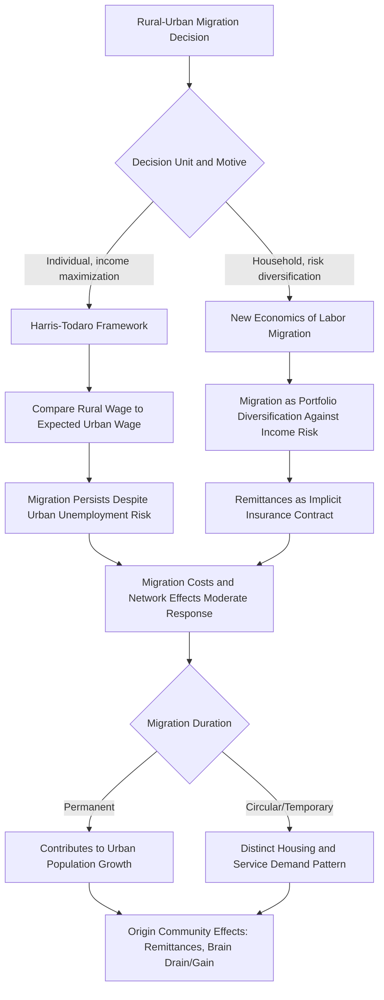

## Rural-Urban Migration in Developing Economies

### Definition and Scope

Rural-urban migration in developing economies refers to the movement of individuals and households from agricultural/rural areas to urban centers, driven by the search for improved economic opportunity, and constitutes the primary demographic mechanism underlying the structural transformation and urbanization patterns discussed in the preceding topic. While the previous topic addressed urbanization as an aggregate spatial and structural phenomenon, this topic focuses specifically on the micro-level economic decision-making, household strategy, and welfare consequences of the migration decision itself — the theoretical and empirical core of development economics' migration literature.

### The Harris-Todaro Framework: Formal Recap and Extensions

As introduced in the prior topic, the Harris-Todaro (1970) model provides the foundational explanation for migration persisting despite urban unemployment, based on migrants comparing the rural wage to the *expected* urban wage (formal wage weighted by employment probability). This topic extends that foundation with the refinements and empirical elaborations most central to migration economics specifically.

**Key Points**

- **Todaro's original dynamic formulation** treats the employment probability $\pi$ as endogenously determined by the ratio of urban formal-sector job vacancies to the existing pool of urban job-seekers, meaning $\pi$ falls as more migrants arrive — creating a self-correcting (though slow and imperfect) mechanism limiting migration, but also implying that migration flows and urban unemployment can be simultaneously determined in equilibrium rather than urban unemployment being simply a policy failure to be solved independently of migration dynamics.
- **Informal-sector waiting extension**: Recognizing that migrants rarely face literal unemployment while awaiting formal jobs, but instead often work in the urban informal sector at a lower wage during a "waiting period," the standard model is extended to include informal-sector earnings $W_{informal}$ in the expected urban income calculation, refining the migration condition to compare $W_r$ against a weighted combination of formal and informal expected urban earnings — better matching the empirical reality that most urban newcomers in developing economies do not experience literal open unemployment but rather informal underemployment.

### The New Economics of Labor Migration (NELM)

A distinct and highly influential theoretical departure from the individual-utility-maximization framing of Harris-Todaro is the New Economics of Labor Migration (associated primarily with Oded Stark and collaborators), which reframes migration as a **household-level risk-diversification strategy** rather than a purely individual income-maximization decision.

**Key Points**

- **Core insight**: Households in developing-country agricultural settings face substantial income risk (weather shocks, crop price volatility, illness) in the absence of well-functioning formal insurance and credit markets. Sending a household member to migrate — particularly to an urban labor market whose income shocks are imperfectly correlated with local agricultural income shocks — functions as an informal risk-diversification and self-insurance mechanism, analogous to a household "diversifying its portfolio" of income sources across spatially and sectorally distinct labor markets.
- **Remittances as insurance/investment**: Migrant remittances sent back to the origin household are interpreted within NELM not merely as altruistic transfers but as part of an implicit intertemporal, self-enforcing contractual arrangement between the migrant and the origin household — the household may have financed the migrant's initial migration costs (a form of investment) with the expectation of a remittance "return," and the migrant may rely on the origin household as an insurance backstop should the urban migration venture fail (e.g., a right to return and reclaim land or family support).
- **Relative deprivation**: NELM also incorporates the idea that migration decisions may be motivated by a household's *relative* income position within its reference community (relative deprivation), not solely by absolute income-maximization calculus — households in communities with high income inequality may have stronger migration incentives even holding absolute income constant, since migration offers a route to improving relative standing within the local reference group.
- This household-strategy framing helps explain empirical patterns that a pure individual-wage-maximization model struggles with: selective migration of specific household members (often a "surplus" adult, frequently but not universally male, rather than entire households); the persistence of strong financial and social ties (remittances, return visits, land rights maintenance) between migrants and origin households long after migration; and migration undertaken by households in relatively better-off (not only the poorest) communities, since some minimum capital is often required to finance migration costs and risk-bearing capacity — a pattern sometimes termed the "migration hump," where migration propensity initially rises with community income before eventually declining at higher income levels.

### Determinants of Migration: Empirical Framework

**Key Points**

- **Wage/income differentials**: The baseline economic driver in both Harris-Todaro and NELM frameworks, though NELM emphasizes relative and risk-adjusted rather than purely absolute differentials.
- **Migration costs**: Direct financial costs (transportation, urban housing search, urban cost-of-living adjustment period) and psychological/social costs (separation from family and community networks) function as a threshold that must be overcome before migration is undertaken, helping explain why migration does not occur instantaneously in response to any positive expected wage gap, and why credit constraints can prevent otherwise economically rational migration from occurring — a distinct explanation for limited migration response that does not require appealing to non-pecuniary attachment to origin location.
- **Migrant networks**: The presence of prior migrants from the same origin community at a given destination substantially reduces the effective cost and risk of subsequent migration (via information sharing about job opportunities, provision of temporary housing/support upon arrival, and reduced psychological cost of moving to a location with an existing social network) — a well-documented empirical regularity generating strong path-dependence in migration corridors between specific origin and destination locations, sometimes termed "chain migration."
- **Human capital and selection**: Migrants are frequently not a random sample of the origin population but exhibit selection on observable and unobservable characteristics (education, risk tolerance, ambition) — the direction and degree of this selection (positive selection of higher-skilled/ability individuals, versus negative selection where migration serves as an option primarily for those with limited local opportunity) is an important and empirically debated question, since it has direct implications for whether migration exacerbates or alleviates origin-community human capital constraints ("brain drain" concerns).
- **Life-cycle and demographic factors**: Migration propensity typically varies systematically with age (peaking among young adults), household composition (presence of young children may reduce migration propensity or shift the household strategy toward temporary/circular rather than permanent migration), and land/asset ownership (land ownership can either reduce migration incentive by providing an existing income source, or increase migration capacity by providing collateral to finance migration costs, with the net effect depending on context-specific land and credit market conditions).

### Circular and Temporary Migration Patterns

**Key Points**

- A substantial share of rural-urban migration in many developing-country contexts is circular or temporary rather than permanent — migrants move to urban areas for a defined period (often seasonally, coinciding with agricultural off-seasons, or for a period of several years) before returning to the origin community, rather than permanently relocating.
- This pattern is consistent with the NELM household-strategy framing (migration as a temporary income-diversification and remittance-generating strategy rather than a permanent household relocation decision) and has significant implications for urban planning and housing policy, since circular migrants' housing and public service demands may differ systematically from those of permanent urban settlers (e.g., lower investment in permanent urban housing, continued maintenance of rural land and housing assets).
- Measurement of circular migration is methodologically challenging using standard census/survey data collected at a single point in time, since such surveys can undercount circular migrants who may be recorded as "rural resident" or "urban resident" depending on the specific timing of data collection relative to their circulation pattern — a distinct measurement issue from the urban reclassification concern discussed in the prior topic, but similarly complicating cross-country and over-time comparability of migration statistics.

### Remittances: Economic Effects on Origin Communities

**Key Points**

- **Household-level effects**: Remittances have been extensively studied as a source of household income smoothing (reducing consumption volatility in the face of local income shocks, consistent with the NELM insurance framing), and as a potential source of investment capital for origin-household agricultural productivity improvements, education spending, or small business investment — though the degree to which remittances are used for productive investment versus consumption smoothing varies substantially across studied contexts.
- **Aggregate/macroeconomic effects**: At a broader scale, remittance inflows constitute a major source of foreign exchange and balance-of-payments support for many labor-exporting developing countries, though the macroeconomic literature also documents potential adverse effects — a "Dutch disease"-type phenomenon whereby large remittance inflows can appreciate the real exchange rate and reduce the competitiveness of the origin country's tradable sector, an effect requiring the same theoretical treatment as other large capital-inflow phenomena in open-economy macroeconomics.
- **Human capital "brain drain" versus "brain gain" debate**: Migration of higher-skilled individuals raises the classic concern that origin communities/countries lose valuable human capital, though a counterargument (sometimes termed "brain gain" or the "brain drain reconsidered" literature) suggests that the *prospect* of skilled migration can incentivize increased educational investment in the broader origin population (since even those who do not ultimately migrate have increased educational returns anticipation), potentially offsetting some of the direct human capital loss from those who do migrate — an empirically contested net effect that varies by context and the specific skill/occupation category studied.

### Migration and Urban Labor Market Impacts at Destination

**Key Points**

- Rural-urban migrant inflows affect destination urban labor markets through standard labor supply mechanisms, with distributional effects depending on the degree of substitutability between migrant and existing urban worker skill sets — migrants with skills similar to existing low-skilled urban workers may exert downward wage pressure on that specific segment, while migrants filling distinct occupational niches may have more complementary rather than purely substitutive labor market effects.
- Migration also interacts with the informal sector absorption dynamics discussed in the prior urbanization topic, since new migrants disproportionately enter urban labor markets through informal-sector employment during an initial adjustment period, connecting the individual/household migration decision directly to the aggregate informal-sector-size patterns characteristic of developing-country urbanization.

### Illustrative Diagram: Migration Decision Frameworks Compared

### Worked Example: NELM Risk-Diversification Logic

Consider a farming household whose agricultural income has a standard deviation of $800/year due to rainfall variability, with a mean of $2,000/year. If the household sends one adult member to migrate to an urban area where earnings (formal plus informal-sector, weighted by respective probabilities) have a mean of $1,800/year with a standard deviation of $500/year, and — critically, per the NELM logic — urban earnings shocks are only weakly correlated with the household's local agricultural rainfall shocks (since urban labor demand depends on different economic factors than local rainfall), then total household income variance can be reduced through diversification even if the migrant's expected earnings are somewhat below the household's average per-capita agricultural income.

$$\text{Var}(Y_{combined}) = \text{Var}(Y_{ag}) + \text{Var}(Y_{migrant}) + 2\,\text{Cov}(Y_{ag}, Y_{migrant})$$

[Inference: whenever $\text{Cov}(Y_{ag}, Y_{migrant})$ is sufficiently low (or negative), the combined household income variance can be lower than the variance of relying on agricultural income alone, even without any gain in expected total income — illustrating the NELM insight that migration can be individually and collectively rational for risk-management reasons distinct from, and potentially even in the absence of, a positive expected income gain; the precise numerical variance reduction in any real household depends on the specific correlation structure between local agricultural and urban labor market shocks, which is an empirical question requiring context-specific data rather than a value that can be assumed a priori.]

### Policy Implications

**Key Points**

- **Rural development versus urban absorption strategies**: A long-standing development policy debate concerns whether limiting "excessive" or "premature" rural-urban migration (through rural development investment intended to improve rural livelihoods and reduce the push factor) or instead improving urban absorption capacity (formal-sector job creation, informal-sector productivity support, urban infrastructure and housing investment) is the more effective policy response to urbanization pressure — a debate directly informed by whether one views the underlying migration process through a Harris-Todaro lens (where formal urban job creation risks the "Todaro paradox" of induced excess migration) or an NELM lens (where migration is a household risk-management response that rural income-stabilization investment, such as agricultural insurance or credit access, might directly substitute for).
- **Restricting migration is generally regarded unfavorably** in the mainstream development economics literature on both efficiency grounds (migration typically reflects a movement toward higher-productivity activity, consistent with broader labor market efficiency gains from reduced mobility barriers) and human-rights/welfare grounds, shifting most policy attention toward managing the consequences and improving the conditions of migration (informal settlement upgrading, portable social protection, migrant-inclusive urban service planning) rather than attempting to prevent migration flows directly — though some historical developing-country policies (e.g., China's hukou household registration system) have implemented direct or indirect migration restrictions, generating a distinct and extensively studied literature on the economic costs and distributional consequences of such restrictions. [Unverified: the current specific status, enforcement stringency, and reform trajectory of any particular country's migration-restriction policy should be verified against current sources given that such policies are subject to ongoing legal and administrative change.]

### Conclusion

Rural-urban migration in developing economies is best understood through two complementary theoretical lenses: the Harris-Todaro framework's emphasis on individual expected-income comparison under employment-probability uncertainty, and the New Economics of Labor Migration's reframing of migration as a household-level risk-diversification and implicit-insurance strategy operating in the absence of well-functioning rural credit and insurance markets. Together, these frameworks explain empirical patterns — persistent migration despite urban unemployment, selective rather than whole-household migration, sustained remittance flows, and circular/temporary migration patterns — that neither framework alone fully captures, and they generate distinct (and sometimes competing) policy implications regarding whether rural income-stabilization investment or urban absorption-capacity investment represents the more effective policy lever for managing migration-driven urbanization pressure.

**Related Topics**

- Urbanization patterns in developing countries (aggregate structural cross-reference)
- New Economics of Labor Migration: household risk-sharing and remittance contracts
- Remittances, Dutch disease, and macroeconomic effects of labor emigration
- Brain drain versus brain gain in human capital migration literature
- Migrant networks and chain migration path-dependence
- Circular and seasonal migration measurement challenges
- China's hukou system and migration restriction policy analysis
- Informal sector absorption of new urban migrants (cross-reference)
- Credit constraints and migration cost financing in developing economies
- Rural development versus urban absorption capacity policy debates