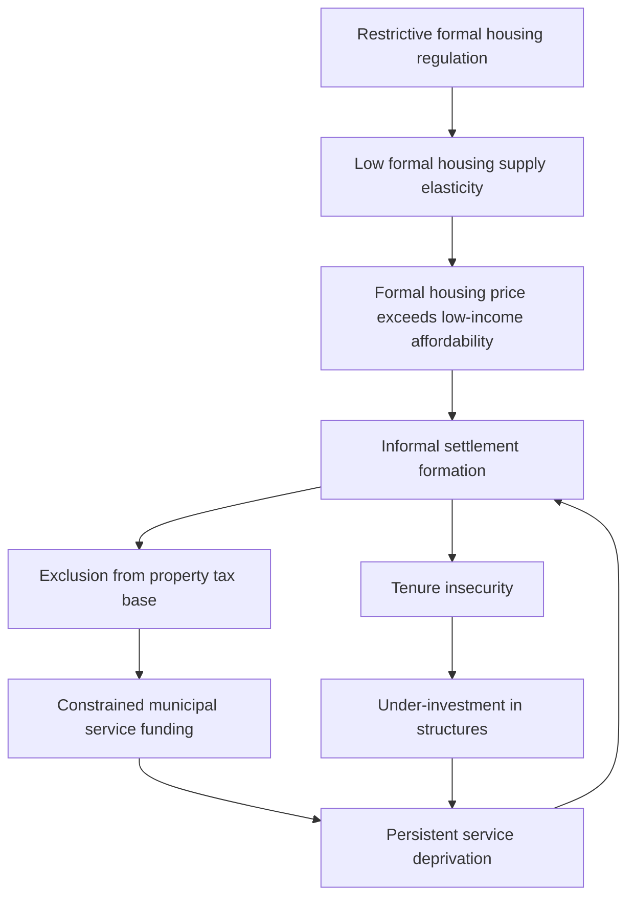

## Informal Settlements and Slums

### Definition and Conceptual Framework

Informal settlements are residential areas where inhabitants have no legal claim to the land they occupy, or where housing does not comply with current planning and building regulations. UN-Habitat operationalizes "slum household" using five criteria, where a household lacking one or more is classified as slum: inadequate access to safe water, inadequate access to sanitation, poor structural quality of housing (durability), overcrowding, and insecure tenure.

The terms "informal settlement" and "slum" are related but not interchangeable. A settlement can be informal (unauthorized land occupation) without being a slum (deficient in the UN-Habitat criteria) if residents have achieved adequate services and housing quality despite lacking legal tenure. Conversely, formally recognized areas can exhibit slum conditions. This distinction matters for policy design: tenure regularization addresses informality, while infrastructure investment addresses slum conditions, and the two interventions are not perfect substitutes.

**Key Points**

- Informality refers to legal/regulatory status of land and structures
- Slum conditions refer to physical and service deprivation
- Overlap is common but not definitional
- Measurement approaches (UN-Habitat, national census definitions, satellite-based) yield different counts for the same city

### Theoretical Foundations in Urban Economics

#### The Land and Housing Market Failure View

Informal settlements emerge substantially as a market response to the gap between low household incomes and the cost of formal housing production. Formal housing requires compliance with zoning, building codes, minimum plot sizes, and infrastructure standards that raise per-unit costs above what low-income households can afford. The informal sector supplies housing at prices closer to household willingness-to-pay by substituting away from costly inputs: legal tenure, code-compliant construction, and planned infrastructure.

This can be represented as a filtering/bid-rent problem. Let $Y_h$ denote household income and $P_f$ the minimum price of formal-sector housing (set by regulatory floors). If $Y_h < P_f$ for a large share of the urban population, excess demand for shelter below $P_f$ must be absorbed somewhere. In the absence of subsidized formal alternatives, it is absorbed by the informal sector, where the effective price $P_i < P_f$ because informal producers do not pay for regulatory compliance, formal titling, or (initially) full infrastructure.

$$P_i = P_f - C_{reg} - C_{infra} - C_{title}$$

where $C_{reg}$, $C_{infra}$, and $C_{title}$ are the cost components stripped out of informal production relative to formal production.

#### Locational Choice and the Bid-Rent Model Applied to Informality

Classic monocentric city models (Alonso-Muth-Mills) predict declining bid-rent with distance from the CBD, with income sorting determining who lives where. Informal settlements complicate this in two ways:

1. **Interior informal settlements**: In many developing-country cities, the poor occupy centrally located but hazardous or legally precarious land (floodplains, steep slopes, railway easements, public land) because proximity to income-earning opportunities (day labor, informal markets) outweighs the disamenity and tenure risk. This inverts the standard prediction that the poor locate at the periphery, since informal centrally-located land has near-zero market price due to legal unmarketability, undercutting formal land prices entirely.
2. **Peripheral informal settlements**: Where central land is fully occupied or enforcement is stronger, informal settlement occurs at the urban fringe, consistent with standard bid-rent logic, but with commuting cost trade-offs that are more severe for the poor given time-cost sensitivity and inadequate transit.

Both patterns can coexist within the same city, producing a bimodal spatial distribution of informality rather than a smooth gradient.

#### De Soto's Dead Capital Thesis

Hernando de Soto's influential argument holds that the primary constraint on informal-sector welfare is the absence of formal, transferable, and collateralizable property title. Without title, assets represent "dead capital": they cannot be used as collateral for credit, cannot be sold in liquid markets, and their value cannot be easily verified. De Soto estimated the aggregate value of untitled real estate held by the poor in developing countries at trillions of dollars.

The de Soto framework predicts that titling programs should, on their own, unlock: (1) access to formal credit markets, (2) increased investment in housing structures (since tenure security raises the expected return to investment), and (3) formalization of small enterprises operating from titled premises.

**[Inference]** Empirical titling studies (discussed below) show investment effects are frequently confirmed but credit-access effects are weaker and more context-dependent than the original thesis predicted, since formal lenders also weight income stability, credit history, and loan-recovery institutions, not title alone.

#### Turner's Self-Help Housing Theory

John F. C. Turner argued (1960s–70s) that housing should be understood as a verb ("housing" as process) rather than a noun (a finished product), and that incremental, resident-controlled construction is often more efficient than top-down provision because residents possess superior local information about their own priorities and can adjust investment to income fluctuations. This underpins policies such as sites-and-services and settlement upgrading rather than demolition-and-rebuild.

### Determinants of Informal Settlement Formation

| Driver | Mechanism | Economic Channel |
| --- | --- | --- |
| Rural-to-urban migration | Migrants arrive faster than formal housing supply expands | Housing supply inelasticity |
| Restrictive land-use regulation | Minimum lot sizes, high building codes, zoning restrict formal supply | Regulatory tax on formal housing raises $P_f$ |
| Weak land administration | Unclear or contested ownership, slow titling | High transaction costs for formal transactions |
| Income inequality | Large low-income population priced out of formal market | Demand-side affordability gap |
| Public/state land occupation | Land with unclear enforcement or de facto tolerance | Zero effective land price |
| Housing finance gaps | Absence of mortgage markets for low/informal income | Credit market failure/information asymmetry |
| Political tolerance/patronage | Selective non-enforcement in exchange for political support | Informal property rights sustained by political exchange rather than law |

**Example**

A city with formal minimum plot sizes of 200 m² and mandatory connection to piped water/sewerage effectively prices out any household unable to afford a plot at that minimum size and standard, even if that household could afford a smaller, incrementally-serviced plot. The regulatory floor, not household preference, determines whether housing is produced formally or informally.

### Housing Supply Elasticity and Informality

The relationship between formal housing supply elasticity and slum incidence can be modeled by extending a standard urban housing supply function. Let formal housing supply $S_f$ respond to price with elasticity $\varepsilon_f$:

$$S_f = A \cdot P_f^{\varepsilon_f}$$

Where $\varepsilon_f$ is compressed by regulation (low elasticity), a demand shock (e.g., migration surge $\Delta D$) is absorbed disproportionately through price increases in the formal sector rather than quantity increases, widening the gap that the informal sector fills:

$$\Delta P_f = \frac{\Delta D}{\varepsilon_f \cdot S_f}$$

Cities with more permissive, incremental-standard formal housing regulation (lower minimum standards, faster permitting, tolerance for smaller units) tend to exhibit lower informal settlement shares for a given income level and migration rate, holding other factors constant. **[Inference]** This is a standard implication of supply elasticity theory in this context; magnitudes are city-specific and sensitive to land-market institutions.

### Measurement and Data Sources

- **UN-Habitat Global Urban Observatory**: standardized cross-country slum household share estimates using the five-criteria definition
- **National census/household surveys (e.g., DHS, LSMS)**: self-reported tenure status, water/sanitation access, structural materials
- **Remote sensing/satellite imagery**: building density, roof material classification, informal settlement footprint mapping (used increasingly given ground survey costs and access constraints)
- **Cadastral and land registry records**: proxy for formal tenure coverage, though weak in most informal-settlement-heavy cities by definition

**[Unverified]** Cross-country comparisons of slum population shares should be treated cautiously since national definitions of "slum" or "informal settlement" vary in threshold and criteria weighting, and administrative undercounting is common where enumeration is politically sensitive.

### Consequences: Economic, Health, and Social

#### Productivity and Labor Market Effects

Proximity of informal settlements to city-center employment can raise labor market participation and reduce commuting costs for low-income workers, functioning as a de facto affordable housing supply that supports urban agglomeration economies from the demand side (cheap labor availability near firms). Removing settlements without adequate relocation compensation can reduce labor supply to central firms and depress informal-sector output.

#### Negative Externalities and Agglomeration Diseconomies

Overcrowding and inadequate sanitation generate negative health externalities (waterborne disease transmission, respiratory illness from poor ventilation) that impose costs beyond the settlement itself, particularly where settlements lack drainage and contaminate shared water sources. Tenure insecurity truncates household investment horizons, a standard hold-up problem: without secure property rights, households discount the expected return to structural investment because of positive probability of eviction, leading to under-investment relative to the social optimum.

#### Fiscal and Municipal Finance Effects

Informal settlements are frequently excluded from the property tax base (no formal title/valuation), constraining municipal revenue precisely in areas experiencing the greatest service-provision needs. This creates a fiscal externality: cities bear health, environmental, and social costs of informality without a commensurate revenue stream to fund mitigating infrastructure.

### Policy Approaches Compared

**Key Points**

1. **Forced eviction/clearance (bulldozing)**: Removes settlements, often with minimal or no compensation. Widely documented to worsen outcomes for displaced households (loss of social networks, longer commutes, destroyed capital) without addressing underlying housing-affordability gap; displaced population commonly relocates to a new informal settlement elsewhere. **[Inference — widely supported but not universal]**: outcomes depend heavily on whether resettlement housing is provided and its locational quality.
2. **In-situ upgrading**: Provision of infrastructure (water, sanitation, roads, drainage, electricity) without relocating residents, often paired with tenure regularization. Preserves existing social and economic networks and existing physical/human capital investment. Cost per household is generally lower than full redevelopment.
3. **Tenure regularization/titling**: Formalizes existing occupation, often as a precursor or complement to upgrading. Empirical literature (e.g., Buenos Aires land-titling natural experiment studies by Galiani and Schargrodsky) finds robust effects on housing investment and, more mixed effects on credit access and fertility/household structure outcomes.
4. **Sites-and-services schemes**: Government provides serviced plots (basic infrastructure, secure tenure) on which households build incrementally. Popularized by World Bank lending in the 1970s-80s. Mixed track record: performance was highly sensitive to plot location relative to employment and to whether standards were kept minimal enough to remain affordable.
5. **Public/social housing construction**: Direct government provision of completed units. Frequently criticized for high per-unit cost relative to units delivered, mismatched unit design (excessive standards relative to household preference/ability to pay), and peripheral location disconnected from labor markets.
6. **Rental market interventions**: Given a substantial share of low-income urban households rent rather than own (including within informal settlements), interventions targeting informal rental markets (small landlord formalization, rent-to-own schemes) address a segment often neglected by ownership-centric titling programs.

**Comparison Table: Policy Trade-offs**

| Approach | Relative Cost | Displacement Risk | Speed | Tenure Security Improvement | Typical Fiscal Burden |
| --- | --- | --- | --- | --- | --- |
| Forced clearance | Low (execution) / High (social) | Very high | Fast | None/negative | Low direct, high indirect |
| In-situ upgrading | Moderate | Low | Moderate | Moderate-high | Moderate, recurring |
| Titling/regularization | Low-moderate | Low | Slow (legal process) | High | Low |
| Sites-and-services | Moderate | Low | Moderate | High | Moderate |
| Public housing | High | Moderate (relocation) | Slow | High | High |

### Formal Model: Willingness to Invest Under Tenure Insecurity

Consider a household deciding how much to invest in housing structure quality $I$, given a probability $\pi$ of eviction in each period and discount rate $r$. The household's optimization problem for the present value of investment returns is:

$$\max_{I} \sum_{t=0}^{\infty} (1-\pi)^t \left(\frac{U(I)}{(1+r)^t}\right) - C(I)$$

As $\pi$ rises, the effective discount factor $(1-\pi)/(1+r)$ falls, reducing the present value of any given investment $I$ and thus reducing the optimal level of $I^*$. Tenure regularization functions in this model by reducing $\pi$ toward zero, raising $I^*$. This is the formal micro-foundation behind the empirically observed link between titling and increased self-reported home improvement investment.

### Illustrative Diagram: Feedback Loop of Informality

### Spatial Illustration: Bid-Rent Distortion with Informal Land Supply (svg_diagram)

<svg xmlns="http://www.w3.org/2000/svg" viewBox="0 0 720 420" font-family="Arial, sans-serif">
<text x="360" y="28" text-anchor="middle" font-size="18" font-weight="bold">Bid-Rent Curves With Informal Land Supply (svg_diagram)</text>
<line x1="80" y1="360" x2="680" y2="360" stroke="#333" stroke-width="2" />
<line x1="80" y1="360" x2="80" y2="60" stroke="#333" stroke-width="2" />
<text x="380" y="395" text-anchor="middle" font-size="13">Distance from CBD</text>
<text x="30" y="200" text-anchor="middle" font-size="13" transform="rotate(-90 30 200)">Land Price / Rent</text>
<path d="M 100 90 Q 300 180 640 340" stroke="#1f77b4" stroke-width="3" fill="none" />
<text x="120" y="85" font-size="12" fill="#1f77b4">Formal bid-rent curve</text>
<path d="M 100 340 L 260 340 Q 300 330 340 300 Q 420 240 640 200" stroke="#d62728" stroke-width="3" fill="none" stroke-dasharray="6,3" />
<text x="360" y="195" font-size="12" fill="#d62728">Informal effective price (near-zero on unmarketable/public land)</text>
<rect x="100" y="330" width="160" height="30" fill="#d62728" opacity="0.15" />
<text x="110" y="350" font-size="11" fill="#d62728">Central informal enclave</text>
<rect x="560" y="150" width="90" height="60" fill="#d62728" opacity="0.15" />
<text x="565" y="145" font-size="11" fill="#d62728">Peripheral informal belt</text>
<text x="90" y="375" font-size="11">CBD</text>
<text x="650" y="375" font-size="11">Fringe</text>
</svg>

### Empirical Evidence Highlights

- Land titling in Buenos Aires (Galiani and Schargrodsky, studying a squatter settlement where title allocation followed a quasi-random legal process) found significant increases in housing investment among titled households relative to untitled counterparts, alongside effects on household composition, but effects on credit access were limited given that formal lenders in that context relied on other underwriting criteria beyond title. **[Inference]** cited as a canonical natural-experiment reference in the tenure security literature; results are context-specific to Argentina's legal and financial-sector institutions and should not be assumed to generalize in magnitude to other settings.
- Slum upgrading program evaluations (various Latin American and South/Southeast Asian contexts) generally find health improvements (reduced diarrheal disease) associated with water/sanitation upgrades, with more mixed evidence on income and asset-value effects, which are more sensitive to complementary factors such as labor market access and macroeconomic conditions.

### Global Prevalence Context

**[Unverified — figures change with data vintage; verify against current UN-Habitat release for precise values]** UN-Habitat estimates indicate that roughly one billion people globally live in informal settlements or slum conditions, concentrated disproportionately in Sub-Saharan Africa, South Asia, and parts of Latin America, with the absolute number rising even where the proportional share of urban population in slums has declined in some regions due to rapid overall urban population growth.

### Common Misconceptions

**Key Points**

- Informal settlements are not synonymous with unemployment or economic inactivity; many residents are engaged in formal or informal urban labor markets and choose location for proximity to income opportunities
- Informality is not purely a supply-side "failure to build enough housing" problem; it also reflects demand-side affordability constraints and land-market institutional gaps
- Slum clearance does not eliminate informal housing demand; absent addressing the underlying affordability gap, displaced households frequently re-settle informally elsewhere
- Titling alone does not guarantee credit access; formal financial sector underwriting practices and income documentation remain independent constraints

### Related Topics

- Urban bid-rent theory and the monocentric city model (Alonso-Muth-Mills)
- Property rights and the economics of tenure security
- Housing supply elasticity and land-use regulation
- Rural-to-urban migration models (Harris-Todaro)
- Municipal finance and property taxation in developing cities
- Urban agglomeration economies and informal labor markets
- Public housing program design and cost-effectiveness evaluation
- Remote sensing methods for informal settlement mapping
- Climate risk and informal settlement vulnerability (flooding, landslides)
- Participatory planning and community-driven upgrading models