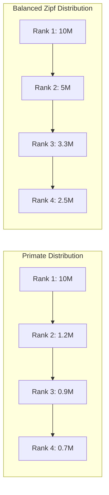

## Primate City Formation

### Definition and the Primacy Concept

A primate city is the largest city in a national or regional urban system that is disproportionately larger than the second-largest city, dominating the urban hierarchy in population, economic activity, and political-administrative function. The concept originates with geographer Mark Jefferson (1939), who observed that in many countries the largest city is not merely first in rank but "primate" in the sense of exerting outsized cultural, economic, and political dominance over the rest of the national territory.

Primacy is distinguished from the more general phenomenon of urban concentration by its relational character: it describes the *shape* of the city-size distribution (top-heavy) rather than the absolute level of urbanization.

**Key Points**

- Primacy is a property of the entire urban hierarchy, not a single city's size in isolation
- A country can be highly urbanized without exhibiting primacy (multiple similarly sized large cities), or lightly urbanized with strong primacy
- Primacy is most pronounced in smaller, poorer, and more centralized states; large federal economies (US, Germany, China) tend to exhibit flatter hierarchies

### Measuring Primacy

#### Primacy Index (Two-City Ratio)

$$PI = \frac{P_1}{P_2}$$

where $P_1$ is the population of the largest city and $P_2$ the population of the second-largest city. A ratio of 2 or higher is commonly treated as indicative of primacy; ratios exceeding 4-5 are considered extreme (e.g., Bangkok relative to Thailand's second city, or Lima relative to Arequipa).

#### Four-City Index (Modified Primacy Index)

To reduce sensitivity to idiosyncrasies of the single second-ranked city, an extended index is used:

$$PI_4 = \frac{P_1}{P_2 + P_3 + P_4}$$

A value above 1 indicates that the largest city alone exceeds the combined population of the next three cities.

#### Rank-Size Rule and Deviation from Zipf's Law

The rank-size rule, formalized by Zipf, predicts that in a well-integrated urban system:

$$P_r = \frac{P_1}{r^{q}}$$

where $P_r$ is the population of the city ranked $r$, $P_1$ is the largest city's population, and $q$ is the Zipf exponent (approximately 1 under the pure Zipf law). Taking logs linearizes this:

$$\ln(P_r) = \ln(P_1) - q \cdot \ln(r)$$

Estimating $q$ via OLS regression of $\ln(P_r)$ on $\ln(r)$ across a country's cities provides a continuous measure of hierarchy shape: $q < 1$ indicates a flatter-than-Zipf distribution (less primacy, more even spread of city sizes), while $q > 1$ indicates a steeper distribution consistent with strong primacy concentrated in the uppermost ranks.

**Example**

If a country's largest city has 10 million residents and its rank-size regression yields $q = 1.5$, the model predicts the second-ranked city at $10,000,000 / 2^{1.5} \approx 3.54$ million and the third-ranked city at $10,000,000/3^{1.5} \approx 1.92$ million — a much steeper drop-off than the $q=1$ benchmark, which would predict 5 million and 3.33 million respectively.

### Theoretical Explanations for Primacy

#### Colonial and Historical Path Dependence

Many primate cities in developing regions originated as colonial administrative or port centers designed to extract and export resources to the metropole, rather than to serve balanced internal trade networks. This created a hub-and-spoke transport and administrative infrastructure oriented toward a single gateway city (e.g., Lagos, Manila, Jakarta, Buenos Aires), with subsequent infrastructure investment reinforcing rather than correcting the initial concentration. **[Inference]** This is a widely cited explanation in urban and economic history literature; the magnitude of colonial-era path dependence relative to post-independence policy choices varies by case and is debated among economic historians.

#### Political Economy: Urban Bias and Capital-City Primacy

The "urban bias" thesis (associated with Michael Lipton) argues that developing-country governments systematically favor urban (often capital-city) interests in policy — subsidized food prices, disproportionate infrastructure spending, public sector employment concentration — because urban populations are more politically organized, geographically concentrated, and better able to mobilize collective action against the government than dispersed rural populations. This channels public investment and formal-sector job creation disproportionately into the primate city, creating a self-reinforcing migration pull.

Ades and Glaeser (1995) provide an influential empirical treatment linking primacy to political factors: countries with more centralized political systems (fewer democratic checks, less political stability requiring dispersed patronage) exhibit systematically higher primacy, controlling for economic factors such as trade openness and transport costs.

#### New Economic Geography: Core-Periphery Models

Krugman's core-periphery framework (New Economic Geography) provides a formal mechanism for self-reinforcing spatial concentration based on the interaction between increasing returns to scale, transport costs, and labor mobility. Firms prefer to locate in the larger market to exploit scale economies and access forward/backward linkages with other firms (a "home market effect"); workers prefer to locate where firms are, to access wider product variety and labor demand. This creates a circular causation:

$$\text{Firm concentration} \rightarrow \text{Larger local market} \rightarrow \text{Migration inflow} \rightarrow \text{Larger local market} \rightarrow \text{Further firm concentration}$$

The model predicts that below a critical threshold of transport costs, the economy "tips" into a core-periphery equilibrium where essentially all manufacturing activity agglomerates in one location. Above the threshold, dispersion is the stable equilibrium. This provides a mechanism by which countries with high internal transport costs (common in developing regions with underdeveloped internal road/rail networks) can be especially prone to a single dominant node, since only one location can support minimum efficient scale for many increasing-returns activities.

#### Harris-Todaro Migration and Primacy

The Harris-Todaro model of rural-urban migration under urban unemployment, when applied at the sub-national scale, predicts migration flows toward the location with the highest expected urban wage, defined as:

$$E[W_u] = \pi \cdot W_u^{formal}$$

where $\pi$ is the probability of obtaining formal urban employment and $W_u^{formal}$ is the formal-sector wage. If the primate city hosts a disproportionate share of formal-sector jobs (due to agglomeration and urban-biased investment), it exhibits both a higher $W_u^{formal}$ and, potentially, a higher $\pi$ due to job market thickness, making it the dominant migration destination even where crowding and informal-sector under-employment are severe.

#### Administrative Centralization

In unitary (non-federal) states, the concentration of central government ministries, judiciary, national media, and corporate headquarters requiring proximity to regulators in a single city creates a demand for face-to-face interaction (regulatory lobbying, licensing, court access) that pulls private-sector activity toward the capital even absent formal urban-bias policy. **[Inference]** federal systems with multiple state capitals appear empirically to dilute this channel by distributing administrative centrality across several cities, though isolating this effect from other confounds (federal countries also tend to be larger, richer, and more geographically dispersed) is methodologically difficult.

### Consequences of Primacy

#### Economic Consequences

**Key Points**

- **Agglomeration benefits concentrated in one location**: knowledge spillovers, labor market matching, and input-sharing benefits accrue disproportionately to primate-city firms and workers, potentially raising aggregate national productivity even as it produces regional inequality
- **Congestion costs**: beyond some threshold, marginal agglomeration benefits are offset by rising land prices, commuting times, pollution, and infrastructure strain — the classic agglomeration-diseconomy trade-off
- **Regional inequality**: secondary cities and rural regions experience relative (and sometimes absolute) stagnation, as capital, skilled labor, and public investment are drawn toward the primate city
- **Vulnerability/systemic risk**: national economic output becomes disproportionately exposed to shocks affecting the primate city specifically (natural disasters, infrastructure failure, political unrest), since a large share of GDP is spatially concentrated

#### Fiscal and Infrastructure Strain

Primate cities frequently experience infrastructure investment lagging population growth, since municipal revenue bases (particularly property taxation, discussed in the context of informal settlements) often fail to keep pace with in-migration, producing simultaneous overcrowding of formal infrastructure (transport, housing, utilities) and expansion of informal settlements at the urban fringe — connecting directly to slum formation dynamics as a spatial outcome of primacy.

#### Political Consequences

Concentration of population in a single city can increase the political salience and bargaining power of that city's residents (consistent with the urban bias thesis), while simultaneously creating a single point of political vulnerability for national governments, since large-scale urban unrest in the primate city has outsized capacity to threaten regime stability compared to dispersed unrest.

### Rank-Size Distribution Diagram

### Illustrative Chart: Rank-Size Curve Comparison (svg_diagram)

<svg xmlns="http://www.w3.org/2000/svg" viewBox="0 0 720 440" font-family="Arial, sans-serif">
<text x="360" y="28" text-anchor="middle" font-size="18" font-weight="bold">Rank-Size Curves: Primate vs. Balanced Hierarchy (svg_diagram)</text>
<line x1="90" y1="380" x2="680" y2="380" stroke="#333" stroke-width="2" />
<line x1="90" y1="380" x2="90" y2="60" stroke="#333" stroke-width="2" />
<text x="385" y="415" text-anchor="middle" font-size="13">City Rank</text>
<text x="35" y="220" text-anchor="middle" font-size="13" transform="rotate(-90 35 220)">Population (log scale)</text>
<circle cx="120" cy="90" r="5" fill="#d62728" />
<circle cx="220" cy="330" r="5" fill="#d62728" />
<circle cx="320" cy="350" r="5" fill="#d62728" />
<circle cx="420" cy="360" r="5" fill="#d62728" />
<circle cx="520" cy="366" r="5" fill="#d62728" />
<path d="M 120 90 L 220 330 L 320 350 L 420 360 L 520 366" stroke="#d62728" stroke-width="2.5" fill="none" />
<text x="530" y="366" font-size="12" fill="#d62728">Primate hierarchy (q &gt; 1)</text>
<circle cx="120" cy="90" r="5" fill="#1f77b4" />
<circle cx="220" cy="160" r="5" fill="#1f77b4" />
<circle cx="320" cy="205" r="5" fill="#1f77b4" />
<circle cx="420" cy="238" r="5" fill="#1f77b4" />
<circle cx="520" cy="263" r="5" fill="#1f77b4" />
<path d="M 120 90 L 220 160 L 320 205 L 420 238 L 520 263" stroke="#1f77b4" stroke-width="2.5" fill="none" />
<text x="530" y="263" font-size="12" fill="#1f77b4">Balanced Zipf hierarchy (q = 1)</text>

<text x="110" y="400" font-size="11">1</text>

<text x="210" y="400" font-size="11">2</text>

<text x="310" y="400" font-size="11">3</text>

<text x="410" y="400" font-size="11">4</text>

<text x="510" y="400" font-size="11">5</text>

</svg>

### Regional Illustrations

**Example**

- **Bangkok, Thailand**: Frequently cited as one of the most extreme primacy cases historically, with population many multiples of Thailand's second-largest city (Nonthaburi/Nakhon Ratchasima depending on metro definition), attributed to centralized monarchy/administrative history and concentrated infrastructure investment
- **Lima, Peru**: Hosts roughly a third of Peru's national population within its metropolitan area, reflecting both colonial port-capital path dependence and 20th-century rural violence-driven migration waves
- **Manila, Philippines**: Metro Manila's dominance reflects Spanish and American colonial administrative concentration compounded by post-independence industrial policy centered on the capital region
- **Buenos Aires, Argentina**: Reflects the historic "head of Janus" port-capital model common across Latin America, where the primate city functioned as the export gateway to global markets under commodity-export-led growth models

**[Unverified — precise current population ratios change with each census/estimate cycle; verify current figures against latest national statistics offices or UN World Urbanization Prospects data for citation-grade precision]**

#### Counter-Examples: Countries Without Strong Primacy

- **China**: A vast, historically administratively fragmented territory with multiple regional economic cores (Beijing, Shanghai, Guangzhou/Shenzhen), reflecting both geographic scale and deliberate regional development policy
- **Germany**: Federal structure with historical polycentrism predating unification (Berlin, Munich, Hamburg, Frankfurt, Cologne as distinct economic centers)
- **India**: Large enough and federally structured enough to support multiple major metropolitan poles (Mumbai, Delhi, Bangalore, Kolkata, Chennai) despite overall high urban primacy at the state level in several states

### Policy Responses to Excessive Primacy

**Key Points**

1. **Capital relocation/new capital construction**: Physically moving the seat of government to a new or secondary city (e.g., Brasília relocating Brazil's capital from Rio de Janeiro, Abuja replacing Lagos in Nigeria, Naypyidaw replacing Yangon in Myanmar, and the ongoing Nusantara project intended to relocate Indonesia's capital from Jakarta to East Kalimantan). Rationale is to decouple political-administrative centrality from the dominant economic city and stimulate a secondary growth pole. **[Inference]** Empirical evidence on whether capital relocation successfully redistributes broader economic activity (versus merely relocating government employment) is mixed; effects depend heavily on whether private-sector linkages follow the administrative move.
2. **Secondary city development/growth pole strategies**: Deliberate public investment (infrastructure, special economic zones, decentralized higher education and health facilities) targeted at selected secondary cities to create alternative agglomeration nodes, drawing on Perroux's growth pole theory.
3. **Regional decentralization of fiscal and administrative authority**: Devolving budgetary and regulatory authority to sub-national/regional governments, reducing the necessity of face-to-face proximity to central authority for business operation.
4. **Transport infrastructure investment in the secondary network**: Reducing internal transport costs between non-primate cities directly targets the New Economic Geography mechanism, potentially shifting the economy from a tipped core-periphery equilibrium toward a more dispersed one if transport-cost thresholds are crossed.
5. **Land-use and industrial location policy**: Restrictions or disincentives on new industrial/commercial licensing within the primate city combined with incentives for secondary-city location (used historically in South Korea's efforts to develop cities beyond Seoul, and various Chinese regional development programs).

**[Inference]** The empirical track record of deliberate anti-primacy policy is mixed and context-dependent; agglomeration forces favoring the primate city are often strong enough that policy interventions produce only modest redistribution unless paired with substantial and sustained investment differentials favoring secondary locations.

### Distinguishing Primacy From Related Concepts

| Concept | Definition | Relationship to Primacy |
| --- | --- | --- |
| Urbanization rate | Share of national population in urban areas | Independent dimension; primacy concerns *distribution* among cities, not the urban share itself |
| Urban concentration | General clustering of population/activity in cities | Primacy is a specific top-heavy form of concentration |
| Megacity | City exceeding 10 million population (absolute threshold) | A primate city is often but not necessarily a megacity; megacity status is absolute, primacy is relative to the national hierarchy |
| Metropolitanization | Expansion of a city's functional/commuting region | Can occur with or without primacy; concerns city boundary definition, not hierarchy shape |

### Related Topics

- Rank-size rule and Zipf's Law in economic geography
- New Economic Geography and Krugman's core-periphery model
- Harris-Todaro model of rural-urban migration
- Urban bias thesis and political economy of development
- Agglomeration economies and diseconomies
- Growth pole theory (Perroux)
- Capital city relocation case studies
- Informal settlements and slums as spatial consequences of unmanaged urban primacy
- Colonial urban systems and post-colonial spatial path dependence
- Secondary city development and decentralization policy