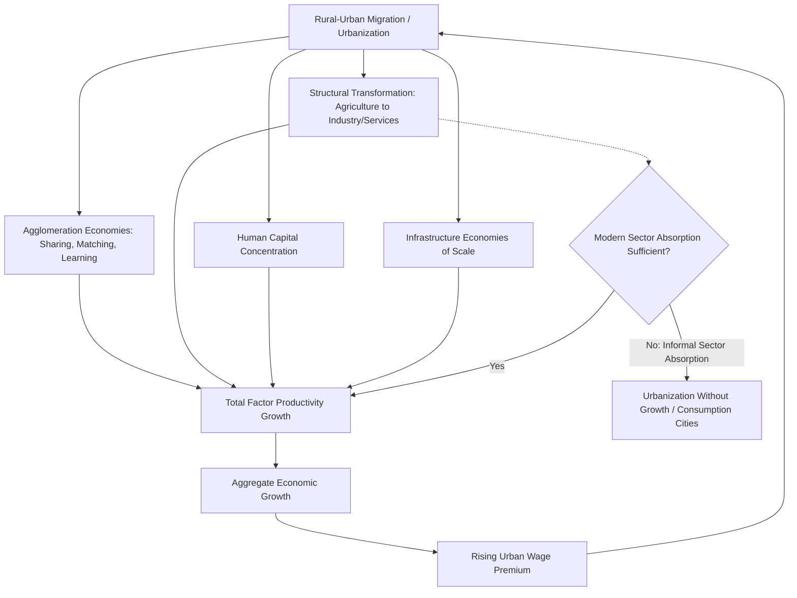

## Urbanization and Economic Growth Linkages

### Conceptual Overview

The relationship between urbanization and economic growth is one of the most robust stylized facts in development economics: across countries and over time, urbanization rates and per-capita income are strongly positively correlated. However, the direction of causation, the mechanisms linking the two, and the conditions under which urbanization translates into sustained growth (versus urbanization without accompanying growth, sometimes termed "urbanization of poverty") remain actively debated. This topic examines the theoretical channels, empirical evidence, and boundary conditions of the urbanization-growth relationship.

**Key Points**

- Urbanization and growth are correlated but the causal direction runs in both directions and through multiple channels
- The relationship is not deterministic: some regions urbanize without commensurate growth ("urbanization without growth" or "premature urbanization")
- Sectoral composition of urban economic activity mediates the strength of the linkage

### The Empirical Regularity

Cross-country data consistently show that no country has reached high-income status without substantial urbanization, and urbanization rate is one of the strongest single predictors of GDP per capita in cross-sectional growth regressions. Historically, in currently high-income countries, urbanization and industrialization proceeded together during the 19th and 20th centuries; in many contemporary developing regions (parts of Sub-Saharan Africa, and to a lesser extent South Asia), urbanization has occurred at rates outpacing manufacturing-sector job growth, generating urban populations concentrated in low-productivity informal services rather than higher-productivity industrial employment.

**[Unverified — precise correlation coefficients and current cross-country regression estimates change with each data vintage; verify against current World Bank/UN World Urbanization Prospects releases for citation-grade figures]**

### Theoretical Channels Linking Urbanization to Growth

#### 1. Agglomeration Economies

Urban density enables three canonical categories of agglomeration economy, following Marshall's (1890) original taxonomy as formalized in modern urban economics (Duranton and Puga's classification):

- **Sharing**: firms and workers share indivisible infrastructure, specialized input suppliers, and risk-pooling labor markets, reducing per-unit costs that would be prohibitive at low density
- **Matching**: thick labor markets improve the quality and speed of matches between workers' skills and firms' requirements, reducing search frictions and mismatch
- **Learning**: spatial proximity facilitates knowledge spillovers, tacit knowledge transfer, and innovation diffusion, consistent with Jacobs (1969) externalities operating across diverse industries in dense cities

These mechanisms raise total factor productivity as a function of city size or density, often represented in urban economics as an agglomeration elasticity: a doubling of city population associated with output-per-worker gains typically estimated in the range of 3-8% in the empirical literature, though estimates vary substantially by context, sector, and identification strategy. **[Inference]** This elasticity range is a widely cited empirical benchmark from the agglomeration literature (e.g., Rosenthal and Strange's survey work), but should be treated as indicative rather than a universal constant, since estimates are sensitive to controls for worker selection and reverse causation.

#### 2. Structural Transformation

Urbanization is functionally linked to structural transformation: the reallocation of labor and output from agriculture to manufacturing and services. The Lewis (1954) dual-sector model formalizes this as labor moving from a low-marginal-product traditional (rural/agricultural) sector to a higher-productivity modern (urban/industrial) sector, driven by a wage gap:

$$W_u > W_r + C_m$$

where $W_u$ is the urban wage, $W_r$ the rural wage, and $C_m$ the cost of migration. As labor reallocates, aggregate output rises because the marginal product of labor is higher in the receiving (urban/modern) sector, at least while rural labor has near-zero or low marginal product (the "surplus labor" condition).

The strength of the urbanization-growth linkage under this channel depends critically on whether urban in-migrants are absorbed into productive modern-sector employment or into low-productivity urban informal activity that does not meaningfully exceed rural marginal product — the central concern of the "urbanization without growth" critique (see below).

#### 3. Human Capital Accumulation and Spillovers

Cities facilitate human capital accumulation through denser concentrations of educational institutions, easier access to specialized training, and peer effects in skill formation. Lucas (1988) formalized human capital externalities as a growth mechanism; urban density is the primary spatial vehicle through which such externalities are realized, since human capital spillovers require proximity for effect.

#### 4. Infrastructure and Public Service Economies of Scale

Per-capita costs of providing infrastructure (piped water, electricity grids, paved roads, telecommunications) and public services (healthcare, education) decline with population density up to a point, due to shared fixed costs. This allows urban areas to achieve higher service quality per unit of public expenditure than dispersed rural populations, feeding back into productivity and human capital channels.

#### 5. Market Size and Innovation

Larger urban markets support finer specialization (following Adam Smith's dictum that the division of labor is limited by the extent of the market) and provide the scale needed to justify fixed costs of innovation and product development, consistent with endogenous growth models (Romer, 1986, 1990) in which technological change is driven by intentional investment that requires sufficient market size to be profitable.

### Formal Representation: Urbanization in an Aggregate Production Function

A standard way to incorporate urbanization into a growth-accounting framework treats urban agglomeration as augmenting total factor productivity:

$$Y = A(u) \cdot K^{\alpha} L^{1-\alpha}$$

where $u$ is the urbanization rate and $A(u)$ is increasing in $u$ up to a congestion threshold, reflecting the net balance of agglomeration benefits against congestion costs (commuting, pollution, land price escalation). Differentiating:

$$\frac{\partial A}{\partial u} > 0 \quad \text{for } u < u^*, \quad \frac{\partial A}{\partial u} < 0 \quad \text{for } u > u^*$$

where $u^*$ is the productivity-maximizing urbanization/density level given the existing state of transport and communication technology. This threshold is not fixed: improvements in transport infrastructure and digital communication technology raise $u^*$ over time by mitigating congestion costs.

### The "Urbanization Without Growth" Critique

Gollin, Jedwab, and Vollrath (2016) provide an influential empirical challenge to the presumed universality of the urbanization-growth linkage, documenting that urbanization in many resource-rich and agriculturally-dependent developing countries is driven substantially by natural-resource rents and consumption-city dynamics rather than by manufacturing-led structural transformation. In this pattern, urban population growth is financed by resource export revenue that supports urban consumption and services employment without a corresponding expansion of tradable, productivity-raising urban production. Cities in this pattern function as "consumption cities" rather than "production cities."

**[Inference]** This is a well-established finding in the development economics literature but the classification of any specific country's urbanization pattern (resource-driven consumption city vs. manufacturing-driven production city) is a matter of ongoing empirical assessment and can shift with the commodity cycle and industrial policy changes.

This critique implies that policy-makers should not treat urbanization rate itself as a growth-promoting target; the *composition* of urban economic activity — specifically whether cities host tradable, productivity-growing sectors — determines whether urbanization translates into aggregate growth.

### Causality: Disentangling Direction

Three broad causal hypotheses have been advanced in the empirical literature:

1. **Urbanization causes growth** (agglomeration/structural transformation channels above)
2. **Growth causes urbanization** (rising incomes shift consumption toward urban-produced goods and services, and rising agricultural productivity releases rural labor — a demand-pull and supply-push combination)
3. **Both are jointly caused by a third factor** (e.g., institutional quality, trade openness, or technological change simultaneously drive both urbanization and growth, generating correlation without either directly causing the other)

Empirical identification strategies used to address this include:

- Instrumental variables based on historical/geographic determinants of urban location (e.g., coastal access, colonial-era transport infrastructure) uncorrelated with contemporary growth shocks
- Natural experiments from policy-driven urbanization episodes (e.g., Chinese hukou reform studies)
- Panel data with country/region fixed effects to control for time-invariant confounds, combined with lagged urbanization measures to assess predictive (Granger-type) relationships

**[Inference]** No single identification strategy in this literature is universally accepted as fully resolving reverse causality concerns; findings should be read as suggestive of causal channels operating in both directions with country-specific relative strength.

### Diagram: Causal Channels Linking Urbanization and Growth

### Illustrative Chart: Stylized Urbanization-Income Relationship (svg_diagram)

<svg xmlns="http://www.w3.org/2000/svg" viewBox="0 0 720 440" font-family="Arial, sans-serif">
<text x="360" y="28" text-anchor="middle" font-size="18" font-weight="bold">Urbanization Rate vs. GDP per Capita (svg_diagram)</text>
<line x1="90" y1="380" x2="680" y2="380" stroke="#333" stroke-width="2" />
<line x1="90" y1="380" x2="90" y2="60" stroke="#333" stroke-width="2" />
<text x="385" y="415" text-anchor="middle" font-size="13">Urbanization Rate (%)</text>
<text x="35" y="220" text-anchor="middle" font-size="13" transform="rotate(-90 35 220)">GDP per Capita (log scale)</text>
<circle cx="130" cy="350" r="5" fill="#1f77b4" />
<circle cx="180" cy="330" r="5" fill="#1f77b4" />
<circle cx="230" cy="300" r="5" fill="#1f77b4" />
<circle cx="290" cy="270" r="5" fill="#1f77b4" />
<circle cx="350" cy="230" r="5" fill="#1f77b4" />
<circle cx="410" cy="200" r="5" fill="#1f77b4" />
<circle cx="470" cy="160" r="5" fill="#1f77b4" />
<circle cx="530" cy="130" r="5" fill="#1f77b4" />
<circle cx="590" cy="100" r="5" fill="#1f77b4" />
<circle cx="640" cy="80" r="5" fill="#1f77b4" />
<path d="M 130 350 Q 400 340 640 80" stroke="#1f77b4" stroke-width="2.5" fill="none" stroke-dasharray="0" />
<text x="440" y="340" font-size="12" fill="#1f77b4">Typical cross-country trend</text>
<circle cx="380" cy="330" r="5" fill="#d62728" />
<circle cx="440" cy="320" r="5" fill="#d62728" />
<circle cx="500" cy="315" r="5" fill="#d62728" />
<text x="410" y="360" font-size="11" fill="#d62728">"Urbanization without growth" outliers</text>
<text x="410" y="374" font-size="11" fill="#d62728">(resource-driven consumption cities)</text>
</svg>

### Sectoral Composition Matters: Production Cities vs. Consumption Cities

| Feature | Production City | Consumption City |
| --- | --- | --- |
| Dominant urban economic base | Tradable manufacturing/export services | Non-tradable services financed by resource rents or remittances |
| Employment absorption | Formal sector, rising productivity | Informal sector, low productivity |
| Growth linkage | Strong: matches theoretical agglomeration/structural transformation channels | Weak/absent: urban growth decoupled from productivity growth |
| Historical examples (illustrative, not exhaustive) | East Asian export-manufacturing hubs during rapid industrialization | Various resource-exporting African and Latin American capital cities during commodity booms |
| Policy implication | Support agglomeration and firm-level productivity growth | Address underlying resource-rent dependence and diversify tradable sector base |

**[Inference]** This dichotomy, drawn from the Gollin-Jedwab-Vollrath framework, represents stylized poles; most real cities exhibit a mix of production and consumption city characteristics rather than falling cleanly into one category.

### Regional Patterns

**Example**

- **East Asia (historical)**: Urbanization proceeded largely in tandem with export-oriented manufacturing growth (South Korea, Taiwan, later coastal China), consistent with the classical growth-linkage channels, supported by deliberate industrial policy, infrastructure investment, and human capital formation
- **Sub-Saharan Africa**: Several countries have urbanized at rates exceeding what manufacturing employment growth would predict, with urban economies weighted toward informal trade and services; this pattern underlies much of the "urbanization without growth" empirical literature
- **Latin America**: Urbanization occurred earlier and reached higher levels than income levels would typically predict (a legacy of import-substitution industrialization policies and rural-urban migration driven partly by land tenure conflict and violence rather than pure wage-differential pull), producing large service-sector-dominated cities with substantial informal employment shares

### Congestion and the Limits of the Growth-Urbanization Linkage

Beyond the productivity-maximizing density threshold discussed above, further urbanization can impose costs that offset or exceed agglomeration benefits:

- **Housing cost escalation**: land price increases can outpace wage gains, reducing real income gains from urban agglomeration (connects to housing supply elasticity discussed in the informal settlements context)
- **Traffic congestion and commuting time costs**: reduce effective labor supply and quality of life
- **Environmental and health externalities**: air pollution, inadequate sanitation infrastructure at scale (connects to slum/informal settlement consequences)
- **Political and social instability risk**: concentrated urban populations facing unmet expectations can generate social unrest, particularly acute in the "urbanization without growth" pattern where migrants arrive expecting formal-sector opportunities that do not materialize at sufficient scale

### Policy Implications

**Key Points**

1. **Complementary investment is necessary, not sufficient**: policies promoting urbanization (infrastructure, migration facilitation) should be paired with policies supporting tradable-sector productivity growth (industrial policy, trade facilitation, skills development) to ensure the structural-transformation channel is activated rather than urbanization outpacing productive job creation
2. **Avoid urbanization as a standalone target**: given the consumption-city critique, urbanization rate alone is a poor proxy for development progress; sectoral composition of urban employment and urban TFP growth are more informative
3. **Manage congestion proactively**: transport and housing supply investment should scale with urban population growth to sustain net agglomeration benefits and prevent the productivity-maximizing threshold $u^*$ from being exceeded
4. **Secondary city and spatial policy coordination**: connects to primate city policy discussion — concentrated primacy can either amplify agglomeration benefits (single large productive hub) or amplify congestion costs, depending on whether the primate city's economic base is production- or consumption-oriented

### Related Topics

- Agglomeration economies: sharing, matching, and learning mechanisms
- Lewis dual-sector model and structural transformation
- Harris-Todaro migration model
- Endogenous growth theory (Romer, Lucas) and urban human capital
- Primate city formation and spatial concentration
- Informal settlements as a symptom of urbanization-growth decoupling
- Consumption cities vs. production cities (Gollin-Jedwab-Vollrath framework)
- Infrastructure economies of scale in service provision
- Congestion costs and optimal city size
- Structural transformation and sectoral employment shares