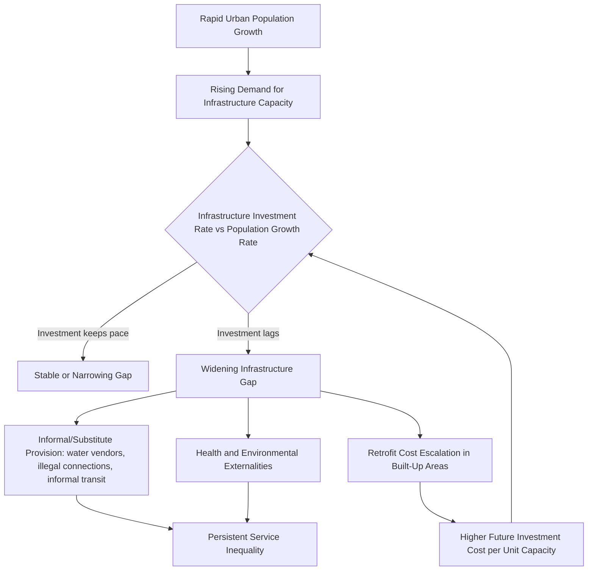

## Infrastructure Gaps in Rapidly Urbanizing Cities

### Conceptual Overview

An infrastructure gap refers to the shortfall between the stock and quality of infrastructure a city requires to support its population and economic activity at an adequate service level, and the infrastructure actually provided. In rapidly urbanizing cities — where population growth rates exceed the pace at which infrastructure capital can be planned, financed, and constructed — this gap widens continuously rather than closing, producing a structural lag rather than a temporary shortage. This topic covers the economic mechanisms generating infrastructure gaps, their measurement, sectoral manifestations, financing constraints, and policy responses.

**Key Points**

- Infrastructure gaps arise from a mismatch between the *stock adjustment speed* of capital-intensive infrastructure and the *flow speed* of urban population growth
- Gaps are not uniform across infrastructure types; network infrastructure (water, sewerage, electricity grids) faces different constraints than social infrastructure (schools, clinics) or transport
- The gap is both a stock problem (insufficient capacity) and a maintenance problem (existing infrastructure deteriorating faster than it is renewed)

### The Economics of Infrastructure Lag

#### Capital Stock Adjustment and Population Flow Mismatch

Infrastructure investment follows a capital stock adjustment process, whereas urban population growth (particularly migration-driven growth) can be comparatively immediate. Let $K_t$ denote the infrastructure capital stock required to serve population $N_t$ at a target service standard $s$:

$$K_t^* = s \cdot N_t$$

Actual capital stock $K_t$ adjusts toward the target with a lag governed by planning, financing, and construction time $\tau$:

$$K_t = K_{t-\tau} + I_{t-\tau}$$

where $I$ is gross investment. If population grows at rate $g_N$ and infrastructure investment capacity grows at rate $g_I < g_N$, the service-standard-adjusted infrastructure gap $G_t$ widens over time:

$$G_t = K_t^* - K_t = s \cdot N_t - K_t$$

$$\frac{dG_t}{dt} \approx s \cdot N_t \cdot g_N - I_t$$

This formalizes the core problem: whenever population-driven demand for infrastructure capacity grows faster than the rate at which infrastructure can be financed and built, the gap is structurally widening rather than a one-time deficit to be closed.

**Example**

A city growing at 5% annually needs to expand piped water network capacity by roughly 5% per year merely to maintain current per-capita coverage. If municipal capital budgets (constrained by property tax base growth, discussed under primate city and slum topics) grow at only 2% annually, the coverage ratio necessarily declines over time even without any nominal reduction in infrastructure spending.

#### Lumpiness and Indivisibility of Infrastructure Investment

Unlike many forms of capital, core network infrastructure (trunk water mains, sewage treatment plants, arterial roads, power substations) exhibits strong indivisibilities: minimum efficient scale requires large discrete investments rather than smooth incremental additions. This creates a mismatch with incremental, unplanned urban growth (particularly informal settlement expansion), since a trunk sewer line sized for a planned population cannot easily or cheaply be resized upward once a settlement has developed organically around it. Retrofitting infrastructure into already-built-up areas is substantially more expensive than installing it during initial development — a cost differential frequently cited in urban planning economics as the "cost of retrofitting versus building ahead of need."

#### Externalities and Under-Provision

Much infrastructure has public-good or quasi-public-good characteristics (non-rival and/or non-excludable within some range, e.g., drainage systems, road networks below congestion thresholds), meaning private markets systematically under-provide it relative to the social optimum absent public intervention or well-designed user-fee/regulatory mechanisms. This is compounded in rapidly urbanizing cities by weak municipal fiscal capacity, discussed below.

### Sectoral Manifestations of Infrastructure Gaps

#### Water and Sanitation

Piped water and sewerage networks are capital-intensive, spatially fixed, and technically difficult to extend incrementally into informally-developed areas with irregular plot layouts. Gaps manifest as: reliance on water vendors/tanker trucks at substantially higher per-liter cost than piped water (a well-documented "poverty penalty" in water access), pit latrines or open defecation in unserved areas, and groundwater contamination from inadequate sewerage.

#### Electricity

Grid extension lags population growth similarly, though electricity exhibits somewhat greater incremental extensibility than water/sewerage (distribution lines can be extended more flexibly than gravity-fed sewer networks). Common manifestations include informal/illegal grid connections, high transmission and distribution losses in underinvested networks, and load-shedding/rationing during demand peaks.

#### Transport

Road network capacity and public transit provision in rapidly urbanizing cities frequently fail to keep pace with both population growth and rising vehicle ownership associated with rising incomes, producing severe congestion. The economic cost is compounded because transport infrastructure exhibits strong path dependence: land development patterns lock in around whatever road network exists at the time of construction, making later retrofitting of mass transit corridors through already-dense built environments extremely costly (right-of-way acquisition costs escalate with existing development density).

#### Solid Waste Management

Collection and disposal capacity frequently lags waste generation growth (itself rising with both population and per-capita income), producing informal dumping, uncollected waste accumulation (with associated public health and drainage-blockage externalities), and reliance on informal waste-picker economies as a de facto (if inadequate) substitute for formal collection systems.

#### Social Infrastructure

Schools, health clinics, and other social infrastructure face similar capital-lag dynamics; unlike network infrastructure, however, social infrastructure can sometimes be scaled through operational adjustments (double shifts in schools, temporary clinic facilities) that provide a partial, lower-quality substitute for capital expansion in the short run.

### Diagram: Infrastructure Gap Dynamics

### Financing Constraints: The Municipal Fiscal Gap

#### Weak Own-Source Revenue Base

As discussed in the context of informal settlements, rapidly urbanizing cities frequently have large shares of their population and land area outside the formal property tax base, either due to informal tenure or outdated/unenforced property valuation systems. This constrains the primary theoretically-appropriate financing instrument for local infrastructure (property taxation, justified by the benefit principle since infrastructure investment capitalizes into land values).

#### Intergovernmental Transfer Dependence

Many rapidly urbanizing cities, particularly in unitary/centralized states, rely heavily on transfers from national government rather than own-source revenue, creating a financing relationship subject to national fiscal priorities and political bargaining rather than local infrastructure need, and often insufficiently indexed to local population growth rates.

#### Access to Capital Markets

Municipal borrowing for infrastructure (municipal bonds, development bank loans) requires creditworthiness that is frequently constrained in rapidly urbanizing developing-country cities by: weak revenue collection track records, absence of independent credit ratings, national government restrictions on sub-national borrowing (common where national governments fear contingent liability exposure), and thin domestic capital markets for long-duration municipal debt instruments.

#### Land Value Capture as a Financing Instrument

Given constraints on conventional property taxation, land value capture instruments have gained policy attention as an alternative financing mechanism: since infrastructure investment (e.g., a new transit line) capitalizes into adjacent land values, mechanisms can be designed to capture a portion of this value increase to fund the infrastructure itself.

$$\Delta LV = f(\text{Accessibility Improvement}, \text{Existing Land Use Regulation})$$

Common instruments include:

- **Betterment levies**: one-time charges on landowners benefiting from a specific infrastructure improvement
- **Tax increment financing**: bonds issued against projected future property tax revenue increases in a defined district following infrastructure investment
- **Development impact fees**: charges on new development calibrated to the marginal infrastructure cost the development imposes
- **Value capture through land readjustment**: landowners contribute land area in exchange for improved infrastructure and resulting higher post-development land values (used historically in Japanese and Korean urban development)

**[Inference]** Land value capture instruments are theoretically well-grounded in the benefit-principle logic of infrastructure finance, but their practical revenue yield is sensitive to land market transparency, valuation capacity, and legal/administrative capacity to implement and enforce the relevant charges — capacities that are often themselves limited in the same rapidly urbanizing cities that most need alternative financing tools.

### Measuring Infrastructure Gaps

| Approach | Description | Limitation |
| --- | --- | --- |
| Coverage ratio gap | Share of population lacking access to a defined service standard (e.g., piped water) | Binary access measures may mask quality/reliability gaps among the "covered" |
| Investment needs estimation | Bottom-up engineering estimates of capital required to reach a target coverage/quality standard by a target date | Sensitive to assumed unit costs and target standards, which vary widely across studies |
| Quality-adjusted service gap | Incorporates reliability (e.g., hours of water supply per day, outage frequency) rather than binary access | Data-intensive; often unavailable at scale for rapidly urbanizing cities |
| Fiscal gap | Difference between estimated infrastructure investment need and realistic revenue/financing capacity | Requires assumptions about future revenue growth and borrowing capacity |

**[Unverified — precise global or regional infrastructure investment gap estimates (e.g., frequently cited figures from international financial institutions) change with each study cycle and depend heavily on methodology and target standards; verify current figures against the latest primary source before citing specific dollar amounts]**

### Illustrative Chart: Widening Infrastructure Gap Over Time (svg_diagram)

<svg xmlns="http://www.w3.org/2000/svg" viewBox="0 0 720 440" font-family="Arial, sans-serif">
<text x="360" y="28" text-anchor="middle" font-size="18" font-weight="bold">Infrastructure Capacity vs. Population-Driven Demand (svg_diagram)</text>
<line x1="90" y1="380" x2="680" y2="380" stroke="#333" stroke-width="2" />
<line x1="90" y1="380" x2="90" y2="60" stroke="#333" stroke-width="2" />
<text x="385" y="415" text-anchor="middle" font-size="13">Time</text>
<text x="35" y="220" text-anchor="middle" font-size="13" transform="rotate(-90 35 220)">Infrastructure Capacity Units</text>
<path d="M 100 340 Q 300 260 640 100" stroke="#d62728" stroke-width="3" fill="none" />
<text x="440" y="150" font-size="12" fill="#d62728">Required capacity (population-driven demand)</text>
<path d="M 100 340 Q 300 300 640 220" stroke="#1f77b4" stroke-width="3" fill="none" />
<text x="440" y="255" font-size="12" fill="#1f77b4">Actual infrastructure capacity (investment-constrained)</text>
<line x1="640" y1="100" x2="640" y2="220" stroke="#333" stroke-width="1.5" stroke-dasharray="4,3" />
<text x="650" y="165" font-size="12" font-weight="bold">Gap</text>
<line x1="300" y1="270" x2="300" y2="290" stroke="#333" stroke-width="1.5" stroke-dasharray="4,3" />
<text x="305" y="285" font-size="11">Smaller early gap</text>
</svg>

### Consequences of Persistent Infrastructure Gaps

**Key Points**

- **Productivity losses**: unreliable electricity and congested transport directly raise firm operating costs and reduce effective labor market access, dampening the agglomeration benefits discussed under urbanization-growth linkages
- **Health externalities**: inadequate water/sanitation infrastructure drives waterborne disease burden, disproportionately affecting infants and children, with long-run human capital consequences
- **Reinforcement of informality**: infrastructure gaps are both a cause and consequence of informal settlement expansion (see Informal Settlements and Slums), since areas lacking planned infrastructure develop organically without regard to future service-provision feasibility, and are subsequently costlier to retrofit
- **Distributional effects**: infrastructure access gaps frequently correlate with income, with poorer/informal areas facing both the lowest access and the highest effective marginal cost of substitute provision (private water vendors, generator-based electricity), producing a regressive "poverty penalty" in service costs

### Policy Responses

**Key Points**

1. **Anticipatory/proactive infrastructure investment**: extending trunk infrastructure into peripheral areas ahead of anticipated development, reducing future retrofit costs, contingent on accurate growth forecasting and available upfront capital
2. **Incremental and appropriate-technology infrastructure standards**: adopting lower-cost, incrementally upgradable infrastructure standards (e.g., condominial sewerage systems, small-bore sanitation) suited to informal and low-income areas rather than requiring full formal-standard infrastructure as a precondition for any service provision
3. **Municipal fiscal reform**: property tax base modernization (updated cadastral mapping, valuation reform), improved collection enforcement, and expanded use of land value capture instruments
4. **Public-private partnerships and blended finance**: leveraging private capital and operational expertise for specific infrastructure sub-sectors (e.g., water utility management contracts, toll road concessions), subject to appropriate regulatory design to manage natural monopoly and affordability concerns
5. **Decentralized/off-grid solutions**: distributed solutions (solar mini-grids, decentralized wastewater treatment, community-managed water points) that can be deployed faster and at lower upfront capital cost than centralized network extension, serving as a bridge or permanent alternative where centralized infrastructure extension is not imminently feasible
6. **Regional/metropolitan governance coordination**: addressing the common mismatch between administrative jurisdiction boundaries and the actual metropolitan functional area, which can fragment infrastructure planning and financing responsibility across multiple under-resourced local governments

### Infrastructure Standards Trade-off

| Approach | Upfront Cost | Coverage Speed | Long-run Efficiency | Suitability for Informal Areas |
| --- | --- | --- | --- | --- |
| Full formal-standard network extension | High | Slow | High (durable, low unit operating cost) | Low (requires stable plot layout, financing lead time) |
| Incremental/appropriate technology | Low-moderate | Fast | Moderate (may require eventual upgrade) | High |
| Decentralized/off-grid | Low-moderate | Fast | Variable (depends on technology and maintenance capacity) | High |
| Informal/private substitute provision (status quo absent intervention) | N/A (privately borne) | N/A (already exists) | Low (high per-unit cost, no economies of scale) | De facto but inequitable |

### Related Topics

- Informal settlements and slums: infrastructure deprivation as a defining criterion
- Municipal finance and property taxation capacity
- Land value capture instruments and benefit-principle infrastructure finance
- Urbanization and economic growth linkages: agglomeration and congestion thresholds
- Public-private partnerships in urban service delivery
- Metropolitan governance and jurisdictional fragmentation
- Transport economics and urban congestion
- Water and sanitation economics (natural monopoly regulation)
- Climate resilience and infrastructure planning in rapidly urbanizing cities
- Appropriate technology and incremental infrastructure standards