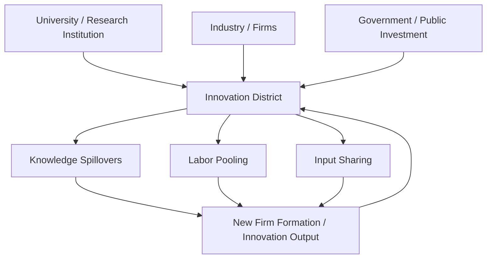

## Innovation Districts and Knowledge Clusters

### Definition and Conceptual Distinction

**Knowledge clusters** are geographic concentrations of interconnected firms, research institutions, and specialized labor within a related technology or industry domain, whose spatial proximity generates productivity and innovation benefits exceeding what isolated firms could achieve. **Innovation districts** are a more specific and typically more deliberately planned urban form: geographically compact areas, usually within or adjacent to a city's urban core, that combine anchor research institutions (universities, hospitals, corporate R&D), a critical mass of innovation-oriented firms (often startups and scale-ups), and mixed-use urban amenities (housing, retail, transit) designed to support dense, walkable, live-work-play environments for a knowledge-economy workforce.

The Brookings Institution's influential 2014 framework (Katz and Wagner) formalized the innovation district concept as distinct from earlier suburban science parks, emphasizing three core assets:

- **Economic assets**: firms, institutions, and organizations that drive innovation activity
- **Physical assets**: public and private spaces (labs, offices, housing, transit, public realm) that support density and connectivity
- **Networking assets**: relationships and collaboration mechanisms (formal and informal) that build trust and facilitate knowledge exchange between actors

**Key Points**

- Knowledge clusters are a broader economic geography concept (can be suburban, exurban, or urban)
- Innovation districts are specifically urban, dense, and mixed-use by design
- Not all knowledge clusters are innovation districts (e.g., traditional suburban science/research parks with segregated single-use zoning are clusters but not districts in the Brookings sense)

### Theoretical Foundations

#### Marshallian Agglomeration and Localization Economies

The theoretical starting point is Alfred Marshall's (1890) analysis of industrial districts, identifying three sources of localization economies (agglomeration benefits specific to firms within the *same* industry, as opposed to Jacobs' cross-industry externalities discussed under urbanization-growth linkages):

1. **Labor market pooling**: concentration of specialized workers reduces search costs for both firms and workers and provides insurance against firm-specific demand shocks
2. **Input sharing**: specialized suppliers, equipment, and services achieve minimum efficient scale only where sufficient local demand from co-located firms exists
3. **Knowledge spillovers**: proximity facilitates the transfer of tacit, uncodified knowledge that cannot be efficiently transmitted through formal (arm's-length, non-local) channels

Formally, localization economies can be represented as an addition to firm-level or establishment-level productivity as a function of same-industry employment density within a defined radius:

$$\ln(TFP_i) = \beta_0 + \beta_1 \ln(\text{Same-industry employment density}_i) + \beta_2 X_i + \varepsilon_i$$

where $\beta_1 > 0$ captures the localization elasticity. **[Inference]** Empirical estimates of $\beta_1$ vary substantially by industry and geography; knowledge-intensive and R&D-oriented industries have generally been found in the literature to exhibit larger localization/agglomeration elasticities than routine manufacturing, consistent with the tacit-knowledge-spillover mechanism being especially important where knowledge is uncodified and rapidly evolving.

#### Jacobs Externalities and Diversity

Where Marshallian externalities operate *within* an industry, Jane Jacobs (1969) argued that innovation is disproportionately generated by *cross-industry* interaction: diverse urban environments juxtaposing unrelated economic activities generate novel recombination of ideas that specialized, single-industry clusters cannot replicate. Innovation districts, by deliberately mixing research institutions, firms across sectors, and urban amenities within a compact area, are partly designed to capture Jacobs-type externalities in addition to Marshallian localization economies — a key distinguishing rationale relative to single-industry science parks.

#### Knowledge Spillover Theory of Entrepreneurship

Audretsch and Feldman's knowledge spillover framework argues that geographic proximity to knowledge sources (universities, corporate R&D labs) is a primary driver of entrepreneurial firm formation, since entrepreneurs frequently commercialize knowledge generated in but not fully appropriated by an incumbent institution (a university lab discovery not pursued commercially by the university itself, or a corporate researcher who leaves to start a firm based on unexploited knowledge). This provides a direct theoretical rationale for co-locating universities/research institutions with startup ecosystems within innovation districts, since spillover-driven entrepreneurship is spatially bounded — its probability declines with distance from the knowledge source.

#### Triple Helix Model

The Triple Helix model (Etzkowitz and Leydesdorff) frames innovation districts as spatial manifestations of institutionalized collaboration between three actor types: universities (knowledge production), industry (commercialization), and government (regulatory and funding support). Successful innovation districts are theorized to require overlapping, mutually reinforcing roles among these three actors rather than a strict division of labor, with physical co-location facilitating the informal, repeated interactions needed to sustain such collaboration.

### Classification of Innovation District Types

The Brookings framework identifies three archetypal spatial patterns:

| Type | Description | Illustrative Pattern |
| --- | --- | --- |
| Anchor-plus model | Built around a large-scale anchor institution (research university, medical center) with startups and support firms clustering around it | University-adjacent biomedical/tech corridors |
| Re-imagined urban areas | Former industrial, warehouse, or port districts redeveloped as innovation districts, leveraging existing building stock (adaptive reuse) and central location | Post-industrial waterfront/rail-yard redevelopment districts |
| Urbanized science parks | Traditionally suburban, single-use, auto-oriented science/research parks retrofitted with mixed-use development, transit connections, and public realm improvements to increase density and connectivity | Suburban research parks undergoing urbanization retrofits |

**[Unverified — specific named examples of each archetype are illustrative of the general pattern; verify current status of any specific named district before citing it, since district development, tenant composition, and success status change over time]**

### Economic Rationale for Public Investment

Innovation districts are frequently supported by public investment (infrastructure, land assembly, tax incentives, public research funding) on the theoretical grounds that knowledge spillovers are a **positive externality**: firms and researchers generating spillover benefits do not capture their full social value through private returns, leading to under-investment in innovation-supporting density and proximity relative to the social optimum absent intervention.

$$MSB_{innovation} > MPB_{innovation}$$

where $MSB$ is marginal social benefit and $MPB$ is marginal private benefit of locating in a high-density knowledge cluster; the gap represents uncaptured spillover value. This externality-based logic parallels the public-good rationale for infrastructure investment discussed elsewhere, but is specific to knowledge non-rivalry and difficulty of exclusion once ideas diffuse locally.

**[Inference]** While the externality-based rationale is theoretically well-established, quantifying the socially optimal level of public subsidy for any specific innovation district project is empirically difficult, and there is an active policy debate about the risk of public investment simply subsidizing private location decisions that would have occurred anyway (a deadweight-loss or "picking winners" concern) versus genuinely additive place-based intervention.

### Measurement of Cluster Strength and Innovation Output

#### Location Quotient (LQ)

A standard measure of industry concentration used to identify clusters:

$$LQ_{i,r} = \frac{E_{i,r}/E_r}{E_{i,n}/E_n}$$

where $E_{i,r}$ is employment in industry $i$ in region $r$, $E_r$ is total regional employment, $E_{i,n}$ is national employment in industry $i$, and $E_n$ is total national employment. An $LQ > 1$ indicates the region has a greater-than-national-average concentration in that industry, a common screening criterion for identifying candidate cluster regions, though $LQ$ alone does not establish that agglomeration economies (as opposed to simple resource endowment) explain the concentration.

#### Patent Citation and Co-location Analysis

Patent citation geography (the degree to which patent citations are geographically localized relative to a random benchmark) has been used in the economic geography literature (following Jaffe, Trajtenberg, and Henderson's foundational work) as a direct empirical test for the existence of localized knowledge spillovers, since citation patterns reveal where subsequent inventors draw on prior knowledge.

#### Startup Density and Venture Capital Concentration

Number of startups per capita, venture capital investment concentration, and patent output per capita within a defined district boundary relative to broader metropolitan or national benchmarks are common practical metrics used by district managers and policymakers to track innovation district performance over time.

### Illustrative Diagram: Innovation District Spatial Anatomy (svg_diagram)

<svg xmlns="http://www.w3.org/2000/svg" viewBox="0 0 720 460" font-family="Arial, sans-serif">
<text x="360" y="28" text-anchor="middle" font-size="18" font-weight="bold">Innovation District Spatial Anatomy (svg_diagram)</text>
<rect x="80" y="60" width="560" height="360" rx="12" fill="none" stroke="#333" stroke-width="2" stroke-dasharray="6,3" />
<text x="360" y="52" text-anchor="middle" font-size="13">District Boundary</text>
<rect x="120" y="100" width="180" height="110" rx="8" fill="#1f77b4" opacity="0.2" stroke="#1f77b4" stroke-width="2" />
<text x="210" y="145" text-anchor="middle" font-size="13" font-weight="bold">Anchor Institution</text>
<text x="210" y="165" text-anchor="middle" font-size="11">University / Hospital / Lab</text>
<rect x="420" y="100" width="180" height="110" rx="8" fill="#d62728" opacity="0.2" stroke="#d62728" stroke-width="2" />
<text x="510" y="145" text-anchor="middle" font-size="13" font-weight="bold">Startup / Firm Cluster</text>
<text x="510" y="165" text-anchor="middle" font-size="11">Co-working, incubators, offices</text>
<rect x="120" y="250" width="180" height="110" rx="8" fill="#2ca02c" opacity="0.2" stroke="#2ca02c" stroke-width="2" />
<text x="210" y="295" text-anchor="middle" font-size="13" font-weight="bold">Mixed-Use Housing</text>
<text x="210" y="315" text-anchor="middle" font-size="11">Live-work residential</text>
<rect x="420" y="250" width="180" height="110" rx="8" fill="#9467bd" opacity="0.2" stroke="#9467bd" stroke-width="2" />
<text x="510" y="295" text-anchor="middle" font-size="13" font-weight="bold">Public Realm / Transit</text>
<text x="510" y="315" text-anchor="middle" font-size="11">Transit node, plazas, amenities</text>
<line x1="300" y1="155" x2="420" y2="155" stroke="#333" stroke-width="1.5" />
<line x1="210" y1="210" x2="210" y2="250" stroke="#333" stroke-width="1.5" />
<line x1="510" y1="210" x2="510" y2="250" stroke="#333" stroke-width="1.5" />
<line x1="300" y1="305" x2="420" y2="305" stroke="#333" stroke-width="1.5" />
<line x1="300" y1="155" x2="420" y2="305" stroke="#333" stroke-width="1" stroke-dasharray="3,3" opacity="0.5" />
<line x1="420" y1="155" x2="300" y2="305" stroke="#333" stroke-width="1" stroke-dasharray="3,3" opacity="0.5" />
</svg>

### Case Illustrations

**Example**

- **Kendall Square, Cambridge (Massachusetts)**: Frequently cited as an anchor-plus model built around MIT and adjacent biomedical/pharmaceutical R&D concentration, often referenced in the urban economics literature as an example of dense, walkable innovation district development achieving high patent output and life-sciences firm concentration
- **22@Barcelona**: A re-imagined former industrial (textile manufacturing) district redeveloped as a mixed-use technology and innovation zone, frequently cited as a European example of adaptive reuse-based district transformation
- **One North, Singapore**: A state-planned innovation district integrating biomedical, media, and information technology clusters with residential and public realm components, illustrative of a government-led, top-down district development approach

**[Unverified — these are illustrative examples drawn from widely cited urban economics and planning literature; current tenant composition, performance metrics, and district boundaries should be verified against current sources if used for a specific analytical claim]**

### Risks and Critiques

**Key Points**

1. **Gentrification and displacement**: innovation district development frequently raises adjacent land and housing costs, displacing existing lower-income residents and businesses — a documented tension between innovation-district economic development goals and equitable development goals, paralleling debates in the informal settlement and housing affordability literature
2. **Uneven benefit distribution**: employment growth within innovation districts skews toward highly-educated, specialized labor; without deliberate workforce development and inclusion programs, local incumbent residents may not benefit proportionately from job creation
3. **Public subsidy efficiency concerns**: as noted above, the risk that public investment subsidizes agglomeration that would have occurred through private location decisions regardless, producing limited net additionality
4. **Overreliance on physical proximity in a remote-work era**: **[Speculation]** the rise of remote and hybrid work arrangements following the COVID-19 pandemic has generated ongoing debate about whether physical co-location benefits central to the innovation district model remain as strong as pre-pandemic empirical estimates suggested; this remains an open and evolving empirical question without clear consensus resolution
5. **Cluster fragility and lock-in risk**: highly specialized clusters face concentrated risk if the dominant industry experiences a demand shock or technological disruption, a concern rooted in the broader regional economics literature on industrial specialization versus diversification trade-offs (related to the Marshall-Jacobs distinction above)

### Policy and Planning Levers

| Lever | Mechanism | Primary Rationale |
| --- | --- | --- |
| Zoning and land-use reform | Permitting mixed-use, higher-density development in target district | Enables Jacobs-type diversity and walkable proximity |
| Public research funding co-location | Siting public research facilities/university expansion within the district | Strengthens anchor-institution knowledge-spillover base |
| Transit investment | Improving connectivity within the district and to broader metro labor market | Expands effective labor market pooling radius |
| Tax increment financing / land value capture | Financing district infrastructure from captured value uplift | Aligns financing with benefit principle (see Infrastructure Gaps topic) |
| Affordable housing set-asides | Mandating or incentivizing affordable unit inclusion in new district development | Mitigates displacement/gentrification risk |
| Innovation intermediary organizations | Funding district management entities, business incubators, and networking programs | Builds "networking assets" per Brookings framework |

### Related Topics

- Marshallian agglomeration economies and localization vs. urbanization economies
- Jacobs externalities and industrial diversity
- Knowledge spillover theory of entrepreneurship (Audretsch-Feldman)
- Triple Helix model of university-industry-government collaboration
- Location quotient and cluster identification methods
- Gentrification and displacement in place-based economic development
- Urbanization and economic growth linkages (agglomeration channel)
- Regional specialization vs. diversification trade-offs
- Public-private partnerships in urban development finance
- Remote work and the future of urban agglomeration