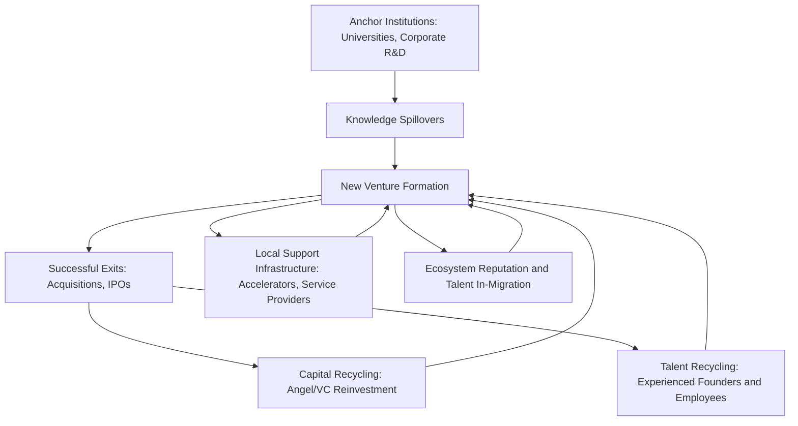

## Startup Ecosystems and Urban Entrepreneurship

### Definition and Conceptual Framework

A startup ecosystem is the set of interconnected actors, institutions, and resources within a geographic area that collectively enable the formation, growth, and scaling of new entrepreneurial ventures, particularly high-growth-potential firms. The ecosystem framing, drawn from business ecology and complex systems thinking, emphasizes interdependence among components (entrepreneurs, investors, talent, mentors, universities, corporates, government, and support infrastructure) rather than treating any single factor (e.g., availability of venture capital) as sufficient on its own to explain entrepreneurial activity levels.

Urban entrepreneurship specifically examines why entrepreneurial activity — firm formation rates, high-growth firm survival, and innovation-driven venture creation — is spatially concentrated in cities, and disproportionately concentrated in a small number of specific cities even within highly urbanized economies.

**Key Points**

- Ecosystem thinking shifts analytical focus from individual entrepreneurs or firms to the interaction effects between ecosystem components
- Urban entrepreneurship concentration is even more extreme than general urban economic activity concentration: a small number of "superstar" cities capture disproportionate shares of high-growth venture formation and venture capital investment
- Ecosystems exhibit path dependence and increasing returns, making them difficult to deliberately replicate through policy alone

### Theoretical Foundations

#### Isenberg's Domains Framework

Daniel Isenberg's influential framework decomposes startup ecosystems into six domains, providing a widely used template for ecosystem mapping and diagnosis:

1. **Policy**: government leadership, regulatory framework, and institutional support for entrepreneurship
2. **Finance**: availability of capital across the funding continuum (friends-and-family, angel, venture capital, growth equity)
3. **Culture**: social norms around risk-taking, tolerance of failure, and status accorded to entrepreneurship
4. **Support**: professional services (legal, accounting), incubators/accelerators, and networking infrastructure
5. **Human capital**: availability of skilled labor, management talent, and entrepreneurial education
6. **Markets**: access to early customers (domestic and export) and distribution networks

**[Inference]** This is a widely used practitioner and policy-diagnostic framework; it is descriptive/taxonomic rather than a formally testable causal model, and different domains interact in ways that are difficult to weight or measure with precision, meaning ecosystem "scores" derived from this framework should be treated as heuristic rather than precise measurement.

#### Agglomeration Economies Applied to Entrepreneurship

The general Marshallian agglomeration mechanisms (labor pooling, input sharing, knowledge spillovers) discussed in relation to innovation districts apply with particular force to entrepreneurial activity because early-stage ventures face acute versions of the frictions agglomeration mitigates:

- **Labor pooling**: startups face high failure risk; workers are more willing to join early-stage ventures where, if the venture fails, they can readily find alternative startup or established-firm employment nearby without relocating — reducing the effective risk premium workers demand
- **Input sharing**: specialized startup service providers (venture-focused law firms, startup-specialized accountants, specialized recruiters) achieve minimum efficient scale only where sufficient local startup density exists
- **Knowledge spillovers**: tacit knowledge about "how to build a startup" (fundraising norms, hiring practices, go-to-market strategy) diffuses through informal local networks, mentor relationships, and serial-entrepreneur/employee mobility between firms

#### Knowledge Spillover Theory of Entrepreneurship (Audretsch-Feldman)

As introduced under innovation districts, this framework argues entrepreneurship is frequently the mechanism by which knowledge generated in an incumbent institution (university, corporate lab) but not fully commercialized by that institution gets converted into new firm formation. Applied to urban entrepreneurship broadly, it predicts that cities with strong research university and corporate R&D presence should exhibit systematically higher rates of knowledge-intensive startup formation, since the pool of uncommercialized spillover knowledge available for entrepreneurial exploitation is larger.

#### Network Theory and Weak Ties

Granovetter's "strength of weak ties" concept has been applied extensively to entrepreneurial ecosystems: dense local networks with high connectivity between otherwise-separate groups (investors, technologists, corporate alumni, university researchers) facilitate information flow about opportunities, talent, and capital that would not occur within more insular or fragmented networks. Ecosystem strength is thus partly a function of network topology, not just the raw count of ecosystem participants — a highly fragmented ecosystem with many participants but few cross-group connections may underperform a smaller but densely interconnected one.

#### Recycling of Capital and Talent

A key self-reinforcing mechanism in mature startup ecosystems is the "recycling" effect: successful exits (acquisitions, IPOs) generate wealth that former founders and early employees reinvest as angel investors or redeploy as founders/executives of subsequent ventures, while also training a cohort of employees in startup operating practices who subsequently found or join other local ventures. This creates path-dependent, increasing-returns dynamics: early ecosystem success increases the probability of future success, making early-mover regional advantages difficult for later-developing ecosystems to close.

$$P(\text{Ecosystem success}_{t+1}) = f(\text{Exits}_t, \text{Talent pool}_t, \text{Capital pool}_t)$$

with each right-hand-side term itself increasing in prior period ecosystem success, generating a positive feedback loop consistent with path-dependence models in economic geography (parallel to the core-periphery self-reinforcement mechanism discussed under primate city formation).

### Diagram: Startup Ecosystem Feedback Loop

### Measurement of Ecosystem Strength

| Metric | What It Captures | Limitation |
| --- | --- | --- |
| Venture capital investment volume ($ and deal count) | Capital availability and investor confidence | Highly skewed by a small number of large deals; volatile year to year |
| Startup formation/density rate | Entrepreneurial activity level | Does not distinguish high-growth from lifestyle/subsistence entrepreneurship |
| Unicorn/high-value exit count | High-growth outlier success | Extremely skewed; small sample sizes make year-to-year comparison unreliable |
| Patent output per capita | Innovation output associated with entrepreneurial activity | Not all valuable innovation is patented; sectoral patenting propensity varies |
| Survival and scaling rates (5-year survival, employment growth) | Ecosystem quality beyond formation (execution/scaling capacity) | Requires longitudinal firm-level data, often unavailable at fine geographic scale |
| Network density/centrality measures | Ecosystem connectivity per network theory | Requires specialized relational data (investor-founder ties, board interlocks) not routinely collected |

**[Unverified — cross-city rankings of "top startup ecosystems" produced by various private index providers use differing, partly proprietary methodologies and should not be treated as precise or directly comparable measurements; treat specific rankings as illustrative rather than authoritative without checking current methodology]**

### Concentration and the "Superstar City" Pattern

Empirical work on venture capital and high-growth firm geography consistently finds concentration levels exceeding general economic activity concentration: a small number of metropolitan areas capture a disproportionate share of national (and global) venture capital investment and high-growth firm formation, even after controlling for those cities' shares of general economic activity or population. This is consistent with the path-dependence/recycling mechanism above: once a city accumulates a critical mass of successful exits, experienced talent, and specialized capital, the increasing-returns dynamic makes it difficult for competing cities to catch up even with substantial deliberate policy investment.

**[Inference]** The degree of concentration and its trend (increasing, stable, or moderating due to remote-work-enabled dispersion since the COVID-19 pandemic) is an active empirical research question; findings are sensitive to the time period, geographic definition, and data source used, and should be verified against current data before making specific quantitative claims.

### Illustrative Chart: Startup Ecosystem Concentration (svg_diagram)

<svg xmlns="http://www.w3.org/2000/svg" viewBox="0 0 720 420" font-family="Arial, sans-serif">
<text x="360" y="28" text-anchor="middle" font-size="18" font-weight="bold">Illustrative VC Investment Share by City Rank (svg_diagram)</text>
<line x1="90" y1="360" x2="680" y2="360" stroke="#333" stroke-width="2" />
<line x1="90" y1="360" x2="90" y2="60" stroke="#333" stroke-width="2" />
<text x="385" y="395" text-anchor="middle" font-size="13">City Rank by VC Investment</text>
<text x="35" y="210" text-anchor="middle" font-size="13" transform="rotate(-90 35 210)">Share of National VC Investment (%)</text>
<rect x="120" y="90" width="60" height="270" fill="#1f77b4" />
<text x="150" y="380" text-anchor="middle" font-size="11">1</text>
<rect x="200" y="200" width="60" height="160" fill="#1f77b4" />
<text x="230" y="380" text-anchor="middle" font-size="11">2</text>
<rect x="280" y="260" width="60" height="100" fill="#1f77b4" />
<text x="310" y="380" text-anchor="middle" font-size="11">3</text>
<rect x="360" y="300" width="60" height="60" fill="#1f77b4" />
<text x="390" y="380" text-anchor="middle" font-size="11">4</text>
<rect x="440" y="325" width="60" height="35" fill="#1f77b4" />
<text x="470" y="380" text-anchor="middle" font-size="11">5</text>
<rect x="520" y="340" width="60" height="20" fill="#1f77b4" />
<text x="550" y="380" text-anchor="middle" font-size="11">6-10 (avg)</text>
<text x="360" y="70" text-anchor="middle" font-size="11" font-style="italic">Illustrative pattern, not specific-city data</text>
</svg>

### Institutional and Policy Actors

**Key Points**

- **Universities**: dual role as talent supplier and knowledge-spillover source; technology transfer offices mediate the commercialization of university research into startups
- **Accelerators and incubators**: structured, time-bound programs providing mentorship, initial capital, and network access in exchange for equity or fees; theorized to compress the time and reduce the risk of early-stage venture validation by providing curated access to ecosystem resources
- **Corporate venture arms and anchor corporates**: large firms often serve dual roles as talent source (alumni who leave to found startups), customer (early enterprise sales), and investor (corporate venture capital)
- **Government**: role spans regulatory framework-setting (business formation ease, labor law flexibility, immigration policy for skilled entrepreneurs), direct funding (public venture funds, grants, matching-capital programs), and public research funding that feeds the knowledge-spillover pipeline
- **Professional service intermediaries**: specialized startup-focused legal, accounting, and recruiting firms reduce transaction costs for firm formation and scaling, an underappreciated but empirically important "support domain" component per Isenberg's framework

### Policy Interventions and Their Rationale

| Intervention | Mechanism | Underlying Rationale |
| --- | --- | --- |
| Public co-investment/matching funds | Government capital matched with private venture investment | Addresses early-stage capital market gaps where private risk appetite alone is insufficient |
| Regulatory sandboxes | Temporary relaxed regulatory regimes for testing new business models | Reduces regulatory barrier to entrepreneurial experimentation in regulated sectors (fintech, healthtech) |
| Skilled migration/founder visa policy | Facilitates international entrepreneur and technical talent inflow | Addresses human capital domain constraints, particularly in smaller domestic talent pools |
| University technology transfer reform | Simplifies IP licensing terms for university-originated spin-outs | Reduces friction in the knowledge-spillover-to-venture pipeline |
| Public research funding | Direct funding of university/institutional R&D | Expands the pool of spillover knowledge available for future entrepreneurial exploitation |
| Ecosystem-builder/convening organizations | Publicly or philanthropically funded organizations that host networking events, mentor matching | Directly targets the "networking assets" and weak-tie-formation mechanisms described above |

**[Inference]** The empirical evidence base on which specific interventions most effectively cause ecosystem development (as opposed to correlating with or merely accompanying it) is less mature than the theoretical/descriptive ecosystem literature; policymakers should treat most specific intervention effect-size claims as suggestive rather than definitively established, and rigorous causal evaluation of place-based entrepreneurship policy remains an active research area.

### Urban Form and Entrepreneurial Activity

Beyond institutional factors, physical urban form has been linked to entrepreneurship rates in the urban economics literature:

- **Density and walkability**: facilitate the chance encounters and informal information exchange theorized to matter for early-stage venture formation (echoing Jacobs-style diversity externalities discussed under innovation districts)
- **Building stock diversity/age**: Jacobs specifically argued that older, lower-rent building stock (as opposed to uniformly new high-cost commercial space) is important for entrepreneurship because early-stage ventures with uncertain revenue require low fixed occupancy costs
- **Mixed-use zoning**: supports the live-work-play environment associated with talent retention among the young, mobile workforce disproportionately drawn to entrepreneurial ventures

### Risks, Limitations, and Critiques

**Key Points**

1. **Survivorship bias in ecosystem case studies**: much popular and policy literature on "how to build a startup ecosystem" derives lessons from a small number of highly successful, often idiosyncratic cases, risking overgeneralization of factors that may not be replicable or causally central
2. **Inequality within ecosystem benefits**: venture-backed high-growth entrepreneurship creates concentrated wealth gains among founders/early employees/investors; broader local economic benefits (widespread job creation, wage growth for non-technical workers) are less consistently documented and can be accompanied by rising local cost of living that offsets gains for non-participating residents
3. **Gender and demographic disparities in ecosystem access**: extensive documented disparities exist in venture capital allocation and ecosystem network access by founder gender, race, and other demographic characteristics, representing both an equity concern and a potential source of allocative inefficiency if capital is not flowing to the highest-return ventures irrespective of founder characteristics
4. **Policy replication difficulty**: given the path-dependent, increasing-returns nature of ecosystem development described above, deliberate government attempts to replicate successful ecosystems elsewhere face a structural disadvantage relative to already-established ecosystems, and historical policy track records of successfully building a "new" major ecosystem from limited pre-existing base are relatively rare
5. **Vulnerability to macro capital cycles**: startup ecosystem activity (venture investment volume, valuations) is highly sensitive to broader interest rate and capital market conditions, meaning ecosystem-level metrics can fluctuate substantially for macroeconomic reasons unrelated to underlying regional entrepreneurial capacity

### Related Topics

- Innovation districts and knowledge clusters (spatial and institutional overlap)
- Marshallian agglomeration economies and localization
- Knowledge spillover theory of entrepreneurship (Audretsch-Feldman)
- Primate city formation and spatial concentration dynamics (parallel path-dependence mechanism)
- Venture capital geography and superstar city effects
- University technology transfer and commercialization policy
- Regional specialization vs. diversification trade-offs
- Urban form, density, and informal knowledge exchange
- Remote work and the geographic dispersion of entrepreneurship
- Place-based economic development policy evaluation