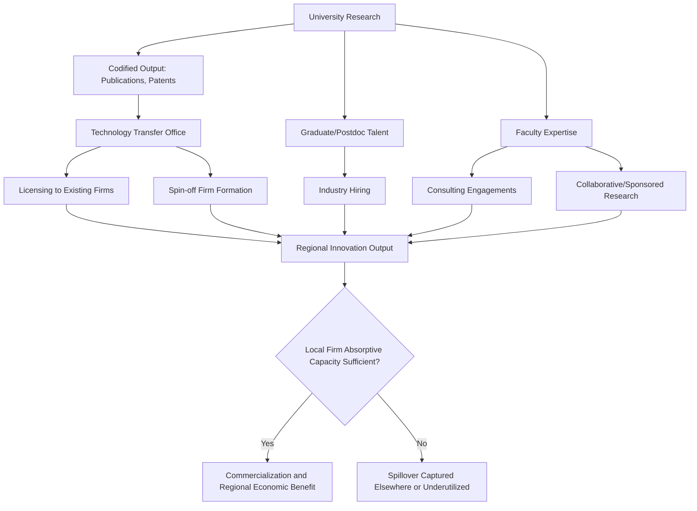

## University-Industry Linkages in Regional Innovation

### Definition and Conceptual Overview

University-industry linkages refer to the formal and informal channels through which knowledge, technology, and human capital flow between universities (and other public research organizations) and private-sector firms, and the extent to which these flows are spatially concentrated in the region surrounding the university. This topic examines the economic rationale for such linkages, their institutional mechanisms, empirical evidence on spatial decay of knowledge spillovers, and the policy instruments used to strengthen regional innovation systems built around university research capacity.

**Key Points**

- University-industry linkages operate through multiple distinct channels (licensing, spin-offs, collaborative research, consulting, labor mobility, informal knowledge exchange), each with different spatial properties and policy levers
- Not all channels are equally geographically bounded: codified knowledge (publications, patents) travels farther than tacit knowledge (know-how transferred through personal interaction)
- Universities function simultaneously as knowledge producers, human capital suppliers, and (through spin-offs) direct sources of new firm formation

### Theoretical Foundations

#### Endogenous Growth Theory and the Role of University Research

Romer's (1990) endogenous growth model treats technological knowledge as a non-rival input to production whose accumulation drives long-run growth, with the discovery of new knowledge being partly a function of intentional research investment. University research constitutes a significant share of a nation's basic research investment (as distinguished from applied, commercially-directed corporate R&D), and endogenous growth theory provides the macro-level rationale for public investment in university research as a driver of aggregate productivity growth, operating through the diffusion of research output into commercial application.

#### Knowledge Spillover Theory of Entrepreneurship

As introduced under startup ecosystems, the Audretsch-Feldman framework identifies university research as a primary source of "spillover knowledge" — discoveries and know-how generated within the university but not fully commercially exploited by the university itself — that becomes the basis for entrepreneurial firm formation when researchers, students, or external entrepreneurs recognize and act on unexploited commercial potential. This framework provides the theoretical bridge between university research output and regional new-firm formation rates.

#### Triple Helix Model

The Triple Helix framework (Etzkowitz and Leydesdorff), introduced under innovation districts, positions universities as one of three core institutional actors (alongside industry and government) in regional innovation systems, with an important refinement specific to this topic: the model emphasizes that universities in advanced knowledge economies increasingly take on a direct "entrepreneurial" role (patenting, licensing, spin-off formation) beyond their traditional teaching and research functions — a shift often termed the "entrepreneurial university."

#### Regional Innovation Systems (RIS) Framework

The regional innovation systems approach (associated with Cooke and others) frames regional economic performance as a function of the interaction density and institutional coherence among regional actors — universities, firms, government, and intermediary organizations — rather than the presence of any single actor type alone. Under this framework, university research capacity is a necessary but not sufficient condition for strong regional innovation performance: the framework predicts that regions with strong university research but weak absorptive capacity among local firms, or weak intermediary institutions connecting the two, will underperform relative to their raw research capacity.

$$\text{Regional Innovation Output} = f(\text{University Research Capacity}, \text{Firm Absorptive Capacity}, \text{Intermediary Institution Density}, \text{Proximity})$$

**[Inference]** This multiplicative/interactive framing is the standard theoretical intuition in the regional innovation systems literature; the precise functional form and relative weight of each factor is not established with the level of empirical precision that would allow confident quantitative prediction, and should be treated as a qualitative organizing framework rather than a estimated structural model.

### Absorptive Capacity

Cohen and Levinthal's concept of absorptive capacity — a firm's ability to recognize, assimilate, and commercially apply external knowledge — is central to understanding why university research proximity does not automatically translate into regional economic benefit. Firms with low absorptive capacity (typically correlated with low internal R&D investment and low proportion of technically trained staff) fail to capitalize on nearby university research regardless of physical proximity, since absorptive capacity is itself substantially a function of a firm's own prior R&D investment (a firm must already possess related internal knowledge to recognize and exploit external knowledge). This implies regional innovation policy focused solely on university research funding, without complementary attention to local firm R&D capacity building, may fail to generate the anticipated regional spillover benefits.

### Channels of University-Industry Knowledge Transfer

| Channel | Mechanism | Spatial Boundedness | Typical Institutional Vehicle |
| --- | --- | --- | --- |
| Publications and codified research output | Open dissemination of research findings | Low (travels globally via journals, conferences) | Academic publishing, open-access repositories |
| Patenting and licensing | Formal IP transfer from university to firm | Moderate (licensing can occur at distance, but often favors regional firms due to relationship/negotiation ease) | University technology transfer offices |
| Spin-off/startup formation | Researcher or student founds a firm to commercialize university-originated knowledge | High (spin-offs disproportionately locate near the originating university) | Technology transfer offices, university incubators |
| Collaborative/sponsored research | Joint research projects between university labs and firms | Moderate-high (face-to-face collaboration favored by proximity, though not strictly required) | Research contracts, industry-sponsored labs |
| Consulting | Faculty provide paid expert advice to firms | High (typically requires periodic in-person engagement) | Individual faculty consulting arrangements |
| Graduate and postdoc labor mobility | Trained researchers join industry, carrying tacit knowledge and networks | High (graduates disproportionately take first jobs in the region where they studied) | Direct hiring, alumni networks |
| Informal knowledge exchange | Conferences, alumni networks, social ties between researchers and industry practitioners | High (tacit knowledge transfer strongly favored by proximity) | Professional associations, informal networks |

**Key Points**

- Codified knowledge (patents, publications) is the least spatially bounded channel — it can in principle be accessed by any firm globally
- Tacit knowledge transfer (informal exchange, consulting, spin-off formation) is the most spatially bounded, since tacit knowledge is difficult to transmit without face-to-face interaction
- Labor mobility is often the empirically most important channel in magnitude, since it transfers both codified and tacit knowledge embodied in trained individuals

### Empirical Evidence on Spatial Decay of University Spillovers

Jaffe's (1989) foundational study, using patent citation geography as a proxy for knowledge flow, found that corporate patenting activity is significantly related to nearby university research spending, with citation patterns showing measurable localization: patents are more likely to cite geographically proximate prior patents and university research than would be expected under random citation patterns, providing direct empirical evidence that knowledge spillovers from university research decay with distance.

Subsequent literature has generally confirmed a spatial decay pattern using varied methodologies (patent citations, firm survey data on spillover sources, spin-off location choice analysis), though the precise decay rate and effective radius vary by study, industry, and time period.

**[Inference]** The general finding that university knowledge spillovers are spatially bounded and decay with distance is well-established in the literature; specific numerical estimates of decay rates or effective spillover radii are sensitive to methodology and data vintage and should be treated as illustrative rather than universal constants applicable to all contexts.

### Diagram: University-Industry Knowledge Transfer Pathways

### Institutional Mechanisms: Technology Transfer Offices

Technology transfer offices (TTOs) are the primary formal institutional mechanism through which universities manage intellectual property arising from research (patenting decisions, licensing negotiations, spin-off equity arrangements). Their design involves several economically consequential trade-offs:

- **Exclusive vs. non-exclusive licensing**: exclusive licenses provide stronger commercialization incentives to the licensee (justifying their own follow-on investment) but risk under-utilization if the exclusive licensee fails to commercialize, whereas non-exclusive licensing spreads access but may weaken any individual licensee's incentive to invest in commercialization
- **Equity vs. royalty/fee-based spin-off arrangements**: universities taking equity stakes in spin-offs align university incentives with long-run venture success but expose the university to greater risk and require more sophisticated portfolio management capacity than fixed licensing fee arrangements
- **Centralized vs. decentralized/faculty-driven technology transfer**: some university systems centralize IP management and permit-seeking through a single TTO, while others grant faculty greater latitude to negotiate their own industry relationships; the trade-off is between consistency/institutional bargaining power (centralized) versus responsiveness and faculty-specific relationship knowledge (decentralized)

**[Inference]** Empirical comparisons of TTO institutional design effectiveness (e.g., licensing revenue, spin-off formation rates) are complicated by wide variation in university research portfolios, disciplinary composition (biomedical versus engineering versus social sciences differ substantially in commercialization potential), and regional economic context, making cross-institution TTO performance comparisons difficult to interpret causally.

### Spatial Patterns: Why Spin-offs Cluster Near Their Origin University

**Example**

A university spin-off founded by a graduate researcher to commercialize a lab discovery disproportionately locates near the originating university rather than at a location chosen purely on cost-minimization grounds, for several documented reasons: (1) the founder's tacit knowledge of the technology is most completely retained through continued informal access to the origin lab and former colleagues; (2) the founder's existing local social and professional network (critical for early hiring and informal advice) is geographically anchored; (3) continued access to university facilities, follow-on research collaboration, or specialized equipment may require ongoing proximity; and (4) local investors and support ecosystem actors (as discussed under startup ecosystems) may have pre-existing familiarity with the university's research programs, reducing information asymmetry in early-stage financing decisions.

### Illustrative Chart: Spatial Decay of University Spillover Intensity (svg_diagram)

<svg xmlns="http://www.w3.org/2000/svg" viewBox="0 0 720 420" font-family="Arial, sans-serif">
<text x="360" y="28" text-anchor="middle" font-size="18" font-weight="bold">Stylized Spillover Intensity by Distance from University (svg_diagram)</text>
<line x1="90" y1="360" x2="680" y2="360" stroke="#333" stroke-width="2" />
<line x1="90" y1="360" x2="90" y2="60" stroke="#333" stroke-width="2" />
<text x="385" y="395" text-anchor="middle" font-size="13">Distance from University</text>
<text x="35" y="210" text-anchor="middle" font-size="13" transform="rotate(-90 35 210)">Spillover Intensity</text>
<path d="M 100 90 Q 200 220 350 300 Q 500 340 640 350" stroke="#d62728" stroke-width="3" fill="none" />
<text x="410" y="290" font-size="12" fill="#d62728">Tacit knowledge / spin-off formation (steep decay)</text>
<path d="M 100 120 Q 300 180 640 250" stroke="#1f77b4" stroke-width="3" fill="none" />
<text x="410" y="235" font-size="12" fill="#1f77b4">Codified knowledge / patent citation (moderate decay)</text>
<path d="M 100 150 L 640 165" stroke="#2ca02c" stroke-width="3" fill="none" />
<text x="410" y="155" font-size="12" fill="#2ca02c">Publications / open research access (minimal decay)</text>
</svg>

### Policy Instruments to Strengthen Regional University-Industry Linkages

**Key Points**

1. **Research funding with regional/collaborative mandates**: public research grants conditioned on industry co-funding or partnership, intended to directly build the collaborative-research channel and align research direction with regional industry needs
2. **University technology transfer reform**: simplifying licensing terms, standardizing equity/royalty templates, and building TTO negotiation capacity to reduce transaction costs in the licensing and spin-off channels
3. **Physical co-location and innovation district development**: as discussed under innovation districts, deliberately siting industry R&D facilities and startup incubation space near university campuses to strengthen the spatially-bounded tacit knowledge and informal exchange channels
4. **Talent retention policy**: regional programs (internship pipelines, employer engagement with university career services, visa/immigration policy for international graduate researchers) aimed at increasing the share of graduates who remain regionally employed rather than migrating elsewhere after graduation
5. **Intermediary organization funding**: support for organizations that bridge university research output and firm absorptive capacity gaps (applied research institutes, industry liaison offices, extension-service-style technical assistance programs modeled on agricultural extension)
6. **Firm-side absorptive capacity building**: R&D tax credits, small-firm innovation grants, and technical assistance programs targeted at increasing local firms' internal R&D capacity, addressing the absorptive capacity constraint identified above rather than assuming proximity alone suffices

### Risks and Limitations

**Key Points**

1. **Overreliance on flagship anchor institutions**: regions with a single dominant research university may face concentration risk and limited diversification of the regional knowledge base relative to regions with multiple, more varied research institutions
2. **Commercialization pressure and academic mission tension**: increased emphasis on patenting, licensing revenue, and spin-off formation as university performance metrics has generated debate about potential conflicts with traditional open-science norms and basic research incentives — a normative tension in the "entrepreneurial university" model that is not fully resolved in the literature
3. **Uneven regional distribution of research capacity**: since university research capacity itself is unevenly distributed (concentrated in a subset of institutions and regions), university-industry linkage-based regional innovation policy may be inherently limited in its ability to address regional inequality, since it cannot easily create research capacity where none exists
4. **Absorptive capacity as a binding constraint often overlooked in policy design**: policy attention frequently focuses on the university/supply side (research funding, TTO reform) while underinvesting in firm-side absorptive capacity building, potentially limiting realized regional benefit even where university research output is strong

### Related Topics

- Innovation districts and knowledge clusters (spatial co-location mechanisms)
- Startup ecosystems and urban entrepreneurship (spin-off and talent recycling linkages)
- Knowledge spillover theory of entrepreneurship (Audretsch-Feldman)
- Endogenous growth theory and the economics of technological change
- Regional innovation systems framework
- Absorptive capacity and firm-level R&D investment
- Technology transfer office institutional design
- Patent citation analysis as a knowledge-flow measurement method
- Graduate labor market mobility and regional talent retention
- Triple Helix model of university-industry-government collaboration