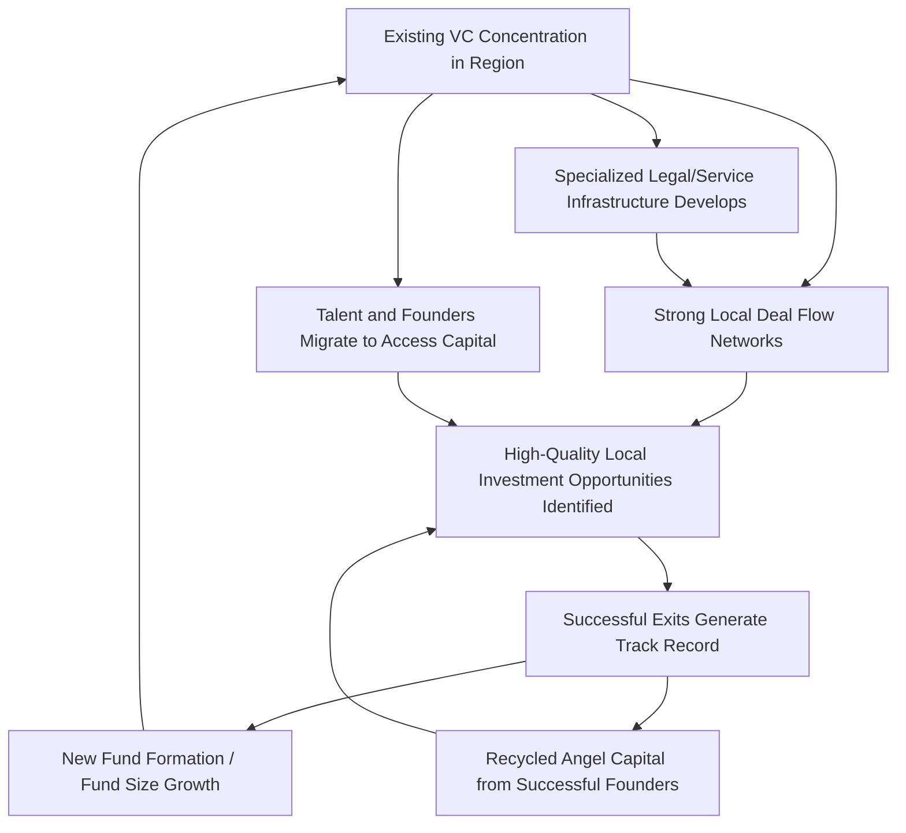

## Venture Capital Geography

### Definition and Scope

Venture capital geography examines the spatial distribution of venture capital investment activity — where VC firms locate, where they invest, and how physical distance between investors and portfolio companies affects investment patterns and outcomes. This field sits at the intersection of financial economics, economic geography, and the entrepreneurship/innovation literature covered under startup ecosystems and university-industry linkages, and is distinguished by an empirical puzzle: venture capital is among the most spatially concentrated forms of financial activity, far exceeding the concentration of general economic activity, banking, or even other forms of specialized finance.

**Key Points**

- VC investment is characterized by extreme geographic concentration in a small number of metropolitan regions, both nationally and globally
- Concentration operates at multiple levels: where VC firms are headquartered, where portfolio companies are located, and the interaction between the two (local bias)
- The degree and drivers of concentration are subjects of an extensive empirical literature examining whether geography constrains VC activity due to information frictions or reflects efficient sorting toward areas with genuinely superior venture opportunities

### Theoretical Rationale for Geographic Concentration

#### Information Asymmetry and Due Diligence

Venture capital investment is characterized by severe information asymmetry between investors and entrepreneurs regarding venture quality, team capability, and technology viability — arguably more acute than in most other asset classes, since early-stage ventures typically lack the financial track record, collateral, or established markets that reduce information asymmetry in other lending/investment contexts. Physical proximity is theorized to mitigate this asymmetry through:

- **Enhanced due diligence**: face-to-face interaction facilitates assessment of soft factors (founder credibility, team dynamics) that are difficult to evaluate remotely
- **Local reputation and network verification**: investors can more easily verify a founder's reputation and track record through local professional networks
- **Reduced monitoring costs post-investment**: VCs typically take active governance roles (board seats, operational involvement) in portfolio companies, which is costlier to execute at a distance

#### Active Investor Involvement (Value-Added Investing)

Unlike passive public equity investment, venture capital is characterized by active investor involvement: board participation, strategic guidance, follow-on financing coordination, and network introductions (to customers, talent, and subsequent investors). This "hands-on" investment model creates a structural preference for geographic proximity, since the marginal cost of frequent in-person board meetings, informal check-ins, and crisis-response availability rises with distance.

$$\text{Investment Probability} = f(\text{Expected Return}, \text{Information Asymmetry Cost}, \text{Monitoring Cost})$$

with both information asymmetry cost and monitoring cost theorized to be increasing in distance, all else equal, producing the empirically observed local investment bias even when controlling for the underlying quality/expected-return distribution of deals across locations.

#### Syndication Networks and Co-investment

Venture investment frequently occurs through syndicates (multiple VC firms co-investing in a single round), which serve both risk-sharing and information-aggregation functions: syndication allows investors to pool due diligence effort and validate investment theses through co-investor confidence. Syndication networks exhibit strong geographic clustering, since repeated co-investment relationships are more easily formed and maintained among geographically proximate investors who interact frequently through overlapping deal flow, industry events, and informal networks — reinforcing the broader ecosystem network-density dynamics discussed under startup ecosystems.

#### Deal Flow and Information Networks

VC firms rely heavily on their local professional networks (accelerators, university technology transfer offices, angel investor networks, other VCs) to generate deal flow — the pipeline of potential investment opportunities. Since these referral networks are themselves geographically embedded (per the network-theory discussion under startup ecosystems), VC firms face a structural incentive to locate where their referral network is strongest, which is typically the same regions where entrepreneurial activity is already concentrated — a mutually reinforcing dynamic between VC location and startup formation location.

### Diagram: Self-Reinforcing VC Geographic Concentration

### Empirical Patterns of Concentration

#### Measuring Concentration

Standard measures used in the VC geography literature include:

- **Herfindahl-Hirschman Index (HHI) of VC investment by metro area**: $HHI = \sum_{i} s_i^2$ where $s_i$ is metro area $i$'s share of national VC investment; higher values indicate greater concentration
- **Top-N city share**: the cumulative percentage of national VC dollar volume or deal count captured by the top 3, 5, or 10 metropolitan areas
- **Gini coefficient of VC investment across regions**: analogous to income inequality measurement, applied to the cross-regional distribution of investment volume

**[Unverified — specific current concentration statistics (HHI values, top-city shares) fluctuate meaningfully year to year with the venture funding cycle and should be verified against current industry data sources such as PitchBook, Crunchbase, or National Venture Capital Association reports rather than assumed static]**

#### The "Local Bias" Finding

A robust empirical finding across multiple studies and time periods is that VC firms exhibit strong "local bias": the probability that a given VC firm invests in a given startup declines sharply with the physical distance between the VC's office and the startup's headquarters, even controlling for startup quality/sector and VC firm characteristics. This local bias is generally found to be strongest at the earliest funding stages (seed, Series A) and to weaken at later stages (growth equity, pre-IPO rounds), consistent with the theoretical mechanism above: information asymmetry and monitoring intensity requirements are highest precisely when a venture has the least track record and requires the most active investor involvement.

**[Inference]** The stage-dependent pattern of local bias is a widely replicated finding in the empirical VC geography literature; the precise magnitude of distance sensitivity varies across studies depending on time period, geographic market definition, and econometric specification, and should be treated as a well-established directional pattern rather than a fixed numerical parameter.

### Illustrative Chart: Local Bias by Investment Stage (svg_diagram)

<svg xmlns="http://www.w3.org/2000/svg" viewBox="0 0 720 420" font-family="Arial, sans-serif">
<text x="360" y="28" text-anchor="middle" font-size="18" font-weight="bold">Stylized Local Investment Bias by Funding Stage (svg_diagram)</text>
<line x1="90" y1="360" x2="680" y2="360" stroke="#333" stroke-width="2" />
<line x1="90" y1="360" x2="90" y2="60" stroke="#333" stroke-width="2" />
<text x="385" y="395" text-anchor="middle" font-size="13">Funding Stage</text>
<text x="35" y="210" text-anchor="middle" font-size="13" transform="rotate(-90 35 210)">Share of Local (Same-Region) Investors (%)</text>
<rect x="130" y="90" width="80" height="270" fill="#d62728" />
<text x="170" y="380" text-anchor="middle" font-size="12">Seed</text>
<rect x="250" y="140" width="80" height="220" fill="#ff7f0e" />
<text x="290" y="380" text-anchor="middle" font-size="12">Series A</text>
<rect x="370" y="210" width="80" height="150" fill="#1f77b4" />
<text x="410" y="380" text-anchor="middle" font-size="12">Series B</text>
<rect x="490" y="270" width="80" height="90" fill="#2ca02c" />
<text x="530" y="380" text-anchor="middle" font-size="12">Growth/Late Stage</text>
</svg>

### Superstar Regions and Winner-Take-Most Dynamics

Empirical geography-of-venture-capital studies consistently identify a small number of "superstar" metropolitan regions capturing a share of national/global VC investment vastly exceeding their share of population or general economic output. This concentration pattern is theorized to reflect the path-dependence and increasing-returns mechanisms introduced under startup ecosystems (capital recycling, talent recycling, network density) operating with particular force in venture finance specifically, because:

1. **Fund-of-funds and limited partner allocation patterns**: institutional investors (pension funds, endowments) allocating capital to venture funds themselves exhibit concentration in established, brand-name VC firms disproportionately headquartered in already-dominant regions, creating a capital-supply-side reinforcement of geographic concentration independent of local deal quality
2. **General partner talent concentration**: experienced venture investors (with track records, networks, and pattern-recognition expertise) are themselves concentrated in established VC hub regions, and new fund formation disproportionately occurs where such talent already resides
3. **Signal value of being locally invested**: startups may seek investment from prominent local VCs specifically for the signaling value to future investors and potential acquirers/customers, reinforcing incumbent firms' deal access advantage independent of pure capital availability

### Cross-Border and International VC Geography

International venture capital flows exhibit even stronger distance sensitivity than domestic flows, reflecting compounding frictions: currency risk, differing legal/regulatory regimes for equity investment and corporate governance, cross-border due diligence costs, and weaker informal network connectivity across national boundaries relative to within-country regional networks. Cross-border VC investment that does occur is disproportionately concentrated in later funding stages (where local-bias information asymmetry concerns are less acute) and disproportionately flows toward a small number of globally recognized innovation hub cities rather than being broadly distributed across international markets.

**[Inference]** The relative importance of specific frictions (currency risk versus network/informal-knowledge barriers versus formal legal/regulatory differences) in explaining cross-border VC distance sensitivity is not definitively decomposed in the literature and likely varies by the specific country-pair and sector examined.

### Remote Work, Digital Tools, and the Post-Pandemic Geography Debate

**[Speculation]** The COVID-19 pandemic prompted widespread adoption of remote due diligence, video-conferencing-based board participation, and digitally-mediated deal sourcing, generating an open debate about whether traditional local-bias patterns in VC investment would persist, weaken, or reassert themselves as normalcy returned. Some data during the pandemic period suggested modest geographic dispersion of VC investment (increased investment in previously under-invested secondary cities), but the durability of this shift and whether concentration patterns have since reverted toward pre-pandemic levels remains a genuinely unsettled empirical question requiring current data verification rather than an established, stable finding. Any specific claim about current dispersion versus reconcentration trends should be checked against recent (post-2023) industry data rather than assumed from pandemic-era research alone.

### Policy Relevance and Regional Development Implications

**Key Points**

1. **Capital gap constraint on secondary-city entrepreneurship**: given local bias, regions lacking an established local VC presence face a structural disadvantage in supporting the growth of locally-founded ventures, independent of the underlying quality of local entrepreneurial talent or ideas — a market-geography friction rather than a pure quality gap
2. **Public venture co-investment programs**: several regional and national governments have established public or public-private co-investment funds explicitly targeting this geographic capital gap, seeding local VC ecosystem development in regions with limited pre-existing venture capital presence
3. **Angel investor network development as a bridging mechanism**: given local bias is strongest at the earliest stages, building local angel investor networks and early-stage capital availability may be a more geographically tractable intervention than attempting to attract established, typically hub-city-headquartered VC firms into new regions
4. **Risk of policy-induced capital misallocation**: place-based capital subsidy programs face the standard concern (echoing the innovation-district subsidy debate) that publicly incentivized investment may fund lower-return local opportunities that would not have attracted capital on commercial merit alone, versus genuinely correcting an information-friction-driven under-investment in viable local ventures — distinguishing between these two scenarios empirically is difficult in practice

### Related Topics

- Startup ecosystems and urban entrepreneurship (capital and talent recycling mechanisms)
- University-industry linkages in regional innovation (spin-off financing pipeline)
- Information asymmetry and due diligence in early-stage finance
- Syndication networks and co-investment theory
- Superstar city effects in innovation and high-growth firm geography
- Public venture co-investment and place-based capital policy
- Cross-border capital flows and international finance frictions
- Remote work and the geography of knowledge-intensive industries
- Angel investor networks and early-stage capital gaps
- Path dependence and increasing returns in regional economic geography