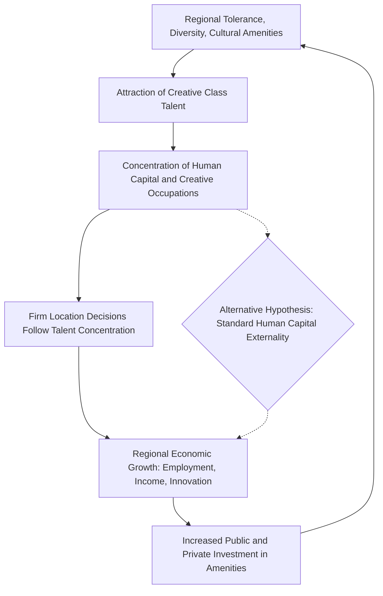

## The Creative Class Thesis and Urban Development

### Definition and Core Argument

The creative class thesis, developed by economist Richard Florida (most prominently in *The Rise of the Creative Class*, 2002), argues that regional economic growth in the post-industrial economy is driven primarily by the ability of cities and regions to attract and retain a "creative class" of workers — a broad occupational category encompassing scientists, engineers, artists, designers, educators, and knowledge-intensive professionals whose economic function centers on generating novel ideas, technologies, and creative content rather than routine production or service delivery. The thesis inverts the traditional regional economic development logic of attracting firms first (and workers following jobs), instead proposing that talented, creative workers choose locations based on quality-of-life and amenity factors, and that firms subsequently locate where this talent concentrates.

**Key Points**

- The thesis reframes regional competitiveness around talent attraction rather than firm attraction or traditional business-cost factors (taxes, land, labor costs)
- Central causal claim: amenities and open, tolerant social environments attract creative workers, who in turn attract firms and drive economic growth — reversing the conventional "jobs follow people" versus "people follow jobs" debate in regional economics
- The thesis has been highly influential in urban policy and planning practice, while also attracting substantial methodological and empirical criticism within academic economic geography

### The 3 Ts Framework

Florida's central analytical framework identifies three factors argued to jointly determine a region's capacity to attract creative-class talent and, consequently, drive economic growth:

1. **Technology**: measured typically via indicators such as high-tech industry concentration, patent output, and innovation intensity — capturing the region's existing knowledge-economy infrastructure
2. **Talent**: measured via the share of the regional workforce in creative-class occupations, or alternatively via educational attainment (percentage of population with bachelor's degrees or higher)
3. **Tolerance**: measured via proxy indicators intended to capture social openness and diversity, most notably Florida's "Gay Index" (concentration of same-sex households, used as a proxy for a region's overall openness to diverse populations and non-conformist lifestyles) and related diversity/bohemian indices

Florida's empirical work constructs composite indices combining these three dimensions and correlates them with regional economic performance measures (employment growth, high-tech industry concentration, income growth).

$$\text{Creativity Index} = f(\text{Technology Index}, \text{Talent Index}, \text{Tolerance Index})$$

**[Inference]** The specific functional form and weighting Florida uses to combine these sub-indices into composite measures has varied across publications and has been a recurring point of methodological critique, since index construction choices can substantially affect resulting regional rankings.

### Theoretical Positioning Relative to Standard Urban Economics

#### Amenity-Driven Location Theory

The creative class thesis draws on and extends a pre-existing literature on quality-of-life and amenity-driven migration in urban economics (associated with work by Rosen and Roback on compensating differentials), which models household location choice as a function of both wages and local amenities, with amenity-rich locations able to sustain higher land/housing costs and/or lower wages in equilibrium because workers derive utility directly from amenities rather than solely from income.

$$U = u(W - R, A)$$

where $W$ is wage, $R$ is housing/land rent, and $A$ is the local amenity bundle. In equilibrium, high-amenity locations exhibit a combination of elevated housing costs and/or suppressed wages relative to what pure production-function considerations would predict, since workers are willing to accept this trade-off in exchange for amenity value. Florida's contribution is to argue that a *specific* amenity bundle — urban vibrancy, cultural diversity, tolerance, and lifestyle amenities particularly valued by highly educated, mobile creative workers — has become disproportionately important in the post-industrial economy relative to traditional amenities (climate, natural landscape) emphasized in earlier quality-of-life literature.

#### Distinction from Human Capital Externality Theory

The creative class thesis should be distinguished from, though it overlaps substantially with, the human capital externality literature (associated with Robert Lucas and empirically extended by Edward Glaeser), which argues that regional economic growth is driven by concentrations of highly educated workers generating positive spillovers on regional productivity. The key distinguishing claim in Florida's framework is the causal *mechanism*: Florida emphasizes amenities and tolerance/diversity as the primary driver of where educated/creative workers choose to locate, whereas the human capital externality literature is more agnostic about the specific mechanism drawing skilled workers to a location, and Glaeser in particular has been a prominent critic arguing that conventional factors (job opportunities, and more prosaic amenities like good weather and low crime) explain regional skilled-worker location patterns at least as well as Florida's tolerance/diversity-specific mechanisms.

### Diagram: Creative Class Thesis Causal Chain

### Empirical Support and Findings

Florida's own empirical work and subsequent related research have documented correlations between creative-class occupational concentration and regional indicators including higher regional wages, higher patent output, and higher rates of high-tech industry employment concentration. **[Inference]** These correlational findings are relatively well replicated in descriptive cross-sectional data; the central empirical and theoretical dispute in the academic literature concerns causal interpretation (whether tolerance/amenity factors specifically drive talent location and subsequent growth, versus talent and growth being driven by more conventional factors that happen to correlate with the tolerance/diversity indices) rather than the existence of the underlying occupational concentration-growth correlation itself.

### Academic Critiques

#### Reverse Causality and Endogeneity

A central methodological critique holds that the correlation between creative-class concentration and regional economic performance may run substantially in the opposite direction from Florida's causal claim: regions may develop tolerant, diverse, amenity-rich environments *because* they have already attracted creative-class workers and grown economically (with resulting fiscal capacity and demand supporting cultural amenities), rather than tolerance/amenities being the causal driver of talent attraction and growth. Disentangling this reverse-causality concern with cross-sectional correlational data of the type used in much of the creative class empirical literature is methodologically difficult.

#### Alternative Explanation: Conventional Human Capital and Job Opportunity Factors

Glaeser's influential critique (and related work) reconstructed Florida-style regional rankings using conventional human capital measures (share of population with a bachelor's degree) alongside more traditional amenity variables and job-opportunity measures, finding that these conventional factors predict regional economic performance comparably well to or better than Florida's tolerance/diversity-specific indices, casting doubt on whether the "tolerance" dimension specifically (as opposed to human capital concentration more generally, which itself correlates with, but need not be caused by, tolerance) is doing independent causal work.

#### Definitional and Measurement Concerns

- **Occupational classification breadth**: the "creative class" occupational category as originally defined by Florida is very broad (including, for example, most professional, managerial, and technical occupations), raising questions about whether the category is meaningfully distinct from standard "skilled/educated labor force" measures used elsewhere in urban economics, or whether it primarily repackages an existing well-established concept under new terminology
- **Gay Index as a tolerance proxy**: use of same-sex household concentration as a proxy for general social tolerance has drawn criticism regarding construct validity — the extent to which this specific measure captures the general tolerance dimension theorized to matter, as opposed to correlating with other unrelated regional characteristics (e.g., urban density, historical settlement patterns) that independently affect economic outcomes
- **Correlation of sub-indices**: since the technology, talent, and tolerance indices are themselves often correlated with each other and with pre-existing regional income/education levels, isolating the independent contribution of each factor to growth outcomes is econometrically challenging

#### Distributional and Equity Critiques

A distinct line of critique, developed partly by Florida himself in later work (*The New Urban Crisis*, 2017), argues that creative-class-attraction-oriented urban development strategies have frequently generated or exacerbated urban inequality: amenity investment and creative-class in-migration drive housing cost increases (echoing gentrification dynamics discussed under innovation districts) that displace lower-income and non-creative-class incumbent residents, while economic gains accrue disproportionately to the attracted creative-class population and property owners rather than being broadly shared across the regional population, including service-sector workers whose employment often expands to serve the creative class but without commensurate wage gains.

**Key Points**

- Florida's later work explicitly acknowledges a tension between creative-class-attraction development strategy and inequality/affordability outcomes
- This connects directly to the gentrification and displacement critique raised under innovation districts, suggesting a broader pattern across amenity-and-talent-oriented urban development strategies
- The "winner-take-most" geographic pattern in creative-class concentration parallels the superstar-city dynamics discussed under startup ecosystems and venture capital geography

### Policy Applications and Practitioner Influence

Despite academic critique, the creative class thesis has had substantial influence on municipal and regional economic development policy practice, particularly from the early-to-mid 2000s onward. Common policy applications include:

| Policy Category | Typical Intervention | Underlying Creative-Class Rationale |
| --- | --- | --- |
| Cultural and arts investment | Public funding for museums, performance venues, public art | Direct amenity provision to attract creative workers |
| Urban design and placemaking | Walkable mixed-use development, public space quality improvements | Amenity/lifestyle factors valued by target demographic |
| Diversity and inclusion branding | City marketing emphasizing openness, LGBTQ+ friendliness, cultural diversity | Direct application of the "tolerance" dimension |
| Nightlife and lifestyle amenity support | Support for entertainment districts, restaurant/bar scene development | Lifestyle amenity provision theorized to attract young, mobile talent |
| Historic building adaptive reuse | Preservation and creative repurposing of older building stock for creative-sector use | Echoes Jacobs' argument (discussed under startup ecosystems) that older, lower-cost building stock supports creative and entrepreneurial activity |

**[Inference]** The causal effectiveness of these specific policy interventions in generating the growth outcomes the creative class thesis predicts has not been rigorously established through the kind of causal policy evaluation methods increasingly standard in applied economics; most evidence supporting these interventions remains correlational or case-study-based rather than derived from designs capable of isolating causal policy effects from confounding regional trends.

### Illustrative Chart: Creative Class Share vs. Regional Income (svg_diagram)

<svg xmlns="http://www.w3.org/2000/svg" viewBox="0 0 720 420" font-family="Arial, sans-serif">
<text x="360" y="28" text-anchor="middle" font-size="18" font-weight="bold">Stylized Relationship: Creative Occupation Share and Regional Income (svg_diagram)</text>
<line x1="90" y1="360" x2="680" y2="360" stroke="#333" stroke-width="2" />
<line x1="90" y1="360" x2="90" y2="60" stroke="#333" stroke-width="2" />
<text x="385" y="395" text-anchor="middle" font-size="13">Creative Class Occupational Share (%)</text>
<text x="35" y="210" text-anchor="middle" font-size="13" transform="rotate(-90 35 210)">Regional Income per Capita</text>
<circle cx="150" cy="330" r="5" fill="#1f77b4" />
<circle cx="200" cy="310" r="5" fill="#1f77b4" />
<circle cx="250" cy="280" r="5" fill="#1f77b4" />
<circle cx="300" cy="260" r="5" fill="#1f77b4" />
<circle cx="360" cy="220" r="5" fill="#1f77b4" />
<circle cx="420" cy="190" r="5" fill="#1f77b4" />
<circle cx="480" cy="160" r="5" fill="#1f77b4" />
<circle cx="540" cy="120" r="5" fill="#1f77b4" />
<circle cx="600" cy="100" r="5" fill="#1f77b4" />
<path d="M 130 340 Q 380 260 630 90" stroke="#1f77b4" stroke-width="2" fill="none" stroke-dasharray="0" />
<text x="140" y="70" font-size="11" font-style="italic">Correlational pattern; causal direction contested in literature</text>
</svg>

### Relationship to Other Regional Development Frameworks

| Framework | Primary Driver Emphasized | Relationship to Creative Class Thesis |
| --- | --- | --- |
| Human capital externality theory (Lucas, Glaeser) | Concentration of educated workers, mechanism-agnostic | Overlapping empirical predictions; disputes Florida's specific tolerance/amenity causal mechanism |
| Knowledge spillover theory of entrepreneurship | University/institutional knowledge spillovers driving new firm formation | Complementary; creative class thesis is more demand/location-choice-oriented, spillover theory more supply/institution-oriented |
| Innovation districts | Deliberate physical/institutional co-location of anchor institutions and firms | Creative class thesis provides a complementary talent-attraction rationale for the mixed-use, amenity-rich design of innovation districts |
| Regional innovation systems | Institutional interaction density among universities, firms, government | Creative class thesis narrower in scope, focused specifically on individual worker location choice rather than institutional system design |

### Related Topics

- Amenity-driven migration and compensating differentials (Rosen-Roback framework)
- Human capital externalities and urban wage premiums (Lucas, Glaeser)
- Innovation districts and knowledge clusters
- Startup ecosystems and urban entrepreneurship
- Gentrification and displacement in place-based economic development
- Urban amenities and quality-of-life indices in regional economics
- Superstar cities and winner-take-most regional concentration
- Talent migration and skilled labor mobility
- Placemaking and cultural investment as economic development strategy
- Regional inequality and the "new urban crisis" critique