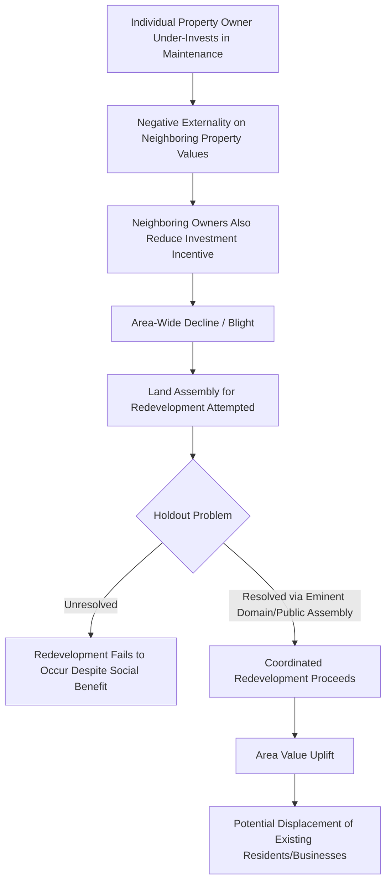

## Urban Renewal and Redevelopment Programs

### Definition and Historical Context

Urban renewal refers to large-scale, typically government-led programs aimed at redeveloping deteriorated or "blighted" urban areas through demolition and reconstruction, infrastructure upgrading, and land-use reorganization. The term is most closely associated with the mid-20th-century wave of programs implemented across North America and Europe (notably the U.S. Housing Act of 1949 and 1954, and comparable post-war reconstruction and slum-clearance programs elsewhere), though the underlying policy logic — public intervention to address perceived market failure in the redevelopment of declining urban areas — continues in modern forms often termed "urban redevelopment" or "regeneration."

**Key Points**

- Classical urban renewal (roughly 1950s-1970s) emphasized large-scale clearance and reconstruction, often displacing existing residents and businesses
- Contemporary redevelopment/regeneration approaches generally emphasize rehabilitation, mixed-income development, and greater resident participation, reflecting lessons drawn from documented failures of the classical model
- Both approaches share a common economic rationale rooted in addressing externalities and coordination failures in property markets, but differ substantially in instrument choice and distributional consequences

### Economic Rationale for Public Intervention

#### Externalities and Neighborhood Decline

Urban renewal's core economic justification rests on the presence of negative externalities associated with property deterioration: a single poorly maintained or abandoned property can depress the value and maintenance incentives of neighboring properties, since property owners bear the full cost of upkeep and improvement but capture only a fraction of the resulting neighborhood-wide benefit (adjacent property value increases, reduced crime, improved area reputation). This generates a coordination failure in which individually rational under-investment by dispersed property owners produces an aggregate area-wide decline that no individual owner has sufficient private incentive to reverse.

$$MPB_{owner} < MSB_{neighborhood}$$

where $MPB_{owner}$ is the marginal private benefit an individual owner captures from property improvement and $MSB_{neighborhood}$ is the marginal social benefit including spillovers to neighboring properties. This externality-based logic parallels the innovation-spillover rationale for public investment discussed under innovation districts, applied here to physical property condition rather than knowledge.

#### Land Assembly Problems

Redevelopment of blighted areas at an economically efficient scale frequently requires assembling multiple, separately owned parcels into a single larger site, since profitable redevelopment (a shopping center, large residential complex, or mixed-use development) often requires minimum efficient scale exceeding individual parcel size. Land assembly faces a **holdout problem**: once a developer has acquired most parcels needed for a project, the remaining parcel owners recognize their bargaining leverage has increased (the developer has sunk costs in the parcels already acquired and needs the final parcels to proceed), and can extract prices well above the parcel's standalone market value. Anticipating this, developers may be deterred from initiating assembly at all, producing under-provision of redevelopment relative to the social optimum even where redevelopment would be efficient if assembly costs were not inflated by strategic holdout behavior.

Urban renewal programs historically addressed the holdout problem through the use of eminent domain (compulsory purchase), allowing government agencies to assemble land at appraised "fair market value" rather than being subject to holdout-inflated negotiated prices — a power subsequently exercised on behalf of, or transferred to, private redevelopers in many renewal programs.

#### Filtering Theory and Housing Quality

Classical urban economics filtering theory holds that housing quality naturally depreciates over time, with units "filtering down" to progressively lower-income occupants as they age, while new housing construction occurs primarily at the top of the quality distribution. Urban renewal proponents historically argued that filtering alone was insufficient to address severe blight, since below some deterioration threshold, rehabilitation costs exceed the value rehabilitation would create, making demolition and reconstruction the only economically viable path to restoring an area's housing stock quality — a claim that later critiques (discussed below) argued was frequently applied too broadly, condemning rehabilitable housing stock.

### Diagram: Externality-Based Rationale for Renewal Intervention

### Classical Urban Renewal: Instruments and Implementation

| Instrument | Mechanism | Typical Era of Use |
| --- | --- | --- |
| Eminent domain / compulsory purchase | Government-compelled land acquisition at appraised value, overriding holdout leverage | Mid-20th century onward, still available but more constrained by subsequent legal reform in many jurisdictions |
| Slum clearance and demolition | Wholesale removal of existing structures deemed substandard or blighted | Predominant mid-20th century approach |
| Public housing construction | Direct government construction of replacement housing, often at increased density | Common accompaniment to clearance in many programs |
| Land write-down to private developers | Government acquires land via eminent domain, then sells/leases to private developers below acquisition cost to induce redevelopment | Common financing mechanism bridging public assembly and private redevelopment execution |
| Urban renewal authorities | Dedicated public agencies with land assembly, financing, and planning powers specific to designated renewal areas | Institutional vehicle for program implementation |

### Critiques of Classical Urban Renewal

#### Jane Jacobs' Critique

Jane Jacobs' *The Death and Life of Great American Cities* (1961) provided an influential and lasting critique of classical urban renewal, arguing that large-scale clearance destroyed the fine-grained mix of building ages, uses, and street-level activity that generated organic neighborhood vitality and informal social control ("eyes on the street"), replacing it with superblock developments that Jacobs argued were frequently *less* safe, less economically vibrant, and less socially functional than the neighborhoods they replaced — despite meeting formal blight-clearance objectives. This critique connects directly to the building-stock-diversity arguments discussed under startup ecosystems (old, low-cost building stock supporting small-scale entrepreneurship) and innovation districts (Jacobs externalities from land-use diversity).

#### Displacement and Distributional Consequences

A central empirical and normative critique documents that urban renewal programs frequently displaced substantially more housing units (particularly low-cost units occupied by low-income and minority residents) than were replaced by subsequent redevelopment, and that displaced residents often lacked adequate relocation assistance or comparable-quality replacement housing — the origin of the frequently cited characterization of urban renewal as "Negro removal" in U.S. policy history, reflecting the disproportionate impact on Black urban communities. This displacement critique parallels concerns raised under informal settlements (forced eviction/clearance outcomes) and innovation districts/creative class development (gentrification-driven displacement), representing a recurring tension across multiple urban policy domains between area-level economic upgrading and incumbent resident welfare.

#### Community Destruction and Social Capital Loss

Beyond physical displacement, critiques emphasize the loss of established social networks, informal community institutions, and place-based social capital when established neighborhoods were demolished, effects that are difficult to compensate through standard property-value-based relocation payments since social capital and community ties are not fully capitalized into individual property values.

#### Fiscal and Implementation Critiques

Empirical assessments of classical urban renewal programs frequently found that redevelopment following clearance proceeded slower than anticipated, leaving cleared sites vacant for extended periods ("urban renewal as urban removal" in some critical characterizations), and that the fiscal benefits (increased property tax revenue from redeveloped sites) frequently fell short of program cost projections, partly because private redevelopment interest was overestimated relative to actual post-clearance market demand.

**[Inference]** These critiques are well-established in the urban planning and economic history literature regarding the classical (mid-20th-century) renewal era specifically; the extent to which they apply to specific individual programs or areas varies, and some classical-era renewal projects are documented as having achieved their intended redevelopment and revitalization objectives more successfully than others.

### Contemporary Redevelopment and Regeneration Approaches

Reflecting lessons drawn from classical urban renewal critiques, contemporary urban redevelopment/regeneration policy generally emphasizes different instruments and objectives:

| Feature | Classical Urban Renewal | Contemporary Redevelopment/Regeneration |
| --- | --- | --- |
| Primary method | Large-scale demolition and reconstruction | Rehabilitation, infill development, adaptive reuse |
| Resident displacement | Frequently extensive, limited relocation support | Explicit displacement mitigation policy emphasis (though not always successfully achieved) |
| Housing mix objective | Often single-use public housing replacement | Mixed-income, mixed-use development emphasis |
| Community role | Top-down planning, limited resident input | Greater emphasis on participatory planning processes (though extent varies substantially) |
| Financing instruments | Direct public land assembly and write-down | Greater reliance on tax increment financing, public-private partnerships, land value capture (see Infrastructure Gaps topic) |
| Scale | Large superblock-scale clearance | More typically parcel-by-parcel or smaller-scale, incremental intervention |

#### HOPE VI and Mixed-Income Public Housing Redevelopment

A notable contemporary U.S. redevelopment model, HOPE VI (and related mixed-income public housing transformation programs), replaced deteriorated, often high-rise public housing projects with lower-density, mixed-income developments, combining demolition of severely distressed public housing with a design philosophy explicitly informed by Jacobs-style critiques of superblock isolation and single-use concentration of poverty. **[Inference]** Empirical evaluations of such programs have found improved physical environment and reduced concentrated poverty at redevelopment sites in many cases, alongside continued debate regarding displacement of original residents (not all of whom return to redeveloped sites) and whether overall regional low-income housing supply is adequately maintained through one-for-one or expanded replacement commitments.

#### Tax Increment Financing (TIF) as a Contemporary Redevelopment Tool

As introduced under infrastructure financing, TIF has become a widely used contemporary instrument for redevelopment area financing: a designated redevelopment district's property tax base is frozen at pre-redevelopment levels for baseline government revenue purposes, with incremental tax revenue generated by resulting property value increases directed toward repaying bonds issued to finance the redevelopment's public infrastructure and site preparation costs.

$$\text{TIF Revenue}_t = \tau \cdot (V_t - V_{baseline})$$

where $\tau$ is the property tax rate, $V_t$ is assessed property value in period $t$, and $V_{baseline}$ is the frozen baseline assessed value at TIF district formation. **[Inference]** TIF's effectiveness and appropriate use is debated in the public finance literature; a persistent methodological and policy concern is the "but-for" question — whether the redevelopment and associated value increase would have occurred without TIF financing (in which case TIF diverts revenue from general government services without generating truly additional redevelopment), a question that is inherently difficult to resolve empirically for any specific case since it requires observing a counterfactual.

### Illustrative Chart: Property Value Trajectory Under TIF-Financed Redevelopment (svg_diagram)

<svg xmlns="http://www.w3.org/2000/svg" viewBox="0 0 720 420" font-family="Arial, sans-serif">
<text x="360" y="28" text-anchor="middle" font-size="18" font-weight="bold">Stylized TIF District Property Value Path (svg_diagram)</text>
<line x1="90" y1="360" x2="680" y2="360" stroke="#333" stroke-width="2" />
<line x1="90" y1="360" x2="90" y2="60" stroke="#333" stroke-width="2" />
<text x="385" y="395" text-anchor="middle" font-size="13">Time</text>
<text x="35" y="210" text-anchor="middle" font-size="13" transform="rotate(-90 35 210)">Assessed Property Value</text>
<line x1="90" y1="320" x2="680" y2="320" stroke="#333" stroke-width="1.5" stroke-dasharray="5,3" />
<text x="500" y="312" font-size="12">Baseline value (frozen for general fund)</text>
<path d="M 200 320 L 200 300 Q 350 260 500 150 L 640 100" stroke="#1f77b4" stroke-width="3" fill="none" />
<text x="450" y="140" font-size="12" fill="#1f77b4">Post-redevelopment value growth</text>
<line x1="200" y1="320" x2="200" y2="60" stroke="#333" stroke-width="1" stroke-dasharray="3,3" />
<text x="205" y="75" font-size="11">TIF district formed</text>
<path d="M 250 300 L 250 240" stroke="#d62728" stroke-width="1.5" marker-end="url(#arrow)" />
<text x="255" y="270" font-size="11" fill="#d62728">Increment captured for bond repayment</text>
</svg>

### Distinguishing Renewal/Redevelopment From Related Concepts

| Concept | Focus | Relationship to Urban Renewal |
| --- | --- | --- |
| Gentrification | Market-driven neighborhood socioeconomic upgrading and displacement | Can occur independent of formal renewal programs, but renewal/redevelopment programs are frequently a direct trigger or accelerant of gentrification dynamics |
| Historic preservation | Retention and adaptive reuse of existing historic building stock | Often in tension with clearance-based renewal; increasingly integrated into contemporary redevelopment practice |
| Brownfield redevelopment | Remediation and reuse of contaminated former industrial sites | A specific redevelopment sub-category with distinct environmental remediation cost and liability considerations |
| Slum upgrading (developing-country context) | In-situ infrastructure improvement without demolition, as discussed under Informal Settlements | Represents the "upgrading not clearance" alternative model, philosophically aligned with contemporary vs. classical renewal distinction |

### Policy Design Considerations for Contemporary Programs

**Key Points**

1. **Displacement mitigation mechanisms**: right-to-return policies, relocation assistance, and affordable housing set-asides are increasingly standard design features intended to address the central historical critique of classical renewal
2. **Genuine community participation versus token consultation**: the depth and influence of resident participation processes varies substantially across programs, and critics note that formal participatory processes do not guarantee that community preferences meaningfully shape final redevelopment outcomes
3. **Balancing redevelopment scale and holdout-problem resolution**: contemporary legal and political constraints on eminent domain use (tightened in various jurisdictions partly in response to classical renewal-era abuses and subsequent controversial case law) mean modern redevelopment must often rely more heavily on voluntary land assembly and negotiated acquisition, which can slow project timelines and cap achievable redevelopment scale relative to the classical-era approach
4. **Fiscal impact analysis rigor**: given the "but-for" ambiguity in TIF and similar instruments, sound program design increasingly incorporates more rigorous ex-ante fiscal impact modeling, though it is inherent limitation that true counterfactual verification remains impossible after the fact

### Related Topics

- Externalities and coordination failures in property markets
- Eminent domain and land assembly economics
- Filtering theory of housing quality depreciation
- Jane Jacobs' critique of urban planning and neighborhood diversity
- Gentrification and displacement (cross-reference: innovation districts, creative class thesis)
- Tax increment financing and land value capture instruments
- Public housing policy and mixed-income redevelopment models
- Informal settlement upgrading as an alternative to clearance-based intervention
- Historic preservation and adaptive reuse economics
- Participatory planning and community engagement in redevelopment policy