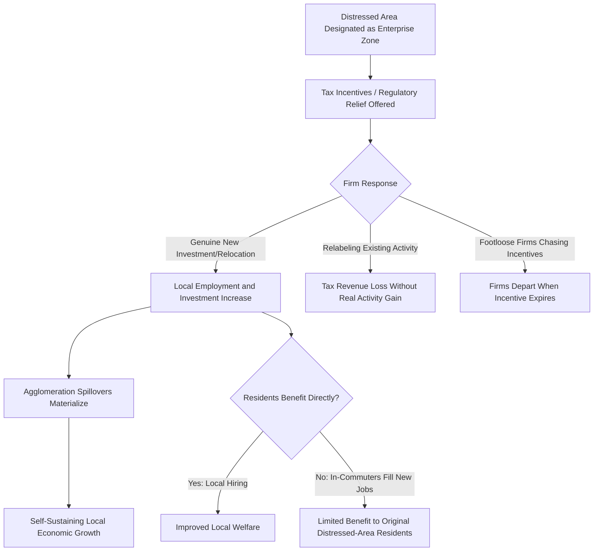

## Place-Based Policies and Enterprise Zones

### Definition and Conceptual Framework

Place-based policies are government interventions that target economic assistance, incentives, or regulatory relief to specific geographically defined areas, rather than to individuals or firms irrespective of location (the latter termed "people-based" or "spatially neutral" policy). Enterprise zones are a specific and widely studied instrument within this broader category: designated geographic areas, typically distressed urban or economically lagging regions, within which firms receive tax incentives, regulatory relief, or subsidies conditional on locating, investing, or hiring within the zone boundary.

**Key Points**

- Place-based policy is defined by the geographic targeting mechanism itself, not by any single instrument; enterprise zones are one instrument among several (others include empowerment zones, opportunity zones, special economic zones, and free trade zones)
- The place-based versus people-based policy debate is a foundational normative and empirical question in regional economics, concerning whether it is more efficient and equitable to help disadvantaged *places* or to help disadvantaged *people* (who may or may not remain in the targeted place)
- Enterprise zone-style programs exist across a very wide range of national contexts and income levels, from developed-country urban revitalization programs to developing-country export-oriented special economic zones

### Theoretical Rationale for Place-Based Intervention

#### Agglomeration Spillovers and Coordination Failure

As introduced under innovation districts and urban renewal, place-based intervention is frequently justified on externality grounds: if firm location decisions generate positive spillovers on other firms and workers in the same area (via the Marshallian mechanisms of labor pooling, input sharing, and knowledge spillovers), then individual firms locating in a distressed area do not capture the full social benefit of their location decision, leading to under-investment in distressed-area location relative to the social optimum. Coordinated public intervention (via zone designation and incentives) is theorized to help overcome this coordination failure by inducing a critical mass of firms to locate simultaneously, each firm's presence increasing the attractiveness of the location for the others.

$$MSB_{firm\ location} > MPB_{firm\ location} \text{ in distressed areas with latent agglomeration potential}$$

#### Multiplier Effects and Local Labor Market Slack

A distinct rationale, more Keynesian/macroeconomic in character, holds that in areas with substantial labor market slack (high unemployment, underutilized capital), place-targeted stimulus can generate larger local employment multiplier effects than would occur in a tight labor market, since new firm investment draws on otherwise idle local labor and capital resources rather than bidding resources away from other productive uses (crowding out), which is the standard concern in tight labor markets.

#### Equity Rationale: Helping People by Helping Places

A normative rationale distinct from the efficiency arguments above holds that place-based intervention is justified on equity grounds when residents of distressed areas face significant barriers to relocating toward opportunity (housing market frictions, social/family ties, limited information about opportunities elsewhere, or the cost of moving itself), meaning that improving conditions in the place where disadvantaged people currently live may be a more effective way to improve their welfare than policies premised on their relocating to opportunity elsewhere.

### The Place-Based vs. People-Based Policy Debate

This debate, central to modern regional economics, contrasts two policy philosophies:

| Dimension | Place-Based Policy | People-Based Policy |
| --- | --- | --- |
| Targeting mechanism | Geographic area designation | Individual/household eligibility (income, employment status) |
| Underlying assumption | Residents face relocation frictions; local conditions can be durably improved | Individuals should be enabled to move toward opportunity; assistance should follow the person |
| Risk if assumption is wrong | Subsidizing firms/investment that would locate there regardless (deadweight loss), or attracting only mobile "footloose" investment providing limited durable benefit | Failing to account for genuine relocation frictions, leaving place-based disadvantage unaddressed |
| Classic instruments | Enterprise zones, special economic zones, place-targeted infrastructure investment | Earned income tax credits, unemployment insurance, means-tested transfers, relocation vouchers |
| Key empirical question | Does the policy induce genuinely additional economic activity, or merely relocate/rebrand activity that would have occurred anyway? | Does removing the "place" support leave immobile or disadvantaged residents worse off? |

**[Inference]** This dichotomy is a standard organizing framework in the academic regional policy literature (associated substantially with work by economists including Glaeser and Gottlieb, and Kline and Moretti, among others); most actual policy portfolios in practice combine elements of both approaches rather than adopting one philosophy exclusively, and the appropriate balance is a matter of ongoing empirical and normative debate rather than settled consensus.

### Diagram: Place-Based Policy Rationale and Risk Pathways

### Enterprise Zones: Instrument Design

Enterprise zone programs typically combine several instrument types, varying by jurisdiction and program generation:

- **Tax incentives**: reduced corporate/business tax rates, investment tax credits, property tax abatements, and employment/hiring tax credits for jobs created within the zone
- **Regulatory relief**: streamlined permitting processes, relaxed zoning or building code requirements, reduced compliance burden for zone-located firms
- **Direct subsidies and grants**: capital grants for zone-located investment, infrastructure investment targeted specifically at the zone
- **Customs and trade privileges** (in special economic zone/free trade zone variants common in developing-country contexts): duty-free import of production inputs, streamlined export processing, often paired with foreign direct investment attraction objectives

**Example**

A hypothetical enterprise zone might offer: a 10-year property tax abatement on new commercial investment, a per-employee hiring tax credit for jobs filled by zone-resident workers, and expedited permitting for qualifying development projects — a combination illustrating the typical layering of tax, employment, and regulatory instruments within a single program.

### Empirical Evidence on Enterprise Zone Effectiveness

#### General Findings Pattern

The empirical literature evaluating enterprise zone and similar place-based tax incentive programs has generally found mixed and often modest effects relative to program cost, with several recurring patterns:

- **Employment effects are frequently smaller than program advocates project**, and in some studies are not statistically distinguishable from zero once appropriate comparison areas and pre-existing trend differences are accounted for
- **Substantial displacement/relabeling concerns**: a portion of measured "new" employment or investment within zone boundaries in some studies appears to reflect relocation of existing activity from just outside the zone boundary (attracted purely by the tax differential) rather than genuinely new regional economic activity — a finding consistent with the "relabeling" risk pathway in the diagram above
- **Benefit incidence often favors firm owners/landowners over targeted-area residents**: several studies find that zone incentives are substantially capitalized into commercial land values (an economic incidence outcome analogous to standard tax-incidence theory, where subsidies to a location get capitalized into the price of the fixed local factor — land) rather than flowing primarily to wage gains for targeted-area resident workers, particularly where zone-created jobs are disproportionately filled by in-commuters rather than local residents

**[Inference]** These are general patterns identified across a substantial body of program evaluation literature spanning multiple countries and program generations; individual program effectiveness varies considerably, and some specific enterprise zone programs have been found in individual studies to generate more favorable employment and investment outcomes than the general pattern would suggest. Specific quantitative effect-size claims for any named program should be verified against current, program-specific evaluation literature rather than assumed from the general pattern.

#### Methodological Challenges in Evaluation

Rigorous evaluation of enterprise zone effectiveness faces a persistent identification challenge: since zones are typically designated based on pre-existing economic distress (non-random assignment), naive before-after or zone-versus-non-zone comparisons risk conflating the incentive program's causal effect with pre-existing negative trend differences between distressed (zone) and non-distressed (comparison) areas — a form of selection bias requiring careful quasi-experimental design (e.g., boundary discontinuity designs comparing areas immediately inside versus outside zone boundaries, or synthetic control methods) to credibly isolate.

### Illustrative Chart: Stylized Enterprise Zone Boundary Discontinuity (svg_diagram)

<svg xmlns="http://www.w3.org/2000/svg" viewBox="0 0 720 420" font-family="Arial, sans-serif">
<text x="360" y="28" text-anchor="middle" font-size="18" font-weight="bold">Boundary Discontinuity Evaluation Design (svg_diagram)</text>
<line x1="90" y1="360" x2="680" y2="360" stroke="#333" stroke-width="2" />
<line x1="90" y1="360" x2="90" y2="60" stroke="#333" stroke-width="2" />
<text x="385" y="395" text-anchor="middle" font-size="13">Distance from Zone Boundary</text>
<text x="35" y="210" text-anchor="middle" font-size="13" transform="rotate(-90 35 210)">Employment Growth Rate</text>
<line x1="385" y1="60" x2="385" y2="360" stroke="#333" stroke-width="1.5" stroke-dasharray="5,3" />
<text x="390" y="75" font-size="12">Zone Boundary</text>
<text x="200" y="380" text-anchor="middle" font-size="11">Outside Zone</text>
<text x="550" y="380" text-anchor="middle" font-size="11">Inside Zone</text>
<path d="M 100 260 Q 250 250 375 245" stroke="#1f77b4" stroke-width="3" fill="none" />
<path d="M 395 200 Q 500 190 670 175" stroke="#1f77b4" stroke-width="3" fill="none" />
<line x1="375" y1="245" x2="395" y2="200" stroke="#d62728" stroke-width="2" stroke-dasharray="4,3" />
<text x="410" y="215" font-size="12" fill="#d62728">Discontinuity = estimated treatment effect</text>
</svg>

### Special Economic Zones (Developing-Country Context)

In developing-country contexts, place-based zone policy frequently takes the form of special economic zones (SEZs) or export processing zones (EPZs), oriented primarily toward attracting export-oriented foreign direct investment through customs privileges, tax holidays, and streamlined regulatory/labor compliance regimes, often combined with dedicated infrastructure provision (reliable power, port access, industrial parks) that may be otherwise unavailable at adequate quality outside the zone given the infrastructure gap constraints discussed under rapidly urbanizing cities.

**[Inference]** SEZ program outcomes across developing countries vary substantially, with some prominent cases (frequently cited in development economics, e.g., China's early Special Economic Zones from the late 1970s-1980s) associated with substantial export growth, foreign investment attraction, and subsequent broader economic reform diffusion, while other SEZ programs in various countries have been documented as generating limited employment or spillover benefit relative to the fiscal cost of incentives and dedicated infrastructure provision. Given this heterogeneity, general claims about SEZ effectiveness should specify the particular country/program context rather than treating SEZs as a uniformly effective or ineffective policy category.

### Opportunity Zones (Contemporary U.S. Example)

**[Unverified — program design and evaluation findings should be verified against current authoritative sources if used for specific claims]** The U.S. Opportunity Zones program (established under 2017 tax legislation) represents a contemporary variant of place-based tax incentive policy, providing capital gains tax deferral and reduction benefits for investment channeled through qualified opportunity funds into designated low-income census tract zones. Early evaluation literature on this program has examined questions similar to those raised for classical enterprise zones: the extent to which investment represents genuinely additional activity versus relabeled/relocated investment, and the distribution of benefits between investors/property owners and existing zone residents.

### Design Considerations for Improving Place-Based Policy Effectiveness

**Key Points**

1. **Targeting zones with genuine latent agglomeration potential**: the coordination-failure rationale for place-based policy is strongest where a distressed area has underlying locational fundamentals (transport access, proximity to markets, latent labor force skills) that could support viable economic activity if the coordination failure were resolved, as opposed to areas whose distress reflects fundamentally unfavorable economic geography that incentives alone cannot overcome
2. **Complementing tax incentives with public investment in local human capital and infrastructure**: pure tax-incentive approaches address only the firm-location-cost side of the equation; combining incentives with local workforce training and infrastructure investment addresses both firm cost and the absorptive-capacity/skill-matching concerns relevant to ensuring local residents benefit from resulting job creation
3. **Local hiring requirements or incentive structures**: conditioning some portion of incentive value on demonstrated local-resident hiring can help address the benefit-incidence concern that zone-created jobs disproportionately go to in-commuters rather than targeted-area residents
4. **Sunset provisions and rigorous evaluation design**: building in program evaluation design (including comparison-area selection sufficient to support credible causal inference) and time-limited program provisions subject to renewal based on demonstrated effectiveness, addressing the general finding that legacy programs often persist without rigorous effectiveness re-assessment
5. **Awareness of interjurisdictional competition/race-to-the-bottom risk**: since neighboring jurisdictions can respond to a zone program with their own competing incentives, place-based tax competition between jurisdictions can erode the net incentive value to firms while each jurisdiction bears the fiscal cost, a collective-action problem that individual jurisdiction-level program design cannot fully resolve without some form of inter-jurisdictional coordination

### Related Topics

- Agglomeration economies and coordination failure rationale for public intervention
- Urban renewal and redevelopment programs (shared externality-based intervention logic)
- Tax incidence theory and capitalization into land values
- Special economic zones and export-oriented industrialization policy
- Regional labor mobility and relocation frictions
- Boundary discontinuity and quasi-experimental program evaluation methods
- Fiscal federalism and interjurisdictional tax competition
- Innovation districts as a complementary place-based instrument
- Infrastructure gaps and public investment complementarity
- Opportunity Zones and contemporary U.S. place-based tax policy