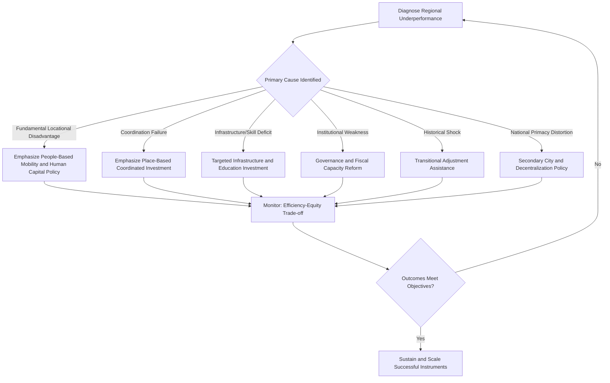

## Regional Development Policy Design

### Definition and Scope

Regional development policy design encompasses the analytical framework, instrument selection, and institutional arrangements governments use to address persistent economic disparities across regions within a country. It synthesizes the theoretical and empirical material from preceding topics — agglomeration economics, place-based versus people-based policy, primate city dynamics, infrastructure gaps, and innovation-driven growth — into a practical framework for designing coherent regional policy interventions rather than isolated instruments.

**Key Points**

- Regional policy design requires diagnosing *why* a region underperforms before selecting instruments, since different underlying causes (weak fundamentals, coordination failure, historical shock, institutional weakness) call for different policy responses
- No single instrument (infrastructure, incentives, decentralization) is sufficient in isolation; effective design typically requires a coherent package addressing multiple binding constraints simultaneously
- Regional policy exists in inherent tension with aggregate national efficiency objectives, since agglomeration economics implies that some degree of spatial concentration is often efficient, not merely a market failure to be corrected

### Diagnosing Regional Disparity: Why Do Regions Underperform?

Effective policy design begins with distinguishing between competing explanations for regional economic underperformance, since the appropriate policy response differs substantially by cause:

| Diagnosis | Description | Appropriate Policy Emphasis |
| --- | --- | --- |
| Fundamental locational disadvantage | Region lacks underlying economic geography advantages (poor transport access, unfavorable resource endowment, small local market) that no feasible policy can fully overcome | People-based policy (mobility support, human capital investment enabling out-migration to opportunity) may dominate place-based investment |
| Coordination failure / agglomeration shortfall | Region has latent fundamentals but is stuck in a low-activity equilibrium due to coordination failure (see place-based policy topic) | Place-based coordinated investment, enterprise zones, anchor institution attraction |
| Infrastructure/human capital deficit | Region has reasonable fundamentals but lacks complementary infrastructure or skilled labor supply | Infrastructure investment, education/training investment |
| Institutional/governance weakness | Region suffers from weak local governance, corruption, or fiscal capacity constraints (see infrastructure gaps and municipal finance) | Institutional capacity building, fiscal decentralization reform, governance strengthening |
| Historical shock/structural transition | Region experienced a specific negative shock (industry decline, resource depletion, trade shock) from which it has not adjusted | Transitional adjustment assistance, targeted diversification support, labor market transition programs |
| Excessive national spatial concentration (primacy) | National urban system is dominated by a single primate city, structurally starving other regions of investment (see primate city formation) | National spatial policy: secondary city development, decentralization, capital relocation |

**[Inference]** In practice, most underperforming regions reflect some combination of these factors rather than a single clean diagnosis, and accurately diagnosing the relative weight of each factor for any specific region requires substantial region-specific empirical analysis rather than generic application of a standard template.

### Theoretical Tension: Efficiency vs. Equity in Spatial Policy

#### The Efficiency Case for Spatial Concentration

Standard agglomeration economics (Marshallian externalities, New Economic Geography core-periphery dynamics, discussed under innovation districts and primate city formation) implies that geographic concentration of economic activity is frequently efficient from a national output-maximization standpoint: dense areas generate productivity benefits (sharing, matching, learning) that dispersed activity cannot replicate. This creates a fundamental tension for regional policy: aggressive redistribution of economic activity toward lagging regions may reduce aggregate national output even while improving spatial equity, since it works against the same agglomeration forces that a well-functioning economy relies on for productivity growth.

$$\text{National Output} = \sum_r Y_r(N_r), \quad \frac{\partial^2 Y_r}{\partial N_r^2} > 0 \text{ over some range (increasing returns to local scale)}$$

Under increasing local returns, redistributing population/activity from a large, productive region to a smaller, less productive one can reduce the sum $\sum_r Y_r$ even as it narrows the gap between $Y_r/N_r$ across regions — the standard efficiency-equity trade-off formalized in spatial economics.

#### The Equity and Option-Value Case for Regional Policy

Counter-arguments for regional policy despite this efficiency tension include: (1) equity concerns independent of aggregate efficiency, reflecting a social preference for reducing regional disparity even at some efficiency cost; (2) the argument that persistent regional decline generates negative externalities of its own (political instability, migration pressure, human capital loss through "brain drain" that is not efficiently priced); (3) the possibility that some regional underperformance reflects genuine coordination failure/market failure (as opposed to efficient sorting), meaning well-designed regional policy can in some cases improve *both* equity and aggregate efficiency simultaneously by correcting the failure rather than fighting efficient concentration.

**[Inference]** Distinguishing empirically, for any specific lagging region, whether its underperformance reflects efficient sorting (in which case aggressive regional policy trades off efficiency for equity) or correctable market failure (in which case well-designed policy could improve both) is one of the most difficult and consequential questions in applied regional economics, and is rarely resolved with high confidence in practice.

### Diagram: Regional Policy Design Decision Framework

### Instrument Portfolio Approach

Given the diagnostic complexity above, contemporary regional policy design literature generally favors a portfolio approach combining multiple complementary instruments rather than reliance on a single tool, informed by the specific diagnosis for the region in question:

#### Infrastructure and Connectivity Investment

As discussed under infrastructure gaps, transport and digital connectivity investment can reduce the effective economic distance between lagging regions and national/international markets, directly addressing the New Economic Geography mechanism whereby high transport costs sustain excessive spatial concentration in a single core region.

#### Human Capital and Institutional Capacity Building

Investment in regional education and health infrastructure addresses both direct human capital constraints and (per the absorptive capacity discussion under university-industry linkages) the capacity of the local economy to benefit from any knowledge spillovers or technology transfer that infrastructure and connectivity investment might otherwise enable.

#### Place-Based Fiscal Incentives

As covered in the place-based policy topic, targeted tax incentives and enterprise zones can address coordination-failure-driven underperformance, subject to the evaluation and design caveats discussed there (deadweight loss risk, benefit incidence concerns, boundary discontinuity evaluation needs).

#### Fiscal Decentralization and Intergovernmental Transfers

Fiscal architecture determines the resources and autonomy available to regional/local governments to pursue development strategies suited to local conditions. Design choices include:

- **Vertical fiscal balance**: the division of taxing and spending authority between national and sub-national government levels, affecting local governments' capacity to finance region-specific infrastructure and services (connecting to the municipal finance constraints discussed under infrastructure gaps)
- **Equalization transfer formulas**: mechanisms redistributing revenue from wealthier to poorer regions, designed to offset the uneven regional tax base that would otherwise perpetuate disparity in locally-financed public service quality
- **Conditional vs. unconditional transfers**: conditional transfers (earmarked for specific uses, e.g., infrastructure or education) provide national-level control over regional spending priorities, while unconditional transfers grant sub-national governments greater discretion suited to local knowledge of priorities, at some cost to national policy coherence

$$\text{Regional Fiscal Capacity}_r = \text{Own-Source Revenue}_r + \text{Transfers}_r$$

Equalization transfer design typically targets narrowing disparities in $\text{Regional Fiscal Capacity}_r$ across regions rather than in pre-transfer own-source revenue alone, recognizing that regions with weaker tax bases require proportionally larger transfers to achieve comparable public service provision.

#### National Spatial Planning and Secondary City Strategy

As discussed under primate city formation, national-level spatial policy (secondary city investment, growth pole strategies, capital relocation) addresses regional disparity at the scale of the overall national urban system rather than through interventions in any single lagging region, on the theory that a more balanced national urban hierarchy provides multiple viable growth poles rather than channeling essentially all agglomeration benefit into a single dominant city.

### Institutional Arrangements for Policy Implementation

| Institutional Model | Description | Trade-off |
| --- | --- | --- |
| Dedicated regional development agencies | Specialized public bodies with authority spanning multiple policy instruments (infrastructure, incentives, planning) for a designated region | Enables coordinated, region-specific strategy; risk of institutional fragmentation from mainstream government functions |
| Sectoral ministry-led implementation | Regional programs implemented through existing national sectoral ministries (transport, education, industry) with regional targeting | Leverages existing institutional capacity; risk of poor cross-sectoral coordination |
| Multi-level governance/partnership models | Formal coordination mechanisms between national, regional, and local government tiers, often with private-sector and civil-society participation | Can improve information flow and buy-in; often slower decision-making and diffused accountability |
| Devolved/decentralized regional authority | Substantial autonomous authority granted directly to regional governments over their own development strategy | Maximizes local-knowledge utilization; requires adequate local institutional capacity, which may itself be a binding constraint in weaker-capacity regions |

**[Inference]** The relative effectiveness of these institutional models is highly context-dependent on pre-existing governance capacity and political-administrative traditions; the comparative institutional design literature does not support a single universally superior model applicable across all country contexts.

### Illustrative Chart: Efficiency-Equity Trade-off Frontier (svg_diagram)

<svg xmlns="http://www.w3.org/2000/svg" viewBox="0 0 720 440" font-family="Arial, sans-serif">
<text x="360" y="28" text-anchor="middle" font-size="18" font-weight="bold">Regional Policy Efficiency-Equity Trade-off (svg_diagram)</text>
<line x1="90" y1="380" x2="680" y2="380" stroke="#333" stroke-width="2" />
<line x1="90" y1="380" x2="90" y2="60" stroke="#333" stroke-width="2" />
<text x="385" y="415" text-anchor="middle" font-size="13">Regional Equity (reduced disparity)</text>
<text x="35" y="220" text-anchor="middle" font-size="13" transform="rotate(-90 35 220)">National Aggregate Output</text>
<path d="M 640 100 Q 400 130 150 340" stroke="#1f77b4" stroke-width="3" fill="none" />
<text x="330" y="200" font-size="12" fill="#1f77b4">Trade-off frontier (efficient sorting scenario)</text>
<circle cx="640" cy="100" r="6" fill="#d62728" />
<text x="600" y="85" font-size="11" fill="#d62728">Pure agglomeration-maximizing outcome</text>
<circle cx="150" cy="340" r="6" fill="#2ca02c" />
<text x="160" y="360" font-size="11" fill="#2ca02c">Maximum dispersion outcome</text>
<path d="M 640 100 Q 400 250 150 340" stroke="#9467bd" stroke-width="2.5" fill="none" stroke-dasharray="6,3" />
<text x="300" y="290" font-size="12" fill="#9467bd">Improved frontier (coordination-failure-correcting policy)</text>
</svg>

### Evaluation Challenges in Regional Policy

**Key Points**

1. **Long time horizons**: regional development effects often materialize over years or decades, making standard short-to-medium-term program evaluation windows potentially insufficient to detect true effects, particularly for infrastructure and institutional capacity interventions
2. **Spatial spillovers complicate causal identification**: interventions in a targeted region may generate spillover effects (positive or negative) on neighboring non-targeted regions, violating the standard evaluation assumption that comparison/control regions are unaffected by treatment in the target region
3. **General equilibrium effects**: successful attraction of activity to a lagging region may, at the margin, draw investment or labor away from other regions rather than representing pure net national gain, an effect that partial, single-region evaluation designs are often not equipped to detect
4. **Attribution difficulty in multi-instrument portfolios**: given the portfolio approach recommended above, isolating the causal contribution of any single instrument within a broader coordinated regional strategy is often not econometrically feasible, complicating efforts to determine which specific components of a regional strategy are doing the analytical work

### Synthesis: Principles for Coherent Regional Policy Design

**Key Points**

1. **Diagnose before prescribing**: instrument selection should follow from a credible, region-specific diagnosis of underperformance causes rather than default application of a generic policy template
2. **Recognize the efficiency-equity trade-off explicitly**: policy design should be transparent about whether and how much aggregate efficiency is being traded for regional equity objectives, rather than assuming regional policy is costless from a national output perspective
3. **Favor coordination-failure-correcting interventions where identifiable**: policies that plausibly address genuine market failure (agglomeration coordination problems, infrastructure gaps, institutional capacity deficits) have a stronger theoretical claim to simultaneously improving efficiency and equity than policies that simply redistribute activity against underlying economic geography fundamentals
4. **Build in rigorous, sufficiently long-horizon evaluation from program design onward**: given the evaluation challenges above, credible impact assessment capacity should be designed into programs from inception rather than retrofitted, including consideration of spatial spillover and general equilibrium effects where feasible
5. **Match institutional design to existing governance capacity**: the sophistication of the chosen institutional and instrument design should be calibrated to genuinely available local and national administrative capacity, since even theoretically well-designed policy can fail through weak implementation capacity

### Related Topics

- Place-based policies and enterprise zones (instrument-level detail)
- Primate city formation and national spatial policy
- Infrastructure gaps and municipal fiscal capacity
- Agglomeration economies and New Economic Geography
- Fiscal federalism and intergovernmental transfer design
- University-industry linkages and regional innovation systems
- Urban renewal and redevelopment programs
- Regional labor mobility and migration policy
- Growth pole theory and secondary city development
- Program evaluation methods for spatially targeted policy