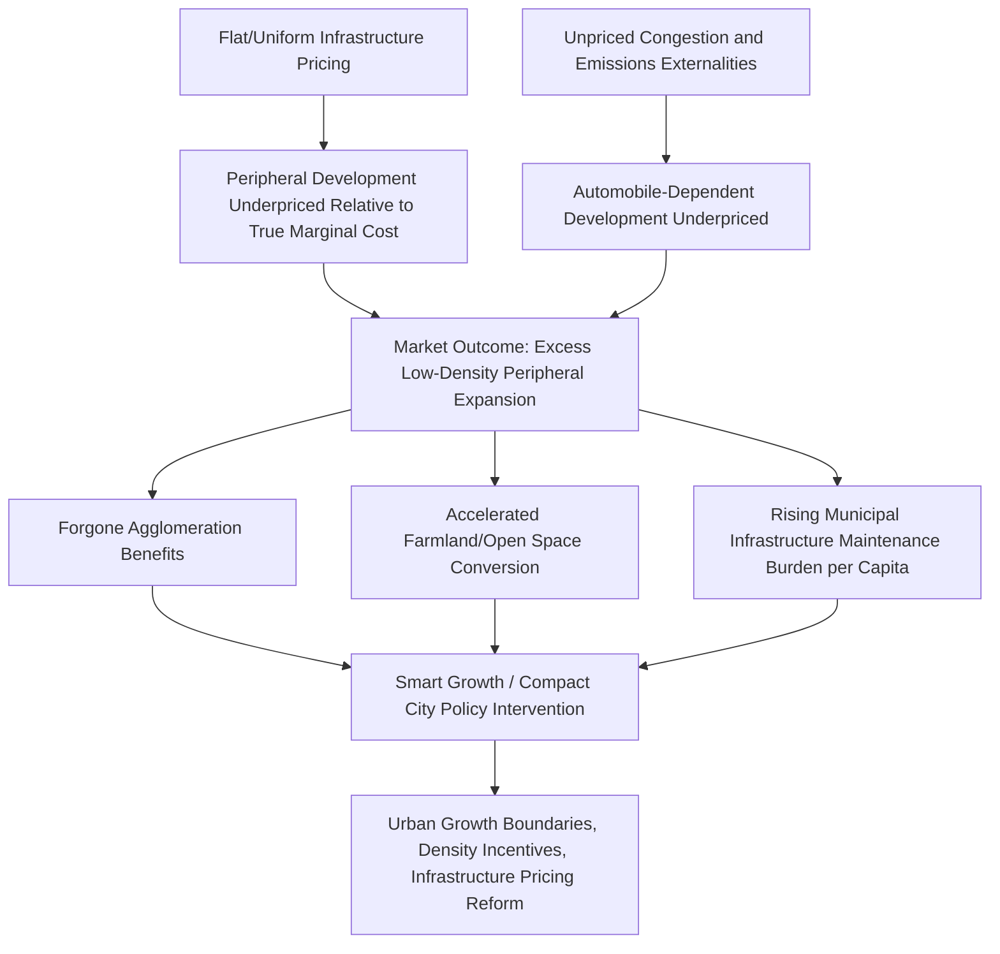

## Smart Growth and Compact City Policies

### Definition and Conceptual Framework

Smart growth and compact city policies are urban planning and regulatory frameworks aimed at directing urban development toward higher-density, mixed-use, infill patterns rather than low-density, automobile-dependent peripheral expansion (commonly termed "sprawl"). While "smart growth" originated primarily as a North American planning movement (formalized substantially through the work of organizations such as the Smart Growth Network in the 1990s) and "compact city" is more associated with European and international planning discourse, both frameworks share a core policy logic: urban form itself has significant economic, environmental, and fiscal consequences, and market outcomes left unregulated tend toward excessive dispersion relative to the social optimum.

**Key Points**

- Both frameworks treat urban spatial form as a policy-relevant variable, not merely an outcome of underlying economic fundamentals
- The core economic argument rests on externalities and public-good under-pricing associated with low-density development, discussed in detail below
- Policy instruments span land-use regulation, infrastructure investment sequencing, and pricing mechanisms, often used in combination

### Economic Rationale: Why Might Sprawl Be Inefficient?

#### Unpriced Infrastructure Costs

Low-density peripheral development typically requires more linear infrastructure (roads, water mains, sewer lines, power distribution) per unit of housing or economic activity served, compared to higher-density development, because infrastructure costs scale substantially with distance and are subject to the density-related economies of scale discussed under infrastructure gaps. Where infrastructure costs are financed through general municipal revenue or flat connection fees rather than development charges reflecting the true marginal cost of extending service to a given location, new peripheral development is effectively cross-subsidized by existing residents and more centrally located development, creating a systematic incentive toward excessive peripheral expansion relative to the full-cost-reflective optimum.

$$MC_{infrastructure}(d) = MC_0 + \beta \cdot d$$

where $d$ is distance from existing infrastructure networks and $\beta > 0$ reflects the marginal cost of infrastructure extension per unit distance. If development charges are flat (independent of $d$) rather than distance-reflective, peripheral developers and residents do not face the true marginal social cost of their location choice, generating the standard economic prediction of excess consumption (in this case, excess peripheral land consumption) when a good is priced below its marginal social cost.

#### Unpriced Transportation Externalities

Automobile-dependent, low-density development patterns are associated with higher per-capita vehicle miles traveled, generating negative externalities including congestion (each additional driver imposes delay costs on other drivers not reflected in their private travel cost calculation), local air pollution, and greenhouse gas emissions. Where fuel taxes, road pricing, or other mechanisms do not fully internalize these externalities (a near-universal condition in practice, since optimal Pigouvian congestion/carbon pricing is rarely implemented at full efficient levels), low-density development patterns that generate more vehicle travel are effectively subsidized relative to their true social cost.

#### Loss of Agglomeration Benefits

As established under the urbanization-growth linkages and innovation districts topics, agglomeration economies (sharing, matching, learning) generally increase with density up to a congestion-driven optimum. Dispersed, low-density development patterns forgo some potential agglomeration benefit relative to more compact alternatives, representing an efficiency cost distinct from the infrastructure and transportation externality arguments above — this is a foregone-benefit argument rather than a negative-externality argument, and is more contested in the literature since it requires assuming that observed low-density outcomes reflect a market or regulatory distortion rather than genuine household/firm preference for lower density that appropriately trades off against agglomeration benefit.

#### Farmland and Open Space Conversion

Low-density peripheral development converts agricultural and undeveloped land at a faster rate per unit of population/economic activity accommodated than compact development, generating an argument for smart growth intervention where farmland or open space is believed to generate positive externalities (ecosystem services, food security, landscape amenity value) not fully captured in the market price of land conversion decisions.

### Diagram: Externality-Based Case for Compact Growth Policy

### Core Policy Instruments

#### Urban Growth Boundaries (UGBs)

Urban growth boundaries designate a fixed geographic limit beyond which new urban development is prohibited or heavily restricted, intended to direct growth pressure toward infill and higher-density development within the boundary rather than continued peripheral expansion.

**Economic effects**: By constraining the supply of developable peripheral land, UGBs are predicted by standard supply-and-demand analysis to raise land and housing prices within the boundary relative to an unconstrained counterfactual, all else equal — an effect extensively documented and debated in the empirical urban economics literature (connecting directly to the housing supply elasticity discussion under informal settlements). Whether this price effect represents a policy cost (reduced housing affordability) or is offset by benefits (reduced infrastructure and externality costs, potentially reflected in other price/quality-of-life margins) is a central empirical and normative question in UGB policy evaluation.

$$P_{housing} = f(\text{Land Supply Elasticity}, \text{Demand Growth})$$

A binding UGB reduces effective land supply elasticity ($\varepsilon_{land} \to$ lower), meaning demand growth (population, income) translates disproportionately into price increases rather than quantity increases, echoing the housing supply elasticity mechanism discussed in the informal settlements context but operating through a regulatory boundary constraint specific to compact growth policy rather than general building-code/zoning stringency.

#### Density Incentives and Zoning Reform

Complementary to UGBs (and sometimes used independently), density-promoting zoning reforms include: upzoning (permitting higher density by-right in targeted areas), density bonuses (allowing developers to build at higher density in exchange for public benefits such as affordable housing set-asides), and transit-oriented development zoning (permitting or mandating higher density specifically around transit station areas to maximize transit ridership potential and capture agglomeration benefit near high-capacity transport infrastructure).

#### Infrastructure Cost Pricing Reform

Reforms directed at aligning private development costs with true marginal infrastructure cost, including: distance-based development impact fees (charging peripheral development a fee reflecting the true marginal cost of infrastructure extension, addressing the unpriced infrastructure cost mechanism above), and infrastructure investment sequencing policy (concentrating new infrastructure capacity investment within designated growth areas rather than extending infrastructure reactively to any location where development pressure emerges, using infrastructure availability itself as a growth-management tool).

#### Transportation Pricing and Investment

Congestion pricing, fuel taxes reflecting externality costs, and prioritized investment in public transit versus highway expansion are complementary instruments addressing the unpriced transportation externality mechanism directly, connecting to the broader Pigouvian externality-correction logic in environmental and transport economics.

#### Mixed-Use and Complete Streets Zoning

Zoning reforms permitting or mandating mixed residential-commercial land use (as opposed to strict single-use separation characteristic of much 20th-century zoning practice) are intended to reduce trip distances and support walkability, connecting to the Jacobs-style land-use diversity arguments discussed under urban renewal and startup ecosystems.

### Comparative Instrument Table

| Instrument | Primary Mechanism | Main Intended Effect | Key Trade-off/Risk |
| --- | --- | --- | --- |
| Urban growth boundary | Hard limit on peripheral development extent | Redirect growth to infill/compact form | Housing price/affordability pressure if infill supply response is insufficient |
| Density bonuses/upzoning | Permit higher density by-right or in exchange for benefits | Increase effective housing supply within existing footprint | Local political resistance ("NIMBY" opposition); implementation gaps between permitted and realized density |
| Distance-based impact fees | Price infrastructure extension cost into peripheral development | Internalize previously unpriced infrastructure cost | Fee level calibration difficulty; may simply shift (not reduce) sprawl if fees are too low to bind |
| Transit-oriented development zoning | Mandate/incentivize density near transit stations | Maximize transit ridership and agglomeration benefit near transport investment | Requires coordinated transit investment; ineffective without adequate transit service quality |
| Congestion pricing | Directly price marginal congestion externality | Reduce auto-dependent travel demand | Political feasibility challenges; potential regressive incidence without careful design |
| Mixed-use zoning reform | Permit combined residential/commercial land use | Reduce trip distances, support walkability | Requires complementary infrastructure (sidewalks, public realm) to realize full walkability benefit |

### Illustrative Chart: Urban Growth Boundary Effect on Housing Prices (svg_diagram)

<svg xmlns="http://www.w3.org/2000/svg" viewBox="0 0 720 420" font-family="Arial, sans-serif">
<text x="360" y="28" text-anchor="middle" font-size="18" font-weight="bold">Stylized Effect of a Binding Urban Growth Boundary (svg_diagram)</text>
<line x1="90" y1="360" x2="680" y2="360" stroke="#333" stroke-width="2" />
<line x1="90" y1="360" x2="90" y2="60" stroke="#333" stroke-width="2" />
<text x="385" y="395" text-anchor="middle" font-size="13">Housing Quantity</text>
<text x="35" y="210" text-anchor="middle" font-size="13" transform="rotate(-90 35 210)">Housing Price</text>
<path d="M 120 340 L 640 100" stroke="#333" stroke-width="2" />
<text x="600" y="90" font-size="11">Demand (D1)</text>
<path d="M 120 260 L 640 200" stroke="#333" stroke-width="2" stroke-dasharray="5,3" />
<text x="600" y="192" font-size="11">Demand (D0, lower)</text>
<path d="M 130 340 Q 300 280 480 90" stroke="#1f77b4" stroke-width="3" fill="none" />
<text x="490" y="100" font-size="11" fill="#1f77b4">Unconstrained supply</text>
<line x1="400" y1="60" x2="400" y2="360" stroke="#d62728" stroke-width="3" />
<text x="405" y="75" font-size="12" fill="#d62728">Growth boundary (fixed quantity limit)</text>
<circle cx="400" cy="205" r="5" fill="#333" />
<text x="330" y="230" font-size="11">Equilibrium under D0</text>
<circle cx="400" cy="110" r="5" fill="#d62728" />
<text x="330" y="130" font-size="11" fill="#d62728">Equilibrium under D1: price rises, quantity fixed</text>
</svg>

### Empirical Evidence and Debates

#### Housing Affordability Effects

A substantial empirical literature has examined the relationship between urban containment policies (UGBs and comparable growth boundary instruments) and housing affordability, generally finding that binding growth boundaries are associated with higher housing prices relative to comparable metropolitan areas without such boundaries, particularly where the boundary is not accompanied by sufficient infill density increases to offset the constrained peripheral supply. This connects the smart growth/compact city literature directly to the housing supply elasticity discussion introduced under informal settlements: the affordability outcome depends critically on whether growth boundary policy is paired with genuine upzoning/density-increase implementation within the boundary, or whether the boundary constrains total supply without a compensating internal density increase.

**[Inference]** This general finding (higher prices associated with binding containment policy absent compensating internal density increases) is well-supported in the empirical literature; the magnitude varies substantially across metropolitan areas and depends heavily on the specific combination of containment and internal density policy implemented, meaning it should not be interpreted as implying all growth-boundary policies produce equivalent affordability effects.

#### Environmental and Vehicle Miles Traveled Effects

Empirical studies generally find that higher-density, mixed-use urban form is associated with lower per-capita vehicle miles traveled and associated emissions, holding income and other factors constant, consistent with the theoretical transportation externality rationale for compact growth policy. **[Inference]** The magnitude of this relationship, and the degree to which it reflects a causal effect of urban form on travel behavior (as opposed to self-selection, where households with lower driving preference choose to live in denser areas) remains a subject of ongoing empirical methodological debate in the urban transportation economics literature.

#### Fiscal Cost Comparisons

Studies comparing municipal service delivery costs (infrastructure, emergency services, schools) across development density patterns generally find lower per-capita servicing costs in higher-density, more compact development patterns, supporting the infrastructure-cost rationale for smart growth policy, though methodological approaches and specific cost estimates vary across studies and jurisdictional contexts.

### International Variation in Compact City Policy Approaches

| Region/Context | Typical Approach | Distinguishing Feature |
| --- | --- | --- |
| United States (smart growth tradition) | Combination of UGBs (e.g., regional examples in the Pacific Northwest), density bonuses, and transit-oriented development zoning | Substantial local/regional government autonomy in implementation; wide variation across metropolitan areas |
| United Kingdom (green belt policy) | Statutory green belt designations restricting development around major cities, in place since mid-20th century | Long-standing, strongly protected boundaries; associated in the literature with significant housing affordability pressure in constrained metropolitan areas |
| Continental Europe (compact city tradition) | Generally higher baseline density and stronger historical land-use planning tradition; compact city policy often building on pre-existing denser urban form rather than reversing established sprawl | Stronger integration with public transit investment as a complementary policy typically deployed alongside density policy |
| East Asian contexts (e.g., transit-oriented development models) | Strong integration of rail transit investment with high-density development around stations, often coordinated through public/quasi-public rail-property development entities | Direct capture of land value uplift near transit stations often used as a transit financing mechanism (connecting to land value capture discussed under infrastructure gaps) |

**[Unverified — specific national/regional policy details and their current status should be verified against current planning-law sources if used for specific claims, since land-use law is subject to ongoing legislative and judicial change in most jurisdictions]**

### Critiques and Limitations

**Key Points**

1. **Affordability risk if not paired with adequate upzoning**: as discussed above, growth boundaries without sufficient compensating density increases risk primarily raising prices rather than achieving compact form objectives, a design failure mode extensively documented in the literature
2. **Local political resistance to density (NIMBYism)**: even where growth boundary or containment policy exists at a regional level, achieving the compensating internal density increases often requires local zoning reform that faces concentrated political resistance from existing residents who bear amenity/congestion costs of new development while capturing limited direct benefit — a collective-action problem parallel to the interjurisdictional competition problem noted under place-based policy
3. **Equity concerns regarding displacement**: compact growth and transit-oriented development policies can trigger the same gentrification and displacement dynamics discussed under innovation districts and urban renewal if rising land values in targeted infill/transit-adjacent areas are not accompanied by affordable housing preservation or inclusion policy
4. **Uncertain net welfare effect where self-selection is strong**: to the extent that observed low-density living patterns partly reflect genuine household preference (for larger lot sizes, single-family housing, or lower density) rather than purely unpriced-externality-driven distortion, compact growth policy restricting low-density development options may impose a welfare cost on households whose genuine preferences are constrained, a tension between the externality-correction rationale and revealed household preference that is not fully resolved in the literature

### Related Topics

- Housing supply elasticity and land-use regulation (informal settlements topic)
- Infrastructure gaps and cost-of-service economics
- Congestion pricing and transportation externality correction
- Transit-oriented development and land value capture
- Innovation districts and mixed-use urban form
- Jane Jacobs' critique and land-use diversity (urban renewal topic)
- Gentrification and displacement risk in targeted growth areas
- Urban growth boundaries and regional housing affordability
- Environmental economics of urban form and vehicle emissions
- Zoning reform and NIMBYism as a collective-action problem