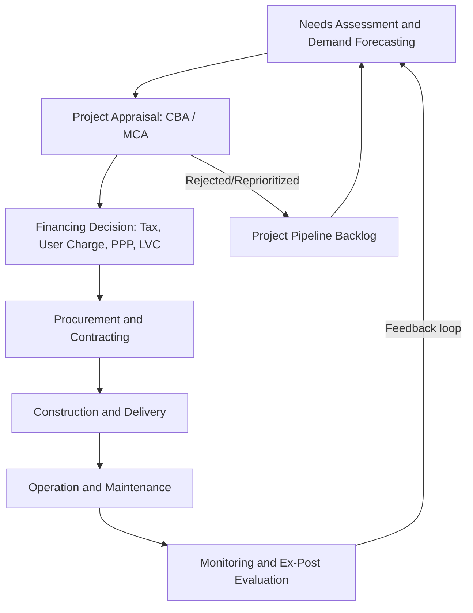

## Infrastructure Investment Policy

### Definition and Scope

Infrastructure investment policy refers to the set of government decisions, instruments, and institutional arrangements governing the financing, provision, and management of long-lived capital assets that support economic activity and urban life. This includes transportation networks (roads, transit, rail, ports, airports), utilities (water, sewer, electricity, telecommunications), and social infrastructure (schools, hospitals, public housing). In urban and regional economics, infrastructure investment is treated as a form of public capital that shapes the spatial distribution of economic activity, land values, agglomeration economies, and regional growth trajectories.

Infrastructure is distinguished economically by several characteristics:

- **Lumpiness**: Large fixed costs relative to marginal costs, creating natural monopoly conditions in many cases
- **Durability**: Asset lives often exceeding 30–100 years, creating path dependence
- **Spatial fixity**: Immobile once built, locking in locational advantages or disadvantages
- **Network effects**: Value often depends on connectivity to the broader system, not just standalone capacity
- **Externalities**: Substantial spillovers to non-users (positive, e.g., agglomeration; negative, e.g., congestion, emissions)

### Theoretical Foundations

**Infrastructure as Public Capital in Production**

A common starting point is treating infrastructure ($G$) as an input into an aggregate production function alongside private capital ($K$) and labor ($L$):

$$Y = A \cdot F(K, L, G)$$

Empirical work in this tradition (following Aschauer's foundational studies) estimates the output elasticity of public capital, though results vary widely depending on specification, level of aggregation, and treatment of reverse causality (richer regions can afford more infrastructure, confounding causal identification).

**Agglomeration and Market Access**

In New Economic Geography and urban economics frameworks, infrastructure investment (particularly transportation) lowers trade costs $\tau$ between locations. Reduced $\tau$ increases effective market access for firms at a location $i$:

$$MA_i = \sum_j \tau_{ij}^{-\theta} Y_j$$

where $\theta$ is the trade elasticity and $Y_j$ is economic mass at destination $j$. Higher market access raises firm productivity and wages through agglomeration externalities, but can also trigger **dispersion** if it lowers the cost for firms to relocate away from congested cores toward cheaper peripheral land — the net effect is ambiguous and depends on the relative strength of centripetal (agglomeration) versus centrifugal (congestion, land rent) forces.

**Capitalization into Land and Property Values**

Under the standard urban land rent model, infrastructure that improves accessibility to a location raises the bid-rent function at that location. If a transit line reduces commuting cost $t$ from a distance $d$ to the CBD, the bid-rent curve $R(d)$ shifts:

$$R(d) = R_{CBD} - t \cdot d$$

A reduction in $t$ flattens the curve and raises rents near new access points, all else equal. This is the theoretical basis for **land value capture (LVC)** financing mechanisms discussed below.

**Wicksellian and Public Finance Rationale**

From a public finance perspective, infrastructure investment is justified when it corrects market failures: non-excludability/non-rivalry (pure public goods, rare in infrastructure), natural monopoly (justifying regulation or public provision), and externalities (e.g., undersupply of transit due to unpriced congestion and emissions benefits).

### Investment Appraisal Methods

**Cost-Benefit Analysis (CBA)**

The standard framework for public appraisal computes the Net Present Value (NPV) of a project over its economic life $T$:

$$NPV = \sum_{t=0}^{T} \frac{B_t - C_t}{(1+r)^t}$$

where $B_t$ are benefits (time savings, safety, environmental gains, agglomeration benefits), $C_t$ are costs (capital, operating, maintenance), and $r$ is the discount rate (often a social discount rate distinct from private capital costs, reflecting intergenerational equity concerns).

Key components typically monetized:

- **Travel time savings**: Valued using a value of time (VOT), often differentiated by trip purpose (business vs. leisure) and income
- **Vehicle operating cost savings**
- **Safety benefits**: Reduction in accident-related costs
- **Environmental externalities**: Emissions, noise
- **Wider economic benefits (WEBs)**: Agglomeration effects, imperfect competition effects, labor market impacts — increasingly incorporated in UK (DfT WebTAG), Australian, and EU appraisal guidance, though contested regarding double-counting with conventional user benefits

**Benefit-Cost Ratio (BCR)**

$$BCR = \frac{PV(\text{Benefits})}{PV(\text{Costs})}$$

Used for project ranking under budget constraints, though it can favor small projects with high ratios over larger projects with greater absolute net benefit — hence NPV is generally preferred for optimal ranking when budgets are not binding, and BCR-based ranking under a capital constraint requires care (Lagrangian/ profitability index reasoning).

**Multi-Criteria Analysis (MCA)**

Where benefits are difficult to monetize (equity, place-making, resilience), infrastructure decisions increasingly use weighted scoring across multiple criteria alongside or instead of pure CBA, particularly in contexts where distributional objectives are politically salient.

### Financing Mechanisms

**Traditional Public Financing**

- General tax revenue (income, sales, property taxes)
- General obligation bonds, backed by the taxing authority of government
- Intergovernmental grants and transfers (federal-to-state/local, e.g., U.S. Highway Trust Fund)

**User Charges**

- Tolls, fares, congestion pricing
- Economically efficient when charges approximate marginal social cost, but raise equity concerns for lower-income users and can conflict with the goal of maximizing network utilization for a largely sunk-cost asset

**Land Value Capture (LVC)**

Because infrastructure capitalizes into surrounding land values, several mechanisms attempt to recover a portion of this uplift to fund the infrastructure itself:

- **Tax Increment Financing (TIF)**: A district's baseline property tax revenue is frozen; incremental revenue from rising assessed values funds debt service on infrastructure bonds
- **Special assessment districts / Business Improvement Districts (BIDs)**: Levies on properties benefiting from infrastructure improvements
- **Developer exactions and impact fees**: Charges on new development tied to infrastructure demand generated
- **Joint development / air rights sales**: Monetizing development rights above or adjacent to transit stations (e.g., Hong Kong's MTR "Rail + Property" model)
- **Betterment levies**: Direct taxation of land value increments attributable to public investment

**Public-Private Partnerships (PPPs / P3s)**

Contractual arrangements transferring some combination of design, build, finance, operate, and maintain (DBFOM) responsibilities to private partners, typically under long-term concession agreements (25–99 years).

Common structures:

- **Availability payments**: Government pays a private partner for asset availability/performance, insulating the private party from demand/traffic risk
- **Demand-risk concessions**: Private partner earns revenue from user tolls/fares, bearing patronage risk (e.g., early US toll road P3s that faced financial distress from over-optimistic traffic forecasts)

[Inference] The choice between availability-payment and demand-risk models involves a risk-allocation tradeoff: shifting demand risk to private partners can improve incentives for efficient service provision but tends to raise the cost of capital, since private financiers demand a risk premium — the net fiscal cost-effectiveness of PPPs versus conventional procurement is empirically contested and highly context-dependent.

**Multilateral and Development Finance**

In regional/international contexts, institutions such as the World Bank, regional development banks, and national infrastructure banks provide concessional or blended finance, particularly for infrastructure in lower-income regions where private capital markets are thin.

### Institutional and Governance Frameworks

**Level of Government and Fiscal Federalism**

Infrastructure responsibility is typically divided by spatial scope of benefits (subsidiarity principle): local roads and water/sewer at municipal level; highways and transit often shared state/provincial and federal; ports and airports often regional authorities or state-owned enterprises. Misalignment between the jurisdiction bearing costs and the jurisdiction capturing benefits (spillovers) is a classic source of underinvestment, motivating intergovernmental grants or regional governance bodies (e.g., Metropolitan Planning Organizations in the U.S.).

**Metropolitan Planning Organizations (MPOs)**

In the U.S., federally mandated regional bodies responsible for transportation planning in urbanized areas, producing Long-Range Transportation Plans (LRTPs) and Transportation Improvement Programs (TIPs) as a condition for federal funding eligibility.

**National Infrastructure Banks/Plans**

Examples include the UK's National Infrastructure Commission, Australia's Infrastructure Australia, and various proposals for U.S. national infrastructure banks — bodies intended to provide independent, technocratic long-term pipeline planning insulated from short electoral cycles.

### Distributional and Equity Considerations

Infrastructure investment has significant distributional consequences studied extensively in urban economics:

- **Gentrification and displacement**: New transit access can raise rents and property values enough to displace lower-income incumbent residents, a well-documented pattern around new rail stations in numerous case studies
- **Historic inequities**: Highway construction in the mid-20th century U.S. (Interstate Highway System) frequently routed through and demolished minority urban neighborhoods, a pattern now well-documented in urban planning and economic history literature and central to contemporary "highway removal" and reparative infrastructure policy debates
- **Spatial mismatch**: Underinvestment in transit connecting low-income neighborhoods to suburban job centers has been linked in the labor economics literature to worse employment outcomes for residents of disconnected areas
- **Rural-urban divide**: Infrastructure investment often skews toward high-density areas with higher CBA returns, raising equity concerns for rural and peripheral regions dependent on political/formula-based allocation rather than pure efficiency criteria

### Empirical Evidence and Measurement Challenges

**Identification Problems**

A central methodological challenge in this literature is that infrastructure is typically placed where growth is expected, creating reverse causality that biases naive cross-sectional estimates of infrastructure's growth effects upward. Modern empirical strategies address this using:

- **Historical/placebo route instruments**: Using planned but unbuilt historical transport networks (e.g., 1898 railroad plans, historical Roman roads) as instruments for modern infrastructure placement, since historical planners' objectives differed from modern growth determinants
- **Natural experiments**: Sudden policy changes, discontinuous program eligibility thresholds (regression discontinuity designs)
- **Difference-in-differences**: Comparing outcomes before/after infrastructure completion in treated versus control areas

**Notable Empirical Findings** [Unverified — figures vary by study, region, and period; cite original sources for policy use]

Findings across the literature broadly suggest infrastructure investment has positive but heterogeneous effects on regional output and employment, with effect sizes highly sensitive to context, existing infrastructure stock (diminishing returns in already well-served regions), and complementary factors like human capital and institutional quality. Large aggregate elasticity estimates from early studies (e.g., original 1980s U.S. time-series estimates) have generally been revised downward in later, more carefully identified regional/micro-level studies.

### Diagram: Infrastructure Investment Policy Cycle

### Illustration: Infrastructure Capitalization into Land Rent

<svg xmlns="http://www.w3.org/2000/svg" viewBox="0 0 640 360">
<text x="320" y="24" text-anchor="middle" font-size="15" font-weight="bold" fill="#1a1a1a">Bid-Rent Shift from Reduced Commuting Cost (svg_diagram)</text>
<line x1="60" y1="300" x2="600" y2="300" stroke="#333" stroke-width="1.5" />
<line x1="60" y1="300" x2="60" y2="50" stroke="#333" stroke-width="1.5" />
<text x="330" y="330" text-anchor="middle" font-size="12" fill="#333">Distance from CBD (d)</text>
<text x="30" y="175" text-anchor="middle" font-size="12" fill="#333" transform="rotate(-90 30 175)">Land Rent R(d)</text>
<path d="M 60 80 L 600 280" stroke="#c0392b" stroke-width="2.5" fill="none" />
<text x="500" y="255" font-size="12" fill="#c0392b">Original R(d)</text>
<path d="M 60 80 L 600 340" stroke="#2471a3" stroke-width="2.5" fill="none" stroke-dasharray="0" />
<text x="500" y="345" font-size="12" fill="#2471a3">Flatter R(d) after transit</text>
<line x1="220" y1="50" x2="220" y2="300" stroke="#888" stroke-width="1" stroke-dasharray="4" />
<text x="225" y="65" font-size="11" fill="#555">New transit node</text>
<circle cx="220" cy="152" r="4" fill="#2471a3" />
<circle cx="220" cy="216" r="4" fill="#c0392b" />
<line x1="230" y1="152" x2="230" y2="216" stroke="#27ae60" stroke-width="1.5" />
<text x="238" y="188" font-size="11" fill="#27ae60">Rent uplift (LVC base)</text>
</svg>

### Related Topics

- Congestion pricing and road user charging theory
- Transit-oriented development (TOD) and joint development models
- Regional growth models and spatial equilibrium (Rosen-Roback framework)
- Tax Increment Financing (TIF) district design and fiscal impact analysis
- Public-Private Partnership risk allocation and contract design
- Highway removal and reparative infrastructure policy
- Fiscal federalism and intergovernmental grant design
- Infrastructure resilience and climate adaptation investment
- Value capture in transit finance (case study: Hong Kong MTR, London Crossrail)
- Benefit-cost analysis methodology and social discount rate selection