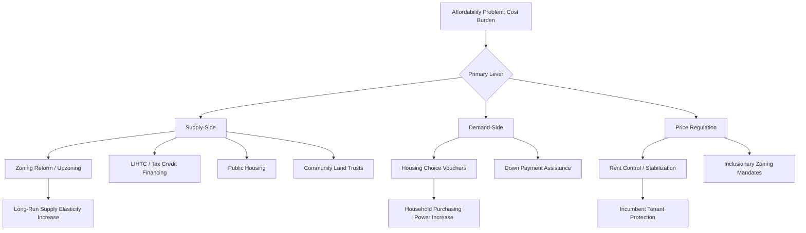

## Affordable Housing Policy Design

### Definition and Scope

Affordable housing policy design refers to the set of instruments governments use to ensure housing costs remain within an acceptable proportion of household income, addressing the mismatch between market-clearing prices and what lower- and moderate-income households can pay. In urban and regional economics, affordability is typically analyzed through the lens of housing supply elasticity, land use regulation, subsidy incidence, and spatial equilibrium models, distinguishing this domain from pure social welfare policy by its emphasis on market mechanisms, price signals, and long-run supply responses.

The standard affordability threshold used in most policy contexts is the **30% rule**: a household is considered cost-burdened if housing expenditure exceeds 30% of gross income, and severely cost-burdened above 50%. [Unverified — precise thresholds vary by jurisdiction and program]

### Theoretical Foundations

**Housing as a Composite Good and Spatial Equilibrium**

In the Rosen-Roback spatial equilibrium framework, housing costs adjust across locations to equalize utility for mobile households, given local wages and amenities. Formally, for a household choosing among locations $i$:

$$U_i = U(w_i, r_i, A_i)$$

where $w_i$ is the local wage, $r_i$ is housing rent, and $A_i$ is local amenities. In equilibrium, high-wage, high-amenity locations capitalize their advantages into housing rents rather than persistent utility differences, implying that housing cost burdens are partly the price of access to opportunity rather than a pure market failure — a framing that shapes debates over whether the correct policy response is subsidizing demand, expanding supply, or facilitating out-migration to lower-cost regions.

**Supply Elasticity and the Housing Price Response**

The core supply-side relationship is:

$$\Delta P = f\left(\frac{\Delta D}{\epsilon_S}\right)$$

where $\epsilon_S$ is the price elasticity of housing supply. Regions with low $\epsilon_S$ (due to land use regulation, geographic constraints, or construction cost inflexibility) experience larger price increases for a given demand shock. Glaeser and Gyourko's foundational work established that in highly regulated markets, housing prices substantially exceed the physical/marginal cost of construction, with the wedge attributable largely to regulatory constraints on supply (zoning, permitting, height limits, minimum lot sizes) rather than land scarcity per se. [Inference — the precise magnitude of the "regulatory tax" varies significantly by metro area and estimation method]

**Filtering Theory**

The filtering model posits that housing units depreciate in quality/price over time, with new construction at the top of the market eventually becoming available to lower-income households as it ages and is vacated by higher-income movers ("moving chains"). This provides a theoretical rationale for market-rate supply expansion as an indirect affordability tool, though filtering can be slow, geographically uneven, and offset by renovation/gentrification that removes units from the affordable stock instead of filtering downward.

**Incidence of Subsidies and Regulations**

A key analytical question is who bears the economic incidence of affordable housing policy. Using standard tax/subsidy incidence logic, the party bearing the cost depends on relative elasticities of supply and demand — inclusionary zoning mandates, for example, function economically similarly to a tax on new market-rate development, and if landowners cannot pass the cost forward to renters (due to competitive rental markets), the incidence falls on landowners via reduced land value, potentially reducing the supply of new development at the margin. [Inference] This is a central point of contention in the empirical inclusionary zoning literature, where findings on net supply effects are mixed and context-dependent.

### Policy Instrument Taxonomy

**Supply-Side Instruments**

- **Zoning reform / upzoning**: Increasing permitted density (e.g., eliminating single-family-only zoning, allowing accessory dwelling units (ADUs), reducing minimum lot sizes) to lower the regulatory constraint on $\epsilon_S$
- **Low-Income Housing Tax Credit (LIHTC)** (U.S.): Federal tax credits allocated to states, syndicated to private investors in exchange for equity, financing construction/rehabilitation of income-restricted rental units. The largest source of new affordable housing production in the U.S. since 1986
- **Public housing**: Direct government ownership and operation of housing stock, largely disfavored in new U.S. production since the mid-20th century due to concentrated poverty outcomes and maintenance funding shortfalls, but remains significant in other countries (e.g., Singapore's HDB system, Vienna's social housing model)
- **Inclusionary zoning (IZ)**: Mandates or incentives requiring a share of units in new market-rate developments to be income-restricted, often paired with density bonuses to offset developer cost
- **Community Land Trusts (CLTs)**: Nonprofit ownership of land with long-term ground leases to homeowners, permanently removing land appreciation from the affordability calculation and enabling below-market resale price restrictions
- **Streamlined permitting / by-right approval**: Reducing discretionary review and entitlement timelines, which lowers holding costs and regulatory risk premiums embedded in development pro formas

**Demand-Side Instruments**

- **Housing Choice Vouchers (Section 8)** (U.S.): Portable subsidies covering the gap between ~30% of household income and a locally-determined Fair Market Rent (FMR), redeemable in the private rental market
- **Rental assistance / cash transfers**: Direct income supplements earmarked or unearmarked for housing costs
- **Down payment assistance and first-time homebuyer programs**: Addressing capital constraints on homeownership access

**Price Regulation Instruments**

- **Rent control / rent stabilization**: Direct legal limits on rent increases for existing tenancies. The economic literature (including quasi-experimental studies such as Diamond, McQuade, and Qian's San Francisco analysis) generally finds rent control benefits incumbent protected tenants but can reduce rental housing supply as landlords convert units to condos or owner-occupancy, and may raise market rents for uncontrolled units citywide by constraining overall supply. [Inference — effects are heterogeneous; some jurisdictions with "vacancy decontrol" or new-construction exemptions see different supply responses than strict "vacancy control" regimes]
- **Rent stabilization with vacancy decontrol**: A hybrid allowing rents to reset to market rate upon tenant turnover, intended to balance tenant protection with landlord investment incentives

### Financing and Delivery Mechanisms

**LIHTC Mechanics (U.S. Case)**

States receive an annual per-capita tax credit allocation from the federal government, award credits competitively to developers via a Qualified Allocation Plan (QAP), and developers syndicate the credits to investors (often banks seeking Community Reinvestment Act credit) for upfront equity, reducing the debt burden and enabling below-market rents for 15–30 year compliance periods.

**Land Value Capture for Affordable Housing**

Overlaps with infrastructure finance mechanisms: density bonus programs allow developers to build more units than base zoning permits in exchange for including affordable units or paying in-lieu fees, effectively capturing a portion of the land value uplift created by the zoning change itself.

**Mixed-Income Development Models**

Cross-subsidization within a single development, where market-rate units financially support below-market units, used in both inclusionary zoning contexts and post-HOPE VI public housing redevelopment in the U.S., partly motivated by deconcentration-of-poverty research (e.g., Moving to Opportunity study findings on neighborhood effects for children).

### Diagram: Affordable Housing Policy Instrument Map

### Illustration: Supply Elasticity and Price Response to Demand Shock

<svg xmlns="http://www.w3.org/2000/svg" viewBox="0 0 640 380">
<text x="320" y="24" text-anchor="middle" font-size="15" font-weight="bold" fill="#1a1a1a">Elastic vs. Inelastic Housing Supply Response (svg_diagram)</text>
<line x1="60" y1="320" x2="300" y2="320" stroke="#333" stroke-width="1.5" />
<line x1="60" y1="320" x2="60" y2="60" stroke="#333" stroke-width="1.5" />
<text x="180" y="345" text-anchor="middle" font-size="11" fill="#333">Quantity (Elastic Market)</text>
<text x="30" y="190" text-anchor="middle" font-size="11" fill="#333" transform="rotate(-90 30 190)">Price</text>
<line x1="80" y1="300" x2="280" y2="120" stroke="#27ae60" stroke-width="2" />
<line x1="120" y1="290" x2="220" y2="90" stroke="#7f8c8d" stroke-width="2" stroke-dasharray="5" />
<line x1="160" y1="290" x2="260" y2="90" stroke="#7f8c8d" stroke-width="2" stroke-dasharray="5" />
<circle cx="177" cy="222" r="4" fill="#c0392b" />
<circle cx="196" cy="200" r="4" fill="#c0392b" />
<text x="90" y="115" font-size="10" fill="#7f8c8d">Demand shift</text>
<text x="200" y="230" font-size="10" fill="#c0392b">Small ΔP</text>
<line x1="380" y1="320" x2="620" y2="320" stroke="#333" stroke-width="1.5" />
<line x1="380" y1="320" x2="380" y2="60" stroke="#333" stroke-width="1.5" />
<text x="500" y="345" text-anchor="middle" font-size="11" fill="#333">Quantity (Inelastic Market)</text>
<line x1="440" y1="300" x2="460" y2="80" stroke="#c0392b" stroke-width="2" />
<line x1="440" y1="290" x2="520" y2="90" stroke="#7f8c8d" stroke-width="2" stroke-dasharray="5" />
<line x1="460" y1="290" x2="540" y2="90" stroke="#7f8c8d" stroke-width="2" stroke-dasharray="5" />
<circle cx="449" cy="197" r="4" fill="#c0392b" />
<circle cx="452" cy="130" r="4" fill="#c0392b" />
<text x="470" y="115" font-size="10" fill="#7f8c8d">Demand shift</text>
<text x="460" y="160" font-size="10" fill="#c0392b">Large ΔP</text>
</svg>

### Key Points

- Affordability is jointly determined by income, supply elasticity, and regulatory constraints — not solely by subsidy generosity
- Supply-side and demand-side instruments address different margins and are generally complementary rather than substitutes; demand-side subsidies without adequate supply response risk simply bidding up prices in constrained markets
- Incidence analysis matters: mandates like inclusionary zoning may not reduce costs for the intended beneficiaries if supply-side responses offset the intended transfer
- Program design details (e.g., vacancy decontrol vs. strict rent control, income-averaging vs. unit-by-unit restrictions in LIHTC) materially affect both efficiency and distributional outcomes

### Related Topics

- Zoning and land use regulation economics
- Housing supply elasticity estimation methods
- Rent control empirical literature and natural experiments
- Neighborhood effects and poverty deconcentration (Moving to Opportunity)
- Homeownership policy and mortgage market structure
- Gentrification, displacement, and filtering dynamics
- Comparative housing systems (Vienna, Singapore, Germany)
- Fair housing law and exclusionary zoning litigation
- Housing finance and LIHTC syndication markets
- Land value capture mechanisms in urban development