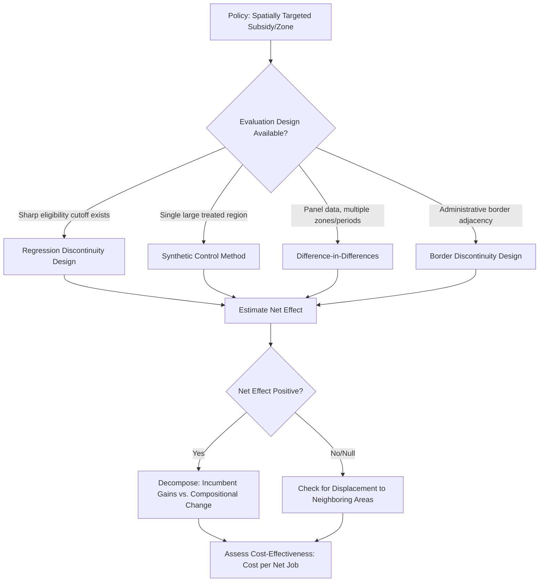

## Evaluating Place-Based Policy Effectiveness

### Definition and Scope

Evaluating place-based policy effectiveness concerns the methodologies, metrics, and theoretical frameworks used to assess whether spatially-targeted government interventions — enterprise zones, empowerment zones, regional development grants, opportunity zones, industrial clusters subsidies — achieve their stated goals. This is distinguished from evaluating "people-based" policy by the central analytical challenge that treatment is assigned to a *place*, while outcomes of interest often need to be traced to *people* (are residents better off, or have they simply been displaced or replaced by in-movers?), and to distinguish real economic gains from spatial reallocation of existing activity.

### Theoretical Foundations

**The Zero-Sum Critique and Spatial Reallocation**

A foundational theoretical concern is that place-based subsidies may simply relocate economic activity from unsubsidized to subsidized areas without generating net new activity at the regional or national level — a "zero-sum game" or "race to the bottom" among competing jurisdictions. Under this view, apparent local job gains are offset by losses in the areas firms relocated from, meaning naive local evaluation designs that ignore spillovers to neighboring areas will systematically overstate net welfare effects.

**Agglomeration Externalities as Efficiency Rationale**

The main efficiency justification for place-based policy in the theoretical literature rests on agglomeration externalities: if firms in a location generate positive spillovers (knowledge, labor pooling, input sharing) that are not captured in private location decisions, then a subsidy correcting this externality can generate genuine net welfare gains rather than pure reallocation. This implies evaluation should assess not just direct job/investment counts but productivity spillovers to incumbent firms and workers in the targeted area.

**Equity Rationale and Spatial Equilibrium**

A separate rationale, independent of aggregate efficiency, is place-based redistribution: because poor households are imperfectly mobile (due to housing lock-in, social ties, or credit constraints), spatial equilibrium models suggest that helping declining places can raise the welfare of *immobile* residents even if it does not maximize aggregate national output. This reframes the evaluation question from "did GDP grow" to "did the utility of place-attached residents improve," which requires tracking whether local job gains actually accrue to pre-existing residents versus new in-migrants — the central empirical concern in this literature.

### Empirical Evaluation Frameworks

**Difference-in-Differences (DiD)**

The workhorse design compares outcome trends in treated places (zones) against untreated comparison areas before and after policy implementation:

$$Y_{it} = \alpha + \beta (\text{Treat}_i \times \text{Post}_t) + \gamma_i + \delta_t + \varepsilon_{it}$$

where $\gamma_i$ are place fixed effects, $\delta_t$ are time fixed effects, and $\beta$ is the estimated treatment effect. Validity rests on the parallel trends assumption — that treated and control areas would have evolved similarly absent treatment — which is often threatened in place-based contexts because zones are typically selected *because* they are distressed or exhibit divergent pre-trends, a serious identification concern addressed via matching on pre-period covariates or synthetic control methods.

**Synthetic Control Method**

Constructs a weighted composite of untreated "donor" regions that closely tracks the treated region's pre-treatment outcome trajectory, then compares post-treatment divergence. Particularly suited to place-based evaluation because it explicitly addresses the "N=1" problem common when evaluating a single large-scale regional intervention (e.g., a single Special Economic Zone or a major infrastructure-linked zone), and produces a transparent counterfactual constructed from real comparison units rather than a linear regression extrapolation.

**Regression Discontinuity Design (RDD)**

Exploits sharp geographic or eligibility boundaries in zone designation (e.g., census tract poverty thresholds determining Opportunity Zone or Empowerment Zone eligibility) to compare outcomes for observations just inside versus just outside the boundary:

$$Y_i = \alpha + \tau D_i + f(X_i - c) + \varepsilon_i$$

where $D_i$ is treatment status, $X_i$ is the running variable (e.g., poverty rate), $c$ is the eligibility cutoff, and $f(\cdot)$ is a flexible function of distance from the cutoff. Geographic RDD requires care regarding spatial spillovers across the boundary (contamination of the control group) and sorting/manipulation around the cutoff, both of which can bias $\tau$ toward zero or in unpredictable directions.

**Border Discontinuity Designs**

A specific application comparing establishments or residents on either side of an administrative boundary (e.g., state or municipal border) within the same local labor market, controlling for unobserved local economic conditions that vary smoothly across space — widely used in the state enterprise zone literature (e.g., Neumark and Kolko's California analysis) to isolate the policy effect from broader regional trends.

### Key Outcome Metrics and Measurement Issues

**Direct vs. Net Employment Effects**

- **Gross job counts**: Jobs created within zone boundaries — the most commonly reported but least informative metric, since it does not net out job losses elsewhere or jobs that would have occurred anyway (deadweight loss)
- **Net job creation**: Adjusts gross counts for displacement (jobs relocated from elsewhere) and deadweight (investment that would have occurred without the subsidy) — much harder to measure and requires counterfactual estimation via the DiD/RDD/synthetic control methods above

**Who Benefits: Incumbent Residents vs. Composition Change**

A critical distinction is between **place prosperity** (aggregate metrics like average income or property values rising in the zone) and **people prosperity** (whether the specific individuals who lived there before treatment are better off). Rising average income in a treated tract can reflect either genuine income gains for incumbents or compositional change through in-migration of higher-income residents displacing the original population — evaluation designs increasingly attempt to track individual-level panel data (e.g., via administrative tax records) rather than tract-level aggregates to distinguish these mechanisms.

**Capitalization Effects**

Property value and rent changes in treated zones can indicate that the subsidy's benefits have been capitalized into land prices rather than passed through to labor or business outcomes — informative about incidence but potentially concerning from an equity standpoint if it primarily benefits landowners rather than the target population.

**Fiscal Cost-Effectiveness**

$$\text{Cost per net job} = \frac{\text{Total public subsidy cost}}{\text{Net jobs created (after displacement/deadweight adjustment)}}$$

This metric enables comparison across different program types and is a standard requirement in program evaluation, though estimates vary enormously across studies and programs depending on both the numerator (subsidy generosity) and the rigor of the net-job denominator calculation. [Unverified — reported figures are highly program- and study-specific; always consult primary evaluation sources for specific program comparisons]

### Notable Program Evaluation Literature

- **U.S. Empowerment Zones / Enterprise Zones**: Mixed evidence; several rigorous DiD and border-discontinuity studies find modest positive employment effects in some zones and null or negative effects in others, sensitive to program design (tax credits vs. capital subsidies) and local implementation
- **U.S. Opportunity Zones** (2017 Tax Cuts and Jobs Act): A large capital-gains-deferral program evaluated using tract-eligibility RDD designs around the poverty/income cutoffs used for designation; early evaluations generally find modest to limited evidence of increased investment activity directly attributable to the tax incentive, with effects concentrated in areas already experiencing pre-existing gentrification trends rather than the most distressed eligible tracts [Inference — this is an active and evolving research area; findings should be checked against the most recent published evaluations]
- **European Regional Development Fund (ERDF) / EU Cohesion Policy**: Extensively evaluated using regional discontinuities in EU funding eligibility thresholds (e.g., NUTS-2 regions just above/below GDP-per-capita cutoffs), generally finding positive convergence effects on regional GDP growth, though effects vary by governance quality and absorption capacity of recipient regions

### Common Threats to Valid Evaluation

- **Selection bias in zone designation**: Zones are non-randomly selected (often the most distressed areas), which biases both simple pre-post comparisons and improperly matched control groups
- **Spatial spillovers contaminating controls**: Nearby "untreated" comparison areas may be indirectly affected by the policy (positive spillovers or negative displacement effects), biasing DiD estimates toward zero
- **Anticipation effects**: Economic actors may respond to announced future zone designation before formal implementation, contaminating the "pre-period" baseline
- **Short evaluation windows**: Agglomeration and infrastructure effects often materialize over long horizons (10+ years), while political evaluation cycles frequently assess outcomes prematurely
- **Data limitations**: Tract-level administrative data often lacks the individual-level panel structure needed to distinguish incumbent gains from compositional turnover

### Diagram: Place-Based Policy Evaluation Decision Framework

### Key Points

- Gross outcome metrics (jobs, investment within zone) systematically overstate policy effectiveness by ignoring displacement and deadweight loss
- Rigorous causal identification (RDD, synthetic control, border discontinuity) is essential given the strong selection bias inherent in place-based policy targeting
- "Place prosperity" and "people prosperity" are distinct and can diverge sharply — evaluation should specify which the policy is intended to achieve
- Spatial spillovers to neighboring untreated areas threaten standard control-group validity and require explicit consideration in design
- Long-run agglomeration effects may not be visible within typical short-term political evaluation windows

### Related Topics

- Enterprise zones and special economic zones comparative analysis
- Opportunity Zones and capital gains tax incentive design
- Agglomeration economies and knowledge spillover measurement
- Synthetic control method technical implementation
- Regional convergence and EU Cohesion Policy evaluation
- Displacement effects and firm relocation decisions
- Spatial equilibrium models and immobile household welfare
- Administrative data panel construction for policy evaluation
- Cost-benefit analysis in regional development policy
- Gentrification and compositional change measurement