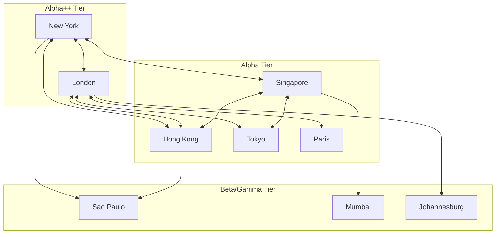

## Global City Networks and Urban Hierarchy

### Definition and Scope

Global city networks and urban hierarchy analysis examines how cities are positioned relative to one another within an interconnected system spanning national borders, focusing on flows of capital, information, corporate control, and specialized services rather than purely national or regional economic geography. This subfield merges urban economics with economic geography and international economics, asking how cities function as nodes in networks of advanced producer services, multinational corporate command-and-control, and global finance, and why certain cities ("global cities") occupy disproportionately powerful positions in this system regardless of their national economy's overall size.

### Theoretical Foundations

**Central Place Theory and Its Limits**

Classical urban hierarchy theory (Christaller's Central Place Theory) explains city size distributions and spatial arrangement through hierarchical market areas: higher-order cities provide specialized goods/services to larger hinterlands, while lower-order cities provide basic goods to smaller local areas. This framework, while foundational, is primarily suited to explaining *national* or *regional* urban systems organized around retail/service market areas and does not adequately explain the modern phenomenon of cities whose economic importance derives from global rather than local hinterland relationships — motivating the global city literature's departure from purely nested spatial hierarchies.

**The Global City Thesis (Sassen)**

Saskia Sassen's foundational work argues that economic globalization, rather than dispersing economic control uniformly, has concentrated command-and-control functions in a small number of "global cities" (originally identified as New York, London, and Tokyo) that serve as the coordination points for globally dispersed production. The key mechanism is the growth of advanced producer services (finance, law, accounting, management consulting, advertising) that benefit from face-to-face agglomeration even as the manufacturing and routine service functions they coordinate disperse globally to lower-cost locations. This produces a paradox: geographic dispersal of production alongside increasing geographic concentration of control functions.

**World City Network Methodology (GaWC)**

The Globalization and World Cities (GaWC) research network, led by Peter Taylor, developed an interlocking network model measuring city status not by attributes of the city itself but by the *connectivity* created through the office location strategies of advanced producer service (APS) firms. If a firm has offices in cities $i$ and $j$, this creates an inferred network link between them. The connectivity measure for city $i$ is typically calculated as:

$$C_i = \sum_{j \neq i} \sum_f s_{ij}^f$$

where $s_{ij}^f$ represents a service value linking cities $i$ and $j$ through firm $f$'s office network (based on office size/function), summed across all firms $f$ and all other cities $j$. This produces rankings (Alpha++, Alpha+, Alpha, Beta, Gamma city tiers) based on network centrality rather than population or GDP alone.

**Zipf's Law and Rank-Size Distribution**

A recurring empirical regularity in urban systems is that city sizes approximately follow a power law, where the population of the $k$-th largest city relates to the largest city's population by:

$$P_k = \frac{P_1}{k^{\theta}}$$

with $\theta$ often empirically close to 1 (giving the classic "rank-size rule" where the 2nd largest city is roughly half the size of the largest). [Inference] The theoretical explanation for why $\theta \approx 1$ emerges so consistently across countries remains debated, with random growth process models (Gibrat's Law — proportional, scale-independent city growth) offering one widely cited but not universally accepted mechanistic explanation.

### Empirical Classification Systems

**GaWC City Tiers**

The GaWC classification ranks cities into tiers based on APS firm connectivity:

- **Alpha++**: Cities with connectivity substantially above all others, historically London and New York, reflecting their combined dominance across finance, law, and related APS sectors
- **Alpha+/Alpha**: Major globally-connected cities with strong but less dominant connectivity (e.g., Singapore, Hong Kong, Paris, Tokyo)
- **Beta/Gamma**: Cities with significant but more regionally-focused connectivity

[Unverified — exact city rankings shift with each GaWC survey iteration; consult the most recent GaWC roster for current classifications]

**A.T. Kearney / Kearney Global Cities Index**

An alternative composite index combining business activity, human capital, information exchange, cultural experience, and political engagement metrics, producing rankings that overlap substantially with but are not identical to GaWC connectivity rankings, reflecting different underlying methodologies (asset-based composite scoring versus network flow inference).

**Financial Centre Indices**

The Global Financial Centres Index (GFCI) specifically ranks cities on competitiveness as financial hubs using survey-based and quantitative indicators, capturing a narrower but economically important dimension of global city status distinct from the broader APS-based GaWC approach.

### Mechanisms of Global City Formation

**Agglomeration in Advanced Producer Services**

Global cities benefit from classic urban agglomeration mechanisms (Marshallian externalities: labor pooling, input sharing, knowledge spillovers) applied specifically to high-skill financial and professional services, where face-to-face interaction remains valuable for trust-building, deal-making, and tacit knowledge transfer despite advances in telecommunications that theoretically enable remote coordination.

**Path Dependence and First-Mover Advantages**

Historical financial and colonial/trade hub status (London's imperial financial infrastructure, New York's post-WWII dollar hegemony position) created initial agglomerations of expertise and institutions that subsequent network effects reinforce, making displacement of established global cities difficult even as economic weight shifts toward other regions (e.g., Asian economic growth has not proportionally translated into equivalent Asian city dominance in the highest GaWC tiers, historically, though this has evolved with the rise of Singapore, Hong Kong, and Shanghai). [Inference — the relative pace of this shift is an actively evolving empirical question]

**Regulatory and Institutional Factors**

Legal system predictability (particularly for contract enforcement, historically favoring common law jurisdictions like London and New York for international finance), light-touch or favorable regulatory regimes, language (English as the dominant global business language), and time zone positioning (enabling 24-hour global market coverage across London-New York-Tokyo/Singapore) all contribute to persistent global city status beyond pure agglomeration economics.

**Air Transport Connectivity**

Direct flight network centrality is both a cause and consequence of global city status — used in some research as an independent proxy measure for city-to-city connectivity, correlating strongly but imperfectly with GaWC's APS-based connectivity measures.

### Contemporary Debates and Extensions

**Polycentric and Regional Network Models**

Critics of the strict global city hierarchy model point to increasingly polycentric arrangements, where regional city networks (e.g., the Pearl River Delta, the Randstad in the Netherlands) function as integrated economic systems rather than single dominant nodes, complicating simple single-city ranking approaches.

**Command-and-Control vs. Innovation Geography**

Some scholarship distinguishes global cities' traditional command-and-control/finance functions from a separate geography of technological innovation (Silicon Valley, Shenzhen), arguing these follow different locational logics — innovation clusters benefit less from centralized command functions and more from specialized technical labor pools, venture capital ecosystems, and university research spillovers.

**Global South and Emerging Global Cities**

The literature has increasingly examined the rise of cities like Dubai, Mumbai, São Paulo, and Lagos as emerging network nodes, raising questions about whether the original Global North-centric global city framework adequately captures new patterns of South-South economic integration and regional hub formation outside the traditional New York-London-Tokyo triad.

**Digitalization and Remote Work Implications**

[Speculation] The post-2020 acceleration of remote work arrangements has prompted ongoing debate about whether face-to-face agglomeration advantages for APS functions will erode over time, though early evidence through the mid-2020s suggests persistent (if somewhat attenuated) importance of physical co-location for the highest-value coordination and deal-making functions in global cities — this remains an actively contested and evolving research question.

### Diagram: Global City Network Structure

### Illustration: Rank-Size Distribution of Global Cities

<svg xmlns="http://www.w3.org/2000/svg" viewBox="0 0 640 380">
<text x="320" y="24" text-anchor="middle" font-size="15" font-weight="bold" fill="#1a1a1a">Zipf's Law: City Rank vs. Connectivity/Size (svg_diagram)</text>
<line x1="70" y1="320" x2="600" y2="320" stroke="#333" stroke-width="1.5" />
<line x1="70" y1="320" x2="70" y2="50" stroke="#333" stroke-width="1.5" />
<text x="335" y="350" text-anchor="middle" font-size="12" fill="#333">Rank (log scale)</text>
<text x="35" y="185" text-anchor="middle" font-size="12" fill="#333" transform="rotate(-90 35 185)">Connectivity (log scale)</text>
<path d="M 90 70 L 150 160 L 200 200 L 260 225 L 320 245 L 390 260 L 460 272 L 530 282 L 590 290" fill="none" stroke="#2471a3" stroke-width="2.5" />
<circle cx="90" cy="70" r="4" fill="#c0392b" />
<text x="95" y="65" font-size="10" fill="#333">London/NY</text>
<circle cx="150" cy="160" r="4" fill="#c0392b" />
<text x="155" y="155" font-size="10" fill="#333">Singapore/HK</text>
<circle cx="260" cy="225" r="4" fill="#c0392b" />
<text x="265" y="220" font-size="10" fill="#333">Tier 2 cities</text>
<circle cx="460" cy="272" r="4" fill="#c0392b" />
<text x="465" y="267" font-size="10" fill="#333">Regional hubs</text>
</svg>

### Key Points

- Global city status derives from network connectivity through advanced producer service firm office networks, not city population or national GDP alone
- The GaWC interlocking network model measures connectivity indirectly via corporate office location patterns rather than direct flow data
- Path dependence and institutional/regulatory factors create persistent advantages for historically established global cities, slowing displacement despite shifting global economic weight
- The relationship between city hierarchy and national economic development is not one-to-one — global city status can decouple substantially from national GDP rank
- Rank-size (Zipf's law) regularities are a robust empirical pattern across urban systems, though the underlying causal mechanism remains debated

### Related Topics

- GaWC (Globalization and World Cities) research network methodology
- Advanced producer services and financial sector agglomeration
- Zipf's Law and Gibrat's Law in urban systems
- Foreign direct investment and multinational corporate location decisions
- Polycentric urban regions (Randstad, Pearl River Delta)
- Air transport network analysis and city connectivity
- Global Financial Centres Index (GFCI) methodology
- Comparative urbanization patterns in the Global South
- Remote work and the future geography of advanced services
- International capital flows and financial center competition