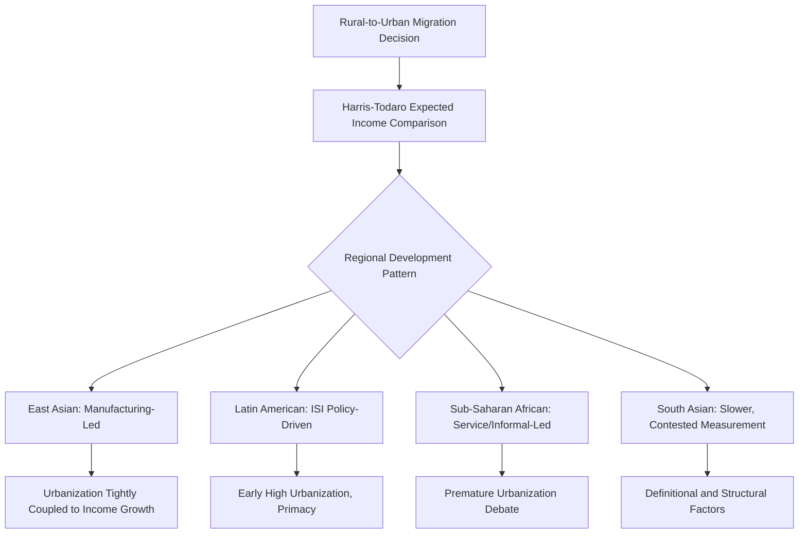

## Comparative Urbanization Across Countries

### Definition and Scope

Comparative urbanization across countries examines how the pace, pattern, and economic drivers of urban population growth differ across national contexts, particularly contrasting the historical urbanization experience of developed economies with the contemporary urbanization trajectories of developing and emerging economies. This subfield draws on urban economics, development economics, and demography to explain why urbanization rates, city size distributions, and the relationship between urbanization and income growth vary systematically across countries and historical periods.

### Theoretical Foundations

**Urbanization and Structural Transformation**

The classical development economics link between urbanization and growth rests on structural transformation theory: as economies develop, labor shifts from low-productivity agriculture to higher-productivity manufacturing and services, which are predominantly urban-based due to agglomeration economies. The stylized empirical relationship is a strong positive correlation between a country's urbanization rate and its GDP per capita, often depicted as an S-shaped logistic curve when urbanization rate is plotted against time or income level, with urbanization historically accelerating during early-to-middle industrialization phases before decelerating as the urban share approaches saturation (typically 80–90%).

**Harris-Todaro Rural-Urban Migration Model**

A foundational theoretical model explaining rural-to-urban migration despite persistent urban unemployment, formalized by Harris and Todaro. Migration decisions are modeled as responding to *expected* urban income rather than actual urban wages:

$$E(w_u) = p \cdot w_u$$

where $p$ is the probability of obtaining formal urban employment and $w_u$ is the formal urban wage. Migration continues until expected urban income equals the rural wage $w_r$:

$$p \cdot w_u = w_r$$

This model explains the empirically observed coexistence of high urban unemployment/informal employment alongside continued rural-to-urban migration in many developing countries — migrants rationally accept a probability-weighted expected gain even with a meaningful chance of urban unemployment, because urban formal wages are typically set above market-clearing levels (via minimum wage laws, unionization, or efficiency wage considerations).

**Urbanization Economies vs. Localization Economies**

Distinguishing agglomeration mechanisms is important for comparative analysis: **localization economies** arise from firms in the *same* industry clustering (specialized labor pools, supplier networks), while **urbanization economies** arise from the diversity and scale of the overall urban economy regardless of industry composition (Jacobs externalities — cross-industry knowledge spillovers). Developing-country cities are frequently observed to exhibit different relative importance of these mechanisms compared to mature developed-country cities, with implications for optimal city size and specialization policy.

**Ozone/Primacy and the Rank-Size Distribution**

Cross-national comparison reveals substantial variation in **urban primacy** — the degree to which a single city (often the capital) dominates a country's urban system relative to what Zipf's Law/rank-size regularity would predict. High primacy is common in many developing economies and is often attributed to colonial-era administrative centralization, import-substitution industrialization policies concentrating infrastructure investment in a single city, and political economy factors (capital cities receiving disproportionate public investment). [Inference — the causal weight of each factor varies substantially by country and region, and the empirical primacy literature does not fully agree on a single dominant explanation]

### Empirical Patterns and Measurement

**Divergent Urbanization-Income Relationships**

A well-documented empirical puzzle is that some regions, particularly parts of Sub-Saharan Africa and Latin America, have exhibited urbanization rates substantially higher than their income levels would predict based on the historical developed-country relationship — sometimes termed "urbanization without growth" or "premature urbanization." This contrasts with the classical East Asian pattern (e.g., South Korea, China) where urbanization has been more tightly coupled with manufacturing-led income growth. [Unverified — the magnitude and interpretation of "premature urbanization" is actively debated in the development economics literature; some scholars attribute it to data/definitional inconsistencies across countries rather than a genuine structural anomaly]

**Definitional Heterogeneity**

A significant comparative measurement challenge is that countries use substantially different definitions of "urban" (population thresholds ranging from 200 to 50,000+ residents, administrative boundary definitions vs. density-based definitions, and differing treatment of peri-urban areas), complicating cross-national comparison of headline urbanization rates. International bodies (UN-Habitat, World Bank) have developed harmonized definitions (e.g., the Degree of Urbanization method using population grid density) specifically to address this comparability problem.

**Informality and Urban Labor Markets**

Developing-country urbanization is frequently characterized by large informal sector employment shares, in contrast to the largely formalized urban labor markets of developed economies during their historical urbanization phases. This has implications for productivity measurement, tax base development, and the applicability of standard urban economic models (which often implicitly assume formal wage-setting and social insurance systems) to developing-country urban contexts.

**Megacity Growth and Secondary City Neglect**

Many developing countries exhibit rapid growth concentrated in a single megacity or primate city, with comparatively underdeveloped secondary city systems — a pattern with efficiency implications (congestion costs, diseconomies of excessive concentration) and policy debates over whether investment should reinforce primate city agglomeration advantages or actively promote secondary city development to achieve more balanced regional growth.

### Comparative Regional Patterns

**East Asian Model**

Characterized by rapid, manufacturing-export-led urbanization tightly coupled with income growth (South Korea, Taiwan historically; China more recently), often accompanied by substantial state-directed infrastructure investment and, in China's case, a distinctive hukou household registration system that has historically constrained full labor mobility and formal urban settlement rights for rural migrants, creating a large "floating population" of urban residents without full urban registration status. [Inference — the pace and nature of hukou reform has been evolving and specific current policy details should be verified against recent Chinese government sources]

**Latin American Model**

Characterized by early and high urbanization rates (many countries exceeding 80% urban) reached earlier relative to income level than the East Asian pattern, often attributed to import-substitution industrialization policies of the mid-20th century that concentrated industrial investment in major cities, combined with historically high rural land inequality pushing rural-to-urban migration.

**Sub-Saharan African Model**

Characterized by rapid ongoing urbanization often occurring without commensurate manufacturing sector growth (limited structural transformation into higher-productivity urban industry), with urban economies frequently dominated by informal services and trade rather than the manufacturing-led pattern of the East Asian experience — a pattern central to the "urbanization without industrialization" debate in African development economics.

**South Asian Model**

Characterized by relatively lower urbanization rates than other developing regions at comparable income levels, with debates over whether this reflects definitional/measurement artifacts (restrictive urban definitions in some South Asian national statistical systems) versus genuine structural factors limiting rural-to-urban transition.

### Diagram: Comparative Urbanization Pathways

### Illustration: Urbanization Rate vs. Income Across Development Models

<svg xmlns="http://www.w3.org/2000/svg" viewBox="0 0 640 380">
<text x="320" y="24" text-anchor="middle" font-size="15" font-weight="bold" fill="#1a1a1a">Stylized Urbanization-Income Trajectories (svg_diagram)</text>
<line x1="70" y1="320" x2="600" y2="320" stroke="#333" stroke-width="1.5" />
<line x1="70" y1="320" x2="70" y2="50" stroke="#333" stroke-width="1.5" />
<text x="335" y="350" text-anchor="middle" font-size="12" fill="#333">GDP per capita</text>
<text x="35" y="185" text-anchor="middle" font-size="12" fill="#333" transform="rotate(-90 35 185)">Urbanization Rate (%)</text>
<path d="M 90 300 C 200 280, 300 100, 550 70" fill="none" stroke="#2471a3" stroke-width="2.5" />
<text x="380" y="90" font-size="11" fill="#2471a3">East Asian (coupled)</text>
<path d="M 90 300 C 150 150, 250 90, 400 75" fill="none" stroke="#e67e22" stroke-width="2.5" />
<text x="230" y="110" font-size="11" fill="#e67e22">Latin American (early-high)</text>
<path d="M 90 300 C 140 200, 220 130, 300 100" fill="none" stroke="#c0392b" stroke-width="2.5" />
<text x="140" y="180" font-size="11" fill="#c0392b">Sub-Saharan (premature)</text>
<path d="M 90 305 C 250 290, 400 220, 550 150" fill="none" stroke="#7f8c8d" stroke-width="2.5" stroke-dasharray="5" />
<text x="380" y="230" font-size="11" fill="#7f8c8d">South Asian (lagging)</text>
</svg>

### Key Points

- The Harris-Todaro model explains persistent rural-to-urban migration despite urban unemployment through expected (probability-weighted) rather than actual wage comparisons
- Cross-national urbanization comparison is complicated by substantial definitional heterogeneity in what constitutes "urban," requiring harmonized measures for valid comparison
- Regional development models (East Asian, Latin American, Sub-Saharan African, South Asian) exhibit distinct urbanization-income relationships reflecting differing structural transformation pathways
- Urban primacy (dominance of a single city) varies substantially across countries and is linked to historical, political, and policy factors beyond pure market agglomeration forces
- Informality is a defining feature distinguishing developing-country urbanization from the historical developed-country experience, with significant implications for urban economic analysis

### Related Topics

- Harris-Todaro migration model extensions and critiques
- Urban primacy and rank-size distribution determinants
- Structural transformation and manufacturing-led development
- Informal sector economics and urban labor markets
- China's hukou system and internal migration policy
- Secondary city development and balanced regional growth policy
- UN-Habitat Degree of Urbanization methodology
- Colonial urban planning legacies and administrative centralization
- Megacity governance challenges in developing economies
- Slum formation and informal settlement economics