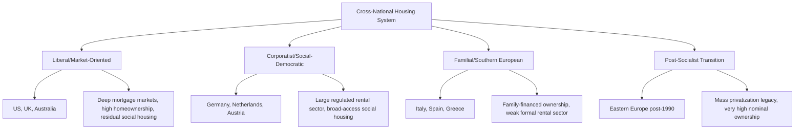

## Cross-National Housing Market Comparisons

### Definition and Scope

Cross-national housing market comparisons examine why housing outcomes — affordability, homeownership rates, price volatility, tenure structure, and supply responsiveness — differ systematically across countries despite broadly similar underlying urban economic forces. This subfield combines urban economics, comparative political economy, and housing finance to explain how institutional arrangements (land use regulation regimes, mortgage market structures, taxation, and welfare state housing provision) produce divergent housing systems even among economies at similar income levels.

### Theoretical Foundations

**Institutional Variation in Otherwise Similar Fundamentals**

Standard urban economic models (bid-rent, monocentric city, spatial equilibrium) predict housing outcomes as functions of income, transport costs, and land supply, but these fundamentals alone cannot explain the substantial cross-national variation observed among comparably wealthy economies. This motivates comparative housing scholarship's core claim: institutional arrangements — not just market fundamentals — are first-order determinants of housing system outcomes, requiring models that incorporate regulatory regimes, financial system structure, and welfare state design as explanatory variables alongside standard urban economic factors.

**Housing Supply Elasticity as the Central Comparative Variable**

As in single-country analysis, cross-national comparison typically centers on estimating and explaining differences in the price elasticity of housing supply $\epsilon_S$ across countries:

$$\epsilon_S = \frac{\% \Delta Q_S}{\% \Delta P}$$

Comparative research (drawing on Glaeser, Gyourko, and international extensions of their methodology) has documented substantial cross-national heterogeneity in $\epsilon_S$, generally attributing lower elasticity to more restrictive land use planning systems (particularly discretionary, case-by-case planning regimes common in the UK versus more rules-based zoning regimes common in much of the U.S.), geographic constraints, and construction sector structure (fragmentation versus industrialization of homebuilding).

**Varieties of Housing Capitalism**

Drawing on the "varieties of capitalism" comparative political economy tradition, housing scholars (notably Jim Kemeny and later Schwartz and Seabrooke) have proposed typologies distinguishing housing systems by the interaction of tenure structure, mortgage market depth, and welfare state design:

- **Liberal/market-oriented systems** (e.g., U.S., UK, Australia): High homeownership rates, deep mortgage securitization markets, residual social housing sectors targeted narrowly at the poorest households
- **Corporatist/social-democratic systems** (e.g., Germany, Netherlands, Austria): Larger rental sectors including substantial non-profit/social housing serving broad income ranges (not just the poorest), more regulated rental markets, historically lower homeownership rates
- **Familial/Southern European systems** (e.g., Italy, Spain): High homeownership achieved partly through intergenerational family transfers and self-building rather than mortgage market depth, weaker formal rental sectors

[Inference] This typology is a useful heuristic but individual countries increasingly exhibit hybrid characteristics, and the classification has been contested and refined substantially since its original formulation.

### Mortgage Market Structure and Financial System Comparison

**Mortgage Market Depth**

Countries vary substantially in mortgage debt as a share of GDP, reflecting differences in financial system development, securitization infrastructure, and regulatory approach to mortgage lending. Deeper mortgage markets generally enable higher homeownership rates and greater house price sensitivity to interest rate and credit conditions, a key channel connecting monetary policy transmission strength to housing market structure across countries.

**Fixed-Rate vs. Adjustable-Rate Mortgage Dominance**

A significant cross-national institutional difference is the prevalence of long-term fixed-rate mortgages (dominant in the U.S., partly due to government-sponsored enterprise involvement in mortgage securitization) versus adjustable/variable-rate mortgages (more common in the UK, much of continental Europe, and Australia). This has material macroeconomic implications: adjustable-rate-dominant systems transmit monetary policy changes to household cash flow and consumption more quickly and directly than fixed-rate-dominant systems, affecting both house price volatility and the transmission mechanism of central bank policy.

**Down Payment Requirements and Credit Access**

Loan-to-value (LTV) regulatory limits and typical down payment norms vary substantially, affecting both homeownership accessibility and financial system exposure to house price declines — countries with looser LTV norms (higher leverage) generally exhibit greater house price and consumption volatility in response to credit supply shocks, a pattern extensively studied in the post-2008 macroprudential policy literature.

### Land Use Regulation Regime Comparison

**Rules-Based vs. Discretionary Planning Systems**

A key comparative distinction is between rules-based zoning systems (property owners have an *ex ante* legal right to build within defined parameters, common in much of the U.S. and continental Europe) and discretionary planning systems (development approval requires case-by-case administrative judgment even for compliant proposals, characteristic of the UK's post-1947 Town and Country Planning framework). [Inference] Discretionary systems are frequently associated with greater development uncertainty, longer approval timelines, and in some empirical work, lower supply elasticity, though the causal relationship is contested and depends heavily on specific local implementation.

**Green Belt and Growth Boundary Policies**

Several countries employ explicit urban growth boundaries or green belt policies restricting peripheral development (the UK's Green Belt system being a prominent and extensively studied example) — comparative research examines how these policies affect price gradients, commuting patterns, and whether they achieve stated environmental/agricultural preservation goals versus primarily constraining housing supply and raising prices within the boundary.

### Homeownership Rate Determinants

Cross-national homeownership rate variation (ranging from roughly 40–50% in some continental European countries to 60–70%+ in many liberal-model economies, with some familial-model Southern/Eastern European countries exceeding 80%) [Unverified — precise current rates fluctuate and should be checked against current OECD/national statistical sources] reflects a combination of:

- Historical housing privatization policies (notably post-socialist Eastern European mass privatization of formerly state-owned housing stock, producing very high formal homeownership rates that partly reflect one-time historical transfers rather than ongoing market dynamics)
- Tax treatment of owner-occupied housing (mortgage interest deductibility, capital gains exemptions, imputed rent taxation or lack thereof)
- Social/rental housing sector scale and quality (larger, higher-quality social rental sectors reduce the relative attractiveness premium of ownership)
- Cultural and historical factors affecting household preferences, though these are difficult to disentangle from institutional determinants in empirical work

### House Price Volatility and Macroprudential Comparison

Cross-national house price volatility comparison, particularly salient following the 2008 Global Financial Crisis, has examined why some countries (U.S., Spain, Ireland, UK) experienced severe housing booms and busts while others (Germany, notably) exhibited comparatively stable house prices over the same period. Explanatory factors examined in this literature include mortgage market structure and leverage norms discussed above, rental sector depth (Germany's large, well-regulated rental sector is frequently cited as providing a substitute for ownership that dampens speculative ownership demand), and macroprudential regulatory stringency (LTV and debt-service-to-income limits).

### Diagram: Comparative Housing System Typology

### Illustration: Mortgage System Structure and Monetary Transmission

<svg xmlns="http://www.w3.org/2000/svg" viewBox="0 0 640 340">
<text x="320" y="24" text-anchor="middle" font-size="15" font-weight="bold" fill="#1a1a1a">Fixed vs. Adjustable-Rate Mortgage Transmission (svg_diagram)</text>
<rect x="60" y="60" width="220" height="60" rx="6" fill="#eaf2f8" stroke="#2471a3" stroke-width="1.5" />
<text x="170" y="95" text-anchor="middle" font-size="12" fill="#1a1a1a">Central Bank Rate Change</text>
<rect x="60" y="160" width="220" height="60" rx="6" fill="#eaf6f1" stroke="#27ae60" stroke-width="1.5" />
<text x="170" y="185" text-anchor="middle" font-size="11" fill="#1a1a1a">Fixed-Rate Dominant System</text>
<text x="170" y="203" text-anchor="middle" font-size="10" fill="#555">(Slow, muted transmission)</text>
<rect x="360" y="160" width="220" height="60" rx="6" fill="#fdedec" stroke="#c0392b" stroke-width="1.5" />
<text x="470" y="185" text-anchor="middle" font-size="11" fill="#1a1a1a">Adjustable-Rate Dominant System</text>
<text x="470" y="203" text-anchor="middle" font-size="10" fill="#555">(Fast, direct transmission)</text>
<line x1="170" y1="120" x2="170" y2="160" stroke="#333" stroke-width="1.5" marker-end="url(#arrow)" />
<line x1="280" y1="90" x2="470" y2="160" stroke="#333" stroke-width="1.5" marker-end="url(#arrow)" />
<rect x="60" y="260" width="220" height="50" rx="6" fill="#f4f6f7" stroke="#7f8c8d" />
<text x="170" y="290" text-anchor="middle" font-size="10" fill="#333">Household cash flow shielded near-term</text>
<rect x="360" y="260" width="220" height="50" rx="6" fill="#f4f6f7" stroke="#7f8c8d" />
<text x="470" y="290" text-anchor="middle" font-size="10" fill="#333">Household cash flow shifts immediately</text>
<line x1="170" y1="220" x2="170" y2="260" stroke="#333" stroke-width="1.5" marker-end="url(#arrow)" />
<line x1="470" y1="220" x2="470" y2="260" stroke="#333" stroke-width="1.5" marker-end="url(#arrow)" />
</svg>

### Key Points

- Institutional arrangements (land use regulation regime, mortgage market structure, tax treatment, welfare state housing provision) are first-order determinants of cross-national housing outcome differences, not just underlying supply-demand fundamentals
- Discretionary versus rules-based planning systems produce materially different supply elasticity and development timeline outcomes
- Mortgage structure (fixed vs. adjustable rate dominance, LTV norms) is a key channel linking housing systems to monetary policy transmission and financial stability
- The "varieties of housing capitalism" typology (liberal, corporatist, familial, post-socialist) provides a useful but increasingly contested heuristic given growing hybridization across systems
- Rental sector depth and quality substantially affect both homeownership rates and house price volatility by providing a viable ownership substitute

### Related Topics

- Housing supply elasticity estimation across countries
- Macroprudential regulation and loan-to-value policy comparison
- Post-socialist housing privatization and its legacy effects
- German rental sector model and house price stability
- UK discretionary planning system and Green Belt policy
- Mortgage securitization systems (GSEs, covered bonds, Pfandbriefe)
- Tax treatment of owner-occupied housing across OECD countries
- Social and non-profit housing sector comparative scale
- 2008 Global Financial Crisis housing market divergence
- Homeownership rate determinants and intergenerational wealth transfer