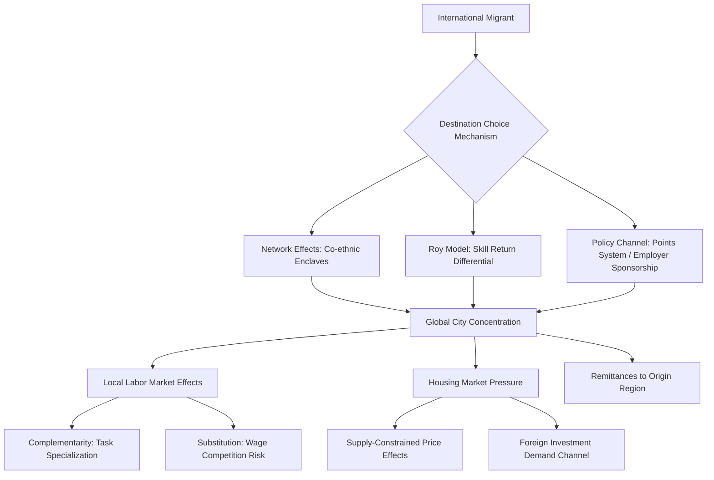

## International Migration and Global Cities

### Definition and Scope

International migration and global cities examines how cross-border migration flows shape, and are shaped by, the economic structure of major urban centers, focusing on how global cities function as primary destination nodes for international migrants and how this concentration affects local labor markets, housing markets, wage structures, and urban economic dynamism. This subfield bridges urban economics, labor economics, and international migration theory, addressing both the determinants of migrant destination choice and the local economic consequences of migrant concentration.

### Theoretical Foundations

**Migrant Networks and Chain Migration**

A foundational theoretical mechanism explaining the strong geographic concentration of international migrants in specific global cities (rather than dispersion proportional to labor demand) is network-based migration theory: early migrants establish enclaves that reduce the cost and risk of subsequent migration for co-nationals through information sharing, job referrals, and social support, creating self-reinforcing concentration even absent superior economic opportunity relative to alternative destinations. This produces persistent path dependence in migration corridors (e.g., specific sending-country/receiving-city pairs) that can outlast the original economic conditions that established them.

**Roy Model of Migrant Selection**

Borjas's application of the Roy model to migration analyzes how the skill composition of migrants to a given destination depends on the relative returns to skill in sending versus receiving locations. If the wage structure is:

$$w = \mu + \delta s$$

where $s$ is skill and $\delta$ is the return to skill, migrants are predicted to be **positively selected** (above-average skill relative to their origin population) when the receiving location has a higher return to skill than the origin, and **negatively selected** when the origin has more skill-compressed wage structures (as under many welfare states) relative to the destination. This framework has been extensively applied to explain skill composition differences among migrant flows to different global cities depending on relative income inequality between sending and receiving economies. [Inference — empirical support for pure Roy-model selection predictions is mixed, with migration costs, network effects, and policy-driven selection (points systems, family reunification) often dominating pure skill-return selection in practice]

**Agglomeration Effects and Migrant-Native Complementarity**

Urban economic analysis of migration's local labor market effects draws on the broader agglomeration and labor market literature, with a key theoretical distinction between the **factor proportions/substitution view** (migrants primarily compete with natives of similar skill levels, depressing wages for close substitutes) and the **complementarity/task specialization view** (migrants and natives sort into different occupational tasks — e.g., migrants into manual/service tasks, natives shifting toward communication-intensive tasks — generating productivity complementarities rather than pure competition). Global cities' large, deep, and highly specialized labor markets are frequently argued to facilitate the latter dynamic more readily than smaller or less diversified local economies, since greater task/occupational diversity creates more room for complementary specialization rather than direct head-to-head competition.

### Empirical Labor Market Effects

**Spatial Correlation and Identification Challenges**

Naive cross-city comparisons of migrant share and native wages suffer from severe endogeneity: migrants disproportionately choose economically dynamic cities, meaning simple correlations confound migration's causal wage effect with reverse causation (migrants following pre-existing local labor demand growth). This has motivated instrumental variable approaches, most prominently the **shift-share/Bartik instrument**, which predicts local migrant inflows using national-level migration trends by origin country interacted with each city's historical (pre-period) settlement pattern of migrants from that origin — exploiting network-driven persistence in destination choice as a source of variation plausibly uncorrelated with contemporaneous local demand shocks.

**The Mariel Boatlift and Natural Experiment Literature**

Card's foundational study of the 1980 Mariel Boatlift (a sudden, large, unanticipated influx of Cuban migrants to Miami) exploited this natural experiment to estimate local labor market effects with reduced endogeneity concerns, finding minimal negative wage or employment effects on native workers, including low-skilled native workers who might be expected to be closest substitutes for the Cuban migrants. This finding, since revisited and debated extensively in subsequent literature (including a reanalysis by Borjas reaching more negative conclusions using different comparison group and specification choices), remains a central and contested reference point in the broader immigration labor market effects literature. [Unverified — this remains an active area of methodological debate; conclusions are sensitive to specification choices regarding comparison cities and worker subgroups]

**Global City Labor Market Segmentation**

Sassen's global city framework specifically emphasizes how international migration interacts with the bifurcated occupational structure of global cities: high-skill professional/financial services employment (often disproportionately native-born or highly-selected skilled migrants) coexists with large low-wage service sectors (frequently staffed by lower-skilled international migrants) providing the personal and building services that support the high-income professional workforce, producing a distinctive dual labor market structure argued to be characteristic of global cities specifically rather than urban economies generally.

### Housing Market Effects

International migration's concentration in global cities exerts upward pressure on housing demand in already supply-constrained markets, interacting with the housing supply elasticity dynamics discussed in comparative housing market analysis. A distinct strand of research examines international real estate investment by non-resident buyers (sometimes termed "capital flight" real estate purchases) as a related but analytically distinct phenomenon from labor migration, with some global cities (London, Vancouver, Sydney, New York) experiencing significant foreign investment demand in prime residential markets that is largely decoupled from local labor market participation, prompting policy responses such as foreign buyer taxes and vacancy taxes in several jurisdictions.

### Remittances and Sending-Country Effects

While the primary urban economics focus is on destination-city effects, comparative and development economics literatures also examine how migrant remittance flows from global city employment affect sending-country regional economies, creating a two-way economic linkage between global cities and often geographically distant origin regions — a dynamic increasingly analyzed using the same network/gravity-model frameworks used to explain migration destination choice itself.

### Policy Frameworks Governing Migration to Global Cities

**Points-Based Skilled Migration Systems**

Countries including Canada, Australia, and the UK (post-Brexit) employ points-based systems explicitly selecting migrants on observable skill characteristics (education, language proficiency, work experience, job offers), representing a policy-driven alternative to the market-driven Roy model selection mechanism, with global cities in these countries typically serving as primary landing points for points-selected skilled migrants due to job market depth and existing co-ethnic networks.

**Employer-Sponsored and Visa Category Systems**

The U.S. H-1B visa system and comparable employer-sponsored programs in other countries link migrant admission directly to specific employer demand, concentrating migration flows in cities with strong presence of sponsoring industries (notably technology sector concentration channeling H-1B flows toward specific US metro areas).

**Undocumented and Informal Migration Flows**

A substantial share of international migration to many global cities occurs outside formal visa/points system channels, complicating both measurement and the applicability of formal selection-model frameworks, with informal-status migrants frequently concentrated in the lower-wage service sector segment of the dual global city labor market structure described above.

### Diagram: Migration-Global City Economic Linkages

### Illustration: Dual Labor Market Structure in Global Cities

<svg xmlns="http://www.w3.org/2000/svg" viewBox="0 0 640 340">
<text x="320" y="24" text-anchor="middle" font-size="15" font-weight="bold" fill="#1a1a1a">Bifurcated Global City Labor Market (svg_diagram)</text>
<rect x="80" y="60" width="480" height="80" rx="6" fill="#eaf2f8" stroke="#2471a3" stroke-width="1.5" />
<text x="320" y="90" text-anchor="middle" font-size="12" fill="#1a1a1a">High-Skill Professional/Financial Services</text>
<text x="320" y="110" text-anchor="middle" font-size="10" fill="#555">Native-born + highly-selected skilled migrants</text>
<text x="320" y="126" text-anchor="middle" font-size="10" fill="#555">Finance, law, consulting, tech</text>
<line x1="320" y1="140" x2="320" y2="180" stroke="#333" stroke-width="1.5" marker-end="url(#arr)" />
<text x="330" y="165" font-size="10" fill="#333">Demand for support services</text>
<rect x="80" y="200" width="480" height="90" rx="6" fill="#fdedec" stroke="#c0392b" stroke-width="1.5" />
<text x="320" y="230" text-anchor="middle" font-size="12" fill="#1a1a1a">Low-Wage Personal/Building Services</text>
<text x="320" y="250" text-anchor="middle" font-size="10" fill="#555">Predominantly lower-skilled international migrants</text>
<text x="320" y="266" text-anchor="middle" font-size="10" fill="#555">Cleaning, food service, childcare, security</text>
<text x="320" y="282" text-anchor="middle" font-size="10" fill="#555">Includes significant undocumented/informal share</text>
</svg>

### Key Points

- Migrant destination concentration in global cities is substantially driven by network effects and path dependence, not purely by contemporaneous labor demand, complicating causal identification of migration's local economic effects
- Shift-share/Bartik instruments and natural experiments (e.g., Mariel Boatlift) are the primary empirical strategies used to isolate causal labor market effects, though findings remain contested and specification-sensitive
- Global cities exhibit a distinctive bifurcated labor market structure linking high-skill professional employment to a large complementary low-wage migrant-staffed service sector
- International migration and international real estate investment are analytically distinct phenomena with different policy levers, both contributing to housing demand pressure in supply-constrained global cities
- Policy-driven selection mechanisms (points systems, employer sponsorship) increasingly shape migrant skill composition alongside or instead of pure market-driven Roy model selection

### Related Topics

- Roy model of migrant self-selection and empirical tests
- Shift-share (Bartik) instrument methodology and critiques
- Mariel Boatlift natural experiment and subsequent reanalysis debates
- Ethnic enclave economies and network-based migration theory
- Foreign real estate investment and housing affordability policy responses
- Points-based skilled migration system design (Canada, Australia, UK)
- Remittance flows and sending-region development economics
- Undocumented migration and informal urban labor markets
- Task-based models of labor market complementarity
- Sassen's global city thesis and labor market bifurcation