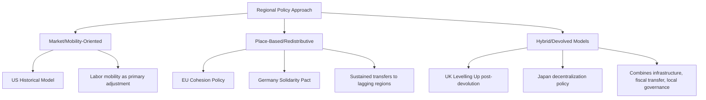

## Comparative Regional Policy Approaches

### Definition and Scope

Comparative regional policy approaches examine how different countries and supranational bodies design and implement policies aimed at addressing spatial economic disparities — differences in income, employment, and productivity across a nation's regions. This subfield analyzes the institutional architecture, policy instruments, and underlying economic philosophy governments adopt to manage regional inequality, contrasting market-oriented approaches emphasizing labor mobility and agglomeration efficiency against interventionist approaches emphasizing direct place-based redistribution and balanced territorial development.

### Theoretical Foundations

**The Efficiency-Equity Tradeoff in Regional Policy**

The central theoretical tension in comparative regional policy design mirrors the place-based policy evaluation literature: spatial concentration of economic activity in leading regions may be efficient from a national output-maximization perspective (exploiting agglomeration economies), while producing politically and socially costly regional inequality. Different national regional policy traditions reflect different implicit weightings of this efficiency-equity tradeoff, with some systems (historically the U.S.) leaning toward reliance on labor mobility and market adjustment, and others (much of the EU) leaning toward active convergence-oriented redistribution.

**Neoclassical Convergence vs. New Economic Geography**

Comparative regional policy design is shaped by which underlying growth model policymakers implicitly or explicitly adopt. Neoclassical growth models (Solow-Swan extended to regional economies) predict automatic convergence as capital flows toward regions with higher marginal returns (lower initial capital-to-labor ratios), implying limited need for active regional policy beyond removing mobility barriers. New Economic Geography models (Krugman and successors), by contrast, predict that agglomeration economies can produce persistent or even self-reinforcing divergence, as cumulative causation locks in advantages for already-leading regions, providing stronger theoretical justification for sustained active regional policy intervention. National policy regimes have shifted in emphasis between these frameworks over time as empirical convergence evidence has been mixed. [Inference — most current regional policy scholarship treats this as a spectrum rather than a binary choice, with hybrid mobility-plus-place-based approaches now common across many systems]

**Fiscal Federalism and Automatic Stabilizers**

A distinct comparative dimension concerns the degree to which national fiscal architecture provides automatic interregional redistribution through progressive taxation and transfer systems, independent of explicit "regional policy" programs. Countries with highly centralized fiscal systems and progressive national tax-transfer schemes (much of Western Europe) achieve substantial passive interregional redistribution through ordinary fiscal federalism, while more fiscally decentralized systems (Switzerland, to a degree the U.S.) rely more heavily on explicit, targeted regional programs to achieve comparable redistributive effects, since automatic stabilizers are weaker at the sub-national level.

### Major National and Supranational Frameworks

**European Union Cohesion Policy**

The EU's Cohesion Policy is among the most extensively studied comparative regional policy frameworks globally, allocating substantial multi-year budget commitments (via the European Regional Development Fund, Cohesion Fund, and European Social Fund) to regions classified by GDP per capita relative to the EU average, using the NUTS (Nomenclature of Territorial Units for Statistics) classification system to define eligible regions. Funding eligibility thresholds (regions below specific percentages of EU average GDP per capita) create natural regression-discontinuity evaluation opportunities extensively exploited in the academic literature, generally finding positive convergence effects, though with substantial heterogeneity depending on recipient-region governance quality and absorptive capacity.

**United States: Fragmented, Market-Oriented Tradition**

The U.S. has historically lacked a comprehensive national regional policy comparable to EU Cohesion Policy, instead relying on a fragmented combination of sector-specific programs (Economic Development Administration grants, Appalachian Regional Commission for a specific historically distressed region, Empowerment Zones and similar place-based tax incentive programs, and more recently Opportunity Zones), reflecting a policy tradition emphasizing labor mobility as the primary adjustment mechanism for regional economic shocks rather than sustained place-based transfers. [Inference] Some recent scholarship has argued this reliance on mobility as the primary adjustment channel has become less effective as U.S. interstate migration rates have declined over recent decades, renewing debate over whether more active place-based intervention is warranted.

**United Kingdom: Post-Devolution and "Levelling Up"**

UK regional policy has evolved substantially through devolution to Scotland, Wales, and Northern Ireland, and more recently through the explicitly framed "Levelling Up" agenda targeting persistent North-South and core-periphery regional disparities within England specifically, combining infrastructure investment, devolved funding mechanisms to local/regional authorities, and place-based innovation and skills programs. [Unverified — specific program structures and funding allocations under evolving UK regional policy initiatives should be checked against current UK government sources, as this policy area has seen frequent restructuring]

**Germany: Solidarity-Based Fiscal Equalization**

Germany's regional policy tradition is distinctive for its strong constitutional commitment to "equivalent living conditions" (gleichwertige Lebensverhältnisse) across the federation, operationalized through a robust interstate fiscal equalization system (Länderfinanzausgleich) alongside historically massive place-based transfers to Eastern German states following reunification (the Solidarity Pact/Solidaritätszuschlag), representing one of the most extensive sustained place-based redistribution programs among developed economies, motivated explicitly by national cohesion and equity objectives distinct from pure efficiency-maximizing regional policy design.

**Japan and East Asian Regional Balance Policies**

Japan's regional policy tradition has historically emphasized deliberate industrial decentralization from Tokyo through combinations of infrastructure investment (notably the Shinkansen high-speed rail network, partly regional-development-motivated) and administrative/corporate relocation incentives, reflecting explicit national concern about excessive Tokyo primacy, though empirical assessments of the effectiveness of decentralization-oriented policy in actually reducing Tokyo's economic dominance are mixed.

### Comparative Policy Instrument Analysis

**Labor Mobility Facilitation vs. Place-Based Investment**

A core comparative design choice is the relative emphasis on:

- **People-based/mobility policies**: Portable unemployment insurance, relocation assistance, national (rather than regional) minimum wage and social insurance floors, reducing barriers (e.g., housing supply constraints in destination regions, as discussed in comparative housing analysis) that impede labor from moving toward opportunity
- **Place-based policies**: Direct infrastructure investment, targeted tax incentives, enterprise zones, and public sector employment/relocation in lagging regions, aiming to bring opportunity to people rather than facilitating people moving to opportunity

Most developed economies employ some blend, but the relative emphasis varies substantially and reflects both economic-philosophical differences and path-dependent political economy factors (electoral geography incentives for regional transfer programs).

**Devolution and Multi-Level Governance Design**

Comparative regional policy also varies substantially in *implementation governance* — whether regional development funding and decision-making authority is centralized at the national level, devolved to regional/subnational authorities, or (as in the EU model) operates through a multi-level system combining supranational funding allocation with national and regional co-management, each involving different tradeoffs regarding local information advantages versus coordination/accountability challenges.

### Diagram: Comparative Regional Policy Framework Positioning

### Illustration: Regional Policy Philosophy Spectrum

<svg xmlns="http://www.w3.org/2000/svg" viewBox="0 0 640 260">
<text x="320" y="24" text-anchor="middle" font-size="15" font-weight="bold" fill="#1a1a1a">Regional Policy Spectrum: Mobility vs. Place-Based (svg_diagram)</text>
<line x1="80" y1="140" x2="560" y2="140" stroke="#333" stroke-width="2" />
<circle cx="80" cy="140" r="5" fill="#2471a3" />
<circle cx="560" cy="140" r="5" fill="#c0392b" />
<text x="80" y="170" text-anchor="middle" font-size="11" fill="#2471a3">Pure Mobility-Oriented</text>
<text x="560" y="170" text-anchor="middle" font-size="11" fill="#c0392b">Pure Place-Based Redistribution</text>
<circle cx="150" cy="140" r="6" fill="#1a1a1a" />
<text x="150" y="120" text-anchor="middle" font-size="10">US (historical)</text>
<circle cx="300" cy="140" r="6" fill="#1a1a1a" />
<text x="300" y="120" text-anchor="middle" font-size="10">UK Levelling Up</text>
<circle cx="420" cy="140" r="6" fill="#1a1a1a" />
<text x="420" y="120" text-anchor="middle" font-size="10">EU Cohesion Policy</text>
<circle cx="510" cy="140" r="6" fill="#1a1a1a" />
<text x="510" y="120" text-anchor="middle" font-size="10">Germany Solidarity Pact</text>
</svg>

### Key Points

- Comparative regional policy design reflects underlying (often implicit) choices about growth model assumptions — neoclassical convergence favoring mobility-based approaches versus New Economic Geography favoring active place-based intervention
- Fiscal federalism structure independently shapes the need for explicit regional programs, since automatic interregional redistribution through progressive national tax-transfer systems substitutes for targeted regional policy in more fiscally centralized systems
- EU Cohesion Policy represents the most extensively evaluated large-scale supranational regional policy framework, using NUTS-based eligibility thresholds that enable rigorous causal evaluation
- Germany's post-reunification Solidarity Pact represents one of the most extensive sustained place-based transfer programs among developed economies, motivated by explicit constitutional equity commitments
- Declining interstate labor mobility in some historically mobility-reliant systems (e.g., the U.S.) has prompted renewed debate over the adequacy of market-adjustment-based regional policy traditions

### Related Topics

- EU Cohesion Policy evaluation methodology and NUTS classification
- German fiscal equalization system (Länderfinanzausgleich)
- New Economic Geography and cumulative causation models
- US regional policy fragmentation and Appalachian Regional Commission
- UK devolution and Levelling Up agenda program design
- Interstate/interregional labor mobility trends and determinants
- Fiscal federalism and automatic stabilizer design
- Place-based policy evaluation methodology
- Japan Shinkansen network and decentralization policy
- Regional convergence empirical testing (beta and sigma convergence)