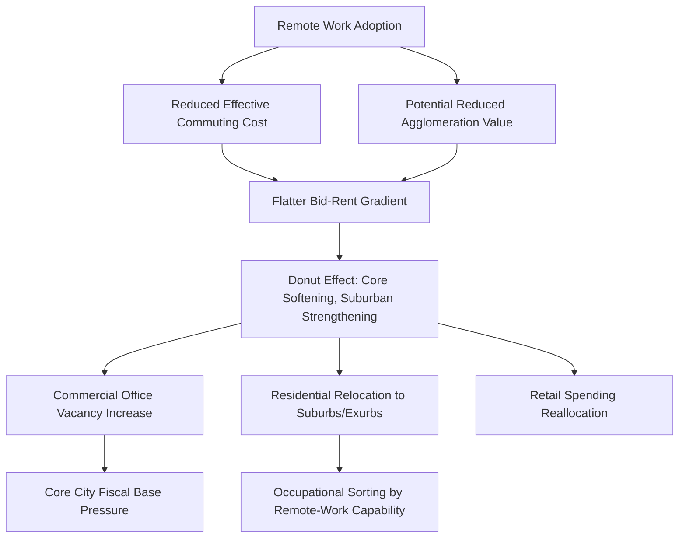

## Remote Work and the Theory of City Structure

### Definition and Scope

Remote work and the theory of city structure examines how the shift toward telecommuting and hybrid work arrangements affects the foundational economic logic of urban spatial organization, particularly the classical relationship between commuting cost, land rent gradients, and city form. This subfield extends and stress-tests the monocentric city model and related urban spatial equilibrium frameworks to incorporate a labor force with heterogeneous and partial workplace attendance requirements, a phenomenon that accelerated sharply following the COVID-19 pandemic and has prompted substantial theoretical and empirical reassessment of core urban economic models.

### Theoretical Foundations

**The Monocentric City Model Under Remote Work**

The classical Alonso-Muth-Mills monocentric city model predicts equilibrium land rent as a declining function of distance $d$ from the central business district (CBD), driven by commuting cost $t$:

$$R(d) = R(0) - t \cdot d$$

Remote work fundamentally alters this relationship by reducing the *effective* commuting cost for workers who attend the office fewer days per week. If a worker commutes only $\phi$ days out of a standard workweek (hybrid arrangement), their effective distance-cost sensitivity is scaled:

$$R(d) = R(0) - (\phi \cdot t) \cdot d$$

This flattens the bid-rent curve, predicting that as $\phi$ falls (more remote days), the rent penalty for distance from the CBD shrinks, and households should be willing to locate farther from the center for a given housing budget — the core theoretical mechanism behind the empirically observed "donut effect."

**The "Donut Effect" and Urban Decentralization**

Ramani and Bloom's widely cited empirical and theoretical work formalizes the observation that remote work-enabled decentralization does not uniformly depress all urban areas, but rather produces a distinctive spatial pattern: **relative decline in dense, expensive urban cores** (where remote-capable, high-income workers had been paying a substantial premium for centrality that is now less necessary) **alongside relative growth in suburban and exurban areas** within the same metropolitan region — a "donut" pattern of urban core softening surrounded by suburban strengthening, rather than uniform metro-wide decline or uniform metro-wide growth.

**Remote Work as a Reduction in Effective Agglomeration Value**

A distinct but related theoretical thread examines remote work's effect on the *value* of urban agglomeration itself, not just commuting cost. If a portion of the productivity benefit of urban density stems from face-to-face knowledge spillovers and collaboration (Marshallian externalities), then a shift toward remote/hybrid work may reduce the realized productivity premium of central urban locations even independent of commuting cost considerations — implying the bid-rent flattening from reduced commuting cost may be compounded by reduced willingness-to-pay for proximity itself, though [Inference] the magnitude of this "pure agglomeration erosion" effect, as distinct from commuting-cost effects, remains empirically difficult to isolate and is an active area of ongoing research.

**Heterogeneous Remote-Work Capability and Spatial Sorting**

Because remote work capability varies sharply by occupation and industry (highly feasible for many information/knowledge-intensive professional occupations, largely infeasible for many service, manufacturing, healthcare, and retail occupations), the theoretical prediction is not uniform urban decentralization but **sorting by remote-work compatibility**: workers in high-remote-capability occupations gain the greatest locational flexibility and are predicted to disproportionately drive suburbanization/exurbanization, while workers in low-remote-capability occupations remain tied to the traditional commuting-cost-driven location logic, potentially widening residential segregation along occupational/skill lines beyond pre-pandemic patterns. [Inference — the long-run equilibrium sorting pattern is still emerging empirically as of the available research base and may continue to evolve]

### Extensions to Standard Urban Models

**Modified Commuting Cost Function**

Formal theoretical extensions of the monocentric model incorporate remote work by treating the commuting frequency $\phi_i$ as a household/worker-specific parameter (rather than a fixed institutional constant), generating a distribution of effective bid-rent curves across the population rather than a single city-wide gradient, with implications for the shape of the *aggregate* urban density gradient once population-weighted across heterogeneous remote-work types.

**Polycentric Model Extensions**

Some theoretical work extends beyond the pure monocentric framework toward polycentric models incorporating both a primary CBD and emerging suburban "edge city" or lifestyle-amenity-based sub-centers, with remote work potentially accelerating the relative importance of amenity-based location decisions (proximity to parks, larger homes, lower density) over pure commute-minimization decisions for the growing remote-capable population share.

**General Equilibrium Feedback Effects**

More complete theoretical treatments incorporate general equilibrium feedback: as remote-capable, often higher-income households relocate to suburban/exurban areas, this affects suburban land and housing prices (upward pressure), local suburban retail and service demand (positive spillover to local service employment in receiving areas), and — via reduced core-city tax base from commercial office vacancy and reduced high-income residential concentration — core city fiscal capacity, creating potential feedback loops affecting core-city public service provision and, by extension, core-city residential desirability for remaining residents.

### Empirical Evidence

**Commercial Office Market Effects**

The most immediately visible empirical manifestation has been substantial and sustained increases in commercial office vacancy rates in many major central business districts following the pandemic-era shift to remote/hybrid work, with the persistence of elevated vacancy beyond initial pandemic disruption periods interpreted by many researchers as evidence of a structural rather than purely transitory shift in office space demand. [Unverified — precise current vacancy rate figures vary substantially by city and should be checked against current commercial real estate market data, as this remains a rapidly evolving empirical picture]

**Residential Relocation Patterns**

Empirical studies using address-change and migration data have documented measurable population and household relocation from dense urban cores toward lower-density suburban and exurban locations within the same metro areas following the shift to remote work, generally concentrated among higher-income, remote-capable households, consistent with the donut effect and occupational sorting theoretical predictions described above.

**House Price and Rent Gradient Changes**

Several studies have documented a measurable flattening of the urban rent/price gradient with respect to CBD distance in metro areas with high remote-work adoption rates relative to pre-pandemic gradients, consistent with the theoretical bid-rent flattening prediction, though the magnitude and persistence of this flattening varies substantially across metro areas depending on local industry composition and remote-work adoption intensity.

**Retail and Local Service Spillovers**

Research examining local business patterns has found that reduced weekday CBD foot traffic from remote/hybrid workers has measurably reduced revenue for CBD-proximate retail and food service businesses reliant on office worker daytime spending, while corresponding modest gains have been observed in residential/suburban neighborhood retail and service establishments benefiting from increased daytime local presence of remote workers — a spatial reallocation of local consumption spending following the same broader decentralization pattern.

### Diagram: Remote Work's Effect on Urban Bid-Rent Structure

### Illustration: Bid-Rent Curve Flattening Under Remote Work

<svg xmlns="http://www.w3.org/2000/svg" viewBox="0 0 640 360">
<text x="320" y="24" text-anchor="middle" font-size="15" font-weight="bold" fill="#1a1a1a">Bid-Rent Gradient: Pre- vs. Post-Remote Work Adoption (svg_diagram)</text>
<line x1="70" y1="310" x2="580" y2="310" stroke="#333" stroke-width="1.5" />
<line x1="70" y1="310" x2="70" y2="50" stroke="#333" stroke-width="1.5" />
<text x="325" y="335" text-anchor="middle" font-size="12" fill="#333">Distance from CBD</text>
<text x="35" y="180" text-anchor="middle" font-size="12" fill="#333" transform="rotate(-90 35 180)">Land Rent R(d)</text>
<path d="M 90 70 L 560 290" stroke="#c0392b" stroke-width="2.5" fill="none" />
<text x="440" y="270" font-size="12" fill="#c0392b">Pre-remote-work R(d)</text>
<path d="M 90 70 L 560 200" stroke="#2471a3" stroke-width="2.5" fill="none" />
<text x="440" y="185" font-size="12" fill="#2471a3">Post-remote-work R(d) (flatter)</text>
<line x1="120" y1="50" x2="120" y2="310" stroke="#888" stroke-width="1" stroke-dasharray="4" />
<text x="90" y="65" font-size="10" fill="#555">CBD core</text>
<line x1="450" y1="50" x2="450" y2="310" stroke="#888" stroke-width="1" stroke-dasharray="4" />
<text x="400" y="65" font-size="10" fill="#555">Suburban zone</text>
<circle cx="120" cy="221" r="4" fill="#27ae60" />
<circle cx="120" cy="128" r="4" fill="#27ae60" />
<text x="128" y="175" font-size="10" fill="#27ae60">Core rent decline</text>
<circle cx="450" cy="245" r="4" fill="#e67e22" />
<circle cx="450" cy="225" r="4" fill="#e67e22" />
<text x="458" y="235" font-size="10" fill="#e67e22">Suburban rent gain</text>
</svg>

### Key Points

- Remote work operates on the classical bid-rent model primarily by reducing effective commuting cost, flattening the rent gradient rather than eliminating the underlying spatial logic entirely
- The "donut effect" describes asymmetric spatial impact — relative urban core softening alongside relative suburban/exurban strengthening — rather than uniform metropolitan decline or growth
- Remote-work capability varies sharply by occupation, producing sorting effects that may widen residential segregation along skill/occupational lines
- Commercial office vacancy increases and core-city fiscal base pressure represent important general equilibrium feedback channels beyond the direct residential bid-rent effect
- The distinction between commuting-cost reduction effects and potential erosion of agglomeration/productivity value itself remains an important but empirically difficult-to-isolate theoretical distinction

### Related Topics

- Alonso-Muth-Mills monocentric city model foundations
- Commercial office market conversion and adaptive reuse policy
- Occupational remote-work feasibility classification (Dingel-Neiman index)
- Urban fiscal base and municipal revenue structure under decentralization
- Polycentric urban models and edge city formation
- Residential sorting and segregation by remote-work capability
- Agglomeration economies and knowledge spillover measurement
- Retail and local service spending geography shifts
- Housing demand and exurban growth patterns post-pandemic
- Central business district revitalization policy responses