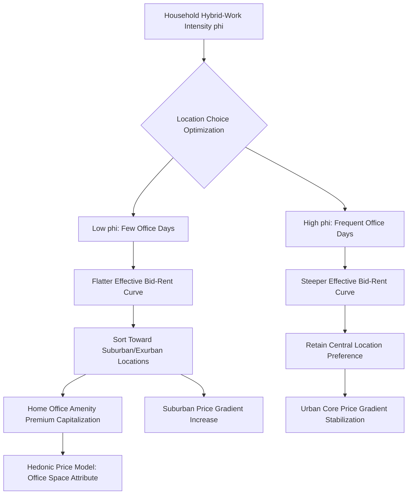

## Residential Sorting and Housing Price Gradients Under Hybrid Work

### Definition and Scope

Residential sorting and housing price gradients under hybrid work examines how the shift toward hybrid (partial-remote) work arrangements specifically — as distinct from either fully in-office or fully remote work — reshapes household location decisions and the resulting spatial structure of housing prices. This subfield narrows the broader remote-work-and-city-structure analysis to focus specifically on the sorting mechanism by which heterogeneous households select residential locations given differentiated hybrid work schedules, and the resulting equilibrium price gradient this sorting produces.

### Theoretical Foundations

**Hybrid Work as a Continuous Location Choice Parameter**

Unlike the binary remote/non-remote framing, hybrid work introduces a continuous parameter $\phi \in [0,1]$ representing the fraction of the workweek requiring physical office attendance. This transforms the standard household location problem from a single commuting-cost minimization into a joint optimization incorporating both commuting cost (now scaled by $\phi$) and the value of larger/cheaper housing available at greater distance:

$$\max_{d} \, U(H(d), \phi \cdot t \cdot d, A(d))$$

where $H(d)$ is housing consumption obtainable at distance $d$ (increasing with $d$ given a fixed budget, since rent falls with distance), and $A(d)$ represents distance-varying amenities. Because $\phi$ varies systematically by occupation, industry, and employer policy, this generates a **household-specific optimal distance** that varies smoothly with hybrid-work intensity rather than a single uniform population response.

**Sorting Equilibrium and Residential Stratification**

In a spatial sorting equilibrium, households with lower $\phi$ (fewer required office days) have flatter effective bid-rent curves and should, in equilibrium, sort toward more distant locations for a given housing budget, while households with higher $\phi$ (more required office days) retain steeper effective bid-rent curves favoring proximity. This produces a **new dimension of residential stratification** — beyond traditional income-based sorting — where hybrid-work intensity itself becomes a sorting variable, with important implications since hybrid-capable occupations are disproportionately concentrated among higher-income, higher-education workers, potentially compounding rather than independently operating alongside pre-existing income-based spatial sorting.

**Capitalization of Hybrid-Work Flexibility into Housing Prices**

The theoretical prediction is that hybrid-work flexibility capitalizes into housing prices in two offsetting ways: (1) reduced willingness-to-pay for central-location premium among hybrid workers, tending to compress the urban rent gradient (as discussed in the broader remote-work bid-rent flattening literature), and (2) potentially increased willingness-to-pay for space-intensive amenities (home office space, larger lot sizes, outdoor space) that become more valuable when more time is spent working from home, which may raise the *hedonic* price premium for specific housing attributes even as the pure *distance* gradient flattens. These two capitalization channels are conceptually distinct and require separate empirical identification.

### Hedonic Price Modeling of Hybrid-Work Effects

**Standard Hedonic Framework**

The empirical workhorse for this literature is the hedonic pricing model, decomposing observed housing prices $P$ into implicit prices for a vector of housing and locational attributes $X$:

$$P = \beta_0 + \beta_1 \cdot d + \beta_2 \cdot X_{\text{size}} + \beta_3 \cdot X_{\text{office space}} + \beta_4 \cdot X_{\text{amenities}} + \varepsilon$$

Hybrid-work-focused extensions of this model typically interact the distance coefficient $\beta_1$ with local or household-level hybrid-work adoption intensity, testing whether the marginal price penalty for distance from the CBD has measurably declined in areas/periods with higher hybrid-work prevalence, and separately testing whether $\beta_3$ (implicit price of dedicated home office space, extra bedrooms convertible to office use, etc.) has risen.

**Difference-in-Differences Applications**

Empirical identification typically exploits variation in hybrid-work adoption intensity across metro areas (driven by differing local industry composition — metros with higher shares of information/professional services employment experienced more intensive hybrid-work adoption) combined with before/after comparison around the pandemic-era policy shift, using a DiD framework:

$$P_{i,d,t} = \alpha + \beta_1 (\text{HighHybridMetro}_i \times \text{Post}_t) + \beta_2 (\text{HighHybridMetro}_i \times \text{Post}_t \times d) + \gamma_i + \delta_t + \varepsilon_{i,d,t}$$

where the triple-interaction term $\beta_2$ captures whether the distance-price gradient flattened more in metros with greater hybrid-work exposure relative to metros with less exposure — this differential exposure design helps address the concern that national house price trends during the pandemic period reflected many confounding factors (interest rates, general migration shifts) beyond hybrid work specifically.

### Empirical Findings

**Gradient Flattening Magnitude**

Studies applying hedonic and DiD approaches to metro-level housing price data have generally found measurable relative price gains in suburban/exurban zip codes relative to dense urban core zip codes within the same metro area during the period of most intensive hybrid-work adoption, consistent with the theoretical gradient-flattening prediction, though [Unverified — the precise magnitude of gradient flattening varies substantially across studies, metro areas, and time periods studied, and some of the initial pandemic-era gradient shift may have partially reversed as hybrid-work policies stabilized or as some employers increased required office attendance in subsequent periods] this remains an evolving empirical picture requiring ongoing monitoring rather than a single settled magnitude.

**Home Office Space Premium**

Several hedonic studies have documented a measurable price premium for housing units with dedicated office-convertible space (extra bedrooms, den/study spaces) following the shift to hybrid work, consistent with the amenity-capitalization channel, representing a genuinely new hedonic attribute premium not well-captured in pre-pandemic housing price models.

**Heterogeneity by Household Income and Occupation**

Empirical sorting studies using microdata (individual household relocation and occupation data) have found that the suburban/exurban relocation and associated price gradient effects are concentrated disproportionately among higher-income, hybrid-capable occupational groups, consistent with the compounding-stratification theoretical prediction — lower-income and less hybrid-capable households have not exhibited comparable relocation patterns, since their location decisions remain governed primarily by the traditional full-commuting-cost bid-rent logic.

**Persistence vs. Transience Debate**

A significant ongoing empirical and policy question is whether the observed gradient flattening represents a durable structural shift in urban spatial equilibrium or a transitory pandemic-era disruption that will partially or fully reverse as hybrid-work policies mature and, in some cases, become more restrictive (return-to-office mandates observed at various employers in subsequent periods). [Speculation] Given the continued heterogeneity in employer hybrid-work policies as of the most recent available data, the long-run equilibrium gradient shape likely depends significantly on how hybrid-work norms stabilize across major employer categories over the coming years, making this an area where current-period data should be treated as an evolving rather than settled empirical picture.

### Diagram: Hybrid-Work Sorting and Price Gradient Mechanism

### Illustration: Hedonic Price Premium for Home Office Space

<svg xmlns="http://www.w3.org/2000/svg" viewBox="0 0 640 340">
<text x="320" y="24" text-anchor="middle" font-size="15" font-weight="bold" fill="#1a1a1a">Home Office Space Price Premium Over Time (svg_diagram)</text>
<line x1="70" y1="290" x2="580" y2="290" stroke="#333" stroke-width="1.5" />
<line x1="70" y1="290" x2="70" y2="50" stroke="#333" stroke-width="1.5" />
<text x="325" y="315" text-anchor="middle" font-size="12" fill="#333">Time (Pre- to Post-Pandemic)</text>
<text x="35" y="170" text-anchor="middle" font-size="12" fill="#333" transform="rotate(-90 35 170)">Hedonic Price Premium (%)</text>
<path d="M 100 260 L 200 255 L 280 150 L 380 110 L 480 100 L 560 95" fill="none" stroke="#27ae60" stroke-width="2.5" />
<text x="420" y="80" font-size="11" fill="#27ae60">Dedicated office/den space</text>
<path d="M 100 270 L 200 268 L 280 260 L 380 255 L 480 253 L 560 250" fill="none" stroke="#7f8c8d" stroke-width="2.5" stroke-dasharray="5" />
<text x="420" y="240" font-size="11" fill="#7f8c8d">Standard bedroom count</text>
<line x1="280" y1="60" x2="280" y2="290" stroke="#c0392b" stroke-width="1" stroke-dasharray="3" />
<text x="285" y="70" font-size="10" fill="#c0392b">Pandemic-era shift</text>
</svg>

### Key Points

- Hybrid work introduces a continuous sorting parameter (office attendance frequency) distinct from a binary remote/non-remote framing, generating household-specific optimal location distances
- Two distinct capitalization channels operate simultaneously: distance-gradient flattening (reduced central-location premium) and rising hedonic premiums for home-office-convertible space
- Empirical identification relies heavily on differential metro-level hybrid-work exposure combined with difference-in-differences designs to isolate hybrid-work effects from confounding pandemic-era housing market shocks
- Sorting effects are concentrated among higher-income, hybrid-capable occupational groups, raising concerns about compounding rather than independently operating income-based residential stratification
- Whether observed gradient flattening is a durable structural shift or a transitory disruption remains an open empirical question sensitive to evolving employer return-to-office policies

### Related Topics

- Hedonic pricing model specification and identification
- Difference-in-differences applications in housing economics
- Return-to-office mandate trends and labor market effects
- Home office space demand and residential renovation markets
- Occupational hybrid-work feasibility classification
- Income-based residential stratification and compounding sorting effects
- Suburban and exurban housing supply responsiveness
- Urban core commercial-to-residential conversion policy
- Spatial equilibrium models with heterogeneous commuting costs
- Metro-level industry composition and remote-work exposure measurement