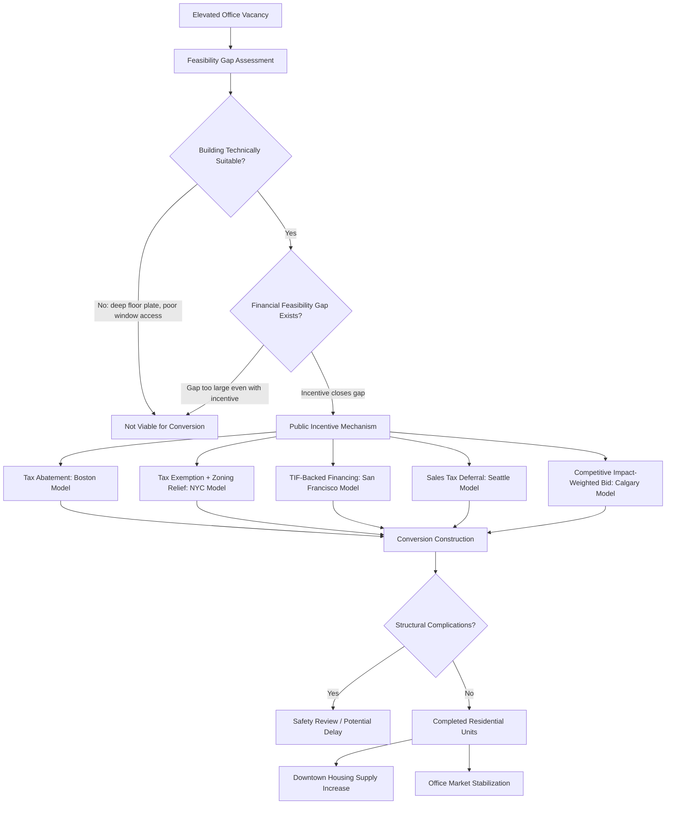

## Office-to-Residential Conversion and Downtown Recovery

### Definition and Scope

Office-to-residential conversion and downtown recovery examines the economics, financing, and policy design of repurposing vacant or underutilized commercial office buildings into residential housing units, as a strategy addressing two interlinked urban problems simultaneously: elevated structural office vacancy following the remote/hybrid work shift, and persistent urban housing supply shortages. This subfield combines real estate economics, urban public finance, and land use policy analysis to evaluate when conversion is economically and technically feasible, what public incentive structures are required to make marginal conversion projects viable, and whether conversion strategies meaningfully contribute to broader downtown economic revitalization.

### Theoretical Foundations

**Highest-and-Best-Use Reallocation Under a Demand Shock**

Standard urban land economics treats building use as determined by highest-and-best-use calculations comparing the capitalized net operating income achievable under alternative uses. The pandemic-era and subsequent structural decline in office space demand (discussed in the broader remote-work-and-city-structure literature) shifted the relative highest-and-best-use calculus for many office buildings toward residential use in markets with simultaneously strong housing demand, but this reallocation is not automatic or costless: conversion requires substantial capital investment to overcome building-specific technical constraints, meaning market forces alone often fail to trigger conversion even when the *theoretical* highest-and-best-use has shifted, motivating the array of public incentive programs discussed below.

**The Conversion Feasibility Gap**

A central analytical concept in this literature is the **feasibility gap** — the difference between a building's as-converted residential value and the sum of its acquisition/current value plus conversion construction costs. Formally, conversion is privately profitable when:

$$V_{\text{residential}} - (V_{\text{acquisition}} + C_{\text{conversion}}) > 0$$

For many older, structurally challenging office buildings, particularly those with large floor plates, deep-set floor areas far from windows (limiting natural light for residential units), and mechanical systems unsuited to residential use, $C_{\text{conversion}}$ can be prohibitively high relative to achievable residential value, producing a persistent feasibility gap that public subsidy, tax abatement, or zoning relaxation is designed to close.

**Fiscal Externality Rationale for Public Intervention**

Beyond simple market-failure framing, city governments have an independent fiscal rationale for subsidizing conversion: sustained office vacancy erodes commercial property tax assessments and reduces downtown foot traffic supporting retail tax revenue, while successful conversion both stabilizes the underlying property's assessed value trajectory and can, over the medium term, generate new residential property tax revenue and local consumption spending — a rationale explicitly invoked in several current municipal program designs (discussed below), including San Francisco's approach of backing conversion incentive payments with anticipated future increases in property tax revenue the projects themselves generate.

### Technical and Structural Conversion Constraints

**Building Typology Suitability**

Not all office buildings are equally convertible. Key technical determinants of feasibility include floor plate depth (narrower, pre-war-era floor plates with more perimeter window access are generally more suitable than large, deep modern floor plates designed for open-plan office layouts), column spacing and structural grid compatibility with residential unit layouts, existing window configurations and operability, and vertical riser/mechanical system capacity for retrofitting residential plumbing and ventilation requirements throughout the building.

**Structural and Safety Considerations**

Conversion projects have encountered building-specific structural challenges during construction that underscore that conversion is not a uniformly low-risk retrofit process. Recent reporting on large-scale conversion projects in Manhattan has documented instances of structural complications during construction — including buckling of structural columns at a major active conversion project and a stop-work order issued after cracks were identified in a newly added top floor at another project — which have prompted renewed scrutiny of structural engineering and safety protocols specific to adaptive reuse conversions as office-to-residential developers face new questions about structural safety following the buckling of two structural columns at the city's largest active conversion project in Midtown Manhattan, and a stop-work order at another conversion project in Lower Manhattan after cracks were found in the building's newly added top floor. [Bipartisan Policy Center](https://bipartisanpolicy.org/explainer/office-to-residential-conversions-in-new-york-city/)

### Public Incentive Program Design Models

**Tax Abatement Models (Boston)**

Boston's Office to Residential Conversion Program, launched in October 2023, provides a substantial multi-year property tax abatement as the primary incentive mechanism. The program provides a 75 percent tax abatement for 29 years as an incentive to developers to convert vacant office space into residential units, including student and workforce housing, with the explicit dual goal of supporting owners and developers of older commercial office buildings in converting them to housing, and helping stabilize the office market downtown while also increasing the housing stock in Downtown Boston. As of program updates, the initiative had received 22 applications to convert 1.2 million square feet of office space across 27 buildings into 1,517 new homes, including 284 income-restricted units, surpassing initial expectations, with the city noting a streamlined review process allowing approvals in just six months. The program was subsequently extended, with the application remaining open through December 31, 2026 with approvals given on a rolling basis. [Office to Residential Conversion Program Extended as it Surpasses 1,500 New Homes | Boston.gov +4](https://www.boston.gov/news/office-residential-conversion-program-extended-it-surpasses-1500-new-homes)

**Combined Tax Incentive and Zoning Relaxation Models (New York City)**

New York City's approach, centered on the 467-m tax exemption program, combines financial incentives with relaxed land use constraints. The other arm of the policy intervention is the relaxation of land use constraints that limited the stock of buildings that could be converted. Fiscal analysis from the NYC Comptroller's office estimated that the pipeline of potential projects in Manhattan south of 59th Street that could qualify for 467-m benefits between now and June 2026 could carry a cost of $5.1 billion in present value (or tax expenditures of $5.6 billion, also in present value), and these conversions could produce approximately 14,500 apartments, of which 3,600 are income-restricted, with the rent discounts on the income-restricted apartments representing 81% of the total cost of the program over the life of the exemptions — an important program-design finding highlighting that most of the fiscal cost of even a market-rate-focused conversion incentive program is concentrated in the affordable-housing-restricted unit share. The Comptroller's analysis also found exemptions more likely to be pivotal for investment decisions in Midtown and likely too generous in Lower Manhattan, illustrating the importance of geographically differentiated incentive calibration within a single program. [Office-to-Residential Conversions in NYC: Economics and Fiscal Estimates - Office of the New York City Comptroller Mark Levine +3](https://comptroller.nyc.gov/reports/office-to-residential-conversions-in-nyc-economics-and-fiscal-estimates/)

**Tax Increment/Future Revenue-Backed Financing Models (San Francisco)**

San Francisco's approach uses a downtown financing district structure explicitly tied to anticipated future tax revenue generated by the converted projects themselves. Eligible projects may enroll to receive annual incentive payments for up to 30 years to help offset the cost of converting office and commercial space into residential units, with the payments backed by future increases in property tax revenue generated by the projects — structurally similar in logic to Tax Increment Financing mechanisms used in broader infrastructure and redevelopment finance, applied specifically to the conversion context. [Californiaconstructionnews](https://www.californiaconstructionnews.com/2026/02/16/san-francisco-creates-downtown-financing-district-to-spur-office-to-housing-conversions/)

**Tax Deferral Models (Seattle)**

Seattle's program uses a sales and use tax deferral mechanism rather than a property tax abatement, authorized under state law. The Sales and Use Tax Deferral Program encourages the conversion of underutilized commercial properties into housing, including below-market-rate rental or ownership opportunities, and supports economic development, downtown activation, and the creation of more residential options in key areas, launched as part of the city's broader Downtown Activation Plan in response to the observation that remote work, declining transit use, shifting retail trends, and affordability concerns have reshaped the urban core. [Seattle.gov](https://www.seattle.gov/opcd/office-to-residential)[Seattle.gov](https://www.seattle.gov/opcd/office-to-residential)

**Competitive Bid/Impact-Weighted Models (Calgary)**

Calgary's program, relaunched in mid-2026 under a revised structure, illustrates an evolving approach incorporating explicit impact-weighted competitive scoring. Key updates included a new "impact" criterion added to application review with more weighting for affordable housing, large-scale projects, and innovative commercial uses retaining non-residential assessment class, alongside an expanded "other uses" category introducing a competitive bid process to support a broader range of adaptive reuse opportunities, including seniors' housing, co-living, student housing, and life sciences — reflecting a shift toward more targeted, outcome-weighted incentive allocation rather than uniform by-right subsidy. [City of Calgary](https://www.calgary.ca/development/downtown-office-conversion-program.html)[City of Calgary](https://www.calgary.ca/development/downtown-office-conversion-program.html)

### Program Design Trade-offs and Evaluation Considerations

**Targeting Affordability vs. Maximizing Conversion Volume**

The NYC fiscal analysis finding that affordability-restricted units account for the large majority of program cost despite representing a minority of total units produced illustrates a core policy design tension: programs can be calibrated toward maximizing total conversion volume (favoring lighter affordability requirements) or toward maximizing affordable unit production (concentrating fiscal cost on a smaller number of income-restricted units), with different implications for both downtown revitalization goals and housing affordability goals that do not necessarily align.

**Geographic and Submarket Calibration**

The finding that identical incentive structures can be simultaneously insufficient in one submarket (Midtown Manhattan) and excessive in another (Lower Manhattan) within the same city underscores that conversion feasibility gaps vary substantially even within a single metro area based on local office rent trajectories, building stock characteristics, and residential demand strength — suggesting uniform city-wide incentive programs may be inefficiently calibrated relative to geographically differentiated alternatives.

**Housing Market Context and Urgency**

The broader housing affordability backdrop shapes the policy urgency behind conversion programs in ways that vary by city. In New York specifically, renter affordability has declined significantly, with rents growing seven times faster than wages in 2023 — the largest gap of any city in the nation — and rents continuing to surge year-over-year across the city's boroughs into 2026, while more than 40% of renter households are cost-burdened, contributing more than 30% of their income to housing, and a December 2025 analysis found the city faces a housing gap of more than 400,000 units. This context has elevated conversion policy from a purely office-market-stabilization tool to a component of broader housing supply strategy. [Office-to-Residential Conversions in New York City • Bipartisan Policy Center +2](https://bipartisanpolicy.org/explainer/office-to-residential-conversions-in-new-york-city/)

**Structural Risk and Program Maturity**

Some experts caution that conversion growth may begin to slow after 2026 as the city's office market begins to recover, illustrating that conversion program design must account for the possibility that the underlying office-vacancy conditions motivating conversion incentives are themselves cyclical rather than permanently structural — a consideration relevant to sizing multi-year, long-duration tax abatement commitments (such as Boston's 29-year abatement structure) against uncertain long-run office market trajectories. [Bipartisan Policy Center](https://bipartisanpolicy.org/explainer/office-to-residential-conversions-in-new-york-city/)

### Diagram: Office-to-Residential Conversion Policy Pathway

### Illustration: Conversion Feasibility Gap Framework

<svg xmlns="http://www.w3.org/2000/svg" viewBox="0 0 640 340">
<text x="320" y="24" text-anchor="middle" font-size="15" font-weight="bold" fill="#1a1a1a">Closing the Office-to-Residential Feasibility Gap (svg_diagram)</text>
<line x1="80" y1="290" x2="560" y2="290" stroke="#333" stroke-width="1.5" />
<text x="150" y="310" text-anchor="middle" font-size="11" fill="#333">Without Incentive</text>
<text x="450" y="310" text-anchor="middle" font-size="11" fill="#333">With Public Incentive</text>
<rect x="110" y="220" width="80" height="70" fill="#eaf2f8" stroke="#2471a3" />
<text x="150" y="260" text-anchor="middle" font-size="10">Acquisition</text>
<rect x="110" y="120" width="80" height="100" fill="#fdedec" stroke="#c0392b" />
<text x="150" y="175" text-anchor="middle" font-size="10">Conversion Cost</text>
<line x1="110" y1="150" x2="190" y2="150" stroke="#c0392b" stroke-width="1.5" stroke-dasharray="4" />
<text x="200" y="145" font-size="9" fill="#c0392b">Residential Value Ceiling</text>
<text x="200" y="185" font-size="9" fill="#c0392b">Feasibility Gap</text>
<rect x="410" y="220" width="80" height="70" fill="#eaf2f8" stroke="#2471a3" />
<text x="450" y="260" text-anchor="middle" font-size="10">Acquisition</text>
<rect x="410" y="150" width="80" height="70" fill="#fdedec" stroke="#c0392b" />
<text x="450" y="185" text-anchor="middle" font-size="10">Net Conversion Cost</text>
<rect x="410" y="100" width="80" height="50" fill="#eafaf1" stroke="#27ae60" />
<text x="450" y="128" text-anchor="middle" font-size="10" fill="#27ae60">Public Subsidy</text>
<line x1="410" y1="150" x2="490" y2="150" stroke="#27ae60" stroke-width="1.5" stroke-dasharray="4" />
<text x="500" y="145" font-size="9" fill="#27ae60">Residential Value Ceiling</text>
</svg>

### Key Points

- Conversion feasibility depends jointly on technical building suitability (floor plate depth, window access, structural grid) and the financial feasibility gap between conversion cost and achievable residential value
- Public incentive program design varies substantially across cities in mechanism (property tax abatement, tax exemption with zoning relief, TIF-backed financing, sales tax deferral, competitive impact-weighted bidding), reflecting different available fiscal tools and policy priorities
- Fiscal analysis of NYC's program revealed that affordability-restricted units, while a minority of total units, account for the large majority of total program cost — an important consideration for program design and evaluation
- Structural safety complications encountered in large active conversion projects underscore that conversion carries genuine engineering risk distinct from standard new construction
- Whether current elevated office vacancy driving conversion activity represents a durable structural condition or a cyclical phenomenon that may partially reverse is an open question with direct implications for long-duration incentive program design

### Related Topics

- Remote work and the theory of city structure
- Commercial real estate valuation under structural demand shifts
- Tax Increment Financing (TIF) mechanisms in urban redevelopment
- Downtown activation and mixed-use zoning reform
- Housing supply shortage measurement and gap analysis
- Adaptive reuse structural engineering standards
- Municipal fiscal impact analysis of tax abatement programs
- Affordable housing set-aside requirements in incentive programs
- Comparative office-to-residential program design across cities
- Central business district revitalization policy