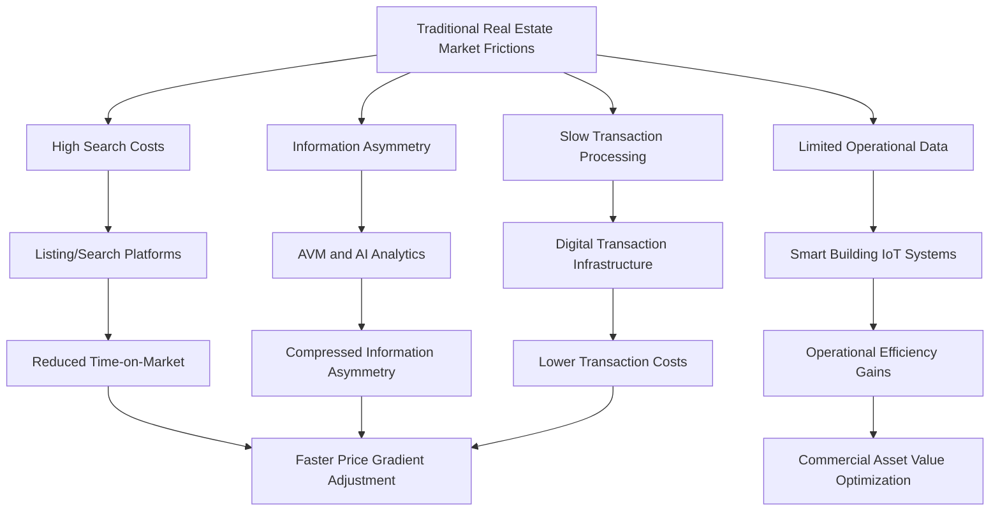

## Proptech and the Digitalization of Real Estate Markets

### Definition and Scope

Proptech (property technology) and the digitalization of real estate markets examines how digital platforms, data analytics, artificial intelligence, and automation are transforming how real estate is searched, transacted, valued, financed, developed, and managed. From an urban and regional economics perspective, this subfield is significant because real estate markets have historically been characterized by severe information asymmetry, high search costs, and illiquidity relative to other asset classes — frictions that directly shape classical urban economic outcomes like price discovery efficiency, market clearing speed, and spatial arbitrage. Digitalization's core economic significance lies in its potential to reduce these frictions, with corresponding implications for housing market efficiency, price gradient formation, and the broader spatial equilibrium models used throughout urban economics.

### Theoretical Foundations

**Search Cost Reduction and Market Efficiency**

Classical urban economic models of housing search (following Wheaton-style search-theoretic housing market models) treat time-on-market and matching frictions as central determinants of housing price dispersion and vacancy duration. Digitalization directly targets these frictions: online listing platforms reduce buyer search costs by aggregating inventory and enabling filtering on hedonic characteristics, theoretically compressing the matching function and reducing both time-on-market and the price dispersion attributable to incomplete buyer information about the full choice set. Reduced search frictions predict, in standard search-theoretic frameworks, faster convergence toward hedonically-consistent equilibrium pricing across comparable units.

**Information Asymmetry and Automated Valuation**

Real estate has historically been characterized by substantial information asymmetry between transacting parties and between market participants and outside observers (unlike centrally-traded financial assets, individual property transactions are heterogeneous and infrequent). Automated Valuation Models (AVMs) — algorithmic pricing tools using hedonic regression and increasingly machine learning approaches applied to large comparable-sales datasets — reduce this asymmetry by providing standardized, low-cost valuation estimates, with implications for reducing appraisal-related transaction friction and potentially compressing bid-ask spreads in preliminary price discovery, though [Inference] AVM accuracy remains heterogeneous across property types and market conditions, with greater reliability generally observed in markets with large volumes of comparable transactions (standardized suburban single-family housing) than in markets with unique or heterogeneous properties (luxury, historic, or highly customized units).

**Platform Economics and Network Effects**

Many proptech business models (listing aggregators, marketplace platforms) exhibit classic two-sided market network effects: platform value to buyers increases with the depth of seller/listing participation, and vice versa, creating winner-take-most dynamics that have driven substantial market consolidation among dominant listing platforms in many national markets, with implications for platform market power and potential rent extraction from both transaction sides that is a recurring subject of competition policy scrutiny in mature proptech markets.

### Major Proptech Technology Categories

**Listing and Search Platforms**

Foundational proptech infrastructure aggregating property listings with search, filtering, and increasingly AI-enhanced recommendation functionality. Consumer research indicates the substantial majority of property searches now begin online, contributing to markedly greater buyer engagement with technology-powered property search tools relative to traditional in-person or print-listing-based search, reflecting a broad ongoing shift in buyer search behavior toward digital-first discovery.

**Automated Valuation Models (AVMs) and AI-Driven Analytics**

AI-powered analytical tools are increasingly central to proptech infrastructure across both residential and commercial segments. Rather than replacing real estate professionals, AI is being used to help them work more efficiently by analyzing large volumes of property data, automating routine tasks, and uncovering patterns that would be difficult to identify manually, with industry observers projecting that as predictive analytics become more sophisticated, access to trusted, high-quality property data will become an increasingly important competitive differentiator for market participants.

**Smart Building and IoT Operations Technology**

Within commercial real estate specifically, adoption of AI-driven tools and smart building technologies has become widespread among major industry participants. By 2026, over 92% of commercial real estate companies report running live AI pilots or full implementations — a sharp increase from roughly 5% only three years earlier — while more than 72% of commercial portfolios utilize smart building technologies spanning energy management, tenant experience, and predictive maintenance functions. [Unverified — adoption statistics from industry market research reports should be treated as directional indicators rather than precise figures, as methodologies and sampling vary across reporting organizations]

**Transaction Digitalization and Blockchain Applications**

Digital transaction infrastructure, including electronic signature and closing platforms, and more experimental blockchain-based property record and transaction systems, aim to reduce the substantial transaction cost and time friction historically characteristic of real estate closings, though blockchain-based property record systems in particular remain at an earlier and more heterogeneous stage of adoption across jurisdictions compared to more mature AVM and listing platform technologies.

**AI Agent and Automation Applications in Property Management**

Emerging applications extend AI beyond valuation and search into operational property management functions, including automated tenant communication and lease document processing — illustrated by industry case examples of AI agents deployed to handle a substantial share of routine resident inquiries without requiring direct human staff involvement, reflecting a broader trend toward AI-driven operational automation within property management specifically as a distinct proptech application area from transaction-focused technology.

### Market Scale and Regional Patterns

**Global Market Growth Trajectory**

Multiple industry market research sources estimate the global proptech market at approximately $51–55 billion in 2026, with most projections forecasting continued strong growth (commonly cited compound annual growth rates in the 16–17% range) toward a market size in the range of $120–230 billion by the early-to-mid 2030s, depending on the forecasting methodology and horizon used across different research providers. [Unverified — market size estimates vary meaningfully across research firms depending on scope definition and methodology; treat any single figure as approximate rather than precise, and consult the original source for a specific figure needed for citation purposes]

**Regional Growth Patterns**

Industry analysis identifies the Asia-Pacific region, particularly India and China, as exhibiting the fastest proptech market growth globally, attributed to large underlying real estate market scale combined with substantial government backing for smart city development programs. The Middle East, particularly Dubai, has also been identified as an emerging proptech and smart city hub, supported by government digital infrastructure initiatives and a real estate sector oriented toward attracting international investment through smart-city-branded large-scale urban development projects.

**AI Investment Concentration**

Within overall proptech investment, AI-related deployment has become a dominant driver of new capital allocation: industry venture capital surveys indicate close to half of proptech-focused venture investors plan increased AI-driven proptech deployment in 2026, and a substantial majority (commonly cited around 70%) of recent proptech deals now include AI components, reflecting the broader trend of AI moving from a discrete "one proptech trend among several" to underlying infrastructure layer across most proptech subcategories.

### Implications for Urban Economic Analysis

**Price Discovery and Gradient Formation Speed**

If digitalization genuinely reduces search and information frictions as theory predicts, this has implications for how quickly urban house price gradients (discussed extensively in the remote-work and residential sorting literature) adjust to underlying demand shocks — faster, more efficient price discovery implies urban spatial equilibrium models with instantaneous market clearing become more empirically applicable, whereas persistent frictions (which proptech may reduce but not eliminate) continue to justify search-theoretic and disequilibrium dynamic modeling approaches.

**Data Availability and Empirical Urban Economics Research**

A significant secondary effect of real estate digitalization, somewhat distinct from its direct market-efficiency implications, is the dramatically expanded availability of granular, high-frequency transaction, listing, and valuation data for empirical urban economics research itself — proptech platforms and associated data analytics firms have become significant data sources supporting the hedonic pricing, gradient estimation, and market efficiency studies discussed throughout this and related urban economics literature.

**Market Concentration and Competition Policy Considerations**

The two-sided network effect dynamics characteristic of dominant listing and transaction platforms raise distinct competition policy questions relevant to urban economists studying market structure — concentrated platform market power in real estate search and transaction infrastructure could, in principle, offset some of the efficiency gains from reduced search costs if platform rent-extraction substantially raises effective transaction costs for buyers or sellers, an area of ongoing regulatory and academic scrutiny in several major national markets.

### Diagram: Proptech's Effect on Real Estate Market Frictions

### Illustration: Proptech Technology Adoption Stack

<svg xmlns="http://www.w3.org/2000/svg" viewBox="0 0 640 340">
<text x="320" y="24" text-anchor="middle" font-size="15" font-weight="bold" fill="#1a1a1a">Proptech Adoption Across the Real Estate Value Chain (svg_diagram)</text>
<rect x="80" y="60" width="480" height="50" rx="6" fill="#eaf2f8" stroke="#2471a3" stroke-width="1.5" />
<text x="320" y="90" text-anchor="middle" font-size="12">Search and Discovery: Listing Platforms, Virtual Tours</text>
<rect x="80" y="125" width="480" height="50" rx="6" fill="#eafaf1" stroke="#27ae60" stroke-width="1.5" />
<text x="320" y="155" text-anchor="middle" font-size="12">Valuation and Underwriting: AVMs, AI Risk Analytics</text>
<rect x="80" y="190" width="480" height="50" rx="6" fill="#fef9e7" stroke="#e67e22" stroke-width="1.5" />
<text x="320" y="220" text-anchor="middle" font-size="12">Transaction: Digital Closing, Blockchain Records</text>
<rect x="80" y="255" width="480" height="50" rx="6" fill="#fdedec" stroke="#c0392b" stroke-width="1.5" />
<text x="320" y="285" text-anchor="middle" font-size="12">Operations: Smart Building IoT, AI Property Management</text>
</svg>

### Key Points

- Proptech's core economic significance in urban economics lies in reducing search, information, and transaction frictions that classical housing search-theoretic models treat as central to price dispersion and time-on-market outcomes
- Commercial real estate has reached near-universal AI pilot or implementation adoption among major industry participants, representing a rapid adoption trajectory from minimal usage only a few years earlier
- Global proptech market size is estimated in the $51–55 billion range for 2026 with strong continued projected growth, though specific figures vary across research providers and should be treated as approximate
- Expanded real estate data availability from proptech platforms has become a significant secondary input supporting empirical urban economics research itself, beyond direct market efficiency effects
- Two-sided network effects in dominant listing and transaction platforms raise ongoing competition policy questions about whether platform market power could offset some search-cost efficiency gains

### Related Topics

- Automated Valuation Model (AVM) methodology and accuracy limitations
- Housing search theory and matching function economics
- Hedonic pricing model applications using proptech transaction data
- Smart building IoT systems and commercial real estate operations
- Two-sided market platform economics and network effects
- Competition policy in digital real estate marketplaces
- Blockchain applications in property title and transaction records
- AI-driven property management automation
- Real estate market data infrastructure for empirical urban economics
- Regional proptech adoption patterns (Asia-Pacific, Middle East smart city initiatives)