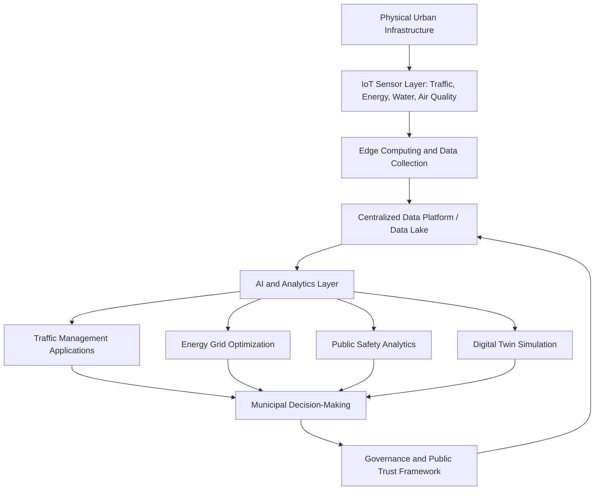

## Smart Cities and Urban Technology Platforms

### Definition and Scope

Smart cities and urban technology platforms encompass the integration of digital infrastructure, data analytics, IoT (Internet of Things) sensor networks, and increasingly artificial intelligence into municipal governance and urban service delivery, aiming to enhance quality of life, optimize resource use, and reduce environmental impact through data-driven urban management. From an urban economics perspective, this subfield examines smart city technology as a form of infrastructure investment whose returns operate through efficiency gains in existing public service provision (traffic, energy, water, public safety) rather than through expanding physical capacity, and analyzes the institutional, fiscal, and market structure questions raised by increasingly platform-mediated municipal governance.

### Theoretical Foundations

**Smart City Technology as Congestion and Externality Management**

A core economic rationale for smart city investment is addressing urban externalities and congestion more efficiently than through pure capacity expansion. Real-time traffic and mobility data platforms, for instance, allow dynamic management of existing road capacity (adaptive signal timing, congestion-responsive routing information) rather than requiring costly new road construction, representing a form of capital-light substitute or complement to the traditional infrastructure investment instruments discussed in infrastructure investment policy. This reframes smart city technology as an efficiency-multiplier on existing capital stock rather than a distinct category of physical capital investment.

**Data as a Municipal Public Good and Interoperability Challenge**

A recurring economic and governance theme is that urban sensor and platform data generates value primarily through cross-departmental and cross-system integration, but individual municipal departments and technology vendors often generate siloed data with limited interoperability. Interoperability across departments and municipalities is identified as key to supporting a robust, networked approach to smart city infrastructure, with industry analysis emphasizing that cities achieving the most success are those building a foundation of data readiness, governance, and platform-based infrastructure that supports emerging technologies like AI, rather than pursuing isolated point-solution deployments — an economic argument for coordinated data governance investment as a complement to, not substitute for, individual sensor/platform deployment.

**Platform Market Structure and Vendor Lock-In**

Smart city technology procurement raises distinct market structure considerations relative to traditional infrastructure procurement: software-and-data platforms often exhibit high switching costs once integrated into municipal operations, creating potential vendor lock-in dynamics analogous to those studied in broader platform economics, with implications for long-run municipal fiscal exposure and negotiating leverage that differ from the more standardized bidding processes typical of conventional infrastructure procurement (e.g., road construction contracts).

### Major Technology Categories and Applications

**AI-Powered Traffic and Mobility Management**

Cities are increasingly deploying AI layers over existing camera and sensor infrastructure to convert raw video and sensor data into actionable traffic and safety insights. With cities already operating large camera networks, there is strong and growing demand for AI layers that turn this existing video infrastructure into actionable insights, with the focus shifting toward real-time event detection, situational awareness, and measurable safety outcomes, particularly tied to initiatives such as Vision Zero traffic safety programs. Specific application examples include computer vision analytics platforms measuring pedestrian, cyclist, and vehicle movements, and AI-powered mobile enforcement platforms for bus lane, bike lane, and parking violation detection using vehicle-mounted cameras.

**Smart Energy Systems**

Smart energy applications — smart grids, advanced metering infrastructure, and automated energy management — are frequently identified in current industry analysis as the fastest-growing segment within overall smart city technology platforms, reflecting the convergence of climate policy pressure, renewable energy integration needs, and falling costs of underlying IoT sensor and edge computing hardware. Emerging sub-trends within this category include energy-positive districts, vehicle-to-grid integration allowing electric vehicles to function as distributed grid storage, and hyperlocal renewable microgrids.

**Digital Twins and Urban Simulation**

Digital twin technology — creating detailed virtual models of physical urban environments for simulation and planning purposes — has emerged as a significant application area, particularly for complex urban planning scenarios. Urban Strategy modeling platforms have been applied in contexts such as Amsterdam's city planning process, where planners must fit large volumes of new housing into existing built environments, with simulation models calculating traffic, air quality, noise, and other impacts across different development scenarios in seconds or minutes rather than the days or weeks required by traditional analytical methods — representing a substantial reduction in the analytical cost of urban planning scenario evaluation.

**Agentic AI in Urban Planning**

Beyond simulation, more advanced AI applications are beginning to directly assist generative planning tasks. Some technology providers have developed proof-of-concept AI agents trained on extensive planning experience data that can generate building massing models and suggest building placement automatically for urban development sites, targeting the traditionally labor-intensive massing-study phase of urban planning — an emerging application area still in relatively early deployment stages as of current industry reporting.

**Urban Furniture and Distributed Sensor Networks**

Beyond centralized platform infrastructure, distributed smart urban furniture — solar-powered streetside installations providing environmental monitoring, wayfinding, and connectivity functions — represents a lower-cost, incrementally deployable smart city infrastructure category, with such platforms reportedly deployed across more than 130 US cities as of recent industry tracking.

### Market Scale and Investment Patterns

**Global Spending Trajectory**

Industry tracking indicates substantial and accelerating smart city technology spending: global smart city technology spending reached approximately $189 billion in 2025, representing a 22% increase over the prior year according to industry spending guide estimates, with momentum attributed to converging pressures including aging infrastructure, climate adaptation mandates, and the falling cost of IoT sensors, edge computing, and AI-powered analytics. [Unverified — spending estimates vary across research and analyst organizations depending on scope definition; treat specific figures as approximate industry estimates rather than official government statistics]

**Sectoral Growth Distribution**

Within overall smart city technology spending, industry analysis suggests smart infrastructure (transport, lighting, buildings) holds the largest overall revenue share among smart city technology categories, though it grows somewhat more slowly than the smart energy segment specifically; data platforms and analytics — centralized city data platforms and AI/IoT data infrastructure functioning as integrating "glue" across other application verticals — are identified as exhibiting particularly high growth rates, consistent with the interoperability and data-integration economic rationale discussed above.

**Regional Investment Concentration**

Fastest growth in smart city technology investment is concentrated in specific regions, particularly Asia-Pacific and the Middle East, reflecting jurisdictions aggressively funding urban digital infrastructure as part of broader national development and smart-city-branding strategies, a pattern consistent with the broader emerging-market proptech and technology investment trends discussed in adjacent literature on digitalization of real estate markets.

### Institutional and Governance Considerations

**From Technology-Led to Governance-Led Deployment**

A significant shift identified in recent industry and practitioner analysis is a maturation from purely technology-driven deployment ("smart infrastructure led") toward insights-driven and governance-first approaches, reflecting lessons learned from earlier waves of siloed point-solution deployment. Industry conference analysis characterizes 2026 as marking a shift in how cities approach AI specifically — the operative question has moved from *whether* to deploy AI to *how* to do so responsibly, securely, at scale, and in ways that build public trust, underscoring that governance and public trust considerations have become as central to smart city technology adoption as the underlying technical capability itself.

**Data Sovereignty and Trust Frameworks**

Emerging governance frameworks emphasize orchestrated, federated data exchange architectures intended to provide trusted, secure, and sovereign frameworks for data exchange within smart city ecosystems — reflecting growing recognition that citizen and institutional trust in data governance is a binding constraint on smart city technology adoption, not merely a secondary implementation consideration, particularly as applications extend into more sensitive domains like AI-powered public safety analytics and traffic enforcement.

**Return on Investment and Accountability Pressure**

Municipal buyers are increasingly demanding platforms that demonstrate clear and fast return on investment, particularly in traffic safety and congestion reduction applications, with cities expecting platforms that go beyond basic descriptive metrics to provide behavioral insights that directly inform infrastructure investment decisions — reflecting a broader trend toward outcome-based procurement and accountability standards for smart city technology spending, paralleling similar evidence-based evaluation pressures discussed in the broader place-based and infrastructure policy evaluation literature.

### Diagram: Smart City Technology Platform Architecture

### Illustration: Smart City Investment by Technology Segment

<svg xmlns="http://www.w3.org/2000/svg" viewBox="0 0 640 340">
<text x="320" y="24" text-anchor="middle" font-size="15" font-weight="bold" fill="#1a1a1a">Relative Growth Across Smart City Technology Segments (svg_diagram)</text>
<line x1="90" y1="290" x2="580" y2="290" stroke="#333" stroke-width="1.5" />
<line x1="90" y1="290" x2="90" y2="50" stroke="#333" stroke-width="1.5" />
<text x="335" y="315" text-anchor="middle" font-size="11" fill="#333">Technology Segment</text>
<text x="45" y="170" text-anchor="middle" font-size="11" fill="#333" transform="rotate(-90 45 170)">Relative Growth Rate</text>
<rect x="130" y="120" width="70" height="170" fill="#27ae60" />
<text x="165" y="305" text-anchor="middle" font-size="10">Smart Energy</text>
<rect x="230" y="180" width="70" height="110" fill="#2471a3" />
<text x="265" y="305" text-anchor="middle" font-size="10">Infrastructure</text>
<rect x="330" y="150" width="70" height="140" fill="#e67e22" />
<text x="365" y="305" text-anchor="middle" font-size="10">Mobility Tech</text>
<rect x="430" y="100" width="70" height="190" fill="#8e44ad" />
<text x="465" y="305" text-anchor="middle" font-size="10">Data Platforms</text>
</svg>

### Key Points

- Smart city technology functions economically as an efficiency-multiplier on existing infrastructure capital rather than a distinct category of physical capacity expansion, with returns operating primarily through congestion and externality management
- Interoperability and coordinated data governance across departments and municipalities is repeatedly identified as a binding constraint on realizing smart city technology value, more so than the underlying sensor/platform technology itself
- Data platforms and analytics infrastructure exhibit the highest growth rates among smart city technology segments, consistent with their role as integrating "glue" across other application verticals
- Governance, public trust, and data sovereignty considerations have become central rather than secondary factors in smart city technology adoption decisions as of current industry practice
- Regional investment concentration in Asia-Pacific and the Middle East reflects broader patterns of state-directed digital infrastructure investment strategies

### Related Topics

- Infrastructure investment policy and efficiency-multiplier technology
- Digital twin technology in urban planning and simulation
- IoT sensor network economics and municipal data governance
- Platform market structure and vendor lock-in in public procurement
- Vision Zero traffic safety programs and AI-powered enforcement
- Smart grid and vehicle-to-grid energy integration
- Municipal data sovereignty and citizen trust frameworks
- Proptech and the digitalization of real estate markets
- Place-based policy effectiveness evaluation methodology
- Agentic AI applications in generative urban planning